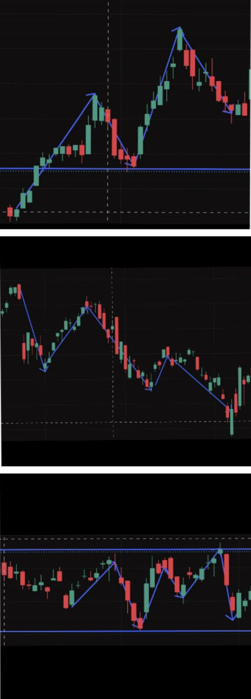
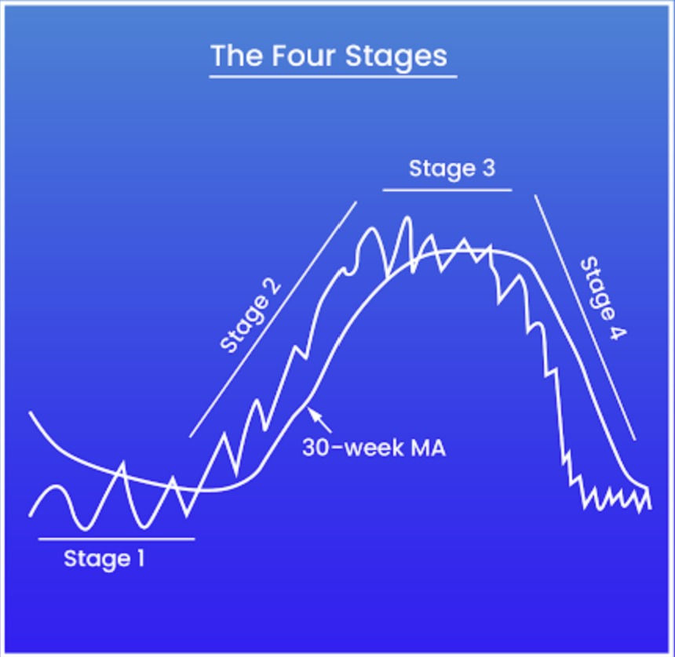
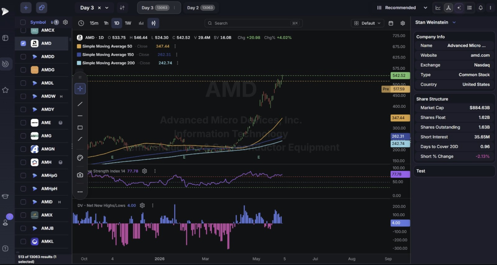

# Day 4 Internship Notes
 
**Date:** 04-06-2026
 
## Work Start Time
 
9:00 AM
 
---
 
# Today's Objective
 
- Understand Trend Direction in detail.
- Learn Volume Analysis and its role in price movement.
- Study the RSI (Relative Strength Index) Indicator.
- Learn how to use DeepVue for Stage Analysis.
- Understand how to screen stocks using Stan Weinstein's methodology.
---
 
# Topics Learned Today
 
## 1. Trend Direction
 
Trend direction represents the overall movement of a stock's price over time. Understanding trend direction matters because it tells a trader which side of the market — buyers or sellers — currently holds the advantage, allowing trades to be aligned **with** market momentum instead of fighting against it.
 
### Types of Trends
 
**Uptrend**
An uptrend is formed when price creates a repeating pattern of:
- **Higher Highs (HH)** — each new peak rises above the previous peak.
- **Higher Lows (HL)** — each new pullback low stays above the previous pullback low.
This pattern indicates strong buyer control and positive market sentiment — buyers are not only pushing price to new highs, but they're also stepping in earlier (at a higher price) on every dip, showing growing confidence.
 
**Downtrend**
A downtrend is formed when price creates the mirror-image pattern:
- **Lower Highs (LH)** — each new peak fails to reach the previous peak's height.
- **Lower Lows (LL)** — each new low falls below the previous low.
This indicates strong seller control and negative market sentiment.
 
**Sideways Trend**
A sideways trend occurs when price moves within a horizontal range without making significant new higher highs or lower lows. Neither buyers nor sellers have gained a decisive advantage — price is essentially "waiting" for new information or a catalyst before committing to a direction.
 
> 

 
### Why Trend Direction Matters
 
- Helps identify the market's underlying bias before looking at anything else.
- Improves trade selection — the same chart pattern can mean different things depending on whether it appears inside an uptrend or a downtrend.
- Prevents trading against momentum, which is statistically a lower-probability approach.
- Supports better risk management, since stop-loss and target placement both depend on knowing which direction is "with the trend" versus "against the trend."
---
 
## 2. Volume Analysis
 
Volume represents the number of shares traded during a specific period. It is one of the most important confirmation tools in technical analysis because price alone only tells you *what* happened, while volume tells you *how much conviction* was behind it.
 
### High Volume Indicates:
- Strong buying or selling activity.
- Increased trader participation — many market participants are acting at once.
- Stronger conviction behind the move, making it more likely to continue.
### Low Volume Indicates:
- Weak participation.
- Reduced conviction.
- Less reliable price movement — a move on low volume can reverse just as easily as it formed.
### Volume During Breakouts
When a stock breaks a support or resistance level **with high volume**, the breakout becomes far more reliable, because it shows a large number of participants agreeing on the new direction at the same time. Volume is exactly what helps a trader differentiate between a genuine breakout and a **false breakout** (a brief, unconvincing push through a level that quickly reverses).
 
### Key Observations
- **Rising price + rising volume** = strength (healthy, well-supported move).
- **Falling price + rising volume** = strong selling pressure (a genuinely bearish, high-conviction move down).
- **Rising price + low volume** = possible weakness (the move may not be trustworthy, since not enough participants are backing it).
 
> 

---
 
## 3. RSI Indicator (Relative Strength Index)
 
RSI is a momentum indicator used to measure the speed and strength of price movements. The RSI value always ranges from **0 to 100**, and it's typically calculated using a 14-period lookback (as seen on both charts today, labeled "RSI 14 close").
 
### Overbought Zone
RSI **above 70** suggests a stock may be overbought — meaning price has risen quickly enough that a pullback or pause becomes more statistically likely.
 
### Oversold Zone
RSI **below 30** suggests a stock may be oversold — meaning price has fallen quickly enough that a bounce becomes more statistically likely.
 
### Uses of RSI
- Identify momentum (how strongly price is currently moving).
- Spot potential reversals before they're obvious on the price chart alone.
- Confirm trend strength (a strong uptrend will often keep RSI elevated above 50).
- Detect overbought and oversold conditions.
### Important Note
RSI should **not** be used alone. It works best when combined with trend analysis, support and resistance, and volume confirmation — using any single indicator in isolation is a common mistake for beginner traders.
 
> 

 
---
 
## 4. DeepVue Tutorial: Screening Like Stan Weinstein
 
Today I learned how DeepVue can be used to screen stocks based on **Stan Weinstein's market methodology** — a well-known framework (originally from his book *Secrets for Profiting in Bull and Bear Markets*) for classifying where any stock sits in its broader market cycle.
 
### Key Learnings
- How to find strong stocks — ones showing genuine institutional buying interest rather than random short-term spikes.
- How to identify stocks in bullish stages specifically.
- How to filter stocks using trend and momentum criteria together, rather than just one or the other.
- How to focus on stocks showing institutional strength — since large institutional buying tends to precede and sustain the strongest moves.
### Benefits
- Faster stock screening — instead of manually checking hundreds of charts, the screener narrows the list down immediately.
- Better market focus — time is spent only on stocks that already meet a quality bar.
- Improved stock selection process overall.
---
 
## 5. DeepVue Tutorial: Stage Analysis (In Detail)
 
Stage Analysis is a method used to classify any stock based on where it currently sits in its repeating market cycle. Every stock — no matter the company — tends to cycle through these four stages over time, rather than trending in one direction forever.

> 

---
> 

 
### Stage 1 — Accumulation
- The stock moves **sideways**, often after a prior decline.
- Institutions begin quietly accumulating (buying) positions during this phase, without causing a dramatic price spike — they are intentionally buying gradually to avoid pushing the price up against themselves (this connects directly to the "smart money" liquidity concepts covered later in the internship, see Day 19's notes on Order Blocks).
- Volume during this stage is often unremarkable on the surface, but a closer look frequently shows a gradual increase in buying-side volume compared to selling-side volume.
### Stage 2 — Uptrend
- **Strong price appreciation** — this is the most profitable stage to be involved in as a trader.
- **Rising moving averages** — both shorter-term and longer-term moving averages slope upward, and price typically stays above them.
- **Increased volume** — particularly on up days, confirming genuine demand is driving the move (tying back to Topic 2's volume rules above).
- This is the stage screeners like DeepVue's Stan Weinstein tool are specifically designed to surface, since it statistically offers the best risk-adjusted trading opportunities.
### Stage 3 — Distribution
- **Price begins losing momentum** — rallies become weaker, and pullbacks become sharper, even though the stock may still be near its highs.
- **Institutional selling may begin** — the same large players who accumulated in Stage 1 start distributing (selling) their shares into the strength, often without an obvious immediate price collapse, since they distribute gradually for the same reason they accumulated gradually.
- This stage can be easy to misread as "just a healthy pullback" if a trader isn't watching for the broader loss of momentum.
### Stage 4 — Downtrend
- **Price declines** in a sustained way.
- **Lower highs and lower lows develop**, confirming the downtrend structure described in Topic 1.
- This is generally considered the stage to avoid for long (buy) positions entirely, and is instead where short-selling or simply staying in cash becomes the more appropriate approach.
### Objective
The primary goal of Stage Analysis is to identify **Stage 2 stocks**, because they consistently provide the strongest and most reliable trading opportunities — this single rule is the entire point of running a Stan Weinstein-based screener in DeepVue rather than scanning charts randomly.
 
---
 
# Practice: Chart Analysis
 
## Stocks Observed
 
- **NVDA**
- **TSLA** *(Trend Direction, Volume Analysis, RSI Observation, Support and Resistance Review)*
## TSLA — Full Chart Analysis
 
**Chart data:** Daily timeframe, NASDAQ. Open 418.70, High 433.60, Low 416.00, Close 423.70 (-0.04, -0.01%).
 
**Trend Direction:** The chart shows a clear shift in structure. From late March into mid-April, TSLA was in a **downtrend** (lower highs and lower lows), bottoming out around the 360 level. From mid-April onward, the structure flipped into a clean **uptrend** — visible from the diagonal trendline I drew connecting a sequence of rising swing lows from roughly 380 up through 410. The stock rallied strongly into mid-May, reaching just above 450, before entering a more sideways/consolidating phase through late May and June.
 
**Support and Resistance Review:** I marked two key horizontal levels:
- **Resistance at 444.72** — price has tested this level twice (mid-May and again in early June) without a decisive breakout above it, making it a well-confirmed resistance zone under the "Most Touches Rule" from Day 3.
- **Support at 402.84** — this level previously acted as a resistance/pause zone during the April rally and has since been retested as support, which is a real example of the **Role Reversal Principle** from Day 3's notes.
**Volume Analysis:** Volume was notably elevated during the sharp mid-April recovery and the May rally (visible as taller green bars), which supports the idea that the uptrend was backed by genuine buying participation. Volume has since cooled into more average levels during the current sideways consolidation between 402.84 and 444.72 — consistent with a pause/consolidation phase rather than continued strong directional conviction.
 
**RSI Observation:** RSI(14) currently reads **53.57**, with its signal line at **57.43**. Both values sit comfortably in the neutral zone (well below the 70 overbought threshold), which lines up with the chart's current sideways behavior — there's no momentum extreme in either direction right now, suggesting the stock is taking a breather after its May rally rather than showing exhaustion or an imminent reversal.
 
**Overall read:** TSLA is currently range-bound between 402.84 support and 444.72 resistance, after recovering from a downtrend into a strong uptrend. A decisive, high-volume close above 444.72 would be the signal to watch for renewed upside continuation; a high-volume break below 402.84 would suggest the recent uptrend is at risk.
> 

 
## NVDA — Chart Analysis
 
**Chart data:** Daily timeframe, NASDAQ. Open 221.72, High 222.82, Low 214.51, Close 214.75 (**-8.07, -3.62%**).
 
**Trend Direction:** NVDA shows a similar broader structure to TSLA — a strong rally into mid-May reaching a peak near 235.45, followed by a pullback into a higher-low support structure (marked by my diagonal trendline) bottoming near the 199.21–216 zone.
 
**Support and Resistance Review:** Two horizontal levels marked:
- **Resistance at 235.45** — the prior swing high from mid-May, untested since the pullback began.
- **Support at 199.21** — a deeper structural support level from the April lows, currently well below current price.
**Volume Analysis:** Today's candle is the key story — a sharp **-3.62% decline on 160.91M volume**, which is visibly one of the larger volume bars on the entire chart. Per today's volume rules, this is a clear example of **"falling price + rising volume = strong selling pressure"** — this was not a quiet, low-conviction dip, but a high-participation move down, which makes it a more meaningful signal than if the same price drop had happened on light volume.
 
**RSI Observation:** RSI(14) reads **51.14**, with its signal line at **58.07**. Both remain in neutral territory (nowhere near oversold below 30), which is worth noting — despite today's sharp red candle, RSI hasn't dropped into oversold territory, meaning there's room for further downside before RSI itself would flag the stock as statistically "stretched" to the downside.
 
**Overall read:** NVDA's bounce attempt off the higher-low trendline failed today on a high-volume rejection candle. Given RSI is still neutral rather than oversold, this looks like genuine renewed selling pressure rather than an overextended, exhausted move — worth watching whether the trendline support holds on the next test.
> 

---
 
# Questions I Had
 
### 1. Why is trend direction important before entering a trade?
 
Trend direction helps traders trade with momentum rather than against market movement. Entering a trade aligned with the dominant trend statistically has a higher probability of success, since the larger structural forces in the market are already moving in that direction rather than needing to be fought against.
 
### 2. Why should volume be used alongside price action?
 
Volume confirms the strength and reliability of price movement. Price action on its own only shows *what* happened, but volume reveals *how many* market participants were actually behind that move — which is exactly why today's NVDA example (a sharp price drop on unusually high volume) carries more weight than the same drop would on quiet, low-participation volume.
 
### 3. Can RSI alone be used for trading decisions?
 
No. RSI should be combined with trend analysis, support and resistance, and volume confirmation. As seen in both of today's chart examples, RSI sitting in neutral territory doesn't tell the full story on its own — it needs to be read together with the broader trend structure (TSLA's range-bound consolidation, NVDA's failed bounce on high volume) to form a complete picture.
 
---
 
# Key Takeaways From Day 4
 
- Trend direction is the foundation of technical analysis — always establish this first, before applying any other tool.
- Volume confirms the strength of market movements; today's NVDA chart was a clear real-world example of high-volume selling pressure.
- RSI helps measure momentum and identify potential reversals, but only when combined with trend, support/resistance, and volume.
- Stage Analysis (Accumulation → Uptrend → Distribution → Downtrend) provides a structured framework for understanding where a stock sits in its broader market cycle, with Stage 2 being the primary target for trading opportunities.
- DeepVue screeners built on Stan Weinstein's methodology can be used to filter for high-quality, institutionally-backed trading opportunities rather than scanning charts randomly.
- Applying today's tools to real TSLA and NVDA charts showed how Trend, Support/Resistance, Volume, and RSI all need to be read together — no single tool tells the complete story on its own.
---
 
# Conclusion
 
Day 4 focused on strengthening the understanding of trend analysis, volume interpretation, and momentum indicators through RSI. In addition, DeepVue tutorials introduced stock screening techniques based on Stan Weinstein's methodology and the four-stage Stage Analysis framework in detail. Applying these concepts to real charts — TSLA's recovery from a downtrend into a consolidating uptrend, and NVDA's high-volume rejection candle after a bounce attempt — made the combination of technical analysis and DeepVue tools much more concrete. This practical step improved my ability to identify strong stocks, understand market structure, and analyze real trading opportunities more effectively, rather than only understanding the concepts in theory.
