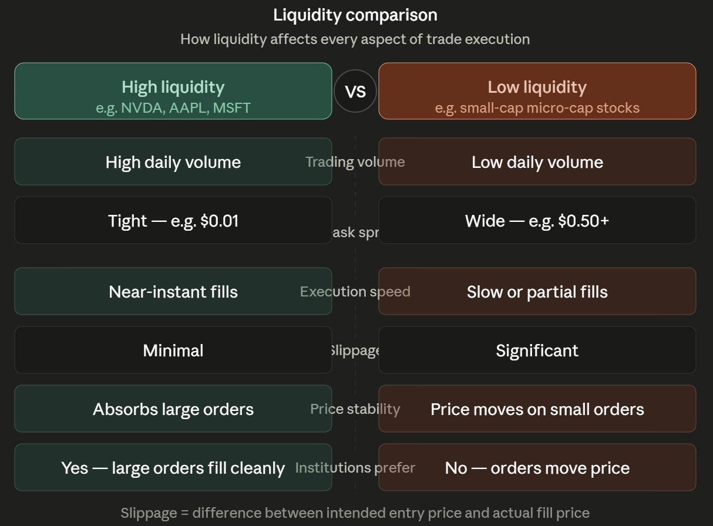

# Day 7 Internship Notes
 
**Date:** 08-06-2026
 
## Work Start Time
 
9:00 AM
 
---
 
# Today's Objective
 
- Liquidity — deepening the understanding 
- DeepVue Bubble Chart — what it is and how it works.
- Finding Breakouts — using the Bubble Chart to identify opportunities fast.
- DeepVue Bubble Charts: Find Breakouts and Market Leaders FAST.
## Introduction
 
Today I expanded my understanding of Liquidity and explored the DeepVue Bubble Chart — a powerful visual screening tool that helps traders identify breakout stocks and market leaders in real time. Rather than scanning hundreds of individual charts one by one, the Bubble Chart plots every stock simultaneously across three variables at once, letting the most active and promising opportunities surface immediately. Today's session also involved real chart practice on **GLXY (Galaxy Digital Holdings)**, which appeared as the standout bubble on the chart — a live example of exactly the kind of breakout candidate the tool is designed to surface.
 
---
 
# Liquidity (Deeper Dive)
 
Liquidity was first introduced on Day 5 and expanded on Day 6 through the Bid-Ask Spread. Today's session revisited and deepened the concept, focusing on the practical real-world impact of liquidity differences between stocks.
 
**Liquidity** refers to how easily a stock can be bought or sold without significantly affecting its market price. The more buyers and sellers actively present in a stock at any given moment, the more liquid it is.
 
> 

 
## Why Liquidity Matters
 
Liquidity directly affects every single aspect of trade execution:
 
- **Order execution speed** — how quickly your order fills once placed.
- **Bid-Ask spreads** — tight in liquid stocks, wide in illiquid ones (see Day 6).
- **Slippage** — the difference between the price you intended to enter and the price you actually got.
- **Price stability** — liquid stocks absorb large orders without dramatic price swings.
- **Trade management** — exiting a position quickly when wrong is only possible in a liquid market.
## High Liquidity vs Low Liquidity
 
| Characteristic | High Liquidity | Low Liquidity |
|---|---|---|
| Trading Volume | High daily volume | Low daily volume |
| Bid-Ask Spread | Tight (e.g., $0.01) | Wide (e.g., $0.50+) |
| Execution Speed | Near-instant | Slow or partial fills |
| Slippage | Minimal | Significant |
| Examples | NVDA, AAPL, MSFT, AMZN | Small-cap or micro-cap stocks |
 
## Institutional Perspective
 
Large institutions need to buy or sell enormous quantities of shares — sometimes millions at once. In a low-liquidity stock, placing that order would push the price dramatically against them before they even finished filling. This is why institutional money flows into liquid stocks — it is the only environment where they can operate efficiently without their own orders working against them. Understanding this is what underpins the Smart Money and Order Block concepts that come much later in this internship (see Days 14–19).

> 

 
## Real-Time Trading Example
 
**Buying 500 shares of NVDA (high liquidity):**
The order fills almost instantly — thousands of shares are changing hands every second at nearly every price level, so there's always a willing counterparty.
 
**Buying 500 shares of a low-volume stock (low liquidity):**
The order may fill slowly, partially, or at a price worse than expected, because there simply aren't enough sellers available at the current price to match 500 shares without the price shifting.
 
---
 
# DeepVue Bubble Chart
 
The **DeepVue Bubble Chart** is a real-time market visualization tool that helps traders identify breakout stocks, strong sectors, and potential market leaders — not by scrolling through a list, but by plotting every stock simultaneously across three visual dimensions at once.
 
Instead of numbers in a table, each stock becomes a **bubble on a scatter plot**, and the bubble's position and size immediately tells you three things about that stock in one glance.

> 

 
## How the Bubble Chart Works
 
The chart uses three variables simultaneously, each mapped to a visual dimension:
 
| Dimension | Controls | Common Metric Used |
|---|---|---|
| **X-Axis** (horizontal position) | Left = lower value, Right = higher value | Relative Measured Volatility (15-day), or % price change |
| **Y-Axis** (vertical position) | Down = lower value, Up = higher value | Relative Volume (20-day) |
| **Bubble Size** | Smaller = less, Larger = more | Relative Volume (makes high-participation stocks visually stand out) |
 
**In the Day 7 screenshot specifically:**
- X-axis = "Relative Measured Volatility – 15 Days" — stocks further right have been making bigger price moves relative to their history.
- Y-axis = "Relative Volume – 20 Day" — stocks higher up have unusually high volume relative to their 20-day average.
- Larger bubbles = stronger relative volume participation.
This means **stocks in the top-right corner are simultaneously making big moves AND doing it on unusually high volume** — the classic combination that defines a breakout candidate.
 
---
 
# Finding Breakouts Quickly
 
One of the most powerful Bubble Chart configurations for finding breakout stocks is:
 
- **X-Axis:** Price Percentage Change from Open (or Relative Measured Volatility)
- **Y-Axis:** Relative Volume
- **Bubble Size:** Relative Volume (20-Day Basis)
Using this setup:
- Strong stocks move toward the **right side** of the chart (bigger price move).
- High-volume stocks move **higher** on the chart (more participation).
- Larger bubbles represent **stronger market participation**.
**Stocks appearing in the top-right corner** — like GLXY in today's session — represent the strongest stocks currently in play: they're moving significantly AND they're doing it with unusually high volume, both of which are the hallmarks of a genuine breakout rather than a low-conviction drift.
 
## Real-Time Interpretation
 
As the market opens and trading develops:
- Stocks with strong buying pressure move upward and to the right immediately.
- Emerging sector themes become visible as clusters of related stocks appear in the same zone together.
- A stock that suddenly "jumps" to the top-right during the session is showing real-time breakout behavior.
This allows traders to identify opportunities much faster than manually scanning individual charts — what could take hours of chart-by-chart review happens in seconds with a single glance at the Bubble Chart.
 
---
 
# Identifying Market Leaders
 
The Bubble Chart also helps identify future market leaders — not just today's active movers, but stocks building the kind of technical foundation that often precedes a sustained, multi-week leadership run.
 
**Relative Strength (RS):** Measures how strongly a stock performs compared to the overall market or benchmark. Higher RS often indicates leadership characteristics — the stock is outperforming even when the market is pulling back.
 
**Relative Measured Volatility (RMV):** Measures how tightly a stock's price is contracting relative to its recent history. A stock with low RMV (trading tightly, making small daily moves) followed by a sudden spike in volume and price often marks the exact beginning of a new leadership move. This connects directly to the "3 Weeks Tight" DeepVue pattern covered on Day 12.
 
When a stock shows all three of the following simultaneously:
- High Relative Strength
- Tight Volatility (low RMV) transitioning to expanding volatility
- Increasing Volume
…it may indicate the early stages of a leadership stock beginning to emerge from accumulation.
 
---
 
# Sector Analysis via Bubble Chart
 
Beyond individual stocks, the Bubble Chart is useful for identifying **sector rotation** — when institutional money moves collectively from one sector to another.
 
Example: If several semiconductor stocks appear in the top-right corner simultaneously (as was the case in the early 2026 period visible on the Day 6 NVDA chart), it likely indicates strong money flow into the semiconductor sector broadly — not just one or two individual names.
 
This helps traders identify broader market themes and focus on the sectors showing the greatest strength, rather than chasing individual stocks randomly.
 
---
 
# Practical Session: GLXY (Galaxy Digital Holdings) — Chart Analysis
 
Today's standout observation from the Bubble Chart was **GLXY (Galaxy Digital Holdings)** — the largest and highest-positioned bubble on the entire chart, sitting at the extreme top-right (approximately x=80-100 on Relative Measured Volatility, y=4.2 on Relative Volume). Clicking the bubble opened the live 15-minute chart for deeper analysis.
 
**Chart data:** 15-minute timeframe. Open 29.11, High 29.57, Low 29.11, Close 29.52, Volume 137.8K, $V 4.1M, Change +0.41 (+1.39%).
 
**Moving Average alignment:**
- SMA 50 = 26.35
- SMA 150 = 28.28
- SMA 200 = 28.59
Price (29.52) is currently **above all three moving averages**, and the 15-minute chart shows a recent sharp upward breakout — a clear surge of green candles pushing above the SMA 150 and SMA 200 zone (28.28–28.59), with the current price now trading above 29.50.
 
**Why GLXY appeared at the top-right of the Bubble Chart:**
- It had one of the highest Relative Volume readings in the entire screener — the bubble's vertical position (y ≈ 4.2 on a 20-day relative volume scale) means it was trading at roughly **4× its average daily volume** at the time.
- Its X-axis position (high RMV) means the price itself was making a much larger move than its typical 15-day range.
- Combined: price up significantly + volume up dramatically = classic breakout signature.
**RSI Observation:** RSI(14) reads **79.15** — this is clearly in **overbought territory** (above 70). While overbought RSI during a breakout is not automatically a reason to avoid the stock, it does flag that momentum has stretched significantly in a short time. A trader applying Day 4's RSI rules would note this: an overbought reading doesn't mean the stock will reverse immediately, but it does mean the risk of a short-term pullback or consolidation has increased. Combined with the fact that this is a 15-minute chart (shorter timeframe), the high RSI reading would encourage more caution or waiting for a small pullback into the 28.59 area (SMA 200) before considering an entry.
 
**RMV (Relative Measured Volatility):** 12.16 — the RMV panel at the bottom of the GLXY chart shows a spike relative to its recent quiet periods, confirming today's move is a genuine expansion of volatility, not just noise within a normal trading range.
 
> 

 
**Overall read on GLXY:** A stock that appears at the top-right extreme of the Bubble Chart AND confirms that position with price above all major moving averages and above-average volume is showing textbook breakout behavior. The overbought RSI is worth noting for entry timing, but doesn't negate the quality of the setup — it simply informs position sizing and entry management.
 
---
 
# Interactive Features of the Bubble Chart
 
- **Clickable bubbles:** Clicking any bubble instantly opens the full stock chart — as demonstrated today with GLXY.
- **Zoom functionality:** Traders can zoom into specific areas of the chart to focus on selected clusters or individual stocks without the distraction of less-relevant names.
- **Real-time updates:** The chart continuously refreshes during market hours, showing which stocks are gaining or losing momentum throughout the session.
---
 
# Questions I Had and Answers I Got
 
**Q1. Why is liquidity important in stock trading?**
 
Liquidity determines how efficiently a stock can be traded without distorting its price. Highly liquid stocks have tighter spreads, faster fills, and lower slippage — reducing hidden costs and making both entry and exit reliable. Illiquid stocks carry the opposite risks. For institutions managing large capital, liquidity is the single most important pre-trade filter.
 
**Q2. How does the DeepVue Bubble Chart help traders identify breakout stocks?**
 
The Bubble Chart plots every stock simultaneously across three variables (price movement, relative volume, and bubble size). Stocks showing strong price movement AND unusually high volume appear in the top-right corner — the two conditions that together define a genuine breakout. Today's GLXY example was a live demonstration: the largest bubble in the top-right, confirmed by a 15-minute chart showing price above all major moving averages on 4× average volume.
 
**Q3. How can traders identify potential market leaders using the Bubble Chart?**
 
By watching for stocks with high Relative Strength and tightly contracting volatility (low RMV) that then suddenly expand with increasing volume. This combination — tight consolidation followed by a volume-driven breakout — often marks the early stages of a leadership stock. Once identified on the Bubble Chart, the full chart can be clicked and analyzed immediately.
 
---
 
# Key Takeaways From Day 7
 
- Liquidity is a pre-trade filter — before worrying about chart patterns, check whether the stock actually trades enough volume to support reliable execution.
- The Bubble Chart turns a time-consuming, manual scan of hundreds of stocks into a single-glance visual — the most active breakout candidates rise to the top-right corner automatically.
- Three variables in one view: X-axis position, Y-axis position, and bubble size each tell a different story simultaneously.
- GLXY appeared at the extreme top-right of today's Bubble Chart — above all three SMAs, 4× average volume, RSI 79.15 (overbought, factor into entry timing), and expanding RMV confirming the move is genuine.
- An overbought RSI during a breakout doesn't automatically invalidate the setup — it informs position sizing and entry patience.
- Sector rotation is visible on the Bubble Chart as clusters of related stocks appearing in the same zone together, revealing where institutional money is flowing at the broad theme level.
---
 
# Conclusion
 
Today's session enhanced my understanding of liquidity while introducing one of the most practically useful screening tools in DeepVue — the Bubble Chart. Rather than scanning stocks one by one, the Bubble Chart immediately surfaces the stocks showing the strongest combination of price movement, relative volume, and relative strength. The live practice on GLXY — identified as the standout bubble on the chart and then verified through its 15-minute chart data — made the entire concept concrete: it's not a theoretical idea, it's a working real-time tool that identified a genuine breakout candidate within seconds. These skills directly build on the volume, RSI, and moving average concepts from earlier days and set the stage for more advanced screening and trade setup work ahead.
 
