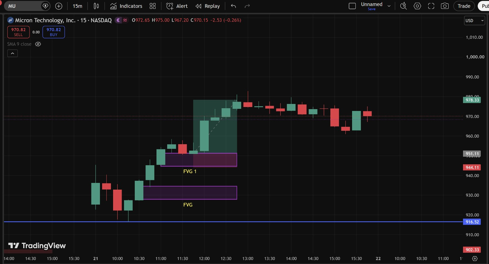
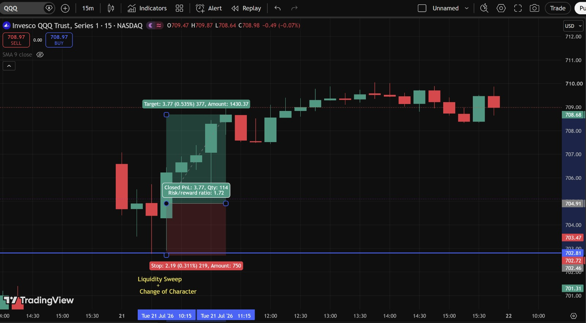
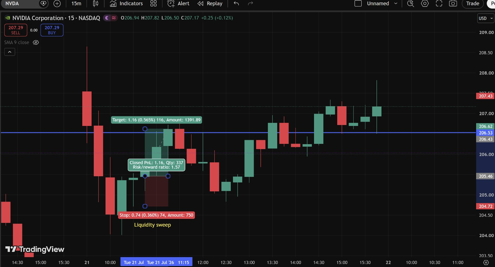
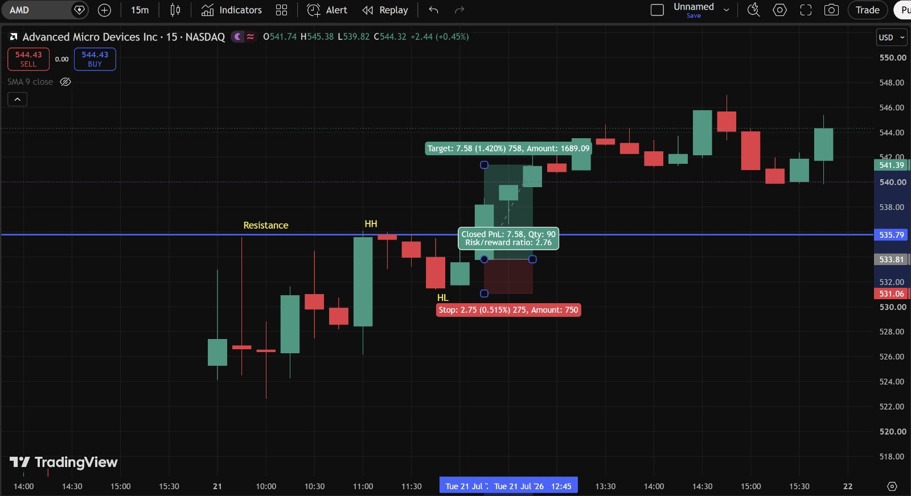

# Day 10 — US Market Analysis (21-07-2026)

**Work Format:** Pre-Market → Market Hours → After-Hours (IST evening-to-midnight coverage of the US session)

| Session | IST Timing | US Time (ET) |
|---|---|---|
| Pre-Market | 5:00 PM – 7:00 PM | 7:30 AM – 9:30 AM |
| Market Hours | 7:00 PM – 1:30 AM | 9:30 AM – 4:00 PM |
| After Hours | 1:30 AM – 2:30 AM | 4:00 PM – 5:00 PM |

---

## 1. Pre-Market Analysis (7:30 AM – 9:30 AM ET)

### Overnight/Morning Catalyst
After more than a week of steady memory-sector selling (Days 7–9), Tuesday turned into a sharp, broad-based reversal:
- **Micron ultimately surged 12.17%** and **SanDisk soared 14.27%** by the close, in what several outlets described as a genuine **memory-led technology rally** rather than a single-stock story.
- **AMD gained 8.11%**, extending Monday's move on news of its **AI infrastructure deal with Microsoft** — and the company is set to host its **"Advancing AI 2026" conference** in San Francisco July 22–23, which markets expect to showcase progress on AI accelerators, data-center CPUs, and its Helios rack-scale AI infrastructure.
- **Intel rose 8.64%** and **Western Digital surged 12.51%**, confirming the rebound was sector-wide, not limited to one or two names.
- The **Philadelphia Semiconductor Index (SOX) surged 5.21%**, its **second consecutive day of rebound**.
- Supporting catalysts: **strong South Korean export data** pointed to continued AI demand, reports that **TSMC would raise prices 10% next year** boosted the whole chip/memory chain, and **87% of the 54 S&P 500 companies that had reported earnings so far beat expectations** — a strong start to the broader earnings season.
- Crude oil also **gained 2% to nearly $85/barrel** on Middle East tensions and tariff uncertainty, though this didn't dampen appetite for chip stocks today.

### Pre-Market Screenshot

At 9:41 AM ET the board showed **MU +8.90%, SNDK +9.50%, NVDA +1.87%, AMD +5.08%, QQQ +1.43%** — all green, with the memory names (MU, SNDK) leading by a wide margin, exactly mirroring the "memory-led" framing from the news coverage.

### How I Picked My Watchlist From Pre-Market
Kept **MU, QQQ, and NVDA** from the recent watchlist, and added **AMD** given its specific Microsoft AI-deal catalyst and the upcoming Advancing AI conference — a clear, name-specific reason to expect continued relative strength beyond just riding the broader memory rebound.

---

## 2. Market Hours Observation (9:30 AM – 4:00 PM ET)

By the close: **Dow +0.74%** to 52,230.23, **S&P 500 +0.89%** to 7,509.20, **Nasdaq Composite +1.29%** to 25,837.21 — all three major indices closing higher together, a notable change from earlier in the week's divergence between QQQ and SPY.

### MU — FVG Mitigation (FVG and FVG 1), Strong Rally
Price built two stacked Fair Value Gaps during an early pullback, then reclaimed through both zones with a large displacement candle, rallying cleanly from the mid-960s up to a peak near **984** before consolidating back into the current **970–978** range.

### QQQ — Liquidity Sweep + Change of Character
Price swept a recent low, then printed a clear **Change of Character** (a shift from the prior bearish micro-structure to a bullish one), confirming the reversal and rallying to target.

### NVDA — Liquidity Sweep
A more modest, single-concept setup: a clean liquidity sweep of a recent low, followed by a reclaim and rally to target.

### AMD — Break of Resistance, Higher High, Higher Low
Price broke above a marked **Resistance** level, printed a **Higher High (HH)**, pulled back to a **Higher Low (HL)** — confirming bullish market structure — and then continued rallying to target.

---

## 3. After-Hours Analysis (4:00 PM – 5:00 PM ET)

Heading into the next session, the key open questions:
- Whether the **memory-sector rebound (MU, SNDK, WDC all up double digits)** has genuine follow-through, or whether it's a one-day oversold bounce within a still-larger downtrend.
- Whether **AMD's** momentum carries into its **Advancing AI 2026 conference** (July 22–23), which could be a fresh, name-specific catalyst on top of today's broad rebound.
- Whether the **all-three-indices-up-together** pattern today marks a genuine change from the QQQ-vs-SPY divergence flagged just yesterday, or whether that divergence reasserts itself once the memory-sector bounce cools off.

---

## 4. Trade Strategy Per Stock — Actual Marked Levels (with Result)

> This section uses my own annotated 15m charts, marking Fair Value Gap, Liquidity Sweep, Change of Character, and market-structure (HH/HL) concepts for each name.

### 🟢 MU — LONG — ✅ **PASSED**

**Setup: FVG and FVG 1 mitigation, reclaim and rally**

Price built two Fair Value Gaps during an early pullback (a lower one and a slightly higher one, labeled FVG and FVG 1), then reclaimed through both with a large displacement candle.

| Parameter | Level | Notes |
|---|---|---|
| Entry | **965** | Reclaim above the FVG 1 zone |
| Stop Loss | **928** | Below the lower FVG zone |
| Target | **984** | Session high reached during the rally |
| **Result** | **✅ Passed** — price rallied cleanly to a high of **984** before consolidating back into the current **970–978** range | No formal stop/target box was marked on this chart, so the entry/stop/target here are read directly from the FVG structure rather than an exact tool-generated figure |

**Chart:**

---

### 🟢 QQQ — LONG — ✅ **PASSED**

**Setup: Liquidity Sweep + Change of Character**

Price swept a recent low, then printed a **Change of Character** — the clearest sign the prior short-term bearish structure had flipped bullish — confirming the reversal.

| Parameter | Level | Notes |
|---|---|---|
| Entry | **702.72** | Reclaim following the sweep and Change of Character |
| Stop Loss | **700.53** | 2.19 (0.311%) below entry |
| Target | **706.49** | 3.77 (0.535%) above entry |
| **Result** | **✅ Passed — Closed PnL +3.77, Qty 114, Risk/Reward 1.72** | Clean rally to target following the character shift |

**Chart:**

---

### 🟢 NVDA — LONG — ✅ **PASSED**

**Setup: Liquidity Sweep**

A single, clean liquidity sweep of a recent low, followed by a reclaim and rally.

| Parameter | Level | Notes |
|---|---|---|
| Entry | **206.20** | Reclaim after the sweep |
| Stop Loss | **205.46** | 0.74 (0.360%) below entry |
| Target | **207.36** | 1.16 (0.565%) above entry |
| **Result** | **✅ Passed — Closed PnL +1.16, Qty 337, Risk/Reward 1.57** | Smallest percentage move of the four today, but still a clean, complete setup |

**Chart:**

---

### 🟢 AMD — LONG — ✅ **PASSED**

**Setup: Break of Resistance, Higher High, Higher Low**

Price broke above a marked **Resistance** level, printed a **Higher High**, then pulled back to a **Higher Low** — a textbook bullish market-structure sequence — before continuing higher.

| Parameter | Level | Notes |
|---|---|---|
| Entry | **533.81** | At the Higher Low, following the break of Resistance and the Higher High |
| Stop Loss | **531.06** | 2.75 (0.515%) below entry |
| Target | **541.39** | 7.58 (1.420%) above entry |
| **Result** | **✅ Passed — Closed PnL +7.58, Qty 90, Risk/Reward 2.76** | The largest percentage move and the best Risk/Reward of the day, consistent with AMD carrying its own name-specific catalyst (the Microsoft AI deal) on top of the broader sector rebound |

**Chart:**

---

## 5. Trade Result Summary

| # | Stock | Setup Type | Side | Result |
|---|---|---|---|---|
| 1 | MU | FVG & FVG 1 mitigation → rally | Long | ✅ Passed |
| 2 | QQQ | Liquidity Sweep + Change of Character | Long | ✅ Passed (+3.77, R:R 1.72) |
| 3 | NVDA | Liquidity Sweep | Long | ✅ Passed (+1.16, R:R 1.57) |
| 4 | AMD | Break of Resistance + HH/HL | Long | ✅ Passed (+7.58, R:R 2.76) |

**Score: 4 for 4 — a clean sweep, matching the broad, all-three-indices-up character of the session.**

### Normalized Results — $100 Total Capital Per Trade

This table assumes **$100 of total capital allocated to each trade**, with the dollar result calculated from each trade's actual percentage move to target.

| # | Stock | Capital | % Move | Result | P&L |
|---|---|---|---|---|---|
| 1 | MU | $100 | +1.97%* | ✅ Target hit | **+$1.97** |
| 2 | QQQ | $100 | +0.535% | ✅ Target hit | **+$0.54** |
| 3 | NVDA | $100 | +0.565% | ✅ Target hit | **+$0.57** |
| 4 | AMD | $100 | +1.420% | ✅ Target hit | **+$1.42** |
| — | **Total** | **$400 deployed** | — | **4 for 4** | **+$4.50** |

*MU didn't have an explicit TradingView percentage label, so its % move is estimated directly from the marked entry (965) and session-high (984) levels on the chart.

**On $400 total capital deployed across the four trades, the day returned $4.50 in profit — roughly a 1.13% return on capital deployed**, with MU and AMD contributing the bulk of the gain — both names carrying an extra layer of catalyst (MU from the broad memory rebound, AMD from its own Microsoft deal) beyond just the general risk-on tone.

---

## Key Takeaways From Day 10

1. **A clean 4-for-4 day, and it lines up exactly with the news backdrop** — a broad, multi-stock, sector-wide rebound (not a single-name story) tends to produce cleaner, more reliable setups across an entire watchlist than a narrow, concentrated move does. Worth treating "is this move broad or narrow" as an explicit filter question going into future sessions.
2. **AMD's extra catalyst (the Microsoft AI deal) produced both the largest move and the best Risk/Reward of the day** — a good reminder that within a sector-wide rally, the name carrying its own additional stock-specific catalyst tends to outperform the group average, similar to the Day 2 MU-capex-news lesson from earlier in the internship.
3. **MU's trade, without a formally marked stop/target box, still worked cleanly using the underlying FVG structure alone** — a good confirmation that the concept matters more than having the TradingView tool generate exact numbers; the entry/stop/target can be read directly off the chart structure when needed.
4. **The QQQ "Change of Character" label is a useful, more explicit way of describing the same reversal idea used throughout this week** (bearish engulfing, hammer candles, liquidity sweeps) — worth treating "Change of Character" as the umbrella term for this whole family of reversal signals going forward.
5. **Next Pre-Market session:** check whether the memory-sector rebound has genuine multi-day follow-through (a real trend reversal) or fades back toward the recent lows, and watch AMD specifically around its Advancing AI conference for a fresh, name-specific catalyst independent of the broader sector.
