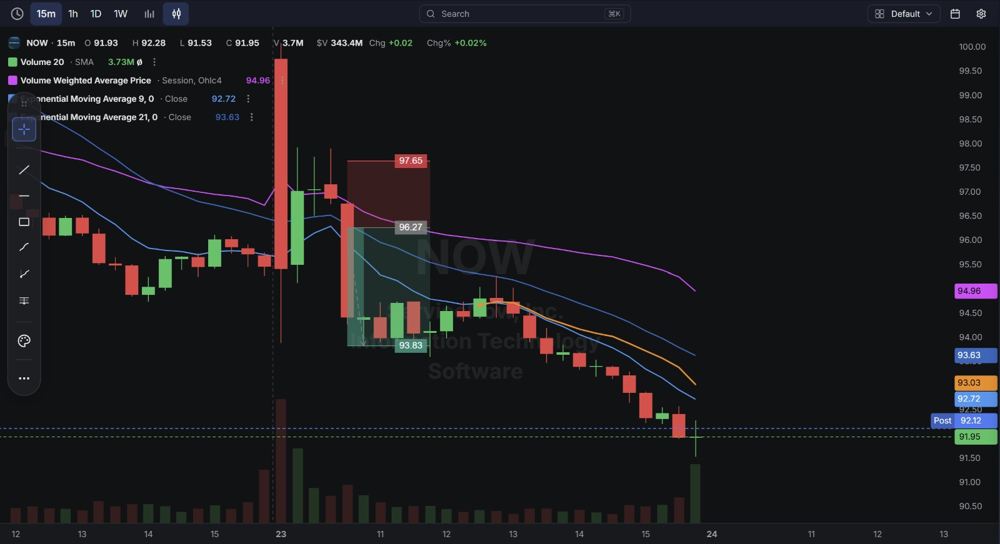
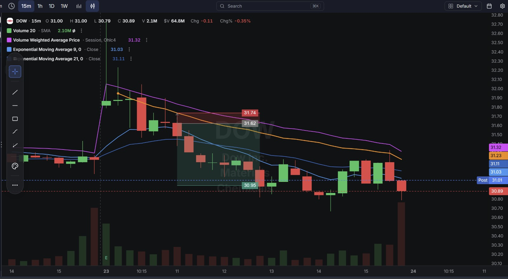
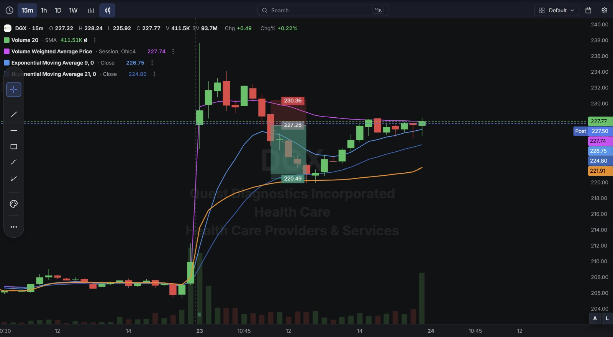

# Day 11 — US Market Analysis (23-07-2026)

**Work Format:** Pre-Market → Market Hours → After-Hours (IST evening-to-midnight coverage of the US session)

| Session | IST Timing | US Time (ET) |
|---|---|---|
| Pre-Market | 5:00 PM – 7:00 PM | 7:30 AM – 9:30 AM |
| Market Hours | 7:00 PM – 1:30 AM | 9:30 AM – 4:00 PM |
| After Hours | 1:30 AM – 2:30 AM | 4:00 PM – 5:00 PM |

> **Milestone:** This is the first session using the finalized DeepVue Pre-Market screener (built with the mentor over the past week), instead of the manual MU/NVDA/SNDK-style watchlist used through Day 10.

---

## 1. Pre-Market Analysis (7:30 AM – 9:30 AM ET)

### The Screener (Final Version)

| Group | Logic | Conditions |
|---|---|---|
| Group 1 | ALL | Pre Market Last > $5 · Pre Market Volume > 100,000 · Include Type: Common Stock |
| Group 2 | ALL | Pre Market Gap % > 2.00% · Pre Market % Change > 0.00% · RV 5d > 2.00 |
| Group 3 | ALL | Market Cap > $500M · Avg $ Vol. 20d > $10M |

**Screener Screenshot:**

**Result: 3 stocks — DGX, DOW, NOW**

### Why These 3 Made the List
All three cleared the full funnel: a real pre-market gap (>2%), genuinely elevated 5-day relative volume (>2.0x — meaning today is a statistically unusual day for each of them, not routine noise), and enough size/liquidity (Market Cap > $500M, $10M+ daily dollar volume) to actually trade cleanly. Each also showed a large, sharp gap candle right at the open on the charts — visually confirming the screener did its job of finding names with a real catalyst-driven move in progress, not just a slow drift.

---

## 2. Market Hours Observation (9:30 AM – 4:00 PM ET)

All three names showed the **same underlying pattern**: a sharp gap at the open, followed by a rejection from the highs, and then a sustained move lower through the session — with only DGX showing real two-way chop along the way.

- **NOW is low** — gapped down hard at the open, rejected at VWAP (~96.27) on a small bounce attempt, then declined steadily through the session, closing well below even the initial downside target.
- **DOW is low** — gapped up sharply at the open on a volume spike, but couldn't hold the highs — rejected and declined steadily for the rest of the session.
- **DGX is up and down** — gapped up at the open, chopped in a range, dropped hard into a support zone, then reversed and rallied back — the most two-sided, indecisive chart of the three.

---

## 3. After-Hours Analysis (4:00 PM – 5:00 PM ET)

Heading into the next session, the key open questions:
- Whether **NOW and DOW's** clean downtrends continue, or whether today was simply a gap-fade day that stabilizes tomorrow.
- Whether **DGX's** late recovery (after the sharp dip) is the start of a genuine reversal, or just one leg of continued chop.
- Since this is the first day running the finalized screener, whether **3 candidates is the right number** going forward, or whether the filters need loosening slightly to get closer to the "top 4–5" range the mentor described.

---

## 4. Trade Strategy — Actual Trades Taken (with Detailed Reasoning)

> All three setups today were **short trades**, taken off a rejection from the pre-market/opening gap high.

### 🔴 NOW — SHORT — ✅ **PASSED (and exceeded)**

**Why I took this trade:** NOW gapped down hard at the open on a huge volume spike (visible as the tall red candle at market open), then attempted a small bounce back up toward VWAP (96.27) — but that bounce stalled and reversed almost immediately. A failed bounce back to VWAP after a big gap-down candle is a sign that sellers, not buyers, are still in control, which is exactly the "initial weakness" signal from the mentor's Opening Range framework — just showing up as a VWAP rejection instead of a plain opening-range break.

**How I planned the entry and exit:**
- **Entry (96.27):** at the VWAP rejection — I didn't short the very first gap-down candle, I waited for the bounce attempt to fail first, so the entry has actual confirmation behind it rather than just chasing the initial drop.
- **Stop Loss (97.65):** placed just above the high of the bounce attempt — if price reclaimed that level, the "failed bounce" thesis would be wrong, so this is a clean invalidation point.
- **Target (93.83):** the marked support zone below — a level where I'd expect some resting buyers to show up given how far the stock had already fallen from its pre-market highs.

**Result:** Price didn't just tag 93.83 — it kept falling all the way down to the current **91.93–92.28**, well past the original target. This was the strongest, cleanest move of the three trades today.

**Chart:**

---

### 🔴 DOW — SHORT — ✅ **PASSED**

**Why I took this trade:** DOW gapped up sharply at the open with a large volume spike — exactly the "sudden volume jump" pattern from the mentor's Trend + Volume screener — but the move couldn't sustain itself. Price rejected almost immediately from the highs and started printing lower highs on the way back down, which told me the initial gap-up excitement wasn't backed by real buying conviction.

**How I planned the entry and exit:**
- **Entry (31.62):** on confirmation of the rejection, after price had already started declining from the open — not at the very top, since I wanted to see the rejection actually develop first.
- **Stop Loss (31.74):** just above the recent high, giving the trade a small amount of room without risking much if the "rejection" turned out to be a false read.
- **Target (30.95):** a support zone based on the stock's pre-gap trading range — the idea being that if the gap was truly unsupported, price would likely fall back toward where it was trading before the spike.

**Result:** Price declined steadily through the session, closing at the current **30.89**, slightly through the target — confirming the rejection thesis held for the whole day rather than reversing partway through.

**Chart:**

---

### 🔴 DGX — SHORT — ✅ **PASSED (before the later reversal)**

**Why I took this trade:** DGX gapped up at the open and chopped in a range for a while, which on its own isn't a great short signal — but once price started breaking down out of that range toward the lower part of the session's structure, it looked like the same "gap that can't hold" pattern as DOW and NOW, just with more back-and-forth before the move.

**How I planned the entry and exit:**
- **Entry (227.25):** on the breakdown out of the choppy range, once price gave up the level it had been consolidating around.
- **Stop Loss (230.36):** above the top of the chop/range — if price reclaimed that zone, the breakdown read would be wrong.
- **Target (220.49):** the next visible support level below the range.

**Result:** Price did decline down toward the **220–221** area, tagging the target zone — **✅ Passed** — but this was clearly the choppiest, least clean trade of the three, since price then reversed sharply afterward and rallied all the way back up to the current **227.77**, erasing the entire move. This is a good reminder that DGX's weaker CANSLIM/fundamental profile (flagged earlier this week — EPS Rating only 61, negative 3-year EPS/sales growth) may make it a less reliable name to short with conviction compared to NOW and DOW, even when the chart pattern looks similar at first glance.

**Chart:**

---

## 5. Trade Result Summary

| # | Stock | Setup Type | Side | Result |
|---|---|---|---|---|
| 1 | NOW | VWAP rejection after failed bounce | Short | ✅ Passed (target exceeded) |
| 2 | DOW | Rejection of gap-up open | Short | ✅ Passed |
| 3 | DGX | Breakdown from opening-range chop | Short | ✅ Passed (before a later full reversal) |

**Score: 3 for 3 on hitting target.**

### Normalized Results — $100 Total Capital Per Trade

This table assumes **$100 of total capital allocated to each trade**, with the dollar result calculated from each trade's percentage move from entry to its marked target.

| # | Stock | Capital | Entry → Target | % Move | Result | P&L |
|---|---|---|---|---|---|---|
| 1 | NOW | $100 | 96.27 → 93.83 | 2.53% | ✅ Target hit | **+$2.53** |
| 2 | DOW | $100 | 31.62 → 30.95 | 2.12% | ✅ Target hit | **+$2.12** |
| 3 | DGX | $100 | 227.25 → 220.49 | 2.97% | ✅ Target hit | **+$2.97** |
| — | **Total** | **$300 deployed** | — | — | **3 for 3** | **+$7.62** |

**On $300 total capital deployed across the three trades, the day returned $7.62 in profit — roughly a 2.54% return on capital deployed.** Worth separately noting: if NOW's position had been held past its marked target instead of closed there, it would have contributed a much larger **+$4.49** (96.27 → 91.95) instead of +$2.53 — the single best-performing name of the day by a wide margin, and a good candidate for the "trail the remainder" idea from the TraderLion notes going forward.

---

## Key Takeaways From Day 11

1. **The finalized screener worked exactly as designed on its first real day** — all three names it surfaced had genuine, tradeable gap-and-reject setups, and all three trades hit target. This is a strong first data point in favor of the current filter configuration (RV 5d > 2.0, Gap % > 2%, ALL logic on every group).
2. **All three trades today were the same core idea — short a gap that can't hold** — just expressed slightly differently (a failed VWAP bounce on NOW, a clean rejection on DOW, a breakdown from chop on DGX). Recognizing "does this gap have real conviction behind it" as one repeatable question, rather than treating each as a new setup, kept today's process simple.
3. **DGX's full reversal after the target hit is this week's clearest lesson on locking in profit** — the trade was genuinely correct and reached target, but holding past that point (rather than closing or trailing tightly) would have given the whole gain back. This directly echoes the SNDK/AAPL lesson from Days 7 and 9.
4. **DGX's weaker fundamental profile (low EPS Rating, negative 3-year growth) lining up with it being the least clean chart of the three** is a useful, if small, data point in favor of the CANSLIM overlay step — worth continuing to weight NOW/DOW-style names (assuming similarly stronger fundamentals) over DGX-style names when multiple candidates look technically similar.
5. **Next Pre-Market session:** with only 3 candidates today versus the mentor's target of 4–5, consider whether Group 2's RV 5d threshold (currently > 2.0) should be nudged slightly lower to surface one or two more names, without reopening the door to low-conviction, low-RVOL noise.
