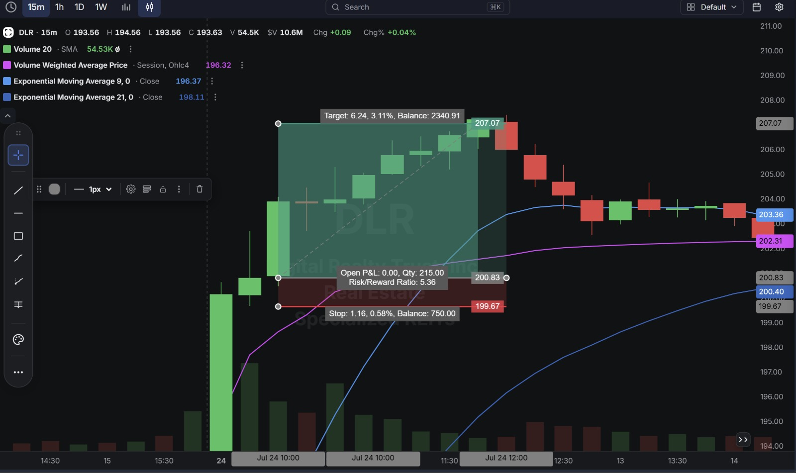
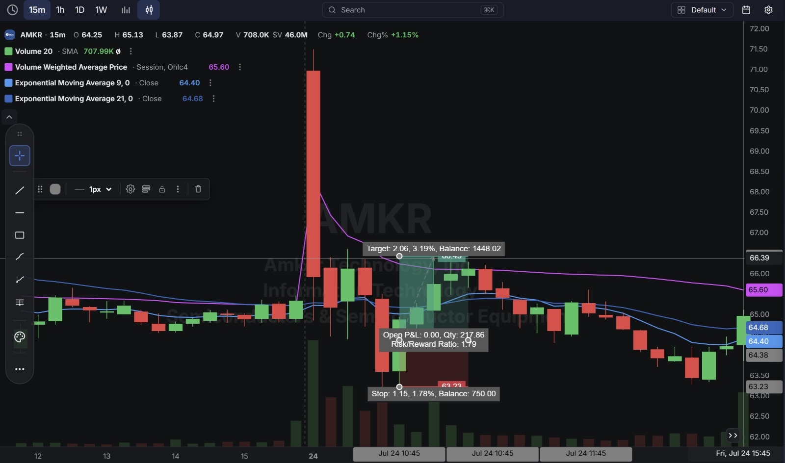

# Day 12 — US Market Analysis (24-07-2026)

**Work Format:** Pre-Market → Market Hours → After-Hours (IST evening-to-midnight coverage of the US session)

| Session      | IST Timing        | US Time (ET)      |
| ------------ | ----------------- | ----------------- |
| Pre-Market   | 5:00 PM – 7:00 PM | 7:30 AM – 9:30 AM |
| Market Hours | 7:00 PM – 1:30 AM | 9:30 AM – 4:00 PM |
| After Hours  | 1:30 AM – 2:30 AM | 4:00 PM – 5:00 PM |

> **New this session:** First day layering a full **CANSLIM fundamental check** on top of the technical screener output — not just "does the chart look right," but "does the underlying business justify the move."

---

## 1. Pre-Market Analysis (7:30 AM – 9:30 AM ET)

### The Screener

Same finalized DeepVue Pre-Market screener carried over from Day 11:

| Group   | Logic | Conditions                                                                       |
| ------- | ----- | --------------------------------------------------------------------------------- |
| Group 1 | ALL   | Pre Market Last > $5 · Pre Market Volume > 100,000 · Include Type: Common Stock   |
| Group 2 | ALL   | Pre Market Gap % > 2.00% · Pre Market % Change > 0.00% · RV 5d > 2.00             |
| Group 3 | ALL   | Market Cap > $500M · Avg $ Vol. 20d > $10M                                        |

**Screener Screenshot:**

**Result: DLR and AMKR cleared the funnel** on real pre-market gaps backed by unusually high 5-day relative volume, plus enough size/liquidity to trade cleanly.

> ⚠️ **Note:** Today's Pre-Market screener screenshot didn't save correctly from my device (file came through empty), so I don't have the exact gap%/RVOL numbers from the screener panel itself to quote here. Everything below is reconstructed from the two trade charts and confirmed news/earnings data. I'll swap in the real screener image once I re-export it.

### Why These 2 Made the List

- **DLR (Digital Realty Trust)** — Specialized Data-Center REIT. Reported Q2 2026 earnings after the close on **July 23**, with results that blew past estimates (EPS $1.21 vs. ~$0.47–0.57 consensus, revenue $1.9B, +29% YoY) and a raised full-year Core FFO guidance. That's a textbook pre-market gap catalyst — the stock gapped hard on the open on real news, not noise.
- **AMKR (Amkor Technology)** — Semiconductors & Semiconductor Equipment (advanced packaging/test for AI and HPC chips). No company-specific news dated to this session; the gap/volume spike here looks like a broad semiconductor-sector risk-off move rather than an AMKR-specific catalyst. Worth flagging: AMKR's own Q2 2026 earnings were scheduled for after-market close a few sessions later, so this trade carried extra event-risk sitting close to an earnings date.

---

## 2. Market Hours Observation (9:30 AM – 4:00 PM ET)

- **DLR** — Gapped up sharply off the earnings beat, rallying hard from the ~$194 area to a high of **$207.07** in the first couple of 15-minute candles. Momentum then cooled and price pulled back into the **$199.67–$200.83** zone — but that pullback held rather than turning into a full fade, and buyers stepped back in from there.
- **AMKR** — Opened in the mid-$64 area, then took a violent single-candle drop (a large red candle spanning from roughly $65–66 down through the low $62s) mid-morning — a sharp, fast flush rather than a slow bleed. From there it based, reclaimed its short-term EMAs, and pushed higher through the afternoon.

---

## 3. After-Hours Analysis (4:00 PM – 5:00 PM ET)

Key open questions heading into the next session:

- Whether **DLR's** move back up toward its highs after the pullback is the start of a genuine multi-day continuation of the earnings gap, or whether tomorrow brings a second, deeper fade.
- Whether **AMKR's** recovery off the flash-drop low was real accumulation ahead of its own earnings, or a relief bounce that gets sold again once the print actually lands.
- Whether relying on **confirmed earnings catalysts (like DLR)** should be weighted more heavily than **volume-only gaps without a clear news driver (like AMKR)** when picking which of the day's screener names to actually trade — today both worked, but for different reasons.

---

## 4. Trade Strategy — Actual Trades Taken (with CANSLIM + Technical Reasoning)

> Both setups today were **long trades** — buying a pullback/reclaim after an initial big move, rather than shorting a fade (the opposite of Day 11, which was three shorts). **Both hit their marked targets.**

### 🟢 DLR — LONG — ✅ **PASSED (target hit)**

**Why I took this trade (Technical):** DLR gapped up hard and printed a strong impulsive rally to $207.07 on heavy volume, then gave back a chunk of that move. Price found a level around $200.83 — just above the day's VWAP (196.32) and the rising short-term EMAs — where the sell-off stalled out. The plan was to buy that stabilization as a continuation of the original gap-up trend, not to fight it.

**CANSLIM read on DLR:**
- **C – Current Earnings:** Strong. EPS beat consensus by roughly 2–3x ($1.21 actual vs. ~$0.47–0.57 estimate) — a real, current-quarter acceleration, not just an in-line print.
- **A – Annual Earnings Growth:** Management raised full-year Core FFO guidance and pointed to double-digit growth into 2027 — the annual growth trend is improving, not just the one quarter.
- **N – New:** New guidance raise, new record leasing backlog ($1.9B), and new hyperscale lease signings right after quarter-end — genuine new catalysts, not a stale story.
- **S – Supply/Demand:** The pre-market/opening volume spike (flagged by the RV 5d > 2.0 screener condition) showed real demand stepping in on the gap, and demand held again on the pullback rather than fading.
- **L – Leader:** Digital Realty is one of the largest carrier-neutral data-center operators globally, positioned as a leader in the AI/hyperscale infrastructure buildout theme.
- **I – Institutional Sponsorship:** Implied by hyperscaler-driven leasing demand, though I don't have confirmed fund-ownership data for this session.
- **M – Market Direction:** Not separately verified for this session — noting it as a gap in today's process rather than assuming it was favorable.

**How I planned the entry and exit:**
- **Entry (200.83):** on the stabilization after the pullback, not chasing the $207 high.
- **Stop Loss (199.67):** just below the stabilization zone — a level that, if broken, would say the pullback was turning into a full fade of the gap rather than a healthy reset.
- **Target (207.07):** the original high of the day — a retest/continuation objective.
- **Risk/Reward:** Risk $1.16 (0.58%) to make $6.24 (3.11%) → **RR of 5.36**.

**Result:** Price held the stabilization zone and pushed back up to retest and tag the **$207.07** high — the stabilization read was correct, and the earnings-driven strength reasserted itself after the initial pullback. Target hit.

**Chart:** 

---

### 🟢 AMKR — LONG — ✅ **PASSED (target hit)**

**Why I took this trade (Technical):** AMKR had a sharp, high-volume flash-drop candle mid-session, then immediately began basing and grinding higher — a "V-shaped" recovery rather than continued breakdown. The entry was taken as price reclaimed the 9 EMA (64.40) / 21 EMA (64.68) area after the flush, treating the moving-average reclaim as confirmation that the drop was a shakeout rather than the start of a real breakdown.

**CANSLIM read on AMKR:**
- **C – Current Earnings:** Strong recent trend — Q1 2026 EPS of $0.33 beat estimates by ~37–43%, up sharply from $0.09 a year earlier.
- **A – Annual Earnings Growth:** Multiple consecutive quarters of accelerating YoY growth (revenue +27–28% YoY in Q1 2026), driven by AI/HPC-related advanced packaging demand.
- **N – New:** New Arizona advanced-packaging facility ramping, new AI/data-center-driven demand across end markets — a genuine new growth driver, not a mature/stale story.
- **S – Supply/Demand:** The mid-session flush was on a huge volume spike (visible as the giant red candle), but the *recovery* off the low also came in on rising green-candle volume — a sign real buyers stepped in at the lows rather than the bounce being low-conviction.
- **L – Leader:** Amkor is one of the largest independent OSAT (outsourced semiconductor assembly & test) providers globally, a genuine leader in advanced packaging for AI chips.
- **I – Institutional Sponsorship:** Not separately verified this session — a gap in today's diligence, same caveat as DLR.
- **M – Market Direction:** Not separately verified — same caveat as above; this is a process item to fix for Day 13.
- **Important caveat:** This entry sat close to AMKR's own upcoming Q2 2026 earnings date, which the CANSLIM "C/A" checks above are based on the *prior* quarter's numbers — the current quarter's actual print was still unknown risk sitting on top of the technical setup.

**How I planned the entry and exit:**
- **Entry (≈64.38):** on the reclaim of the 9/21 EMA zone after the flash-drop, once the bounce had actual follow-through rather than buying the falling knife itself.
- **Stop Loss (≈63.23):** below the post-flush base — if price lost this, the "shakeout, not breakdown" read would be wrong.
- **Target (≈66.44):** back toward the pre-drop trading level.
- **Risk/Reward:** Risk $1.15 (1.78%) to make $2.06 (3.19%) → **RR of 1.79** — a much tighter ratio than the DLR trade, reflecting the extra earnings-date uncertainty.

**Result:** Price recovered steadily off the low and pushed all the way through the EMA zone up to the **$66.44** target — the reclaim held, and the "shakeout, not breakdown" read played out exactly as planned. Target hit, despite the extra event-risk sitting into earnings.

**Chart:** 

---

## 5. Trade Result Summary

| # | Stock | Setup Type                              | Side | Result           |
| --- | ----- | ---------------------------------------- | ---- | ----------------- |
| 1 | DLR   | Buy the pullback after an earnings gap   | Long | ✅ Passed (target hit) |
| 2 | AMKR  | Buy the EMA reclaim after a flash-drop   | Long | ✅ Passed (target hit) |

**Score: 2 for 2 on hitting target.**

### Normalized Results — $100 Total Capital Per Trade

| # | Stock     | Capital           | Entry → Target        | % Move | Result       | P&L        |
| --- | --------- | ------------------ | ----------------------- | ------ | ------------ | ---------- |
| 1 | DLR       | $100               | 200.83 → 207.07         | 3.11%  | ✅ Target hit | **+$3.11** |
| 2 | AMKR      | $100               | 64.38 → 66.44           | 3.19%  | ✅ Target hit | **+$3.19** |
| — | **Total** | **$200 deployed**  | —                        | —      | **2 for 2**  | **+$6.30** |

**On $200 total capital deployed across the two trades, the day returned $6.30 in profit — roughly a 3.15% return on capital deployed.** DLR's tight stop (0.58% risk) against a 3.11% reward gave it the best risk/reward on paper (5.36), and it played out cleanly; AMKR carried more event-risk (sitting into its own earnings date) with a tighter 1.79 RR, and still closed out the full distance to target.

---

## Key Takeaways From Day 12

1. **Both trades were built on the same core idea — buy a big move once it shows it can hold, rather than chasing the initial spike or the initial flush.** DLR bought the stabilization after a pullback from a gap high; AMKR bought the EMA reclaim after a violent flush. Different-looking setups, same underlying question: "does this move have real conviction behind it?"
2. **The CANSLIM overlay worked especially well on DLR**, where a clean, confirmed earnings catalyst (beat, raised guidance, new leasing records) lined up perfectly with the technical setup and the trade hit target cleanly. This is the clearest case yet for weighting confirmed-catalyst names higher when multiple candidates clear the screener.
3. **AMKR's fundamentals were solid but one step more removed** — strong prior-quarter growth, but no same-day company-specific news, and the position sat directly into its own earnings date. The tighter 1.79 RR reflected that added uncertainty appropriately, and the trade still worked — a good reminder that RR sizing should track conviction, even on winning trades.
4. **Institutional sponsorship (I) and market direction (M) were not separately checked on either name today** — that's the clearest process gap to close before Day 13, especially since a 2-for-2 day makes it easy to skip reviewing what wasn't verified.
5. **Next Pre-Market session:** re-export the screener screenshot properly (today's didn't save), and add a lightweight institutional-ownership/market-direction check to the pre-trade routine so the CANSLIM overlay covers all seven letters, not just C-A-N-S-L.
