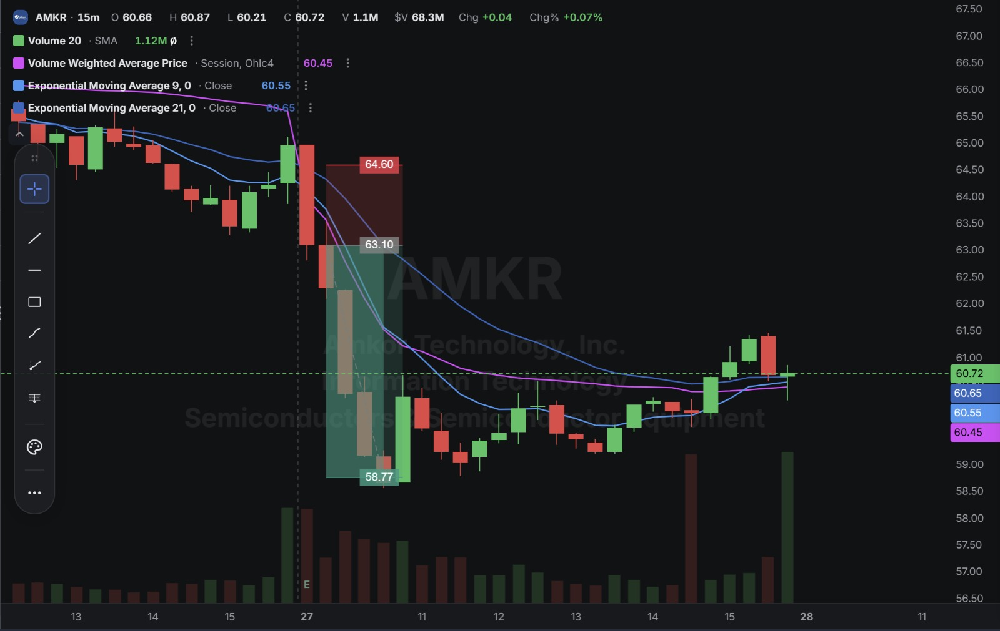
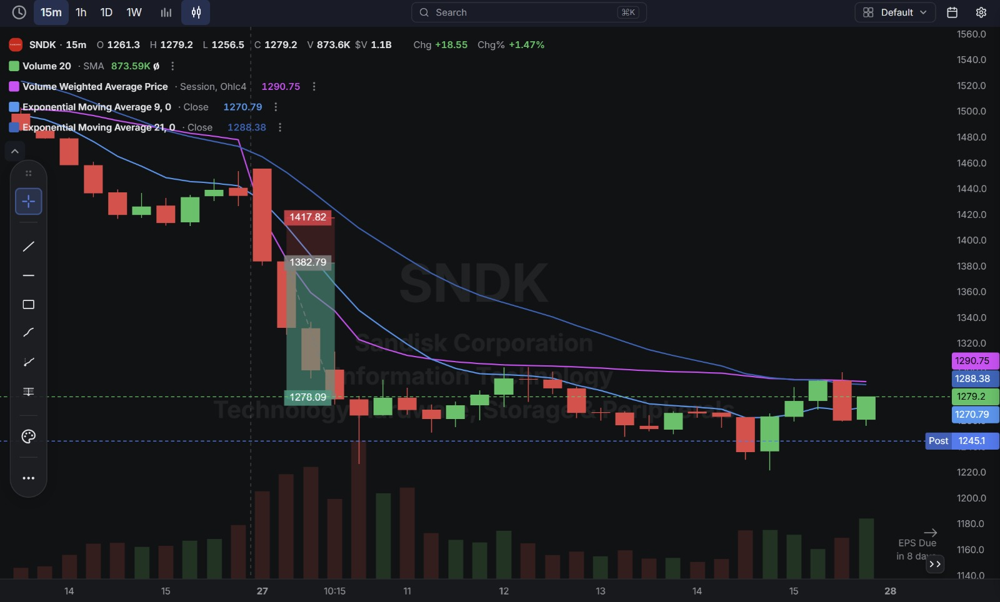
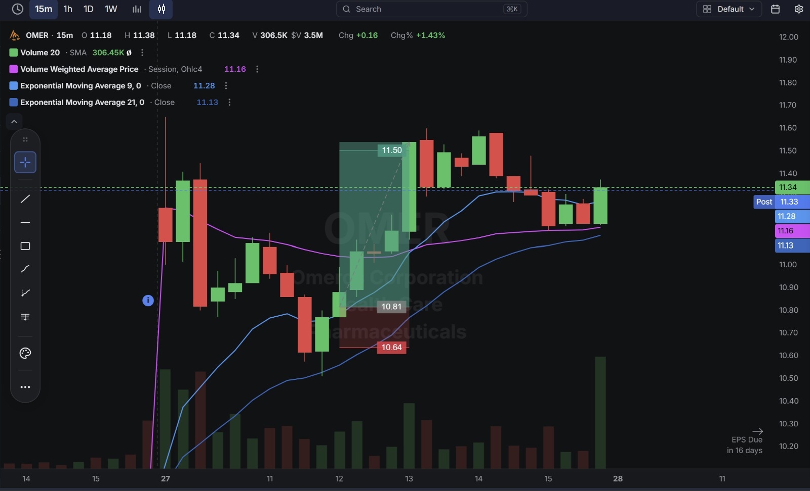

# Day 13 — US Market Analysis (27-07-2026)

**Work Format:** Pre-Market → Market Hours → After-Hours (IST evening-to-midnight coverage of the US session)

| Session | IST Timing | US Time (ET) |
|---|---|---|
| Pre-Market | 5:00 PM – 7:00 PM | 7:30 AM – 9:30 AM |
| Market Hours | 7:00 PM – 1:30 AM | 9:30 AM – 4:00 PM |
| After Hours | 1:30 AM – 2:30 AM | 4:00 PM – 5:00 PM |

---

## 1. Pre-Market Analysis (7:30 AM – 9:30 AM ET)

### The Screener (Current Configuration)

| Group | Logic | Conditions |
|---|---|---|
| Group 1 | ALL | Pre Market Last > $5 · Pre Market Volume > 100,000 · Include Type: Common Stock |
| Group 2 | ALL | RV 5d > 2.00 · Pre Market Gap % > 2.00% · Pre Market % Change > 0.00% |
| Group 3 | ALL | Avg $ Vol. 20d > $10M · Market Cap > $500M |

**Screener Screenshot:**

**Result: 9 stocks.** From this list, three were selected to actively trade: **AMKR, OMER, SNDK** — each had a real, identifiable catalyst behind its gap (not just a random screener hit), which is the manual "confirm the news" step from the mentor's screening framework.

### Overnight/Morning Catalysts
- **AMKR** reported Q2 2026 earnings after Monday's close — a record $1.9B in revenue and $0.70 EPS, crushing the $0.48 consensus. Despite the beat, the stock gapped down and kept falling on **weaker-than-expected Q3 guidance** ($1.95–2.05B vs. higher analyst expectations) — a classic "beat the quarter, miss the outlook" reaction.
- **SNDK** gapped up premarket (+3.6–5.3%) after **ChangXin Memory Technologies (CXMT)**, a Chinese memory-chip maker, completed a blockbuster Shanghai IPO that itself surged over 466% on debut. The initial reaction lifted memory names (SK Hynix, Micron, SanDisk all up premarket) on renewed AI/memory enthusiasm — but the mood flipped hard once the market opened, as investors refocused on **CXMT as a competitive threat** to the NAND/DRAM pricing environment SanDisk has ridden all year.
- **OMER** jumped on news that **AstraZeneca's Ultomiris failed a Phase 3 trial** for a rare blood disorder — since Omeros' own approved drug, Yartemlea, treats a related condition, a competitor's clinical failure is read as a direct, positive read-through for Omeros' addressable market.

---

## 2. Market Hours Observation (9:30 AM – 4:00 PM ET)

### AMKR — Gap Down on Guidance, Steady Decline
Opened lower after the earnings/guidance mismatch, declined through the session in a clean, sustained move, before recovering somewhat into the current price.

### SNDK — Gap Up, Violent Reversal, Extended Decline
Gapped up on the initial CXMT-driven memory enthusiasm, but reversed almost immediately once the broader market opened — the reversal extended into one of the stock's largest single-day declines of the year, pushing it more than 45% below its June record high and through the $1,300 support/100-day moving average level.

### OMER — Gap Up on Competitor's Clinical Failure, Clean Rally
Gapped up on the AstraZeneca news and, after some initial chop, rallied cleanly through the session toward the marked target zone.

---

## 3. After-Hours Analysis (4:00 PM – 5:00 PM ET)

Heading into the next session, the key open questions:
- Whether **SNDK's** decline is a genuine trend change (the market pricing in real, structural Chinese-competition risk to the memory upcycle) or an overreaction to a single competitor IPO, given SNDK's underlying 2026 performance has been exceptionally strong until today.
- Whether **AMKR's** guidance-driven selloff fades as the market digests the still-record quarter and the recent $1.5B Nvidia partnership, or whether the weaker Q3 outlook is the start of a real deceleration.
- Whether **OMER's** rally has any durability given its clinical/competitive read-through is indirect (AstraZeneca's failure, not a result from Omeros' own trials).

---

## 4. Trade Strategy — Actual Trades, Full CANSLIM Reasoning, and Results

> Each trade below is explained in two layers: **why the trade was taken** (including how it does or doesn't hold up against the CANSLIM framework), and **how the entry/exit was planned**.

### 🔴 AMKR — SHORT — ✅ **PASSED**

**Why I took this trade:** AMKR is a genuinely strong CANSLIM name on paper — **C (Current Earnings):** the $0.70 EPS beat was more than 45% above the $0.48 consensus; **N (New):** the recently announced $1.5B Nvidia partnership is a real, fresh catalyst; **L (Leader):** Amkor is the clear leading independent OSAT (chip packaging/test) name, reinforced by its TSMC and Nvidia partnerships. Despite all of that, the stock **gapped down and kept falling** — because the market was reacting to **forward guidance**, not the quarter that had just been reported. This is a good real-world example of why "M" (market/forward direction) and the market's read of guidance can override even a strong C+N+L profile in the short term. The trade itself wasn't a bet against AMKR's business — it was a read that a guidance-driven gap-down, once confirmed by a clean break of the pre-market range, tends to keep going for the rest of the session.

**How I planned the entry and exit:**
- **Entry (63.10):** on the break of the pre-market consolidation range, once price gave up the level it had been holding right after the open — not on the initial gap-down candle itself.
- **Stop Loss (64.60):** just above that same consolidation range — if price reclaimed it, the "guidance disappointment is driving the day" thesis would be wrong.
- **Target (58.77):** the next visible support level below, based on the stock's recent trading range before the Nvidia-deal-driven rally.

**Result:** Price declined cleanly to the target zone (**58.77**) — ✅ Passed — before recovering back up to the current **60.72** as some buyers stepped in around the strong-quarter/Nvidia-deal narrative.

**Chart:**

---

### 🔴 SNDK — SHORT — ✅ **PASSED (near-exact)**

**Why I took this trade:** SNDK is the most instructive CANSLIM case of the day. By nearly every "C/A" measure, SanDisk has been one of the single best-performing stocks of 2026 (roughly +500% year-to-date coming into today) — the earnings story itself hasn't changed, and the next report isn't even until August 5th. What changed was **"S" (Supply/Demand) and "M" (Market)** at the *industry* level: CXMT's blockbuster IPO reintroduced a real fear that Chinese manufacturers could disrupt NAND/DRAM pricing power, and — separately — SNDK's enormous 2026 run made it an obvious source of profit-taking the moment sector sentiment wobbled. This is a direct, live example of the mentor's "composite risk" warning: a stock's own fundamentals can be excellent, and it can still fall hard because of a sector-wide risk-off shift.
- **Entry (1,382.79):** short on the reversal from the premarket gap-up high, once the initial CXMT-driven optimism visibly failed to hold.
- **Stop Loss (1,417.82):** above the gap-up high — if buyers reclaimed that level, the reversal thesis was wrong.
- **Target (1,278.09):** the next support shelf below, based on recent consolidation before the stock's most recent leg higher.

**Result:** Price declined almost exactly to the target (**1,278.09**), and the current price (**1,279.20**) is still sitting right there — unlike AMKR and OMER, this move hasn't reversed away from target yet. This was also, by a wide margin, the largest percentage move of the day.

**Chart:**

---

### 🟢 OMER — LONG — ✅ **PASSED**

**Why I took this trade:** This is the clearest example today of a stock that clears the **technical/gap screener** but would **fail a full CANSLIM fundamental check** — worth being explicit about that distinction rather than treating every gap-up as an equally strong setup.
- **N (New):** genuinely real — AstraZeneca's Phase 3 failure is a legitimate, positive competitive catalyst for Omeros' own drug.
- **C & A (Earnings):** weak — Omeros has negative operating margins exceeding -1000% and a GF Score of just 26/100.
- **I (Institutional):** a red flag, not a green one — recent insider activity shows **net selling**, not buying.
- This trade was taken as a **pure momentum/catalyst play**, not a CANSLIM "true market leader" trade — a deliberate, conscious choice to treat it as a short-duration technical trade rather than a fundamentally-backed position to hold longer.

**How I planned the entry and exit:**
- **Entry (10.81):** after the initial gap-up spike cooled and consolidated, rather than chasing the first move.
- **Stop Loss (10.64):** just below that consolidation zone.
- **Target (11.50):** the next resistance level from the stock's recent trading range.

**Result:** Price rallied cleanly to and slightly through the target (touching roughly **11.4–11.6** on the chart) — ✅ Passed — before settling back to the current **11.34**.

**Chart:**

---

## 5. Trade Result Summary

| # | Stock | Setup Type | Side | CANSLIM Read | Result |
|---|---|---|---|---|---|
| 1 | AMKR | Guidance-driven gap down, breakdown from consolidation | Short | Strong C/N/L, but "M" (guidance reaction) drove the move | ✅ Passed |
| 2 | SNDK | Sector-wide reversal (CXMT competitive threat) | Short | Strong C/A historically, but "S"/"M" at the sector level drove today | ✅ Passed (near-exact) |
| 3 | OMER | Competitor clinical failure, catalyst-driven gap | Long | Real "N," but weak C/A/I — pure momentum trade | ✅ Passed |

**Score: 3 for 3.**

### Normalized Results — $100 Total Capital Per Trade

This table assumes **$100 of total capital allocated to each trade**, with the dollar result calculated from each trade's percentage move from entry to its marked target.

| # | Stock | Capital | Entry → Target | % Move | Result | P&L |
|---|---|---|---|---|---|---|
| 1 | AMKR | $100 | 63.10 → 58.77 | 6.86% | ✅ Target hit | **+$6.86** |
| 2 | SNDK | $100 | 1,382.79 → 1,278.09 | 7.57% | ✅ Target hit | **+$7.57** |
| 3 | OMER | $100 | 10.81 → 11.50 | 6.38% | ✅ Target hit | **+$6.38** |
| — | **Total** | **$300 deployed** | — | — | **3 for 3** | **+$20.81** |

**On $300 total capital deployed across the three trades, the day returned $20.81 in profit — roughly a 6.94% return on capital deployed**, the best single-day return so far in this documentation series — driven by all three names having unusually large, catalyst-driven percentage moves rather than the smaller 1–3% moves typical of the MU/NVDA/QQQ-style large-caps traded earlier in the internship.

---

## Key Takeaways From Day 13

1. **Today is the clearest illustration yet of why CANSLIM is a full 7-letter framework, not just "find good news and buy/sell it."** AMKR had strong C/N/L but still fell on weak guidance. SNDK had a strong C/A track record all year but still fell hard on a sector-level S/M shock it had nothing to do with directly. OMER had a real N but weak C/A/I — the strongest CANSLIM profile of the three (AMKR) still produced a short trade, because the *direction* of the catalyst mattered more than the *quality* of the underlying business for today's specific setup.
2. **SNDK is a textbook "composite/sector risk" example from the mentor's Risk Management notes** — an excellent individual stock can still fall sharply purely because of what's happening elsewhere in its sector, with zero new company-specific bad news.
3. **OMER is a useful reminder to trade catalyst-driven gaps on weak-fundamental names as short, defined trades** (entry/stop/target, no longer-term hold) rather than mistaking a real news catalyst for a genuine CANSLIM "true market leader" setup — the two are not the same thing, even when the chart looks similar.
4. **Today's percentage moves (6–7.5% per trade) were roughly 3–4x larger than the typical 1–2% moves on Days 4–10's MU/NVDA/QQQ setups** — a good reminder that mid/small-cap, earnings-and-catalyst-driven names (this screener's specialty) carry meaningfully more volatility, and position sizing should account for that rather than treating every $100-notional trade as equally risky.
5. **Next Pre-Market session:** watch whether SNDK's break below $1,300/its 100-day moving average holds as new resistance on any bounce attempt, and whether AMKR's post-earnings decline stabilizes once the market fully digests the still-record quarter alongside the softer guidance.
