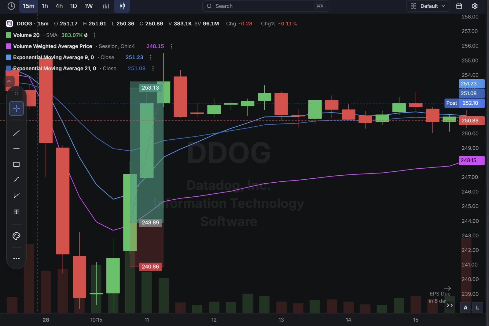
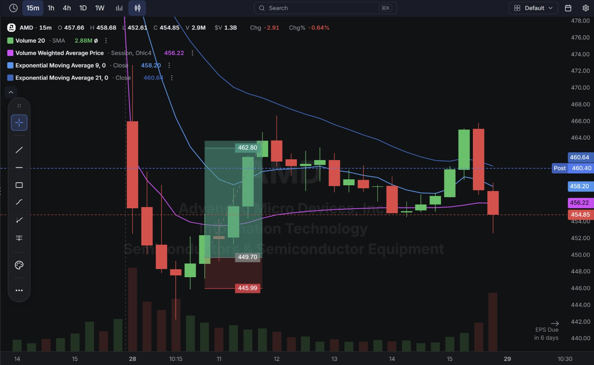

# Day 14 — US Market Analysis (28-07-2026)

**Work Format:** Pre-Market → Market Hours → After-Hours (IST evening-to-midnight coverage of the US session)

| Session      | IST Timing        | US Time (ET)      |
| ------------ | ----------------- | ----------------- |
| Pre-Market   | 5:00 PM – 7:00 PM | 7:30 AM – 9:30 AM |
| Market Hours | 7:00 PM – 1:30 AM | 9:30 AM – 4:00 PM |
| After Hours  | 1:30 AM – 2:30 AM | 4:00 PM – 5:00 PM |

> **New this session:** Switched the screener over from the pure "gap + volume" version used through Day 13 to a proper **CANSLIM Screener**, built to filter directly on earnings acceleration and institutional accumulation instead of just price/volume gaps.

---

## 1. Pre-Market Analysis (7:30 AM – 9:30 AM ET)

### The Screener (New Configuration — "CANSLIM Screener")

| Group   | Logic | Conditions                                                                                                  |
| ------- | ----- | ------------------------------------------------------------------------------------------------------------ |
| Group 1 | ALL   | Dollar Volume > $20M · AS 3M > 85 · Include Type: Common Stock                                                |
| Group 2 | ALL   | EPS Growth Latest Rptd Qtr (%) > 25.00% · Sales Growth Latest Rptd Qtr (%) > 25.00% · AS 1M > 95              |

**Screener Screenshot:** 

**Result: 56 stocks.** Unlike the old gap screener, this version is CANSLIM by design: Group 1's **AS 3M > 85** and Group 2's **AS 1M > 95** filters are directly measuring institutional **A**ccumulation **S**core over 3-month and 1-month windows — the "I" (Institutional Sponsorship) letter of CANSLIM, built into the filter itself. Group 2's EPS/Sales growth >25% conditions filter directly for the "C" (Current Earnings) letter. From the 56 results, three were selected to actively trade: **MU, DDOG, AMD** — all three had cleared the earnings-acceleration + accumulation filters, but all three were also caught in the same broad market-wide selloff, which is what made today's setups interesting.

### Overnight/Morning Catalysts

- **Broad AI/semiconductor risk-off, not a single-stock catalyst.** The dominant story overnight was a global chip selloff: Samsung and SK Hynix's preliminary results out of Asia disappointed, the KOSPI briefly triggered a "sidecar" circuit breaker after falling over 7%, and China's ChangXin Memory Technologies (CXMT) — a direct competitive threat in the memory space — kept fueling fears that Chinese manufacturers could pressure NAND/DRAM pricing power. **Western Digital, Applied Materials, Marvell, Micron, AMD, and Nvidia all sold off together** as AI-valuation worries spread across the sector.
- **MU** was the epicenter — down as much as 10.6% the prior session and continuing lower, even though the company's actual quarterly numbers (record ~$41.5B revenue territory, strong free cash flow, new multi-year Strategic Customer Agreements) haven't changed. Rising bond yields and fresh talk of tighter export controls on advanced semiconductor equipment added to the pressure, and a technical break of key support levels triggered automated sell programs that accelerated the drop.
- **AMD** was swept into the same tape — grouped explicitly with MU and the other chip names in the day's "AI-valuation worries" selloff, with added competitive-narrative pressure from reports that Chinese firms are building their own AI chips to reduce reliance on Nvidia (and, by extension, AMD).
- **DDOG** isn't a chip stock, but it wasn't spared either — it dropped alongside the broader tech tape as risk-off sentiment moved from semiconductors into higher-multiple software/AI-adjacent names generally. No DDOG-specific news was tied to today's drop; this was purely a sympathy move with the broader session, with the stock's actual Q2 earnings still **8 days away**.

---

## 2. Market Hours Observation (9:30 AM – 4:00 PM ET)

### MU — Gap Down Hard, Sharp V-Recovery

Opened sharply lower continuing the prior session's steep decline, briefly slipping well below $800, then found a floor and rallied hard through the session — recovering most of the drop before cooling off into the current price.

### DDOG — Gap Down With the Tape, Clean Reclaim

Gapped down hard alongside the broader risk-off tech tape, based out quickly, then rallied cleanly back up through the session before giving back some of the move into the current price.

### AMD — Gap Down With Chip Sector, Strong Recovery

Opened sharply lower with the rest of the semiconductor names, based, then pushed higher through the session in a strong recovery before fading somewhat off the highs into the current price.

---

## 3. After-Hours Analysis (4:00 PM – 5:00 PM ET)

Heading into the next session, the key open questions:

- Whether **MU's** sharp intraday recovery is the start of a genuine stabilization — supported by real Strategic Customer Agreements and still-strong cash generation — or just a one-day bounce inside a larger sector downtrend still being driven by China/CXMT competitive fears.
- Whether **AMD** and the broader chip complex hold today's recovery levels, or whether the "AI-valuation is overextended" narrative resurfaces and drags the group back down.
- Whether **DDOG's** rebound — on no company-specific news — was simply beta to the broader tech tape reversing, and how the stock behaves as it moves closer to its earnings date in 8 days.

---

## 4. Trade Strategy — Actual Trades, Full CANSLIM Reasoning, and Results

> Each trade below is explained in two layers: **why the trade was taken** (including how it does or doesn't hold up against the CANSLIM framework), and **how the entry/exit was planned**. All three were **long** trades — buying the recovery off a broad, sentiment-driven flush rather than chasing the initial panic lower.

### 🟢 MU — LONG — ✅ **PASSED**

**Why I took this trade:** MU is the strongest CANSLIM name of the day on paper. **C (Current Earnings):** cleared the screener's >25% EPS and sales growth filters on real, reported numbers. **A (Annual Earnings Growth):** newly signed multi-year Strategic Customer Agreements point to a more durable growth trajectory than the old memory boom-bust cycle. **N (New):** the SCAs themselves are a fresh, forward-looking catalyst, and the stock was sitting close to its 52-week high territory before this pullback. **I (Institutional Sponsorship):** passed both the AS 3M > 85 and AS 1M > 95 accumulation filters, meaning big money has been net accumulating even through recent volatility. The one letter clearly working against the stock today was **S/M** — a sector-wide, sentiment-driven selloff (Samsung/SK Hynix weakness, CXMT competitive fears, automated sell-program triggers on a support break) that had nothing to do with MU's own numbers. The trade was a bet that a strong C/A/N/I profile reasserts itself once the panic-driven selling exhausts, rather than a bet that the "China memory competition" risk is fully resolved.

**How I planned the entry and exit:**
- **Entry (807.81):** on the stabilization after the sharp drop below $800, once selling pressure visibly slowed rather than on the panic candle itself.
- **Stop Loss (797.83):** below that stabilization zone — if lost, the "this is a shakeout, not a trend change" read would be wrong.
- **Target (828.14):** the next visible resistance/retest level from the pre-drop trading range.
- **Risk/Reward:** Risk $9.98 (1.24%) to make $20.33 (2.52%) → **RR of 2.04**.

**Result:** Price rallied cleanly off the entry zone and pushed through the **$828.14** target on its way to a session/post-market high near **$830.75**, before cooling off into the current **$820.25**. Target hit.

**Chart:** 

---

### 🟢 DDOG — LONG — ✅ **PASSED**

**Why I took this trade:** DDOG is a harder CANSLIM case than MU, and worth being explicit about that rather than treating every recovering gap the same way. **C/A:** cleared the screener's growth filters on its last reported quarter, but the next print is **8 days out** — meaning today's fundamentals read is based on trailing data, not a fresh confirmation. **N:** no company-specific new catalyst was identifiable for today's drop or bounce — this was a pure sympathy move with the broader tech tape. **I:** passed both accumulation filters (AS 3M > 85, AS 1M > 95), which is the main fundamental support for the trade. **L:** Datadog remains a recognized leader in the observability/monitoring software category. This trade leaned more on the technical reclaim than on a fresh CANSLIM catalyst — a conscious choice to treat it as a short-duration bounce trade off a broad-market flush rather than a high-conviction fundamental position, especially with earnings still ahead.

**How I planned the entry and exit:**
- **Entry (243.89):** on the reclaim after the flush low, once the stock stopped making new lows alongside the broader tape.
- **Stop Loss (240.86):** below the post-flush base — if broken, the "sympathy bounce" read would be wrong.
- **Target (253.13):** back toward the pre-drop trading level.
- **Risk/Reward:** Risk $3.03 (1.24%) to make $9.24 (3.79%) → **RR of 3.05**.

**Result:** Price rallied through the reclaim zone and pushed past the **$253.13** target (intraday high near $254), before pulling back into the current **$250.89** (post-market $252.10). Target hit.

**Chart:** 

---

### 🟢 AMD — LONG — ✅ **PASSED**

**Why I took this trade:** AMD sits between MU and DDOG on the CANSLIM spectrum. **C/A:** cleared the >25% EPS/sales growth filters on the last reported quarter, with earnings due again in **6 days** — similar trailing-data caveat as DDOG. **N:** less clean than MU's SCA story — the closest thing to a fresh catalyst is the competitive narrative around Chinese firms building their own AI chips, which is actually a *headwind* narrative for AMD rather than a tailwind, making this more of a pure "broad selloff, buy the recovery" trade than a fundamentally-driven one. **L:** AMD is a genuine leader in the CPU/GPU and AI-accelerator race, which is exactly why it gets swept into every "AI-valuation" risk-off wave alongside Nvidia. **I:** passed both accumulation filters. The trade was a bet on the recovery/reclaim holding through the same broad risk-off wave that hit MU, rather than a standalone AMD-specific thesis.

**How I planned the entry and exit:**
- **Entry (449.70):** on the reclaim after the flush low, in line with the rest of the chip sector's recovery move.
- **Stop Loss (445.99):** below the post-flush base — if broken, the recovery thesis across the sector would be in question.
- **Target (462.80):** back toward the pre-drop trading range.
- **Risk/Reward:** Risk $3.71 (0.83%) to make $13.10 (2.91%) → **RR of 3.53**.

**Result:** Price rallied through the reclaim zone and pushed past the **$462.80** target (intraday high in the $465–466 area), before fading back into the current **$454.85** (post-market $460.40). Target hit.

**Chart:** 

---

## 5. Trade Result Summary

| # | Stock | Setup Type                                        | Side | CANSLIM Read                                                             | Result       |
| --- | ----- | --------------------------------------------------- | ---- | -------------------------------------------------------------------------- | ------------- |
| 1 | MU    | Buy the stabilization after a sector-wide flush     | Long | Strong C/A/N/I; today's drop was pure sector "S"/"M" risk-off              | ✅ Passed     |
| 2 | DDOG  | Buy the sympathy-flush reclaim, no direct catalyst  | Long | Passed screener I/C filters, but no fresh "N" and earnings still 8 days out | ✅ Passed     |
| 3 | AMD   | Buy the sector recovery alongside MU/chip complex   | Long | Passed screener C/I filters; "N" narrative actually a headwind, not a tailwind | ✅ Passed     |

**Score: 3 for 3.**

### Normalized Results — $100 Total Capital Per Trade

This table assumes **$100 of total capital allocated to each trade**, with the dollar result calculated from each trade's percentage move from entry to its marked target.

| # | Stock     | Capital           | Entry → Target   | % Move | Result       | P&L        |
| --- | --------- | ------------------ | ------------------ | ------ | ------------ | ---------- |
| 1 | MU        | $100               | 807.81 → 828.14     | 2.52%  | ✅ Target hit | **+$2.52** |
| 2 | DDOG      | $100               | 243.89 → 253.13     | 3.79%  | ✅ Target hit | **+$3.79** |
| 3 | AMD       | $100               | 449.70 → 462.80     | 2.91%  | ✅ Target hit | **+$2.91** |
| — | **Total** | **$300 deployed**  | —                   | —      | **3 for 3**  | **+$9.22** |

**On $300 total capital deployed across the three trades, the day returned $9.22 in profit — roughly a 3.07% return on capital deployed.** Smaller per-trade percentage moves than Day 13's catalyst-driven names (AMKR/SNDK/OMER averaged ~6.9%), which makes sense — today's three trades were large, liquid, index-heavy names bouncing off a broad sentiment flush rather than small/mid-caps reacting to individual news events.

---

## Key Takeaways From Day 14

1. **The new CANSLIM Screener changes what "why did this stock show up" means.** Days 11–13 answered that question with "it gapped on volume, and here's the news." Today's screener answers it with "it has real earnings/sales acceleration and real institutional accumulation" *before* any gap or news is even considered — a meaningfully different (and more CANSLIM-faithful) starting point.
2. **MU is today's cleanest CANSLIM lesson:** a stock can pass every fundamental letter of the framework (C, A, N, I, L) and still drop double digits over two sessions purely on **S/M** — sector-wide sentiment and a technical support break triggering automated selling. The trade wasn't a disagreement with the selloff; it was a bet that the other five letters would reassert themselves once the panic-driven selling exhausted, and today they did.
3. **DDOG and AMD are useful reminders that passing the screener's institutional-accumulation filter (I) is not the same as having a same-day fundamental catalyst (N).** Both traded well today, but both trades leaned on the technical reclaim and the "swept up in someone else's selloff" logic more than on a fresh, stock-specific story — worth tracking separately from MU-style setups when reviewing win rates later.
4. **All three names shared the same underlying trade idea despite different CANSLIM profiles: buy the reclaim once a broad, sentiment-driven flush stops making new lows.** That's a repeatable pattern worth watching for on future broad-market-selloff days, regardless of which specific stocks the screener surfaces.
5. **Next Pre-Market session:** track whether MU's Strategic Customer Agreement story continues to outweigh the China/CXMT competitive narrative over the next few sessions, and watch how DDOG and AMD trade as they move closer to their own earnings dates (8 and 6 days out respectively) — that's when their own "C" letter gets a fresh, current-quarter test instead of relying on the last reported one.
