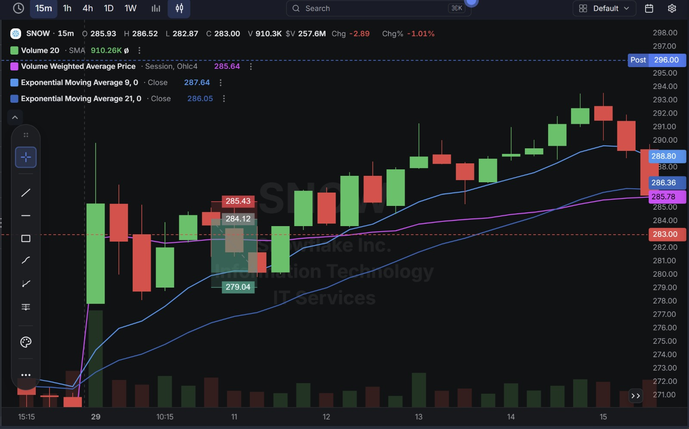
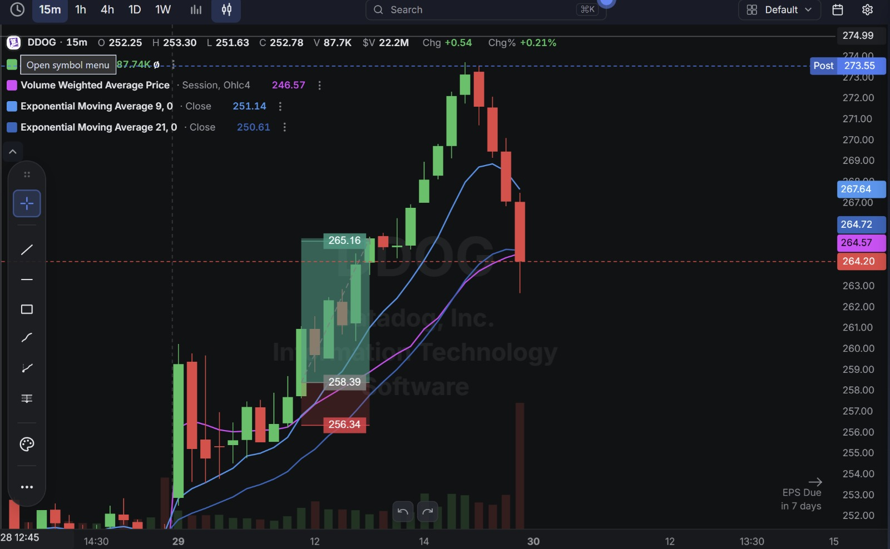
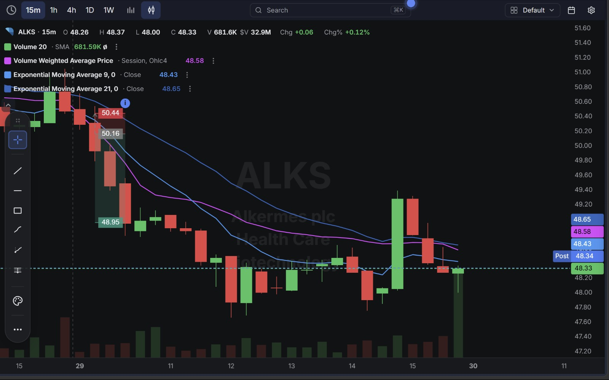

# Day 15 — US Market Analysis (29-07-2026)

**Work Format:** Pre-Market → Market Hours → After-Hours (IST evening-to-midnight coverage of the US session)

| Session      | IST Timing        | US Time (ET)      |
| ------------ | ----------------- | ----------------- |
| Pre-Market   | 5:00 PM – 7:00 PM | 7:30 AM – 9:30 AM |
| Market Hours | 7:00 PM – 1:30 AM | 9:30 AM – 4:00 PM |
| After Hours  | 1:30 AM – 2:30 AM | 4:00 PM – 5:00 PM |

> **New this session:** Tightened the CANSLIM Screener from Day 14 by adding two more years of history to the earnings-growth check (**EPS Growth 3 Yrs Ago** and **EPS Growth 5 Yrs Ago**, both > 25%) — the screener now demands a multi-year growth pattern, not just one strong recent quarter. Results dropped from 56 stocks on Day 14 to just **9** today, a much more selective list.

---

## 1. Pre-Market Analysis (7:30 AM – 9:30 AM ET)

### The Screener (Refined Configuration — "CANSLIM Screener")

| Group   | Logic | Conditions                                                                                                                                             |
| ------- | ----- | --------------------------------------------------------------------------------------------------------------------------------------------------------- |
| Group 1 | ALL   | Dollar Volume > $20M · AS 3M > 85 · Include Type: Common Stock                                                                                            |
| Group 2 | ALL   | EPS Growth Latest Rptd Qtr (%) > 25.00% · Sales Growth Latest Rptd Qtr (%) > 25.00% · AS 1M > 95 · EPS Growth 3 Yrs Ago (%) > 25.00% · EPS Growth 5 Yrs Ago (%) > 25.00% |

**Screener Screenshot:** 

**Result: 9 stocks.** Adding the 3-year and 5-year EPS growth conditions is a direct upgrade to the "A" (Annual Earnings Growth) letter of CANSLIM — the old version only proved a company had one good recent quarter; this version proves the company has been compounding earnings growth for years, not just showing a single spike. From the 9 results, three were selected to actively trade: **SNOW, DDOG, ALKS** — two continuation/momentum names and one earnings-reaction name.

### Overnight/Morning Catalysts

- **SNOW (Snowflake)** — No earnings-day catalyst (next report isn't until Aug 26), but the stock has been on a sustained AI-driven re-rating all year: Q1 product revenue accelerated to 34% YoY growth (up from 26% a year ago), net revenue retention climbed to 126%, and July 28 brought a fresh **Cortex AI Gateway** security-platform announcement plus new partnerships (Aembit, 1Password). Multiple sell-side desks (BofA, Citi, Jefferies) have been raising targets and naming it a top software pick. This is a genuine, still-unfolding "N" story riding on top of an already-strong "C/A" profile.
- **DDOG (Datadog)** — Continuing straight out of Day 14's setup with no new company-specific news; still riding the broader tech-tape recovery, with its own Q2 earnings now **7 days away** (down from 8 days yesterday).
- **ALKS (Alkermes)** — Reported Q2 2026 earnings before the bell on **July 28**: revenue of $496.0M beat the ~$457–459M consensus (+27% YoY) and adjusted EPS came in at $0.00 vs. a consensus loss of -$0.02–0.29, but the market focused entirely on **guidance** — full-year revenue guidance of $1.785B midpoint landed just below the $1.81B analyst consensus. Shares gapped down roughly 5% on the beat-but-guide-down reaction, a near-identical setup to Day 13's AMKR trade.

---

## 2. Market Hours Observation (9:30 AM – 4:00 PM ET)

### SNOW — Extended Rally, Late Pause and Pullback

Continued grinding higher through the session on the AI-security-announcement tailwind, pushing well into the low-$290s before cooling off and pulling back into the current price late in the session.

### DDOG — Strong Continuation, Sharp Late Reversal

Extended its recovery aggressively through the session, rallying well past its prior levels, before a sharp single-candle reversal knocked it back down off the highs into the current price — though the post-market price recovered back above the intraday high.

### ALKS — Sharp Earnings-Gap Decline, Extended Lower, Late Stabilization

Gapped down hard on the guidance miss and kept falling through the morning well past the initial drop, before basing out and chopping sideways into a modest recovery by the current price.

---

## 3. After-Hours Analysis (4:00 PM – 5:00 PM ET)

Heading into the next session, the key open questions:

- Whether **SNOW's** pullback after its extended run is healthy digestion of a genuine multi-year growth story, or the first sign that the AI-security-catalyst rally got ahead of itself in the short term.
- Whether **DDOG's** sharp late reversal is just profit-taking after a strong run, or an early signal of nerves building ahead of its earnings date in 7 days.
- Whether **ALKS's** stabilization after such a deep guidance-driven drop is a genuine floor, or just a pause before the guidance disappointment keeps working through the stock, given short interest is already elevated at 10.7% of float.

---

## 4. Trade Strategy — Actual Trades, Full CANSLIM Reasoning, and Results

> Each trade below is explained in two layers: **why the trade was taken** (including how it does or doesn't hold up against the CANSLIM framework), and **how the entry/exit was planned**.

### 🔴 SNOW — SHORT — ❌ **STOPPED OUT**

**Why I took this trade:** After SNOW's extended run on the Cortex AI Gateway news, price paused right around the VWAP/EMA cluster — the plan was to fade that pause as short-term exhaustion after such a fast move, on the idea that a stock can't run in a straight line forever. Where this trade goes wrong on a full CANSLIM read is worth being explicit about: **C (Current Earnings):** SNOW cleared the strict new multi-year screener, meaning both its latest quarter *and* its 3-year and 5-year EPS growth all clear >25% — a genuinely rare, high-quality combination. **A (Annual Earnings Growth):** product revenue growth has been *accelerating* for consecutive quarters (26% → 30% → 34% YoY), the opposite of a decelerating story. **N (New):** the Cortex AI Gateway launch and new security partnerships are fresh, real catalysts, not stale news. **L (Leader):** named a top software pick by multiple desks (Citi, Jefferies), with price targets being raised, not cut. **I (Institutional Sponsorship):** passed both AS 3M > 85 and AS 1M > 95 — real institutional accumulation, not distribution. In hindsight, shorting a name with essentially a perfect CANSLIM profile on nothing more than "it went up a lot, it should pause" was the weakest read of the day — this wasn't a real reversal signal, just a brief flag before the stock kept climbing.

**How I planned the entry and exit:**
- **Entry (284.12):** short on the pause at the VWAP/EMA cluster after the extended rally, betting on short-term mean reversion.
- **Stop Loss (285.43):** just above that pause zone — a tight, 0.46% stop given how strong the underlying trend was.
- **Target (279.04):** the next support shelf below.
- **Risk/Reward:** Risk $1.31 (0.46%) to make $5.08 (1.79%) → **RR of 3.88**.

**Result:** Price never came close to the target — it broke back above the stop almost immediately and continued climbing into the $290s before the late pullback, confirming that the pause was a continuation flag, not a reversal. Stopped out at **285.43**. A clean, textbook example of why fading a stock with a near-perfect CANSLIM profile is a low-odds bet even with a good-looking chart pause.

**Chart:** 

---

### 🟢 DDOG — LONG — ✅ **PASSED**

**Why I took this trade:** DDOG's setup carried over directly from Day 14's "buy the sympathy-flush reclaim" logic, now one day further along. **C/A:** still resting on the last reported quarter's growth numbers (screener-cleared), with the next print now only 7 days out — the trailing-data caveat from yesterday still applies, one day closer to resolution. **N:** still no fresh, DDOG-specific catalyst — this remains a beta/momentum trade riding the broader tape rather than a fundamentally-driven one. **I:** passed the accumulation filters again today. **L:** still a recognized observability-category leader. The trade thesis was simple: the prior session's reclaim held, and the stock's own momentum (not a new story) was strong enough to keep pushing higher.

**How I planned the entry and exit:**
- **Entry (258.39):** on continuation of the prior session's reclaim, buying strength rather than waiting for a deeper pullback.
- **Stop Loss (256.34):** below the base of that continuation move.
- **Target (265.16):** the next resistance extension above.
- **Risk/Reward:** Risk $2.05 (0.79%) to make $6.77 (2.62%) → **RR of 3.30**.

**Result:** Price rallied well past the target, reaching into the $271–273 area, before a sharp single-candle reversal pulled it back to the current **264.20** (post-market recovered further to **273.55**). Target hit comfortably before the late-session pullback.

**Chart:** 

---

### 🔴 ALKS — SHORT — ✅ **PASSED**

**Why I took this trade:** ALKS is this session's version of Day 13's AMKR — a "beat the quarter, miss the outlook" reaction. **C (Current Earnings):** revenue grew 27% YoY and beat consensus, and the stock's improving EPS trend (from a deep prior-year loss toward breakeven) is real. **N:** the CEO transition (Blair Jackson assuming the role August 1) is a fresh, relevant event, though not the catalyst driving today's move. Where the CANSLIM read turns negative: **M (Market's read of guidance):** the market ignored the beat entirely and sold off purely on the full-year revenue guidance midpoint landing just under consensus. **I (Institutional Sponsorship):** a genuine red flag rather than a green one here — $2.2M of insider selling over the past three months with no offsetting purchases, and short interest already sitting at 10.7% of float and rising. This trade was a bet that a guidance-driven gap-down, on a stock with weak insider conviction, tends to keep extending for the session rather than snap back — the same logic that worked on AMKR two days earlier.

**How I planned the entry and exit:**
- **Entry (50.16):** short on the break of the initial post-earnings consolidation, once the bounce attempt failed to hold.
- **Stop Loss (50.44):** just above that consolidation range — a tight, 0.56% stop.
- **Target (48.95):** the next support level below, based on the stock's recent pre-earnings range.
- **Risk/Reward:** Risk $0.28 (0.56%) to make $1.21 (2.41%) → **RR of 4.32**.

**Result:** Price broke down cleanly through the target, extending even further to the $47.20–47.40 area, before basing and recovering modestly back to the current **48.33**. Target hit with room to spare.

**Chart:** 

---

## 5. Trade Result Summary

| # | Stock | Setup Type                                             | Side  | CANSLIM Read                                                                 | Result         |
| --- | ----- | ------------------------------------------------------- | ----- | ------------------------------------------------------------------------------ | -------------- |
| 1 | SNOW  | Fade a pause after an extended AI-catalyst rally        | Short | Near-perfect C/A/N/L/I profile — the fade itself was the weak link            | ❌ Stopped out |
| 2 | DDOG  | Continuation of prior session's sympathy-flush reclaim  | Long  | Passed screener I/C filters; still no fresh "N," earnings 7 days out          | ✅ Passed      |
| 3 | ALKS  | Guidance-driven gap down, breakdown from consolidation  | Short | Real C (beat), but "M" (guidance reaction) and weak "I" (insider selling) drove it | ✅ Passed      |

**Score: 2 for 3.**

### Normalized Results — $100 Total Capital Per Trade

This table assumes **$100 of total capital allocated to each trade**, with the dollar result calculated from each trade's percentage move from entry to its stop (losers) or target (winners).

| # | Stock     | Capital           | Entry → Result   | % Move  | Result         | P&L        |
| --- | --------- | ------------------ | ------------------ | ------- | -------------- | ---------- |
| 1 | SNOW      | $100               | 284.12 → 285.43 (stop) | -0.46% | ❌ Stopped out  | **-$0.46** |
| 2 | DDOG      | $100               | 258.39 → 265.16 (target) | 2.62%  | ✅ Target hit   | **+$2.62** |
| 3 | ALKS      | $100               | 50.16 → 48.95 (target)   | 2.41%  | ✅ Target hit   | **+$2.41** |
| — | **Total** | **$300 deployed**  | —                    | —       | **2W / 1L**     | **+$4.57** |

**On $300 total capital deployed across the three trades, the day returned $4.57 in profit — roughly a 1.52% return on capital deployed.** The one loss (SNOW) cost the least of the three trades by design (its tight 0.46% stop), while the two winners each cleared 2.4%+ moves — a reminder that a single well-sized loss doesn't have to derail an otherwise profitable day.

---

## Key Takeaways From Day 15

1. **SNOW is the sharpest lesson of the day: a near-perfect CANSLIM profile is a reason to be very cautious about fading a stock, even on a clean-looking technical pause.** Every fundamental letter — current earnings, annual growth trend, new catalysts, leadership status, institutional accumulation — was pointing the same direction, and the "it's paused, it should pull back" read had nothing real behind it. The tight stop kept the damage small, but the trade shouldn't have been taken against that strong a profile in the first place.
2. **ALKS is a clean repeat of Day 13's AMKR pattern** — a real earnings beat that the market completely ignores in favor of a guidance disappointment. Worth formalizing as its own repeatable setup type ("beat-but-guide-down gap") since it's now shown up twice with the same result.
3. **DDOG's trade worked again, but it's now two sessions running on borrowed momentum rather than a fresh catalyst.** Worth flagging explicitly before the position is extended a third day — the safer read is to treat each day's DDOG entry as a fresh, independently-sized trade rather than assuming yesterday's thesis still fully applies.
4. **Tightening the screener with 3-year/5-year EPS growth checks cut the results pool from 56 to 9 — a meaningfully more selective list** that surfaces genuinely rare multi-year compounders like SNOW. The lesson from today is that passing a stricter fundamental screen doesn't automatically make a stock a good *short* candidate — it usually makes it a stock you should be more careful about betting against.
5. **Next Pre-Market session:** watch whether ALKS's guidance-miss selloff has more room to run given the still-rising short interest, and start tracking DDOG's setup as a standalone trade each day rather than a continuation of the prior day's thesis, especially as its earnings date closes in.
