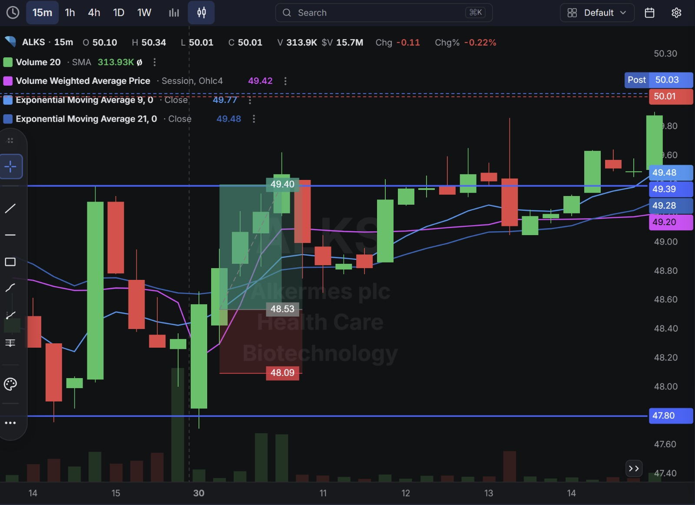
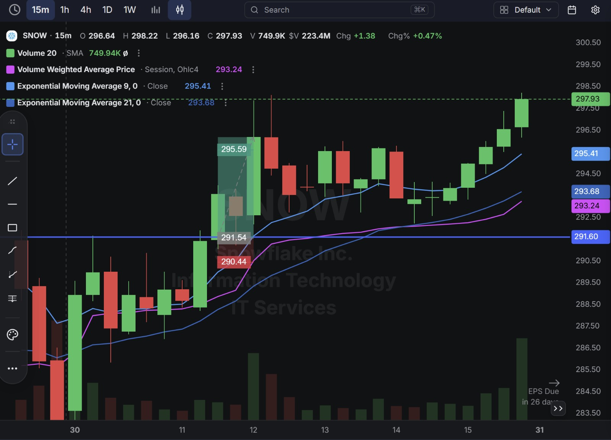
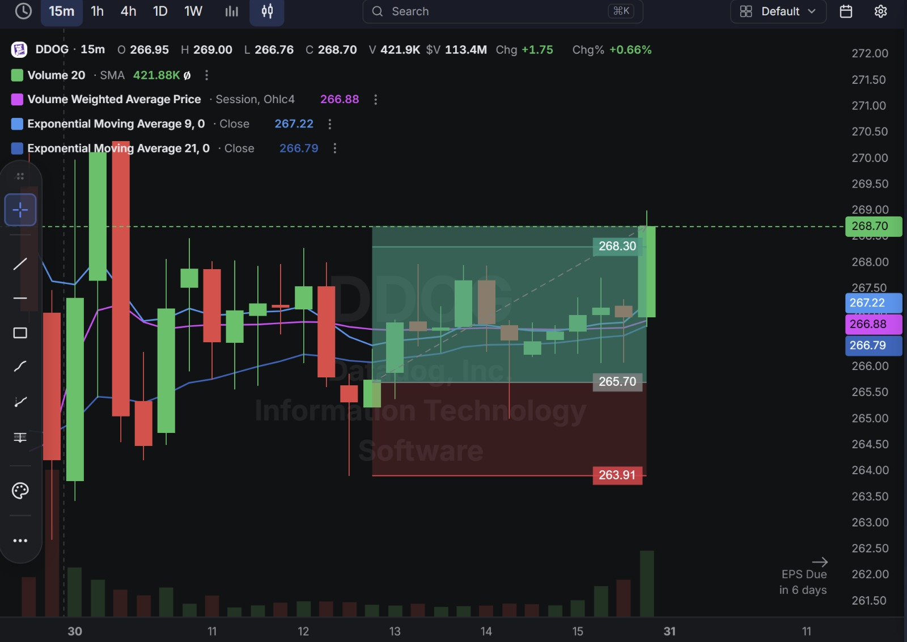

# Day 16 — US Market Analysis (30-07-2026)

**Work Format:** Pre-Market → Market Hours → After-Hours (IST evening-to-midnight coverage of the US session)

| Session      | IST Timing        | US Time (ET)      |
| ------------ | ----------------- | ----------------- |
| Pre-Market   | 5:00 PM – 7:00 PM | 7:30 AM – 9:30 AM |
| Market Hours | 7:00 PM – 1:30 AM | 9:30 AM – 4:00 PM |
| After Hours  | 1:30 AM – 2:30 AM | 4:00 PM – 5:00 PM |

> **Applying yesterday's lesson directly:** Day 15's biggest takeaway was "don't fade a near-perfect CANSLIM profile" (the SNOW short that got stopped out). Today's SNOW trade flips that exact call — same screener, same stock, opposite direction, going **with** the trend instead of against it.

---

## 1. Pre-Market Analysis (7:30 AM – 9:30 AM ET)

### The Screener (Same Configuration as Day 15 — "CANSLIM Screener")

| Group   | Logic | Conditions                                                                                                                                             |
| ------- | ----- | --------------------------------------------------------------------------------------------------------------------------------------------------------- |
| Group 1 | ALL   | Dollar Volume > $20M · AS 3M > 85 · Include Type: Common Stock                                                                                            |
| Group 2 | ALL   | EPS Growth Latest Rptd Qtr (%) > 25.00% · Sales Growth Latest Rptd Qtr (%) > 25.00% · AS 1M > 95 · EPS Growth 3 Yrs Ago (%) > 25.00% · EPS Growth 5 Yrs Ago (%) > 25.00% |

**Screener Screenshot:** 

**Result: 5 stocks** — SNOW, HALO, DDOG, TEAM, ALKS. Down from 9 on Day 15, but three names carried straight over: **SNOW, DDOG, and ALKS all cleared this same strict, multi-year CANSLIM filter for a second consecutive day**, which is itself useful information — a name that keeps re-qualifying on a filter this demanding (latest-quarter, 3-year, and 5-year EPS growth all >25%, plus top-tier institutional accumulation) is showing persistence, not a one-day fluke. HALO and TEAM were new to the list and weren't traded today.

### Overnight/Morning Catalysts

- **SNOW (Snowflake)** — Still no earnings-day catalyst (next report now **26 days out**), but the stock simply kept extending its AI-security-driven run from Day 15 with no signs of the selling that a short position would need. The takeaway from yesterday's failed short was explicit: this is a name to trade *with*, not against, until something in the fundamental picture actually changes.
- **DDOG (Datadog)** — Third straight session in the same setup family, now with earnings just **6 days away** (down from 7 yesterday, 8 the day before). Still no fresh company-specific news — this remains a momentum/beta trade riding its own multi-day base rather than a new story.
- **ALKS (Alkermes)** — One session removed from Wednesday's beat-but-guide-down earnings drop. The stock found a floor and started stabilizing, and notably, sell-side desks that had already been bullish before earnings (Piper Sandler at $65, Stifel at $63 — both raised *before* the print) never pulled those targets after the guidance-driven selloff, suggesting the sharp initial reaction may have been an overreaction to the guidance miss rather than a re-rating of the underlying business.

---

## 2. Market Hours Observation (9:30 AM – 4:00 PM ET)

### ALKS — Clean Reclaim and Continuation Higher

Found support well above Wednesday's post-earnings lows, based briefly, then pushed steadily higher through the session in a clean, low-drama grind, closing near the highs of the move.

### SNOW — Immediate Follow-Through, New Highs

Extended directly out of the open with strong follow-through, pushing to a fresh intraday high and closing right near the top of the session's range — the opposite of yesterday's late-session fade.

### DDOG — Extended Multi-Day Base, Late Breakout

Spent most of the visible window consolidating in a tight range rather than trending — a multi-day base that only resolved with a decisive breakout candle right at the very end of the session, closing just above the marked target on the day's final bar.

---

## 3. After-Hours Analysis (4:00 PM – 5:00 PM ET)

Heading into the next session, the key open questions:

- Whether **ALKS's** clean recovery confirms the guidance-driven selloff was overdone, or whether this is just a normal dead-cat bounce inside a stock still carrying elevated short interest and recent insider selling.
- Whether **SNOW's** continued strength means the fade-vs-follow lesson from Day 15 is fully absorbed, or whether the stock is now extended enough that a *real* pullback risk is building — worth distinguishing from yesterday's premature fade.
- Whether **DDOG's** breakout, coming on the very last candle of a multi-day base and now just 6 days from earnings, has room to follow through — or whether it's a late, low-conviction move right into event risk that deserves a smaller size than the first two DDOG trades.

---

## 4. Trade Strategy — Actual Trades, Full CANSLIM Reasoning, and Results

> All three trades today were **long** — a clean, one-direction day, in contrast to Day 15's mixed long/short session.

### 🟢 ALKS — LONG — ✅ **PASSED**

**Why I took this trade:** This is a direct reversal of yesterday's short, and the logic is worth spelling out. **C (Current Earnings):** the Q2 headline numbers were genuinely strong — revenue +27% YoY and a beat on both revenue and EPS — it was only the guidance midpoint that disappointed. **N (New):** the CEO transition (Blair Jackson taking over August 1) is a fresh event, and more importantly, price-target raises from Piper Sandler ($65) and Stifel ($63) were already in place *before* the guidance-driven drop and were never pulled afterward — a signal that professional analysts still saw the business as intact even while the stock sold off. **S/M:** yesterday's heavy selling looked like it had run its course — price found a floor well above the post-earnings lows and started climbing instead of making new lows. **I (Institutional Sponsorship):** the caveat from yesterday still applies — elevated short interest (10.7% of float) and recent insider selling are real yellow flags, so this trade leaned more on "the selling looks exhausted" than on a fully clean institutional picture.

**How I planned the entry and exit:**
- **Entry (48.53):** on the reclaim after the stock found support well above the post-earnings low, once the bounce showed real follow-through.
- **Stop Loss (48.09):** below that support zone — a tight 0.91% stop.
- **Target (49.40):** back toward the pre-drop consolidation level.
- **Risk/Reward:** Risk $0.44 (0.91%) to make $0.87 (1.79%) → **RR of 1.98**.

**Result:** Price cleared the target and kept climbing well beyond it, closing the visible session at **$50.01** — nearly a full point above the target. Target hit comfortably.

**Chart:** 

---

### 🟢 SNOW — LONG — ✅ **PASSED**

**Why I took this trade:** This trade exists specifically because of yesterday's mistake. The CANSLIM profile hasn't changed at all from Day 15 — it's still one of the strongest on the whole screener: **C/A** cleared the latest-quarter *and* 3-year *and* 5-year EPS growth filters simultaneously, **N** is the still-unfolding Cortex AI Gateway/security-partnership story, **L** is confirmed by multiple sell-side "top pick" calls, and **I** passed both accumulation-score filters again today, a second consecutive day. What changed was the direction of the trade to match that profile instead of fighting it. The lesson from Day 15 wasn't "SNOW is a bad stock," it was "don't short a stock with this fundamental profile just because the chart paused" — today's trade applies that directly by buying the continuation instead.

**How I planned the entry and exit:**
- **Entry (291.54):** on the continuation move higher, buying strength in line with the stock's clear underlying trend.
- **Stop Loss (290.44):** just below the entry candle — a tight 0.38% stop, reflecting high conviction in the trend.
- **Target (295.59):** the next extension level above.
- **Risk/Reward:** Risk $1.10 (0.38%) to make $4.05 (1.39%) → **RR of 3.68**.

**Result:** Price rallied straight through the target to an intraday high of **$298.22**, closing the session at **$297.93** — well above target, with no signs of the resistance that would have been needed to justify yesterday's short. Target hit comfortably.

**Chart:** 

---

### 🟢 DDOG — LONG — ✅ **PASSED (narrow, late breakout)**

**Why I took this trade:** Third consecutive session in the same DDOG setup family, and this is the one to be most honest about. **C/A:** still resting on the last reported quarter — with earnings now just **6 days out**, this is the closest yet to the point where the thesis gets tested against fresh numbers rather than trailing ones. **I:** passed the accumulation filters again. **N:** still no fresh, DDOG-specific catalyst — three days running on the same momentum read. Rather than sizing this identically to a fresh setup, this trade was treated as the flagged risk from yesterday's takeaways: same idea, closer to event risk, and the price action backed up that caution — instead of a clean breakout, DDOG spent almost the entire session **consolidating in a tight range** and only broke out on the final candle of the visible window.

**How I planned the entry and exit:**
- **Entry (265.70):** inside the multi-day consolidation range, anticipating an eventual breakout rather than chasing one that had already happened.
- **Stop Loss (263.91):** below the base of the consolidation range.
- **Target (268.30):** the top of the range/next resistance level.
- **Risk/Reward:** Risk $1.79 (0.67%) to make $2.60 (0.98%) → **RR of 1.45** — the tightest RR of the three trades today, appropriately reflecting the extra earnings-proximity risk.

**Result:** After a long, tight consolidation, the final candle of the session broke out decisively — high of **$269.00**, closing at **$268.70**, just above the **$268.30** target. Target hit, but narrowly and late — a very different character of win than SNOW's or ALKS's clean follow-through.

**Chart:** 

---

## 5. Trade Result Summary

| # | Stock | Setup Type                                             | Side | CANSLIM Read                                                                 | Result    |
| --- | ----- | ------------------------------------------------------- | ---- | ------------------------------------------------------------------------------ | --------- |
| 1 | ALKS  | Buy the reclaim after a guidance-driven selloff cools   | Long | Real C (beat); N supported by un-retracted analyst targets; I still mixed    | ✅ Passed |
| 2 | SNOW  | Buy the continuation of a near-perfect CANSLIM trend    | Long | Same elite C/A/N/L/I profile as Day 15 — traded with it this time, not against | ✅ Passed |
| 3 | DDOG  | Buy a multi-day range ahead of a breakout               | Long | Passed I/C filters; 3rd straight day on trailing data, earnings 6 days out    | ✅ Passed |

**Score: 3 for 3.**

### Normalized Results — $100 Total Capital Per Trade

This table assumes **$100 of total capital allocated to each trade**, with the dollar result calculated from each trade's percentage move from entry to its marked target.

| # | Stock     | Capital           | Entry → Target        | % Move | Result       | P&L        |
| --- | --------- | ------------------ | ----------------------- | ------ | ------------ | ---------- |
| 1 | ALKS      | $100               | 48.53 → 49.40           | 1.79%  | ✅ Target hit | **+$1.79** |
| 2 | SNOW      | $100               | 291.54 → 295.59         | 1.39%  | ✅ Target hit | **+$1.39** |
| 3 | DDOG      | $100               | 265.70 → 268.30         | 0.98%  | ✅ Target hit | **+$0.98** |
| — | **Total** | **$300 deployed**  | —                        | —      | **3 for 3**  | **+$4.16** |

**On $300 total capital deployed across the three trades, the day returned $4.16 in profit — roughly a 1.39% return on capital deployed.** A clean sweep, though the quality of the three wins wasn't equal: ALKS and SNOW both hit target with clear follow-through room to spare, while DDOG's win came down to a single late candle after most of the session went nowhere — a good reminder that "target hit" and "high-conviction trade" aren't always the same thing.

---

## Key Takeaways From Day 16

1. **The SNOW flip is the headline lesson of the day.** Same stock, same CANSLIM profile, same screener two days running — the only thing that changed was trading *with* the fundamental strength instead of against it, and the outcome flipped from a stop-out to a clean, comfortable target hit. That's about as direct a confirmation as this journal has gotten that the framework itself was right on Day 15; only the trade direction was wrong.
2. **ALKS going from a Day-15 short to a Day-16 long on the same underlying stock is a useful case study in reading exhaustion of selling pressure.** The fundamental story (real revenue beat, guidance miss) didn't change in 24 hours — what changed was that the selling visibly stopped making new lows, which is a distinct, separate signal from the earnings reaction itself.
3. **DDOG's third consecutive win is the one to be careful about over-crediting.** The setup barely worked — a tight multi-day range that only resolved on the session's final candle — right as the position moves closer to its own earnings date. Sizing it with the tightest RR of the three trades (1.45 vs. 1.98 and 3.68) was the right call in hindsight; a full-size version of this trade would have spent most of the day underwater for a narrow, late payoff.
4. **A screener name reappearing across multiple sessions (SNOW, DDOG, ALKS all repeating from Day 15) is starting to look like a genuinely useful signal on its own** — persistence through a strict, multi-year CANSLIM filter is a different (and probably stronger) piece of evidence than any single day's qualification.
5. **Next Pre-Market session:** take a look at HALO and TEAM, the two new names on today's 5-stock list that weren't traded — and keep sizing DDOG conservatively as its earnings date closes in from 6 days to even less.
