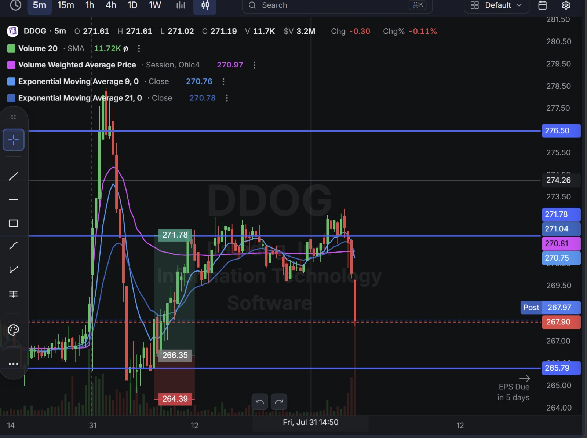
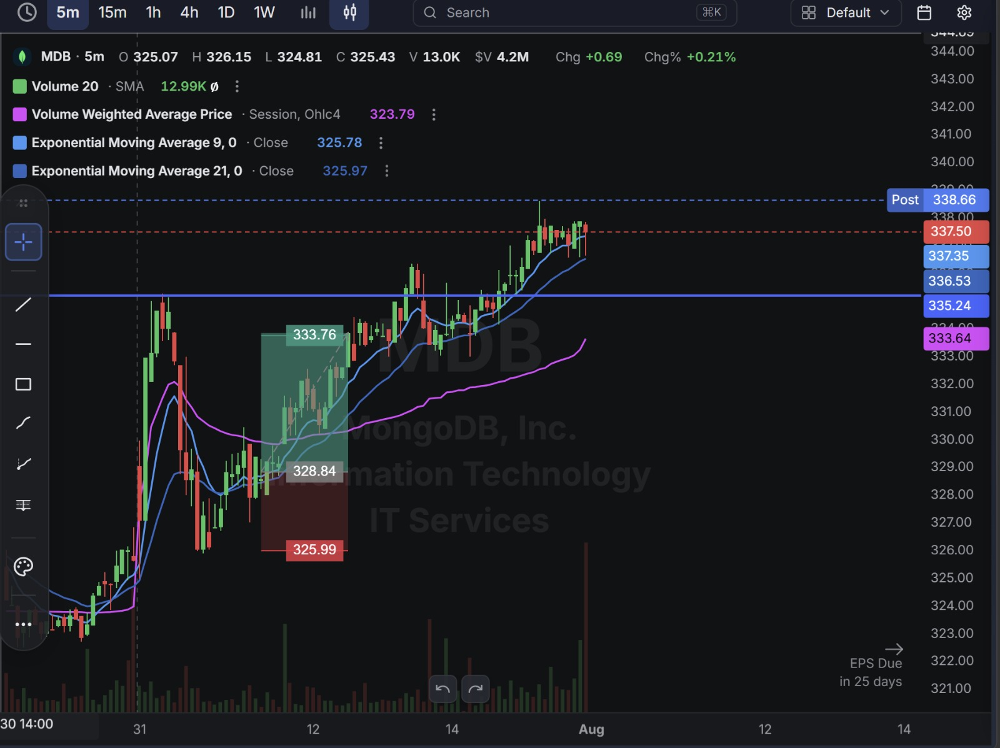
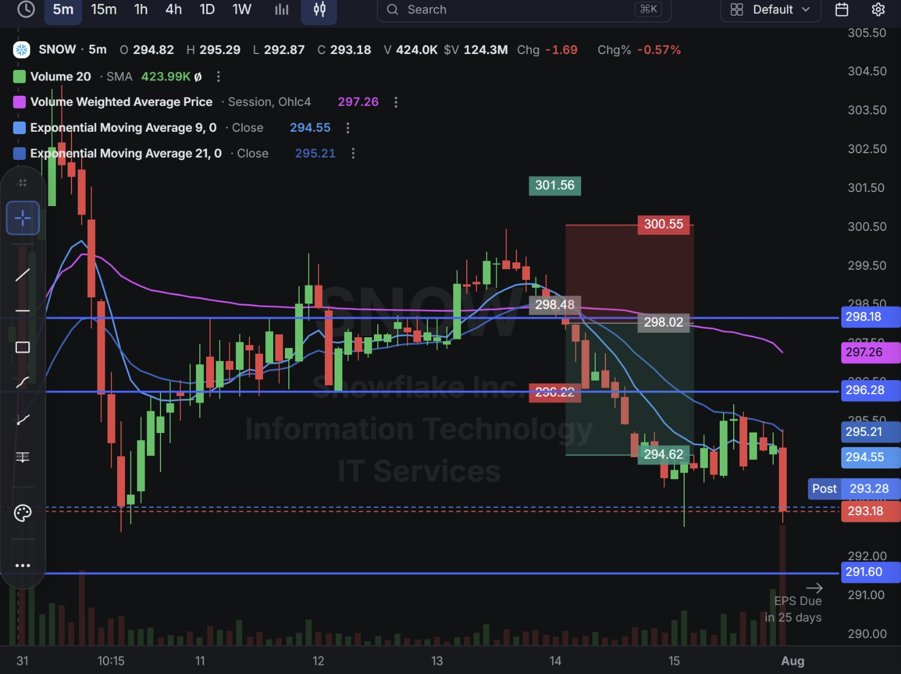

# Day 17 — US Market Analysis (31-07-2026)

**Work Format:** Pre-Market → Market Hours → After-Hours (IST evening-to-midnight coverage of the US session)

| Session      | IST Timing        | US Time (ET)      |
| ------------ | ----------------- | ----------------- |
| Pre-Market   | 5:00 PM – 7:00 PM | 7:30 AM – 9:30 AM |
| Market Hours | 7:00 PM – 1:30 AM | 9:30 AM – 4:00 PM |
| After Hours  | 1:30 AM – 2:30 AM | 4:00 PM – 5:00 PM |

> **New this session:** Switched chart execution from the 15m timeframe (used through Day 16) down to **5m** for entries — tighter, faster reads on the same CANSLIM-screened names. Also the first day with a real loser to unpack rather than just a "narrow win" like Day 16's DDOG.

---

## 1. Pre-Market Analysis (7:30 AM – 9:30 AM ET)

### The Screener (Same Configuration as Day 15/16 — "CANSLIM Screener")

| Group   | Logic | Conditions                                                                                                                                             |
| ------- | ----- | --------------------------------------------------------------------------------------------------------------------------------------------------------- |
| Group 1 | ALL   | Dollar Volume > $20M · AS 3M > 85 · Include Type: Common Stock                                                                                            |
| Group 2 | ALL   | EPS Growth Latest Rptd Qtr (%) > 25.00% · Sales Growth Latest Rptd Qtr (%) > 25.00% · AS 1M > 95 · EPS Growth 3 Yrs Ago (%) > 25.00% · EPS Growth 5 Yrs Ago (%) > 25.00% |

**Screener Screenshot:** 

**Result: 7 stocks** — up from 5 on Day 16. **DDOG and SNOW carried over for a third and second straight day respectively**, and **TEAM and MDB were new additions** to the actively-traded list today (TEAM had appeared on the Day 16 results list but wasn't traded; MDB is a fresh name to this journal).

### Overnight/Morning Catalysts

- **DDOG (Datadog)** — Fourth consecutive session in the same setup family, with earnings now just **5 days out**. Still no fresh company-specific news; this is purely a continuation of the multi-day base/momentum read from Days 14–16.
- **MDB (MongoDB)** — No same-day earnings catalyst (next report ~25 days out), but the stock has been on a strong run backed by real fundamentals: Atlas (its cloud database) now drives roughly three-quarters of revenue and has been *accelerating* (29% YoY growth, up from 26% the prior quarter), the company has been adding thousands of new AI-workload customers per quarter, and Citi has named MDB one of its top three software picks for 2026 alongside SNOW. Multiple desks (Needham, Scotiabank, Wedbush, Tigress) have been raising price targets through the year.
- **SNOW (Snowflake)** — No new catalyst; still riding the same AI-security story from Days 15–16, but today's chart showed the stock running directly into a well-defined prior resistance zone rather than open air — a meaningfully different technical picture than yesterday's clean breakout.
- **TEAM (Atlassian)** — The most volatile name on the list by far. TEAM has been down sharply for the year (a March restructuring cut ~10% of staff), but just four sessions ago (July 27) jumped over 9% on news that Jira is becoming an AI-native development hub, integrating coding agents directly into the platform. The stock carries very high realized volatility (recommended stop-loss sizing around 4.7%, daily average volatility near 6.8%) and reports its own earnings in just **5 days**.

---

## 2. Market Hours Observation (9:30 AM – 4:00 PM ET)

### DDOG — Sharp Early Volatility, Strong Rally, Late Reversal

Opened with a wide, volatile early range, then rallied hard through the session toward resistance in the mid-$270s before a sharp single-candle reversal knocked it back down into the close, with post-market trading even lower than the regular-session close.

### MDB — Clean, Sustained Grind Higher

After an early volatile swing, based cleanly and then trended steadily higher through the rest of the session with very little chop, closing near its highs with post-market extending the move further.

### SNOW — Rally Into Resistance, Clean Rejection

Extended the multi-day uptrend up into a well-marked resistance zone from prior price action, stalled precisely there, and reversed hard — a technically clean rejection rather than a random fade.

### TEAM — Volatile Opening Range, Then a Powerful, Sustained Rally

After a wide, choppy opening range, the stock broke into a strong, sustained uptrend for the rest of the session, grinding to new highs with very little pullback.

---

## 3. After-Hours Analysis (4:00 PM – 5:00 PM ET)

Heading into the next session, the key open questions:

- Whether **DDOG's** sharp late-session/after-hours reversal, now just 5 days from earnings, is the first real sign that this multi-day momentum trade is running out of room.
- Whether **MDB's** clean trend continues given its still-strong, accelerating Atlas growth numbers, or whether the stock's rich valuation (a well-documented risk in coverage of the name) starts to matter more as the move extends.
- Whether **SNOW's** rejection at resistance is the start of a real pullback or just a pause before another push — a genuinely different question than Day 15's mistake, since this time there's an actual technical level to point to.
- Whether **TEAM's** powerful rally reflects durable conviction in the AI-native Jira story, or whether the stock's historically extreme volatility means today's strength could reverse just as fast heading into its own earnings in 5 days.

---

## 4. Trade Strategy — Actual Trades, Full CANSLIM Reasoning, and Results

> Four trades today: three long-side wins and one short-side loss — the first clear loser since Day 15's SNOW short.

### 🟢 DDOG — LONG — ✅ **PASSED**

**Why I took this trade:** Fourth straight session on the same core idea, and the earnings-proximity caution from Day 16 carries forward directly — with the print now just 5 days away. **C/A:** still resting on trailing-quarter data. **I:** passed the accumulation filters again. **N:** still no fresh catalyst; this remains a pure continuation trade riding the multi-day base built across Days 14–17.

**How I planned the entry and exit:**
- **Entry (266.35):** on the reclaim after an early, sharp volatility swing, once the stock stabilized above the day's low.
- **Stop Loss (264.39):** below that stabilization zone — a tight 0.74% stop.
- **Target (271.78):** the next resistance extension above.
- **Risk/Reward:** Risk $1.96 (0.74%) to make $5.43 (2.04%) → **RR of 2.77**.

**Result:** Price rallied through the target intraday, testing resistance in the $274–276 area, before a sharp reversal pulled it back to close at **271.19** — just above the target — with post-market trading down further to $267.97. Target was hit cleanly during the session before the late give-back.

**Chart:** 

---

### 🟢 MDB — LONG — ✅ **PASSED**

**Why I took this trade:** First appearance of MDB in this journal, and it's a strong CANSLIM profile. **C (Current Earnings):** last reported quarter showed 24% YoY revenue growth with an operating-margin expansion story (15% margin, up from 11% a year earlier), plus Atlas growth *accelerating* to 29% YoY. **A:** consistent 20%+ revenue growth across recent years, clearing the screener's 3-year and 5-year checks. **N:** Atlas's AI-workload adoption is a genuine, still-developing new growth driver, with thousands of new customers added over the last two quarters. **L:** MongoDB is the clear leader in its database category and was named alongside SNOW as one of Citi's top software picks for 2026. **I:** passed both accumulation filters, and multiple desks have been actively raising price targets through the year. The one honest caveat: the stock trades at a demanding valuation (high forward P/E and price-to-cash-flow multiples per third-party coverage), meaning the trade leans on continued flawless execution rather than a cheap entry point.

**How I planned the entry and exit:**
- **Entry (328.84):** on the reclaim after an early volatility swing, buying the stabilization rather than the initial spike.
- **Stop Loss (325.99):** below that stabilization zone — a 0.87% stop.
- **Target (333.76):** the next resistance extension above.
- **Risk/Reward:** Risk $2.85 (0.87%) to make $4.92 (1.50%) → **RR of 1.73**.

**Result:** Price cleared the target with room to spare, trending steadily up to close near **337.50**, with post-market extending further to **338.66**. Target hit comfortably, with the trend still intact into the close.

**Chart:** 

---

### 🔴 SNOW — SHORT — ✅ **PASSED**

**Why I took this trade:** This is a different kind of SNOW short than Day 15's mistake, and worth being precise about the distinction. Day 15's short faded strength with no technical justification, purely on "it went up a lot." Today's short was taken **at a specific, well-defined prior resistance zone** that the multi-day rally ran directly into and stalled at — a real technical trigger, not just a hunch that the move was overextended. The underlying CANSLIM profile (C/A/N/L/I) is unchanged and still elite, so this trade was sized and framed as a short-term technical fade at resistance, not a bet against the fundamental story.

**How I planned the entry and exit:**
- **Entry (298.48):** short on the rejection at the resistance zone, once price failed to push through and started rolling over.
- **Stop Loss (300.55):** above the resistance zone — a 0.69% stop, tight given the strength of the level.
- **Target (294.62):** the next support level below.
- **Risk/Reward:** Risk $2.07 (0.69%) to make $3.86 (1.29%) → **RR of 1.87**.

**Result:** Price broke down through the target, extending further into a sharp late-session drop to close at **293.18** — below even the target level. Target hit and exceeded, confirming the resistance rejection read was correct this time.

**Chart:** 

---

### 🔴 TEAM — SHORT — ❌ **STOPPED OUT**

**Why I took this trade:** TEAM's CANSLIM read is genuinely mixed, and this trade underweighted the wrong side of that mix. **C/A:** cleared the strict screener on trailing numbers, and the company is explicitly targeting GAAP profitability by fiscal 2027. **N:** the "Jira as an AI-native development hub" story (integrating coding agents including Claude Code) is real and recent — just four sessions old. Where this trade went wrong: treating an early consolidation after that news as exhaustion, when the more accurate read was that a fresh, high-conviction catalyst in a historically very high-volatility name (daily volatility near 6.8%, with 26 analysts rating it a buy) was far more likely to keep extending than to reverse. Shorting into that combination — fresh bullish news plus a name known for large, fast moves — was the weakest-grounded trade of the day.

**How I planned the entry and exit:**
- **Entry (99.30):** short on what looked like a pause/consolidation after the early move.
- **Stop Loss (99.73):** just above the consolidation range — a tight 0.43% stop.
- **Target (98.15):** the next support level below.
- **Risk/Reward:** Risk $0.43 (0.43%) to make $1.15 (1.16%) → **RR of 2.67**.

**Result:** The consolidation resolved upward almost immediately, breaking the stop and continuing into a sustained rally to a session high of **101.35**, closing at **101.02** — well above both the stop and the entry. Stopped out at **99.73**.

**Chart:** `Images/TEAM.jpeg`

---

## 5. Trade Result Summary

| # | Stock | Setup Type                                              | Side  | CANSLIM Read                                                                     | Result         |
| --- | ----- | ---------------------------------------------------------- | ----- | ------------------------------------------------------------------------------------ | -------------- |
| 1 | DDOG  | Buy the reclaim, 4th day of the same continuation trade    | Long  | Passed I/C filters; no fresh N, earnings now 5 days out                             | ✅ Passed      |
| 2 | MDB   | Buy the stabilization in an accelerating-growth leader     | Long  | Strong C/A/N/L/I; only caveat is a demanding valuation                              | ✅ Passed      |
| 3 | SNOW  | Short a rejection at a defined prior resistance level      | Short | Elite fundamentals unchanged; traded as a technical fade at resistance, not a fundamental bet | ✅ Passed      |
| 4 | TEAM  | Short a pause after a fresh bullish AI-catalyst news event | Short | Mixed C/A/N; underweighted a fresh catalyst in a historically high-volatility name  | ❌ Stopped out |

**Score: 3 for 4.**

### Normalized Results — $100 Total Capital Per Trade

This table assumes **$100 of total capital allocated to each trade**, with the dollar result calculated from each trade's percentage move from entry to its target (winners) or stop (losers).

| # | Stock     | Capital           | Entry → Result          | % Move  | Result         | P&L        |
| --- | --------- | ------------------ | -------------------------- | ------- | -------------- | ---------- |
| 1 | DDOG      | $100               | 266.35 → 271.78 (target)   | 2.04%   | ✅ Target hit   | **+$2.04** |
| 2 | MDB       | $100               | 328.84 → 333.76 (target)   | 1.50%   | ✅ Target hit   | **+$1.50** |
| 3 | SNOW      | $100               | 298.48 → 294.62 (target)   | 1.29%   | ✅ Target hit   | **+$1.29** |
| 4 | TEAM      | $100               | 99.30 → 99.73 (stop)       | -0.43%  | ❌ Stopped out  | **-$0.43** |
| — | **Total** | **$400 deployed**  | —                            | —       | **3W / 1L**     | **+$4.40** |

**On $400 total capital deployed across the four trades, the day returned $4.40 in profit — roughly a 1.10% return on capital deployed.** The one loss (TEAM) was, by design, the smallest-dollar outcome of the four trades thanks to its tight 0.43% stop — a repeat of the same pattern seen on Day 15's SNOW loss: size the weakest-conviction trade the tightest, so a wrong read costs the least.

---

## Key Takeaways From Day 17

1. **Not every short on the same stock is the same trade.** Day 15's SNOW short (fading strength with no technical trigger) failed; today's SNOW short (fading a clean rejection at defined resistance) passed. Same ticker, same underlying CANSLIM profile, completely different setup quality — worth remembering that "which stock" matters less than "what specific, falsifiable signal justifies the trade."
2. **TEAM is the clearest lesson of the day: don't short a consolidation that follows a genuinely fresh, high-conviction catalyst, especially in a name known for large, fast moves.** The Jira AI-native story was only four sessions old and still actively re-rating the stock — treating the pause as exhaustion rather than as a flag before continuation was the actual mistake, independent of the tight risk management that kept the loss small.
3. **DDOG's fourth straight win came with the same "narrow, late-session" character flagged on Day 16** — it hit target intraday but gave the move back sharply into the close and after-hours. With earnings now just 5 days out, this is close to the point where the multi-day continuation trade should probably be paused rather than taken a fifth time.
4. **MDB was today's cleanest trade** — a genuinely accelerating growth story (Atlas growth speeding up, not slowing down) with real institutional sponsorship (top-pick status, repeated price-target raises) and a clean technical trigger. Worth adding to the regular rotation alongside SNOW and DDOG rather than treating it as a one-off.
5. **Next Pre-Market session:** watch whether DDOG's late reversal is the start of a real top given the earnings proximity, and treat TEAM's next setup — long or short — with extra respect for its outsized volatility given it also reports earnings in the coming days.
