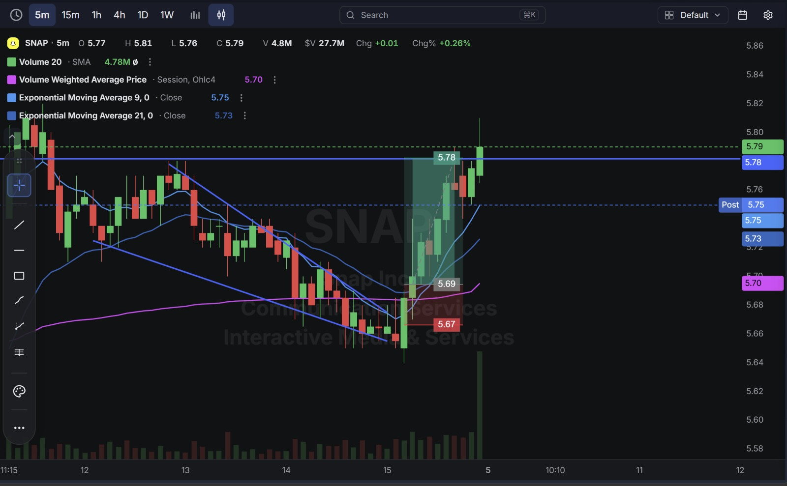
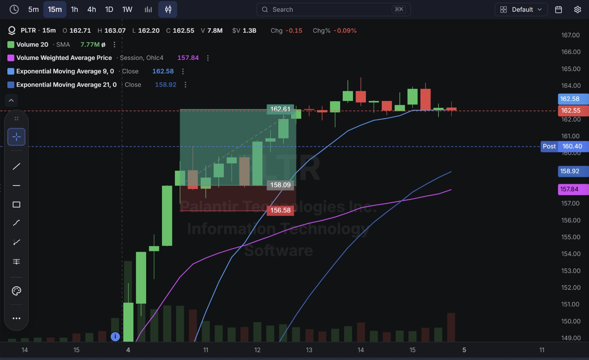
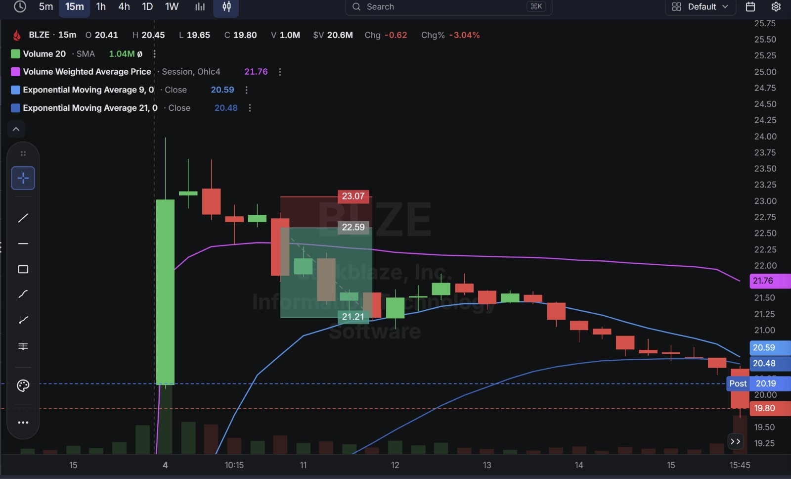
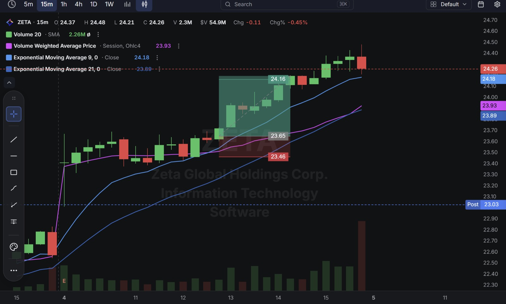

# Day 19 — US Market Analysis (04-08-2026)

**Work Format:** Pre-Market → Market Hours → After-Hours (IST evening-to-midnight coverage of the US session)

| Session      | IST Timing        | US Time (ET)      |
| ------------ | ----------------- | ----------------- |
| Pre-Market   | 5:00 PM – 7:00 PM | 7:30 AM – 9:30 AM |
| Market Hours | 7:00 PM – 1:30 AM | 9:30 AM – 4:00 PM |
| After Hours  | 1:30 AM – 2:30 AM | 4:00 PM – 5:00 PM |

> **Clean sweep day:** All four trades hit target — the best score yet in this journal. Fitting, given the day itself: a genuine "Big Beat Tuesday" earnings avalanche across ad-tech, AI software, and cloud storage.

---

## 1. Pre-Market Analysis (7:30 AM – 9:30 AM ET)

### The Screener (Same Configuration as Day 18 — "Pre Market Move")

| Group   | Logic | Conditions                                                                                             |
| ------- | ----- | --------------------------------------------------------------------------------------------------------- |
| Group 1 | ALL   | Pre Market Last > $5 · Pre Market Volume > 100,000 · Include Type: Common Stock                            |
| Group 2 | ALL   | RV 5d > 2.00 · Pre Market Gap % > 2.00% · Pre Market % Change > 0.00%                                       |
| Group 3 | ALL   | Avg $ Vol. 20d > $10M · Market Cap > $500M                                                                  |

**Screener Screenshot:** 

**Result: 12 stocks** — more than double Day 18's 5, and for a simple reason: this was one of the heaviest earnings mornings of the summer. Four names were traded: **SNAP, PLTR, BLZE, ZETA** — every single one of them either had just reported, or was about to report, a real earnings beat.

### Overnight/Morning Catalysts

- **SNAP (Snap Inc.)** — Reported Q2 2026 results Monday afternoon: revenue of $1.60B, up 19% YoY and ahead of the ~$1.54B estimate, a narrower-than-expected loss, daily active users topping 493 million, and an optimistic Q3 revenue outlook of $1.70–1.74B. The stock gapped from a $4.78 close to over $5.30 at the open, then spent the morning consolidating in a tight range near the highs — CEO Evan Spiegel cited improving North American ad demand and a World Cup-related ad-spend boost.
- **PLTR (Palantir)** — The single biggest catalyst of the day. Q2 revenue of $1.94B beat the ~$1.8B estimate, up 93% YoY, with U.S. commercial revenue up 149% YoY. Management raised full-year guidance to $8.15–8.16B (from $7.65–7.66B) and CEO Alex Karp called it an "otherworldly" quarter. The stock surged nearly 30% intraday — its largest single-day gain in over two years.
- **BLZE (Backblaze)** — Q2 revenue climbed 18% YoY to $42.7M, with B2 Cloud Storage revenue up 34% to $26.6M, alongside a raised 2026 outlook tied to a multi-year CoreWeave AI infrastructure agreement. Shares gapped enormously, trading as high as $23.99 intraday (up from a $15.59 prior close) before giving back a large portion of that spike.
- **ZETA (Zeta Global)** — Set to report Q2 2026 results *after* today's close (4:30 p.m. ET) — its 20th consecutive "beat and raise" quarter streak on the line. The stock traded higher into the print on that strong track record; the actual report (released after the session ended) showed a solid revenue beat and raised guidance, but a large EPS miss against an inflated estimate triggered an 8% after-hours drop — after the trade in this journal was already closed.

---

## 2. Market Hours Observation (9:30 AM – 4:00 PM ET)

### SNAP — Tight, Orderly Consolidation Near Highs

After the initial earnings gap, spent the session digesting the move in a narrow band just under the highs rather than immediately giving it back — exactly the kind of "steady, not sold" consolidation that suggests continuation.

### PLTR — Powerful, Sustained Melt-Up

Extended steadily higher through the entire session in a strong, low-drama uptrend, closing well off the day's highs but still dramatically higher on the day.

### BLZE — Parabolic Spike, Sharp Multi-Stage Give-Back

Gapped enormously on the open, spiked further intraday, then spent the rest of the session unwinding a large portion of that move in a steady, multi-stage decline.

### ZETA — Steady Grind Higher Into the Print

Climbed in an orderly uptrend through the regular session ahead of its after-the-close earnings report, with no signs yet of the after-hours volatility to come.

---

## 3. After-Hours Analysis (4:00 PM – 5:00 PM ET)

Heading into the next session, the key open questions:

- Whether **SNAP's and PLTR's** post-earnings strength holds up over the following sessions as the market fully digests two very different kinds of good news — SNAP's turnaround story versus PLTR's already-priced-for-perfection AI narrative.
- Whether **BLZE's** pullback from its intraday spike is healthy digestion of a huge move, or the start of a deeper give-back of the entire gap.
- Whether **ZETA's** after-hours drop on the EPS miss (despite the revenue beat and raised guidance) spills into the next session, and what it says about how the market is treating "beat and raise" quarters that miss on the bottom line specifically.

---

## 4. Trade Strategy — Actual Trades, Full CANSLIM Reasoning, and Results

> All four trades today hit target — the first perfect session in this journal. Three longs and one short, each reasoned independently against the CANSLIM framework even though the screener itself was event/gap-based rather than growth-filtered.

### 🟢 SNAP — LONG — ✅ **PASSED**

**Why I took this trade:** **C (Current Earnings):** a real, clean beat — revenue +19% YoY, narrowed loss, DAUs and ARPU both ahead of estimates. **A:** the raised Q3 guidance ($1.70–1.74B) points to continued acceleration, not a one-off. **N (New):** improving North American ad demand and a World Cup ad-spend tailwind are genuinely fresh drivers. **S/M:** the tight, orderly consolidation just under the post-gap highs — rather than an immediate fade — was the specific signal that the market was digesting the news rather than selling it, supporting a continuation entry.

**How I planned the entry and exit:**
- **Entry (5.69):** on the reclaim after a brief dip within the tight post-gap consolidation range.
- **Stop Loss (5.67):** just below that consolidation — an extremely tight 0.35% stop, appropriate given the low dollar price.
- **Target (5.78):** the top of the consolidation range/session high area.
- **Risk/Reward:** Risk $0.02 (0.35%) to make $0.09 (1.58%) → **RR of 4.5** — the best risk/reward of the day.

**Result:** Price broke out above the range to a session high of **$5.81**, closing at **$5.79**. Target hit with room to spare.

**Chart:** 

---

### 🟢 PLTR — LONG — ✅ **PASSED**

**Why I took this trade:** About as strong a CANSLIM case as this journal has seen. **C:** adjusted EPS $0.41 vs. $0.35 estimate, revenue +93% YoY. **A:** full-year guidance raised from $7.65B to $8.15B — a genuine step-change in the growth trajectory, not a marginal beat. **N:** U.S. commercial revenue up 149% YoY, described by management as reflecting a shift from AI "pilot programs to large-scale software integration" — a fresh, structural growth driver. **L:** Palantir is the clear leader in the enterprise/government AI-platform category, with $3.4B in total contract value bookings for the quarter alone. **S/M:** the stock breaking to new highs on the heaviest volume of its recent range is exactly the kind of price/volume confirmation CANSLIM looks for around a major earnings catalyst.

**How I planned the entry and exit:**
- **Entry (158.09):** on the continuation push after the initial gap, buying strength directly in line with the fundamental catalyst.
- **Stop Loss (156.58):** below that continuation base — a 0.96% stop.
- **Target (162.61):** the next resistance extension above.
- **Risk/Reward:** Risk $1.51 (0.96%) to make $4.52 (2.86%) → **RR of 2.99**.

**Result:** Price extended well past the target to an intraday high near $164, closing the regular session at **162.55**. Target hit comfortably on a genuinely elite CANSLIM day.

**Chart:** 

---

### 🔴 BLZE — SHORT — ✅ **PASSED**

**Why I took this trade:** Same "fade the euphoric spike, not the fundamentals" logic used on FERG on Day 18. **C/A/N** are all genuinely strong here — an 18% revenue beat, 34% growth in the core B2 Cloud Storage segment, a raised outlook, and a real, fresh CoreWeave AI infrastructure partnership. None of that was in question. What this trade targeted was the sheer speed and size of the gap itself — shares more than tripled from the prior close to the intraday high, and moves of that magnitude on a single news event routinely give back a significant portion before finding a real level, independent of how good the underlying news is.

**How I planned the entry and exit:**
- **Entry (22.59):** short on the first clear rejection after the parabolic spike, once the initial buying momentum stalled.
- **Stop Loss (23.07):** above that rejection high — a 2.13% stop, wider than the other three trades given the stock's extreme volatility today.
- **Target (21.21):** the next support level below, well off the highs.
- **Risk/Reward:** Risk $0.48 (2.13%) to make $1.38 (6.11%) → **RR of 2.88**.

**Result:** Price continued declining well past the target, closing the session at **$19.80** — nearly $2 below the target level, confirming the "fade the spike" read was directionally correct and, if anything, understated how much of the initial pop would come back in.

**Chart:** 

---

### 🟢 ZETA — LONG — ✅ **PASSED**

**Why I took this trade:** This trade was taken entirely on ZETA's track record heading into an earnings date, not on the print itself (which hadn't happened yet). **C/A:** ZETA entered this report on a streak of 20 consecutive "beat and raise" quarters — an exceptionally consistent execution history that's rare even among strong growth names. **L:** genuine AI-infrastructure partnerships with OpenAI, Snowflake, and Palantir reinforce its positioning as a category leader rather than a marginal player. **I:** the steady, orderly climb into the print (rather than a speculative spike) suggested measured institutional positioning ahead of the report, not retail euphoria. **Important caveat, stated plainly:** this trade closed before the after-the-close report, which — as it turned out — beat on revenue and raised guidance but missed on EPS against a very high bar, triggering an 8% after-hours drop. The regular-session trade captured here was unaffected by that outcome, but it's a useful reminder that a strong pre-earnings track record is not a guarantee for the next print.

**How I planned the entry and exit:**
- **Entry (23.65):** on the continuation of the pre-earnings uptrend, in line with the stock's consistent execution history.
- **Stop Loss (23.46):** below that continuation base — a 0.80% stop.
- **Target (24.16):** the next resistance level above.
- **Risk/Reward:** Risk $0.19 (0.80%) to make $0.51 (2.16%) → **RR of 2.68**.

**Result:** Price extended to a session high of $24.48, closing the regular session at **24.26** — well above target. Target hit before the after-hours report (and its subsequent drop) even happened.

**Chart:** 

---

## 5. Trade Result Summary

| # | Stock | Setup Type                                                  | Side  | CANSLIM Read                                                                    | Result    |
| --- | ----- | -------------------------------------------------------------- | ----- | ------------------------------------------------------------------------------------- | --------- |
| 1 | SNAP  | Buy the breakout from a tight post-earnings consolidation      | Long  | Real C beat, raised guidance, orderly S/M digestion of the news                     | ✅ Passed |
| 2 | PLTR  | Buy the continuation of a blowout-earnings breakout             | Long  | Elite C/A/N/L/S/M — one of the strongest CANSLIM days in this journal                | ✅ Passed |
| 3 | BLZE  | Short the fade of a parabolic post-earnings spike                | Short | Strong C/A/N; short targeted the spike's size, not the fundamentals                  | ✅ Passed |
| 4 | ZETA  | Buy the pre-earnings uptrend on a consistent beat-and-raise track record | Long  | Strong historical C/A/L/I; traded before the print itself, which later missed on EPS | ✅ Passed |

**Score: 4 for 4.**

### Normalized Results — $100 Total Capital Per Trade

This table assumes **$100 of total capital allocated to each trade**, with the dollar result calculated from each trade's percentage move from entry to its marked target.

| # | Stock     | Capital           | Entry → Target        | % Move | Result       | P&L         |
| --- | --------- | ------------------ | ----------------------- | ------ | ------------ | ----------- |
| 1 | SNAP      | $100               | 5.69 → 5.78              | 1.58%  | ✅ Target hit | **+$1.58**  |
| 2 | PLTR      | $100               | 158.09 → 162.61          | 2.86%  | ✅ Target hit | **+$2.86**  |
| 3 | BLZE      | $100               | 22.59 → 21.21            | 6.11%  | ✅ Target hit | **+$6.11**  |
| 4 | ZETA      | $100               | 23.65 → 24.16            | 2.16%  | ✅ Target hit | **+$2.16**  |
| — | **Total** | **$400 deployed**  | —                          | —      | **4 for 4**  | **+$12.71** |

**On $400 total capital deployed across the four trades, the day returned $12.71 in profit — roughly a 3.18% return on capital deployed**, the best single-day return in this journal so far. BLZE's short alone contributed nearly half the day's total profit, a reminder that fading an extreme, volatile spike can carry the largest payoff precisely because it carries the widest true range.

---

## Key Takeaways From Day 19

1. **A perfect 4-for-4 day is a good moment to separate skill from favorable conditions.** Every trade today was anchored to a real, verifiable earnings catalyst (three already-reported beats, one pre-earnings track record) rather than a speculative technical read — the clean sweep says as much about how strong the day's setups were as it does about execution.
2. **PLTR is the clearest example yet of a name where every CANSLIM letter lined up simultaneously** — current earnings, annual growth acceleration, a genuine new catalyst (the AI pilot-to-scale shift), category leadership, and institutional-grade price/volume confirmation, all on the same day. Worth using as the reference case for what a truly elite setup looks like.
3. **BLZE reinforces the Day 18 FERG lesson (fade the spike, not the fundamentals) at a much larger scale** — a ~6% target became the single largest dollar winner of the day precisely because the underlying move was so extreme. Extreme moves cut both ways: they create the best fade opportunities *and* the highest risk if the size of the position isn't respected.
4. **ZETA is a useful edge case for how this journal frames trades: the entry and exit were both complete before the event that would have most affected the read (the after-hours earnings miss).** The trade itself was sound and profitable on its own terms; the after-hours drop is a separate data point about ZETA specifically, not a flaw in the trade that was actually taken.
5. **Next Pre-Market session:** watch how SNAP and PLTR trade on the second day after such large moves (this is where Day 15's "don't fade strength without a real technical trigger" lesson becomes directly relevant again), and keep an eye on ZETA's next session open given the after-hours EPS-miss reaction.
