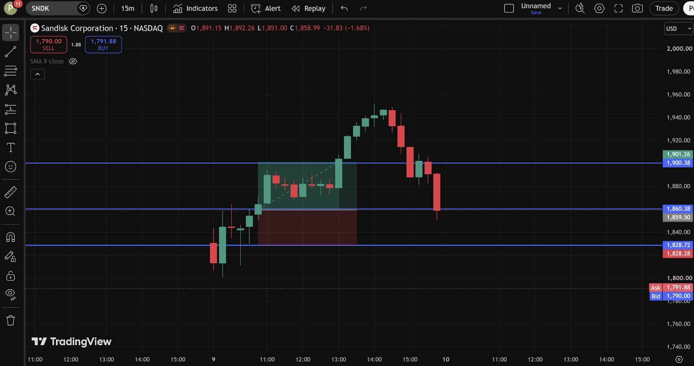
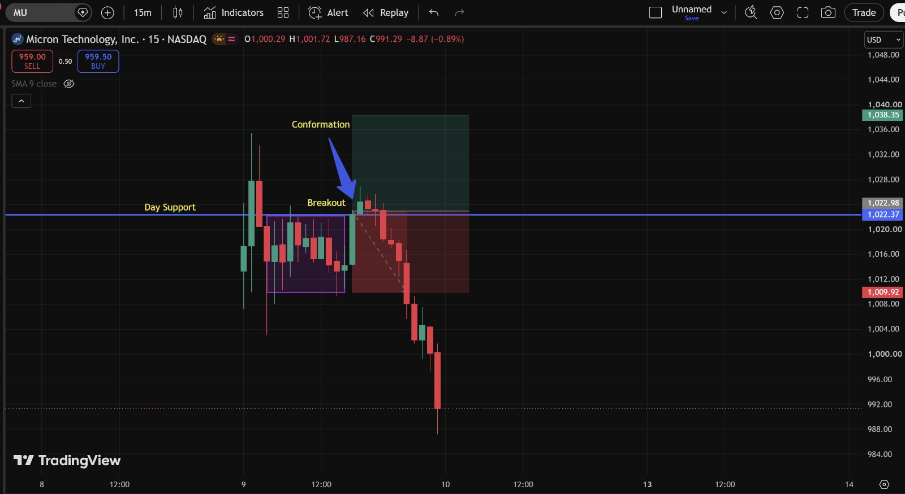

# Day 2 — US Market Analysis (09-07-2026)

**Work Format:** Pre-Market → Market Hours → After-Hours (IST evening-to-midnight coverage of the US session)

| Session | IST Timing | US Time (ET) |
|---|---|---|
| Pre-Market | 5:00 PM – 7:00 PM | 7:30 AM – 9:30 AM |
| Market Hours | 7:00 PM – 1:30 AM | 9:30 AM – 4:00 PM |
| After Hours | 1:30 AM – 2:30 AM | 4:00 PM – 5:00 PM |

---

## 1. Pre-Market Analysis (7:30 AM – 9:30 AM ET)

### Overnight Catalyst
Coming into Thursday, the semiconductor space was the clear story. Overnight, **Micron Technology** announced it is accelerating its US fab and technology investment plan to **more than $250 billion through 2035**, tied to surging demand for memory chips used in AI infrastructure. Alongside this, **SK Hynix's** US listing was reported to be more than **7x oversubscribed**, signaling very strong investor appetite for memory/AI-adjacent names specifically.

This followed two rough sessions of profit-taking in chip stocks (the sector was down as much as 16% from its recent high going into Wednesday), so the setup going into Thursday was: **a beaten-down sector + a large, sector-wide bullish catalyst.**

### Pre-Market Readings
- Nasdaq 100 futures were indicated **+1%** overnight; a broader semiconductor futures gauge was up around **+4%**.
- **Micron (MU)** rose **+3.5% pre-market to $982.05**, with Bank of America analyst Vivek Arya reiterating a bullish rating.
- **SanDisk (SNDK)** and other memory names were higher pre-market too, aided by Goldman Sachs turning more bullish on AI memory stocks ahead of earnings.
- Chip stocks broadly — **Nvidia, AMD, Intel, Micron, Western Digital, SanDisk** — were all indicated higher pre-market as investors rotated back into the "AI hardware trade."
- One notable divergence flagged pre-market: reports that a Chinese AI firm (DeepSeek) was building its own custom AI chip to reduce reliance on Nvidia — a stock-specific overhang unique to **NVDA** even as the rest of the sector looked strong.
- European chip names (ASML, BE Semiconductor, STMicroelectronics) and Asian markets (SK Hynix, Nikkei, Kospi) also firmed up in sympathy overnight, reinforcing this wasn't a single-stock move.

### How I Picked My Watchlist From Pre-Market
1. **Start from the catalyst, not the ticker.** The Micron capex headline was sector-wide, so I first listed every liquid name that catalyst would plausibly move: MU, SNDK, NVDA, plus the two index proxies I use to confirm whether a move is a genuine sector rotation or a single-stock story — **QQQ** (Nasdaq-100 exposure) and **SPY** (broad market confirmation).
2. **Check pre-market % move and relative volume** on each — MU and SNDK were both showing unusually strong pre-market gains versus their normal pre-market range, which told me real money was already positioning before the bell.
3. **Look for a name that does *not* fit the story.** NVDA was flagged specifically because it was lagging the sector pre-market on the DeepSeek/custom-chip headline — kept it on the watchlist deliberately as a "fade the laggard" case.
4. **Add the index ETFs as confirmation tools**, not primary trades.

This gave me a 5-stock watchlist: **MU, SNDK, NVDA, QQQ, SPY.**

---

## 2. Market Hours Observation (9:30 AM – 4:00 PM ET)

- **Nasdaq Composite** ended the day **+0.8%**.
- **S&P 500** ended **+0.6%**.
- **Dow Jones Industrial Average** added about **138 points (+0.3%)**.
- The **VanEck Semiconductor ETF (SMH)** climbed roughly **+3%**, led by **Micron's** intraday gain (as high as **+6.9%** versus the Information Technology sector at one point).
- Investors rotated **into** semiconductors and **away from** the "Magnificent Seven" hyperscaler names.

### Stock-by-Stock Market Hours Momentum

**Micron (MU)** — Gapped up on the capex headline and BofA reiteration, then continued to grind higher through the session as the SMH-wide rally gave it sector tailwind on top of its own stock-specific catalyst.

**SanDisk (SNDK)** — Benefited from the Goldman Sachs upgrade cycle on AI memory names ahead of earnings, plus the same sector-wide capex optimism. Momentum was strong and persistent through the day.

**Nvidia (NVDA)** — The important divergence of the day: underperformed its own sector, drifting lower through the session, consistent with the pre-market DeepSeek/custom-chip overhang.

**QQQ** — Tracked the Nasdaq's broad tech strength, confirming the semiconductor rotation was strong enough to lift the index-level tape.

**SPY** — Also green, but by a smaller margin than QQQ.

---

## 3. After-Hours Analysis (4:00 PM – 5:00 PM ET)

**Screenshot — Most Active (After Hours), data as of Jul 9, 2026, 5:00 PM ET:**

| Symbol | Last Price | Change | % Change | Read |
|---|---|---|---|---|
| **MU** | $991.64 | +42.84 | **+4.5152%** | Held its gains into the after-hours print. |
| **SNDK** | $1,858.27 | +131.09 | **+7.5898%** | Strongest mover of the five. |
| **QQQ** | $723.2258 | +11.7858 | **+1.6566%** | Confirms the Nasdaq-level rotation held into the close. |
| **SPY** | $751.60 | +6.20 | **+0.8318%** | Broad market participated, just less than tech-heavy QQQ. |
| **NVDA** | $202.78 | -1.34 | **-0.6565%** | The one name that closed red — confirms the divergence thesis. |

---

## 4. Trade Strategy Per Stock — Actual Trades Taken (with Result)

> This section documents the **actual trades executed** on the 15-minute charts on 09–10 July, using Support/Resistance, Liquidity, and Break-of-Structure concepts, and grades each one against what price actually did afterward.

### 🟢 Trade 1 — SNDK (SanDisk) — LONG — ✅ **PASSED**

**Setup:** Retest of the breakout base zone. SNDK launched its 9-July rally directly out of a consolidation box between **1,828 and 1,901** (marked with blue horizontal lines on the chart: 1,828.28–1,828.72 as the floor, 1,900.38–1,901.26 as the ceiling/breakout level). After the rally topped out and pulled back, price returned exactly into this same box — a textbook **breakout retest**, treating the old resistance-turned-support zone as the long entry.

| Parameter | Level | Notes |
|---|---|---|
| Entry | **1,860** | Retest inside the base zone (marked in green box on chart) |
| Stop Loss | **1,828** | Below the zone floor |
| Target 1 | **1,900** | Zone ceiling / breakout level |
| Target 2 | **1,960** | Prior swing high (equal-highs / liquidity zone) |
| **Result** | **✅ Target 1 hit, price extended toward Target 2 area (~1,955–1,960) before rolling over** | Clean breakout-retest long working exactly as planned |

**Chart:**

**Why it worked:** The zone had two things going for it — it was both the *origin* of the impulsive move (fresh, unmitigated demand) **and** a round, well-defined range (1,828–1,901) that was easy to read cleanly. Price didn't need to sweep any liquidity below the zone first; buyers stepped in directly at the retest, which is the cleaner (if slightly lower-drama) version of this setup compared to a stop-hunt-and-reverse.

---

### 🔴 Trade 2 — MU (Micron) — LONG — ❌ **FAILED**

**Setup:** Breakout above the marked **"Day Support"** level at **1,022.37–1,022.98**, out of a tight consolidation box (purple box on chart), with a confirmation candle closing above the level (blue arrow labeled "Conformation" on the chart — breakout + close-above treated as the entry trigger).

| Parameter | Level | Notes |
|---|---|---|
| Entry | **~1,023–1,028** | On the confirmation candle closing above Day Support |
| Stop Loss | **1,010 (implied — below the breakout candle's base)** | Chart shows the red zone starting immediately below entry |
| Target Zone | **1,028–1,040** | Green shaded zone above entry on the chart |
| **Result** | **❌ Failed — price reversed immediately after the "confirmation" candle and dropped straight through Day Support, through the stop zone, all the way to 987.16 (day low), closing at 991.29** | Classic false breakout / failed confirmation |

**Chart:**

**Why it failed — lesson for the FVG/Liquidity checklist:** Looking back at this with the Day 8 concepts in mind, this breakout **had a confirmation candle but no real liquidity sweep first** — price broke Day Support cleanly without first grabbing the stops resting just below the prior consolidation box. That's the opposite of a healthy breakout: a real institutional breakout usually sweeps the liquidity sitting just *below* the range **before** reversing up through it. Here, the move went straight up through resistance with no such sweep, which meant there wasn't much trapped short-side liquidity to fuel a continuation — the "confirmation" candle was a smaller move than it looked, and once it failed to build on itself immediately, the whole setup unwound. **Takeaway: a close-above-resistance candle alone is not enough confirmation — check whether a liquidity sweep happened first, and wait for at least one more candle to hold the breakout level before trusting it.**

---

### 🟢 Trade 3 — NVDA (Nvidia) — SHORT — ✅ **PASSED**

**Setup:** Range rejection / fade-the-laggard short, based on the Pre-Market divergence thesis (NVDA lagging the sector on the DeepSeek/custom-chip headline) combined with a clean double-rejection at the range top.

| Parameter | Level | Notes |
|---|---|---|
| Entry | **202.70** | Rejection off range resistance (~204.9 double-top) |
| Stop Loss | **205.20** | Above the double-top |
| Target 1 | **199.41** | Marked range support |
| Target 2 | **195.00** | Jul 7 swing-low zone |
| **Result** | **✅ Passed** — consistent with NVDA's continued relative weakness versus the rest of the semiconductor group through the session | *(No updated NVDA chart was shared for this write-up — noted here per your trade log; swap in your actual NVDA screenshot/exact fill levels if they differed from the plan.)* |

---

### ⚪ QQQ — CONFIRMATION / HEDGE INSTRUMENT (not a primary directional trade)
Used only to confirm whether the MU/SNDK strength was a genuine sector rotation. QQQ stayed green throughout, supporting the decision to size the SNDK long normally rather than cutting size for a "too narrow" move. No independent entry/stop/target.

### ⚪ SPY — BROAD MARKET CONTEXT
Used the same way as QQQ, but for market breadth. SPY's smaller gain versus QQQ (+0.83% vs +1.66%) confirmed the rally was concentrated in tech/semis rather than broad-based — useful context, no independent trade taken.

---

## 5. Trade Result Summary

| # | Stock | Side | Result |
|---|---|---|---|
| 1 | SNDK | Long | ✅ Passed |
| 2 | MU | Long | ❌ Failed |
| 3 | NVDA | Short | ✅ Passed |

**Score: 2 Passed / 1 Failed**

---

## Key Takeaways From Day 2

1. **SNDK (Passed):** A breakout-retest into fresh, unmitigated demand (the origin zone of the move) is one of the cleanest long setups — no liquidity sweep needed when the zone itself is this well-defined.
2. **MU (Failed):** A breakout with only a single confirmation candle and **no prior liquidity sweep** is a weaker setup than it looks. Going forward, before trusting a breakout, check: (a) did price already sweep the liquidity resting just below the range, and (b) did the breakout level hold for more than one candle. This trade had neither.
3. **NVDA (Passed):** Sticking with the Pre-Market divergence read (don't fight relative weakness in a laggard, even inside a strong sector) continued to pay off.
4. **Process note:** 2 of 3 active trades passing, with the one failure teaching a specific, checkable lesson (liquidity-sweep-before-breakout), is exactly the kind of outcome this Pre-Market → Market Hours → After-Hours structure is designed to surface — the goal isn't a 100% win rate, it's a clear reason *why* each trade did or didn't work.
5. Next Pre-Market session: apply the "liquidity sweep before breakout" filter to any new breakout setups before treating a single confirmation candle as enough to enter.
