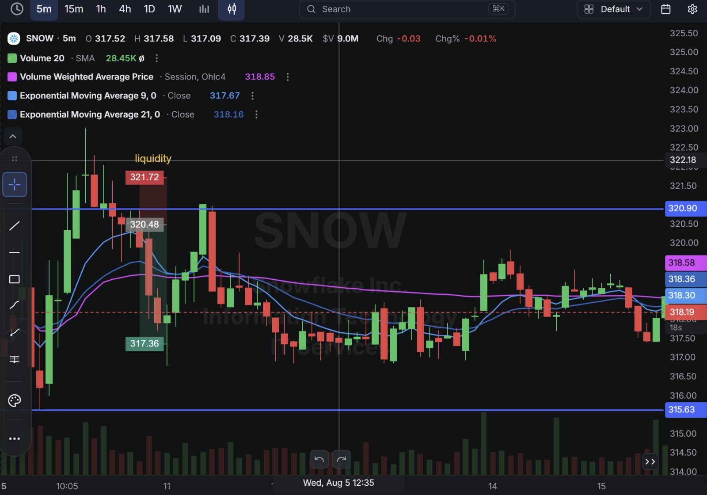
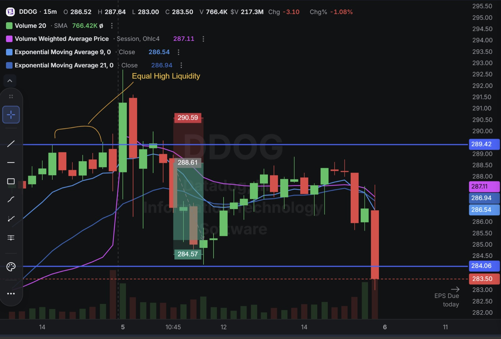
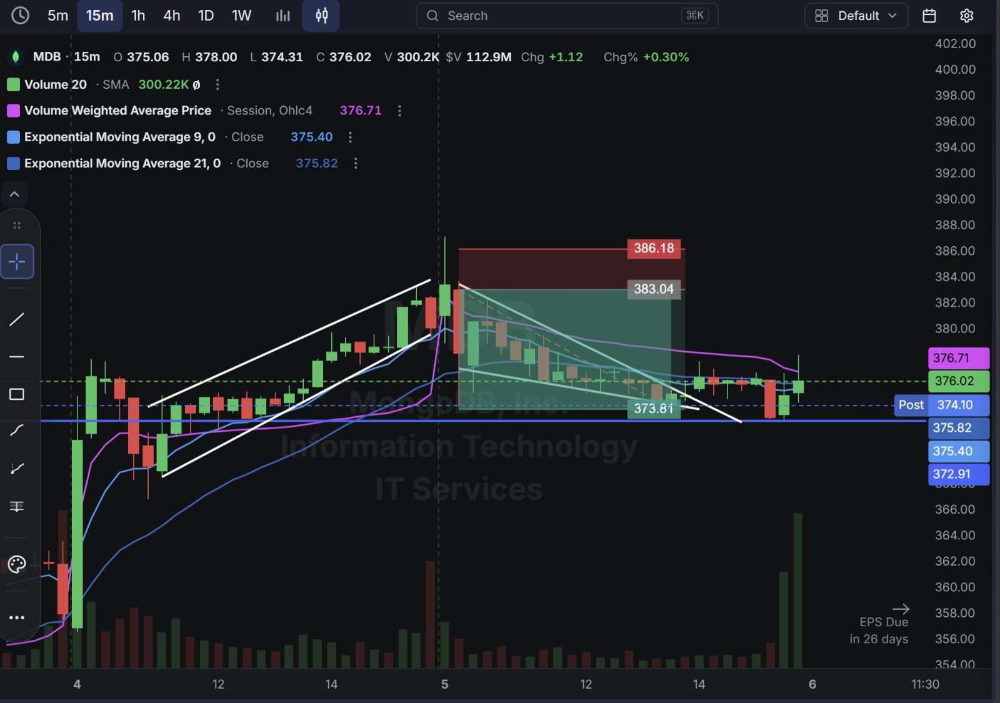
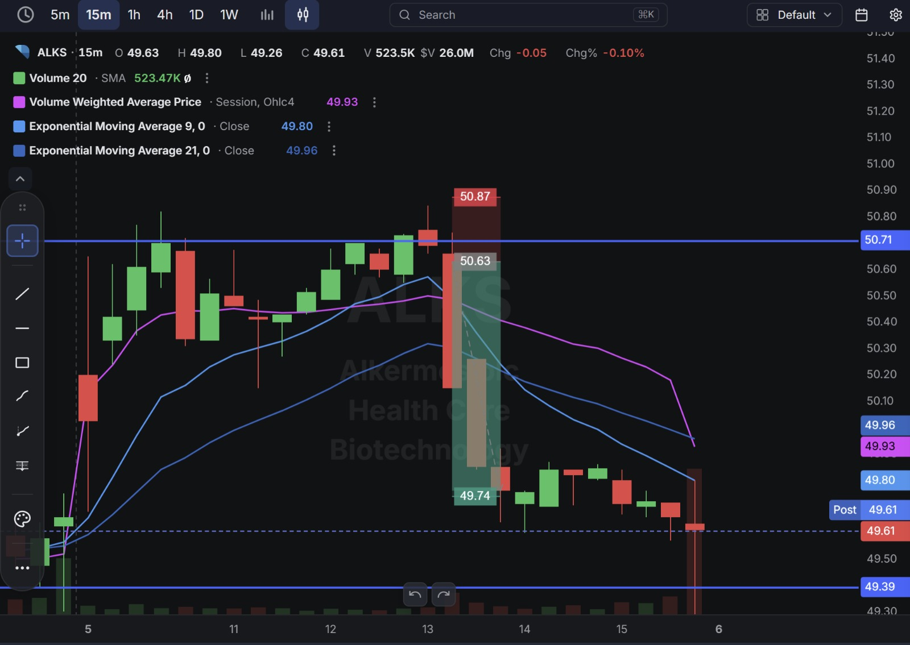

# Day 20 — US Market Analysis (05-08-2026)

**Work Format:** Pre-Market → Market Hours → After-Hours (IST evening-to-midnight coverage of the US session)

| Session      | IST Timing        | US Time (ET)      |
| ------------ | ----------------- | ----------------- |
| Pre-Market   | 5:00 PM – 7:00 PM | 7:30 AM – 9:30 AM |
| Market Hours | 7:00 PM – 1:30 AM | 9:30 AM – 4:00 PM |
| After Hours  | 1:30 AM – 2:30 AM | 4:00 PM – 5:00 PM |

> **New this session:** Started annotating charts with explicit **Smart Money Concepts (SMC)** — marking "liquidity" pools and "Equal High" zones directly on the entries, alongside a classic rising-wedge pattern on MDB. This is the first day the technical setup itself, not just the CANSLIM fundamentals, gets its own explanation.

---

## 1. Pre-Market Analysis (7:30 AM – 9:30 AM ET)

### The Screener (Back to the CANSLIM Screener — Same Config as Days 15–17)

| Group   | Logic | Conditions                                                                                                                                             |
| ------- | ----- | --------------------------------------------------------------------------------------------------------------------------------------------------------- |
| Group 1 | ALL   | Dollar Volume > $20M · AS 3M > 85 · Include Type: Common Stock                                                                                            |
| Group 2 | ALL   | EPS Growth Latest Rptd Qtr (%) > 25.00% · Sales Growth Latest Rptd Qtr (%) > 25.00% · AS 1M > 95 · EPS Growth 3 Yrs Ago (%) > 25.00% · EPS Growth 5 Yrs Ago (%) > 25.00% |

**Screener Screenshot:** 

**Result: 9 stocks.** Back to the strict, multi-year CANSLIM filter after Days 18–19's event-driven detour. Three familiar names re-qualified — **SNOW, DDOG, and ALKS** all previously appeared in this journal — plus **MDB**, last traded on Day 17.

### The Setup Type — SMC Liquidity Grabs and a Rising Wedge

Every trade today used the **same underlying technical idea**, framed through Smart Money Concepts rather than pure support/resistance: price pushes to a level where a cluster of stop-losses or breakout buy orders is sitting (a "liquidity pool" — either a single prior high or, in DDOG's case, **two nearly identical highs**, an "Equal High," which is one of the most reliable liquidity magnets in SMC because breakout traders place buy-stops just above both highs at once). Price sweeps through that level, triggers the resting orders, and then reverses — the idea being that the sweep itself was the real purpose of the move, not genuine breakout demand. MDB added a second, complementary read: a visibly **narrowing rising wedge** (higher lows compressing faster than higher highs) directly into the liquidity level — a classic technical exhaustion pattern that often precedes a sharp reversal.

### Overnight/Morning Catalysts

- **SNOW (Snowflake)** — No fresh company-specific news; still the same elite CANSLIM profile carried since Day 15. Today's trade was purely a technical fade of a liquidity sweep at a defined level, not a bet against the fundamentals.
- **DDOG (Datadog)** — The most important context of the day: DDOG reports Q2 earnings **before the bell tomorrow (August 6)**. Heading into the print, the stock was trading around $290 against an average analyst price target of roughly $276 — meaningfully ahead of where the sell-side collectively sees fair value, even after a strong prior quarter (32% YoY revenue growth last time out). This is the fifth straight session this journal has traded DDOG's momentum, and today's session is the one where that repeated caution about earnings proximity finally became the headline event.
- **MDB (MongoDB)** — No fresh catalyst; still resting on the same strong multi-year growth profile from Day 17, with earnings a comfortable 26 days out.
- **ALKS (Alkermes)** — No fresh catalyst; a return to the name after Day 16's long trade, this time faded from the short side off a defined resistance level.

---

## 2. Market Hours Observation (9:30 AM – 4:00 PM ET)

### SNOW — Clean Liquidity Sweep and Reversal

Pushed up to sweep a marked prior high, immediately reversed, and spent the rest of the session drifting in a wide, choppy range well below that level.

### DDOG — Equal-High Sweep, Reversal, Then a Violent Late Breakdown

Pushed up to sweep two nearly identical prior highs, reversed into the target zone, based for several hours, then broke down violently in the final stretch of the session — a dramatic acceleration lower right into tomorrow's earnings date.

### MDB — Rising Wedge Break and Clean Descending Channel

Climbed inside a visibly narrowing rising wedge into the liquidity level, broke down out of the wedge, and fell in an orderly descending channel for the rest of the session.

### ALKS — Sweep, Reversal, and Extended Grind Lower

Pushed up to sweep a defined high, reversed sharply, and spent the rest of the session grinding lower in a series of smaller steps rather than one sharp move.

---

## 3. After-Hours Analysis (4:00 PM – 5:00 PM ET)

Heading into the next session, the key open questions:

- Whether **DDOG's** violent late-session breakdown was simply pre-earnings de-risking (traders trimming a stock trading above its average price target ahead of a binary event), or the start of a real re-rating that tomorrow's report will only confirm or deny.
- Whether **SNOW's and ALKS's** clean liquidity-sweep reversals hold into the next session, or whether the underlying uptrends (still fundamentally intact in SNOW's case) reassert themselves the way SNOW did after Day 15's failed fade.
- Whether **MDB's** wedge breakdown is a genuine trend change or just a normal pullback within its longer uptrend, given earnings are still 26 days away and the fundamental story hasn't changed.

---

## 4. Trade Strategy — Actual Trades, Full CANSLIM + SMC Reasoning, and Results

> All four trades today were **short**, and all four used the same core setup: fade a liquidity sweep (or, for MDB, a wedge breakdown into one) rather than bet against the underlying fundamentals.

### 🔴 SNOW — SHORT — ✅ **PASSED**

**The setup:** Price swept above a clearly marked prior high (321.72) — a textbook single-level liquidity grab — before reversing. **CANSLIM read:** unchanged elite profile (accelerating multi-year growth, top-pick status, strong accumulation scores); this trade, like Day 17's SNOW short, was a technical fade of a defined level rather than a fundamental bet.

**How I planned the entry and exit:**
- **Entry (320.48):** short on the reversal candle immediately after the liquidity sweep failed to hold.
- **Stop Loss (321.72):** at the swept high itself — a 0.39% stop.
- **Target (317.36):** the next support level below.
- **Risk/Reward:** Risk $1.24 (0.39%) to make $3.12 (0.97%) → **RR of 2.52**.

**Result:** Price declined through the target and continued lower through the rest of the session, closing at **317.39** — essentially at the target level. Target hit.

**Chart:**

---

### 🔴 DDOG — SHORT — ✅ **PASSED**

**The setup:** An **Equal High liquidity** sweep — two nearly identical prior highs got taken out together before reversing, which typically clears out a larger cluster of resting buy-stops than a single high would. **CANSLIM read:** this is the trade where "close to earnings" finally became the whole story. DDOG was trading meaningfully above the average analyst target heading into tomorrow's print, on the back of five straight sessions of the same momentum trade — the exact setup flagged as increasingly risky on Days 16 and 17. Today's short treated that combination (extended price, imminent binary event) as reason enough to fade the sweep rather than buy another continuation.

**How I planned the entry and exit:**
- **Entry (288.61):** short on the reversal after the Equal High sweep.
- **Stop Loss (290.59):** above the swept highs — a 0.69% stop.
- **Target (284.57):** the next support level below.
- **Risk/Reward:** Risk $1.98 (0.69%) to make $4.04 (1.40%) → **RR of 2.04**.

**Result:** Price declined into the target zone, based for several hours, then broke down violently in the final stretch of the session, closing at **283.50** — well below the target, right into tomorrow's earnings date. Target hit and exceeded.

**Chart:** 

---

### 🔴 MDB — SHORT — ✅ **PASSED**

**The setup:** A **rising wedge** — visibly narrowing higher-highs/higher-lows compression — breaking down directly at a liquidity level, combining a classic technical exhaustion pattern with the same SMC liquidity-sweep logic used on the other three trades. **CANSLIM read:** unchanged strong profile from Day 17 (accelerating Atlas growth, top-pick status); this trade, like SNOW's, was purely technical — fading an exhausted pattern at a defined level, not a fundamental bet, with earnings still a comfortable 26 days away.

**How I planned the entry and exit:**
- **Entry (383.04):** short on the wedge breakdown, right at the marked liquidity level.
- **Stop Loss (386.18):** above the wedge high — a 0.82% stop.
- **Target (373.81):** the next support level below, based on the descending channel projection.
- **Risk/Reward:** Risk $3.14 (0.82%) to make $9.23 (2.41%) → **RR of 2.94**.

**Result:** Price fell in an orderly descending channel straight into the target zone, closing the session at **376.02** with post-market trading even lower at **374.10** — right at the target level. Target hit.

**Chart:** 

---

### 🔴 ALKS — SHORT — ✅ **PASSED**

**The setup:** The same single-level liquidity sweep as SNOW — price pushed above a marked high (50.87) before reversing. **CANSLIM read:** no new catalyst; this was purely a technical fade off a defined resistance level, the mirror image of the long-side reclaim traded on Day 16.

**How I planned the entry and exit:**
- **Entry (50.63):** short on the reversal immediately after the sweep.
- **Stop Loss (50.87):** at the swept high — a 0.47% stop.
- **Target (49.74):** the next support level below.
- **Risk/Reward:** Risk $0.24 (0.47%) to make $0.89 (1.76%) → **RR of 3.71** — the best risk/reward of the day.

**Result:** Price declined through the target and continued lower into a session low of **$49.26**, closing at **49.61**. Target hit with room to spare.

**Chart:** 

---

## 5. Trade Result Summary

| # | Stock | Setup Type                                             | Side  | CANSLIM Read                                                              | Result    |
| --- | ----- | ---------------------------------------------------------- | ----- | ------------------------------------------------------------------------------ | --------- |
| 1 | SNOW  | Fade a single-high liquidity sweep                          | Short | Elite fundamentals unchanged; pure technical fade of a defined level          | ✅ Passed |
| 2 | DDOG  | Fade an Equal High liquidity sweep ahead of earnings         | Short | Extended above average analyst target with earnings the next morning         | ✅ Passed |
| 3 | MDB   | Fade a rising-wedge breakdown at a liquidity level            | Short | Strong fundamentals unchanged; earnings 26 days out; pure technical fade      | ✅ Passed |
| 4 | ALKS  | Fade a single-high liquidity sweep                          | Short | No new catalyst; mirror image of the Day 16 long                              | ✅ Passed |

**Score: 4 for 4.**

### Normalized Results — $100 Total Capital Per Trade

This table assumes **$100 of total capital allocated to each trade**, with the dollar result calculated from each trade's percentage move from entry to its marked target.

| # | Stock     | Capital           | Entry → Target        | % Move | Result       | P&L        |
| --- | --------- | ------------------ | ----------------------- | ------ | ------------ | ---------- |
| 1 | SNOW      | $100               | 320.48 → 317.36          | 0.97%  | ✅ Target hit | **+$0.97** |
| 2 | DDOG      | $100               | 288.61 → 284.57          | 1.40%  | ✅ Target hit | **+$1.40** |
| 3 | MDB       | $100               | 383.04 → 373.81          | 2.41%  | ✅ Target hit | **+$2.41** |
| 4 | ALKS      | $100               | 50.63 → 49.74            | 1.76%  | ✅ Target hit | **+$1.76** |
| — | **Total** | **$400 deployed**  | —                          | —      | **4 for 4**  | **+$6.54** |

**On $400 total capital deployed across the four trades, the day returned $6.54 in profit — roughly a 1.64% return on capital deployed.** A second consecutive perfect session, though on smaller average percentage moves than Day 19's earnings-driven names — consistent with these being technical liquidity-sweep fades on names without same-day fundamental catalysts (DDOG excepted).

---

## Key Takeaways From Day 20

1. **DDOG is the headline story: the earnings-proximity caution flagged on Days 16 and 17 finally resolved into an actual trade.** Rather than taking a sixth straight day of the long-side continuation trade, the setup flipped to fade an Equal High sweep specifically *because* the stock was extended above its average analyst target heading into a binary event the next morning — turning a repeated worry into a specific, falsifiable short thesis instead of just a footnote.
2. **Today formalizes a repeatable setup type worth naming: the SMC liquidity-sweep fade.** Price tags a level where stop-losses or breakout orders are known to cluster (a single high, or better, an Equal High), sweeps through it, and reverses. This is a distinct trigger from the plain "resistance rejection" used on Day 17's SNOW trade — it's about *why* a level gets touched (to trigger orders) rather than just *that* it gets touched.
3. **MDB's rising wedge is a useful reminder that classic chart patterns and SMC liquidity concepts aren't competing frameworks — they stack.** The wedge explained the *shape* of the exhaustion; the liquidity level explained *where* the reversal was likely to trigger. Using both together produced the highest-RR trade of the day (2.94) outside of ALKS.
4. **A second consecutive 4-for-4 day is worth treating with real caution rather than pure celebration.** Two perfect sessions in a row is exactly the point where overconfidence creeps in — the next loss, whenever it comes, shouldn't be treated as a surprise or a sign the framework stopped working.
5. **Next Pre-Market session:** DDOG's actual Q2 report lands before tomorrow's open — a direct, immediate test of whether today's pre-earnings short was reading real distribution or just a normal pullback. Watch it closely alongside SNOW and ALKS to see whether today's reversals hold or get reclaimed.
