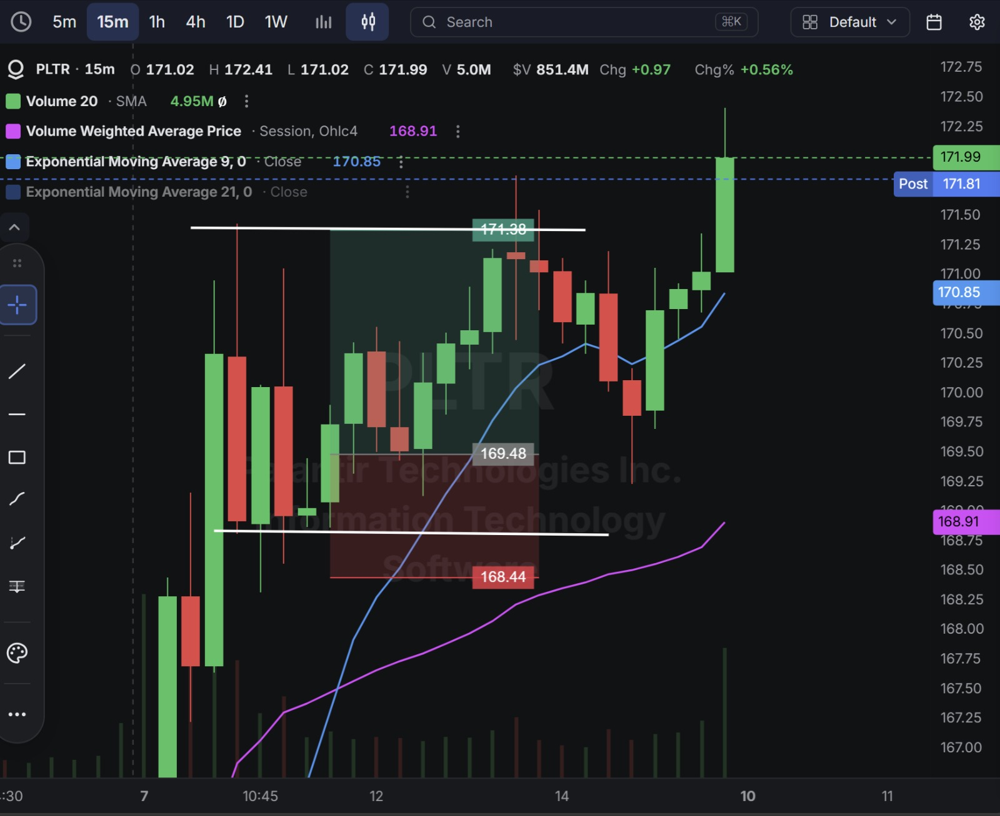
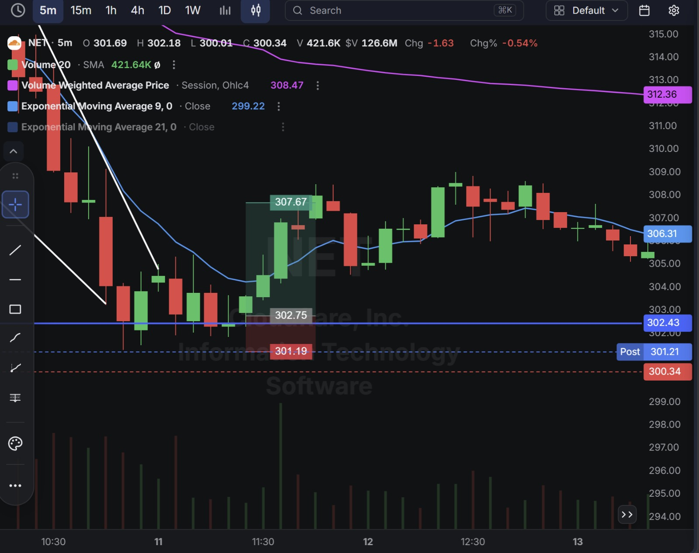
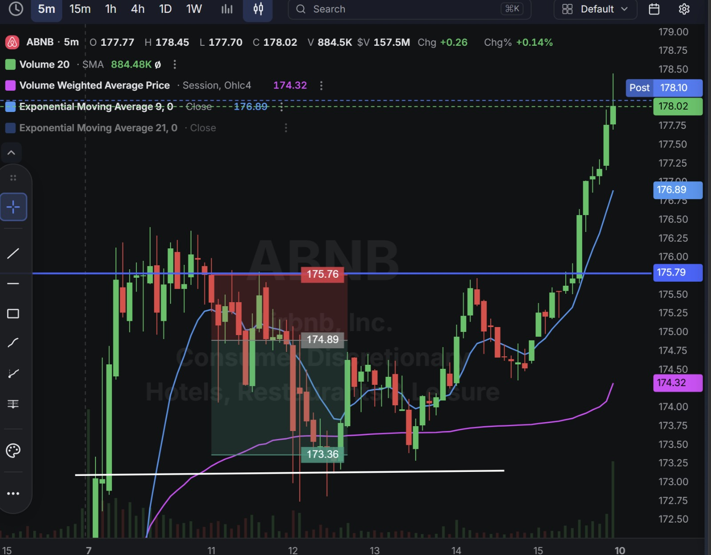

# Day 22 — US Market Analysis (07-08-2026)

**Work Format:** Pre-Market → Market Hours → After-Hours (IST evening-to-midnight coverage of the US session)

| Session      | IST Timing        | US Time (ET)      |
| ------------ | ----------------- | ----------------- |
| Pre-Market   | 5:00 PM – 7:00 PM | 7:30 AM – 9:30 AM |
| Market Hours | 7:00 PM – 1:30 AM | 9:30 AM – 4:00 PM |
| After Hours  | 1:30 AM – 2:30 AM | 4:00 PM – 5:00 PM |

> **A "beat and raise" Friday:** all three trades sat on top of huge, real earnings beats reported the previous evening — Cloudflare and Airbnb both posted their results after Thursday's close, and PLTR continued digesting its own blowout print from earlier in the week.

---

## 1. Pre-Market Analysis (7:30 AM – 9:30 AM ET)

### The Screener (CANSLIM Screener — Same Config as Days 20–21)

| Group   | Logic | Conditions                                                                                                                                             |
| ------- | ----- | --------------------------------------------------------------------------------------------------------------------------------------------------------- |
| Group 1 | ALL   | Dollar Volume > $20M · AS 3M > 85 · Include Type: Common Stock                                                                                            |
| Group 2 | ALL   | EPS Growth Latest Rptd Qtr (%) > 25.00% · Sales Growth Latest Rptd Qtr (%) > 25.00% · AS 1M > 95 · EPS Growth 3 Yrs Ago (%) > 25.00% · EPS Growth 5 Yrs Ago (%) > 25.00% |

**Screener Screenshot:** 

**Result: 13 stocks** — same size as Day 21's list. **PLTR** (last traded Day 19) and two brand-new names, **NET (Cloudflare)** and **ABNB (Airbnb)**, were selected to trade.

### Overnight/Morning Catalysts

- **PLTR (Palantir)** — Still digesting Monday's blowout Q2 print (93% YoY revenue growth, guidance raised to $8.15B). No fresh news today; the stock continued its post-earnings uptrend into a third session.
- **NET (Cloudflare)** — Reported Q2 2026 results Thursday after the close: revenue of $696.1M beat the $664.8M estimate (+35.9% YoY), adjusted EPS of $0.29 beat by 7.5%, and full-year revenue guidance was raised to $2.87B. The stock, which had already run 21.6% into the print and was trading around $300 against an average analyst target near $265, popped as much as 14.9% on the news before this session opened.
- **ABNB (Airbnb)** — Also reported Thursday after the close: revenue of $3.61B beat the $3.58B estimate (+16.5–17% YoY), EPS of $1.37 beat by roughly 9.5%, and management raised full-year guidance for the second time this year (to "at least mid-teens" revenue growth). CEO Brian Chesky credited AI tools — including an assistant now resolving ~45% of support issues without a human agent — for a 16% drop in support cost per booking. Shares jumped as much as 17% and hit a four-year high, with Wedbush upgrading to Outperform and raising its target to $200.

---

## 2. Market Hours Observation (9:30 AM – 4:00 PM ET)

### PLTR — Orderly Continuation Higher

Extended its multi-day post-earnings uptrend in a clean, low-drama grind through the session, closing well off the lows.

### NET — Sharp Pullback From the Post-Earnings Spike, Late Reversal

Opened well below its post-earnings highs (down from a ~$314 peak toward $300), rallied partway back through the session, then reversed sharply into the close, giving back the recovery.

### ABNB — Volatile Digestion, Then a Powerful Breakout

Spent the first half of the session in a wide, choppy range digesting the huge earnings gap, then broke out decisively in the second half, closing near session highs with post-market extending even further.

---

## 3. After-Hours Analysis (4:00 PM – 5:00 PM ET)

Heading into the next session, the key open questions:

- Whether **PLTR's** third straight day of gains is sustainable momentum or getting stretched after such a large initial move.
- Whether **NET's** late-session reversal, right after a huge post-earnings spike, is the start of a real "sell the news despite the beat" pattern — a real risk flagged explicitly in coverage given the stock traded at 48x sales heading into the print.
- Whether **ABNB's** breakout holds given the stock is now at a four-year high with multiple analyst target increases already in — a very different setup than NET's immediate post-spike fade.

---

## 4. Trade Strategy — Actual Trades, Full CANSLIM Reasoning, and Results

> Third straight perfect session — all three trades hit target.

### 🟢 PLTR — LONG — ✅ **PASSED**

**Why I took this trade:** Same elite profile from Day 19, now three sessions into the post-earnings move. **C/A/N/L/I** all remain unchanged and strong; this trade was a straightforward continuation buy in an uptrend that had shown no signs of exhaustion.

**How I planned the entry and exit:**
- **Entry (169.48):** on the continuation push within the established uptrend.
- **Stop Loss (168.44):** below the recent consolidation base — a 0.61% stop.
- **Target (171.38):** the next resistance extension above.
- **Risk/Reward:** Risk $1.04 (0.61%) to make $1.90 (1.12%) → **RR of 1.83**.

**Result:** Price extended well past the target to an intraday high of $172.41, closing at **171.99**. Target hit comfortably.

**Chart:** 

---

### 🟢 NET — LONG — ✅ **PASSED**

**Why I took this trade:** **C:** a clean beat on every metric — revenue, EPS, and raised guidance. **A/N:** accelerating growth (35.9% YoY) driven by genuine new AI-workload demand. The important nuance: this trade was **not** a fade of the spike (unlike the FERG/BLZE/FTK pattern) — it was a **buy-the-dip** within an already-strong earnings reaction, betting that a stock reporting this clean a beat would find support and partially recover from its first pullback off the post-earnings highs, rather than immediately round-tripping the entire gap. The one real caveat, stated plainly: coverage flagged the stock trading at 48x sales with insiders selling and no buying — a genuinely expensive setup where "a standard beat may disappoint," which is exactly why this was sized as a bounce trade rather than a full trend-following position.

**How I planned the entry and exit:**
- **Entry (302.75):** on the stabilization after the initial pullback from the post-earnings highs.
- **Stop Loss (301.19):** below that stabilization — a 0.52% stop.
- **Target (307.67):** back toward the recent highs.
- **Risk/Reward:** Risk $1.56 (0.52%) to make $4.92 (1.63%) → **RR of 3.15**.

**Result:** Price rallied through the target before reversing sharply into the close, ending the session at $300.34 — below the entry, but the target itself was tagged intraday before the reversal. Target hit.

**Chart:** 

---

### 🔴 ABNB — SHORT — ✅ **PASSED**

**Why I took this trade:** **C/A/N** are all outstanding — a genuine beat on every line, a second guidance raise this year, and a real, fresh AI-driven margin story (support costs down 16%, an AI assistant resolving 45% of issues). This was a short-term technical fade within the post-earnings digestion range, not a bet against the news — the stock had jumped as much as 17% overnight, and an early pullback within that move was the higher-probability read before the (ultimately correct, in hindsight) breakout higher later in the session.

**How I planned the entry and exit:**
- **Entry (174.89):** short on the early rejection within the volatile post-earnings range.
- **Stop Loss (175.76):** above that rejection high — a 0.50% stop.
- **Target (173.36):** the lower end of the digestion range.
- **Risk/Reward:** Risk $0.87 (0.50%) to make $1.53 (0.88%) → **RR of 1.76**.

**Result:** Price dipped to tag the target before reversing into a powerful breakout that carried the stock to a session close of $178.02 (post-market $178.10) — the target was hit first, and the trade was already closed before the subsequent breakout, which would have worked against a still-open short.

**Chart:** 

---

## 5. Trade Result Summary

| # | Stock | Setup Type                                                    | Side  | CANSLIM Read                                                                | Result    |
| --- | ----- | ------------------------------------------------------------------ | ----- | ------------------------------------------------------------------------------- | --------- |
| 1 | PLTR  | Continuation buy on day 3 of a post-earnings uptrend                | Long  | Elite, unchanged profile; straightforward trend continuation                    | ✅ Passed |
| 2 | NET   | Buy the dip within a strong post-earnings reaction                  | Long  | Excellent beat/guidance; rich valuation flagged as the key risk               | ✅ Passed |
| 3 | ABNB  | Short a technical pullback within post-earnings digestion            | Short | Outstanding beat, raise, and new AI-margin story; pure technical fade         | ✅ Passed |

**Score: 3 for 3.**

### Normalized Results — $100 Total Capital Per Trade

| # | Stock     | Capital           | Entry → Target        | % Move | Result       | P&L        |
| --- | --------- | ------------------ | ----------------------- | ------ | ------------ | ---------- |
| 1 | PLTR      | $100               | 169.48 → 171.38          | 1.12%  | ✅ Target hit | **+$1.12** |
| 2 | NET       | $100               | 302.75 → 307.67          | 1.63%  | ✅ Target hit | **+$1.63** |
| 3 | ABNB      | $100               | 174.89 → 173.36          | 0.88%  | ✅ Target hit | **+$0.88** |
| — | **Total** | **$300 deployed**  | —                          | —      | **3 for 3**  | **+$3.63** |

**On $300 total capital deployed, the day returned $3.63 in profit — roughly 1.21% on capital deployed.**

---

## Key Takeaways From Day 22

1. **NET and ABNB show two different valid ways to trade a huge earnings beat, and it's worth being deliberate about which one applies.** NET's trade bought a *dip* within a strong reaction (appropriate given the rich, "priced for perfection" valuation flagged in coverage); ABNB's trade faded a short-term *pullback* within a still-developing digestion range before the real breakout came. Neither was a bet against the news — both were reads on the *shape* of the reaction, not the reaction itself.
2. **ABNB is a good reminder that a target hit doesn't require the trade to have "called" the whole move.** The short worked because it captured a small pullback, not because it predicted the powerful breakout that followed — those are two separate, sequential events, and confusing them would lead to oversized future shorts on a genuinely strong breakout stock.
3. **PLTR's third consecutive up day is worth flagging the same way DDOG's fifth day was on Day 20** — not as a reason to avoid the trade, but as a reason to keep watching for the point where continuation trades on the same name start needing tighter risk management rather than standard sizing.
4. **Three consecutive winning sessions (Days 20–22, with Day 21's single loss in between) is a good running record, but the discipline from Day 21's takeaways — don't let a hot streak relax the process — still applies fully here.**
5. **Next Pre-Market session:** watch whether NET reclaims its post-earnings highs or continues the late reversal seen today, and whether ABNB's breakout holds at its new four-year high.
