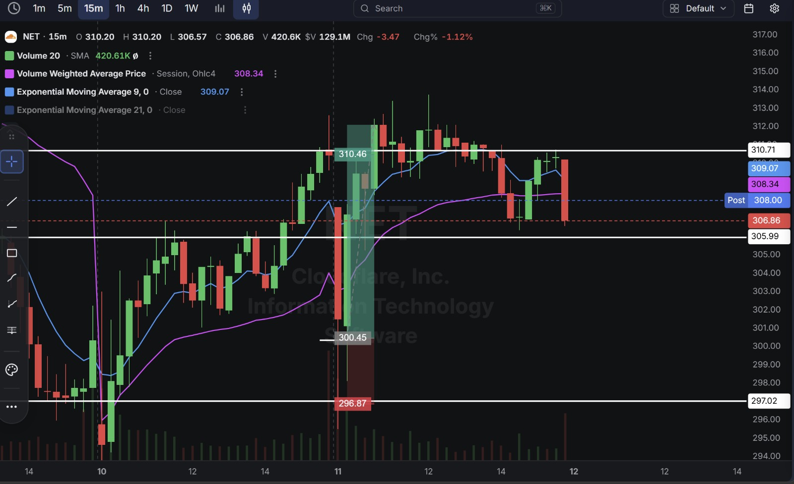
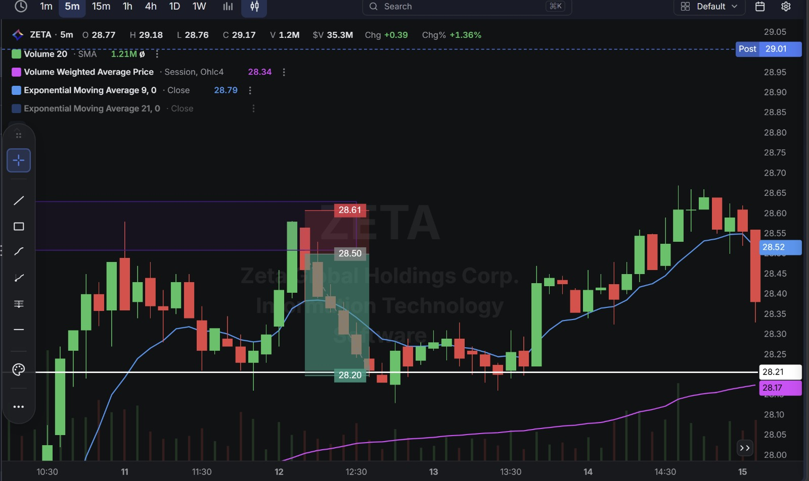
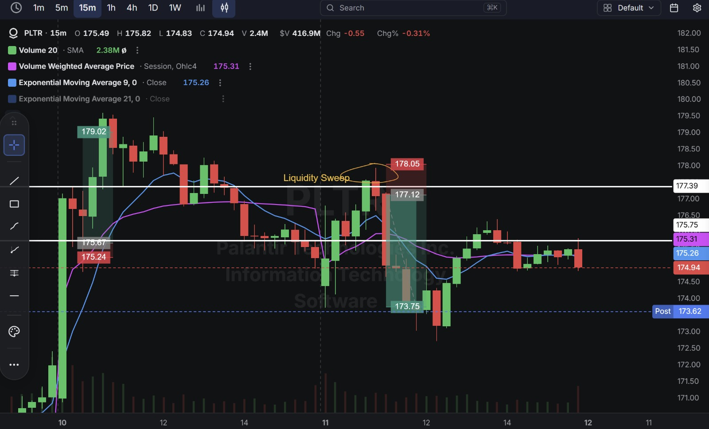
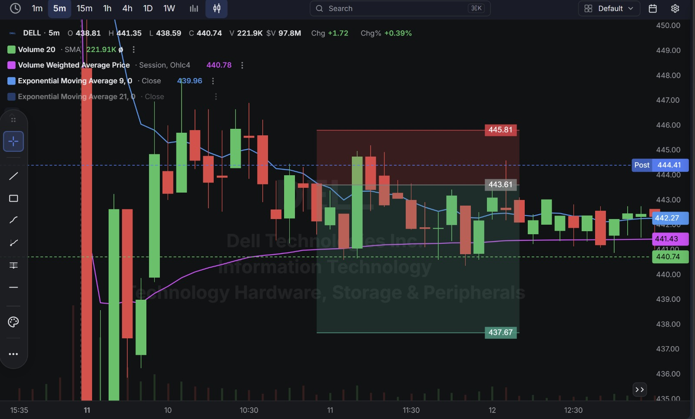

# Day 24 — US Market Analysis (11-08-2026)

**Work Format:** Pre-Market → Market Hours → After-Hours (IST evening-to-midnight coverage of the US session)

| Session      | IST Timing        | US Time (ET)      |
| ------------ | ----------------- | ----------------- |
| Pre-Market   | 5:00 PM – 7:00 PM | 7:30 AM – 9:30 AM |
| Market Hours | 7:00 PM – 1:30 AM | 9:30 AM – 4:00 PM |
| After Hours  | 1:30 AM – 2:30 AM | 4:00 PM – 5:00 PM |

---

## 1. Pre-Market Analysis (7:30 AM – 9:30 AM ET)

### The Screener ("CANSLIM 2" — Same Configuration as Day 23)

| Group   | Logic | Conditions                                                                                             |
| ------- | ----- | --------------------------------------------------------------------------------------------------------- |
| Group 1 | ALL   | Dollar Volume > $20M · AS 3M > 85 · Include Type: Stocks                                                   |
| Group 2 | ALL   | Pre Market Last > $5 · Pre Market Volume > 100,000                                                         |
| Group 3 | ALL   | EPS Growth Latest Rptd Qtr (%) > 25.00% · Sales Growth Latest Rptd Qtr (%) > 25.00% · AS 1M > 95            |

**Screener Screenshot:** 

**NET and PLTR both carried over** from Day 23; **ZETA** returns for the first time since Day 17; **DELL** is a brand-new name to this journal.

### Overnight/Morning Catalysts

- **NET (Cloudflare)** — No fresh news; continuing directly out of the multi-day post-earnings strength traded on Days 22–23.
- **ZETA (Zeta Global)** — No same-day catalyst identified; a technical setup on an established uptrend.
- **PLTR (Palantir)** — No fresh news; still the same elite, multi-week momentum name, now being traded from the short side on a technical signal for the first time.
- **DELL (Dell Technologies)** — The most fundamentally interesting name of the day. Dell has been one of 2026's biggest AI-infrastructure stories — shares are up roughly 260% year-to-date, driven by explosive AI-server demand (Nvidia- and AMD-powered systems) and a blowout fiscal Q1 print (revenue +87.5% YoY, adjusted EPS +64%, guidance raised toward $167B for the year). The stock set a fresh all-time closing high on August 4 after being named technology provider on a $10B AI-factory deal with startup Volta. Since then, the momentum has cooled: **Morgan Stanley cut its price target to $430 from $477 on August 7**, and the stock has been consolidating well off its highs — down from the ~$467 record to the low $440s heading into today's session.

---

## 2. Market Hours Observation (9:30 AM – 4:00 PM ET)

### NET — Strong Push Higher, Sharp Late Reversal

Extended cleanly higher through the morning before a sharp, high-volume reversal candle knocked it back down hard into the close.

### ZETA — Dip Within an Uptrend, Then a Powerful Extension Higher

Dipped briefly within its established uptrend before reversing and extending sharply higher through the rest of the session.

### PLTR — Liquidity Sweep and Clean Reversal Lower

Pushed up to sweep a marked prior high before reversing decisively lower, extending the decline into the close and after-hours.

### DELL — Extended, Directionless Chop

After an early volatile swing, spent nearly the entire session oscillating in a tight, non-trending range with no clear resolution either way.

---

## 3. After-Hours Analysis (4:00 PM – 5:00 PM ET)

Heading into the next session, the key open questions:

- Whether **NET's** sharp late reversal is the start of a real pullback after such an extended run, or just normal profit-taking within an intact uptrend.
- Whether **ZETA's** powerful extension confirms real underlying strength or is getting ahead of itself after such a fast move.
- Whether **PLTR's** liquidity-sweep reversal marks the start of the exhaustion this journal has been watching for since the Day 23 round-trip, given price continued lower even into after-hours.
- Whether **DELL** breaks out of today's tight range in either direction once the market digests the Morgan Stanley downgrade against the underlying AI-infrastructure growth story, or continues consolidating.

---

## 4. Trade Strategy — Actual Trades, Full CANSLIM + SMC Reasoning, and Results

> Three trades resolved to a clean target; one (DELL) never resolved and was closed manually rather than left to chop indefinitely.

### 🟢 NET — LONG — ✅ **PASSED**

**Why I took this trade:** A continuation of the same "buy the dip within a strong reaction" thesis traded on Days 22–23 — same excellent beat, same raised guidance, same rich-valuation caveat noted previously. Today's entry bought a fresh stabilization within the still-intact uptrend.

**How I planned the entry and exit:**
- **Entry (300.45):** on the reclaim after an early dip.
- **Stop Loss (296.87):** below that dip — a 1.19% stop.
- **Target (310.46):** the next resistance level above.
- **Risk/Reward:** Risk $3.58 (1.19%) to make $10.01 (3.33%) → **RR of 2.80**.

**Result:** Price rallied through the target to a session high above $313, before reversing sharply into the close at **306.86**. Target hit before the reversal.

**Chart:**

---

### 🔴 ZETA — SHORT — ✅ **PASSED**

**Why I took this trade:** No fresh catalyst — this was a pure technical fade of a short-term rejection within ZETA's broader uptrend, similar in spirit to the resistance-rejection shorts traded on strong names in prior sessions (SNOW, Day 17 and Day 20).

**How I planned the entry and exit:**
- **Entry (28.50):** short on the rejection at the top of a short-term range.
- **Stop Loss (28.61):** just above that rejection — a tight 0.39% stop.
- **Target (28.20):** the bottom of the range.
- **Risk/Reward:** Risk $0.11 (0.39%) to make $0.30 (1.05%) → **RR of 2.73**.

**Result:** Price dipped to tag the target before reversing into a powerful extension higher, closing the session at **29.17** (post-market $29.01) — the target itself was hit before that reversal. Target hit.

**Chart:**

---

### 🔴 PLTR — SHORT — ✅ **PASSED**

**Why I took this trade:** The same **SMC liquidity-sweep** setup used repeatedly since Day 20 — price swept above a marked prior high (177.39) before reversing, exactly the "Liquidity Sweep" pattern labeled directly on the chart. **CANSLIM read:** unchanged elite fundamentals; this was a pure technical fade of the sweep, not a bet against the stock's underlying momentum, and it's notable this is the first time PLTR has been shorted in this journal after five-plus sessions of trading it long.

**How I planned the entry and exit:**
- **Entry (177.12):** short on the reversal immediately after the liquidity sweep failed to hold.
- **Stop Loss (178.05):** at the swept high — a 0.53% stop.
- **Target (173.75):** the next support level below.
- **Risk/Reward:** Risk $0.93 (0.53%) to make $3.37 (1.90%) → **RR of 3.62**.

**Result:** Price declined steadily through the target and continued lower into after-hours, closing at **174.94** with post-market trading even lower at **173.62**. Target hit and exceeded.

**Chart:** 

---

### 🔴 DELL — SHORT — ⚪ **CLOSED MANUALLY (sideways, no clear resolution)**

**Why I took this trade:** **C/A/N** are all genuinely outstanding for DELL — an 87.5% revenue beat, a real $10B AI-factory contract, and guidance raised toward $167B for the year. This was, once again, a "fade the extension, not the fundamentals" trade: after a 260% year-to-date run and a fresh record high, a pullback toward the recent Morgan Stanley price-target cut ($430) was the read, not a bet that the AI-infrastructure story itself was wrong.

**How I planned the entry and exit:**
- **Entry (443.61):** short on the failure to hold near the recent highs, in a stock still digesting both a huge run and a fresh analyst downgrade.
- **Stop Loss (445.81):** above that failed level — a 0.50% stop.
- **Target (437.67):** the next support level below.
- **Risk/Reward:** Risk $2.20 (0.50%) to make $5.94 (1.34%) → **RR of 2.70** as planned.

**Result:** Neither level was reached — price spent the entire remaining session chopping in a tight, directionless range between roughly $438 and $443, never committing to either the target or the stop. Rather than let the position sit indefinitely in a stock showing no follow-through either way, **the trade was closed manually at 440.74**, banking a small partial gain rather than waiting on a range that showed no sign of resolving. This is a different, and equally valid, outcome category from a clean pass or a stop-out — the setup wasn't wrong, the market simply didn't provide a decisive move within a reasonable window.

**Chart:** 

---

## 5. Trade Result Summary

| # | Stock | Setup Type                                                    | Side  | CANSLIM Read                                                                | Result                    |
| --- | ----- | ------------------------------------------------------------------ | ----- | --------------------------------------------------------------------------------- | -------------------------- |
| 1 | NET   | Continuation buy on a dip within a strong uptrend                    | Long  | Excellent beat/guidance; continuation of an already-validated thesis             | ✅ Passed                  |
| 2 | ZETA  | Fade a short-term rejection within a broader uptrend                 | Short | No fresh catalyst; pure technical fade                                           | ✅ Passed                  |
| 3 | PLTR  | Fade an SMC liquidity sweep of a prior high                          | Short | Elite fundamentals unchanged; first short taken on this name in the journal      | ✅ Passed                  |
| 4 | DELL  | Short the extension after a 260% YTD run, into a fresh downgrade      | Short | Outstanding C/A/N; fade targeted the extension, not the fundamentals             | ⚪ Closed manually (flat) |

**Score: 3 passed, 1 closed sideways (no loss taken).**

### Normalized Results — $100 Total Capital Per Trade

| # | Stock     | Capital           | Entry → Result           | % Move | Result             | P&L        |
| --- | --------- | ------------------ | ---------------------------- | ------ | ------------------- | ---------- |
| 1 | NET       | $100               | 300.45 → 310.46 (target)     | 3.33%  | ✅ Target hit        | **+$3.33** |
| 2 | ZETA      | $100               | 28.50 → 28.20 (target)       | 1.05%  | ✅ Target hit        | **+$1.05** |
| 3 | PLTR      | $100               | 177.12 → 173.75 (target)     | 1.90%  | ✅ Target hit        | **+$1.90** |
| 4 | DELL      | $100               | 443.61 → 440.74 (manual close) | 0.65%  | ⚪ Closed, small gain | **+$0.65** |
| — | **Total** | **$400 deployed**  | —                               | —      | **3 clean, 1 manual** | **+$6.93** |

**On $400 total capital deployed, the day returned $6.93 in profit — roughly 1.73% on capital deployed**, and unusually, every single trade today ended positive, even the one that never reached its formal target.

---

## Key Takeaways From Day 24

1. **DELL adds a genuinely useful third outcome category to this journal's process: not every trade needs to resolve to a clean pass or stop.** A range that goes nowhere after a reasonable window is itself information — closing manually at a small gain (or even flat) is a legitimate, disciplined choice, distinct from either patience paying off or a stop being hit.
2. **PLTR being shorted for the first time in this journal, after five-plus sessions traded exclusively long, is worth flagging as a real shift.** The SMC liquidity-sweep signal fired on a fundamentally strong name the same way it has on others (SNOW, ALKS) — a reminder that the technical setup is genuinely independent of the fundamental story, in either direction.
3. **DELL is a strong real-world example of "fade the extension, not the fundamentals" meeting a genuine analyst catalyst (the Morgan Stanley downgrade) rather than just price action alone.** Even with two supporting reasons instead of one, the market chose to consolidate rather than immediately confirm either the bull or bear case — a good reminder that even well-reasoned trades need the market's cooperation on timing.
4. **A four-for-four "no losses" day (three clean passes plus one flat manual close) is worth noting without over-crediting** — DELL specifically didn't validate the short thesis; it simply didn't invalidate it either.
5. **Next Pre-Market session:** watch whether DELL's range finally resolves now that today's chop is behind it, and keep tracking PLTR closely — a first short trade working cleanly on a stock that's been almost purely long for weeks is exactly the kind of data point worth building a larger sample around.
