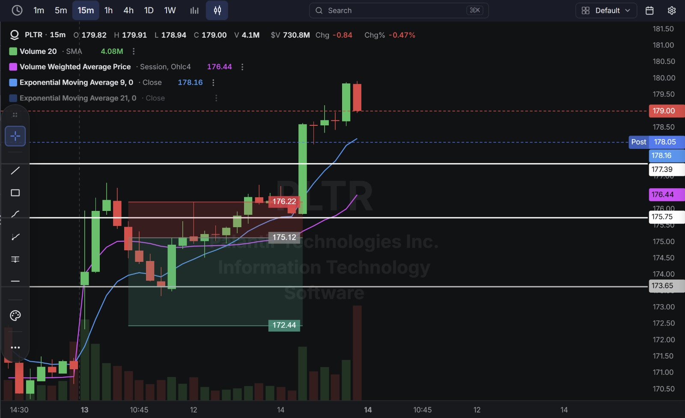
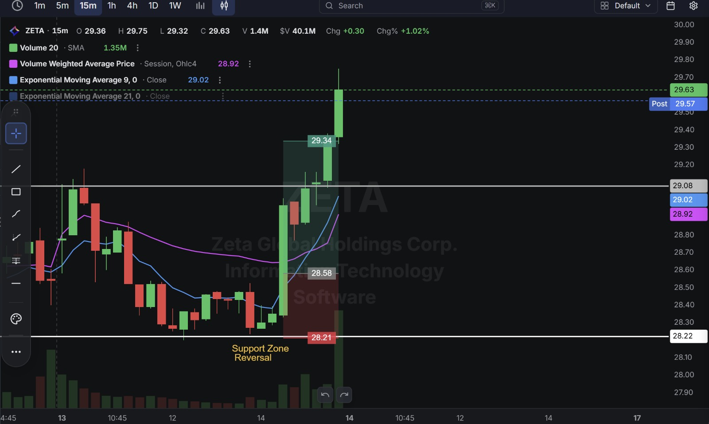
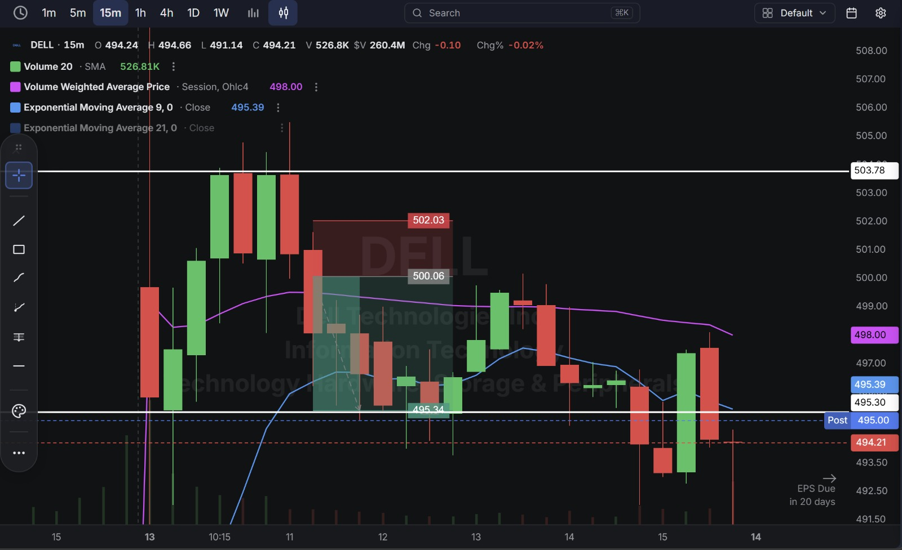
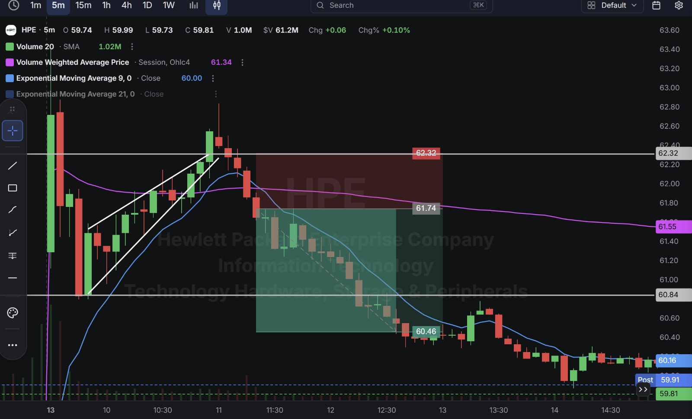
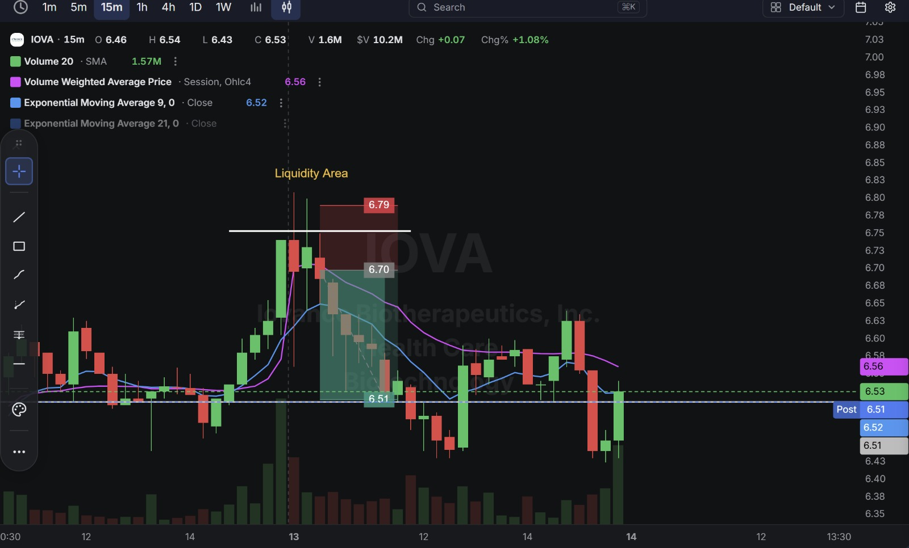

# Day 26 — US Market Analysis (13-08-2026)

**Work Format:** Pre-Market → Market Hours → After-Hours (IST evening-to-midnight coverage of the US session)

| Session      | IST Timing        | US Time (ET)      |
| ------------ | ----------------- | ----------------- |
| Pre-Market   | 5:00 PM – 7:00 PM | 7:30 AM – 9:30 AM |
| Market Hours | 7:00 PM – 1:30 AM | 9:30 AM – 4:00 PM |
| After Hours  | 1:30 AM – 2:30 AM | 4:00 PM – 5:00 PM |

---

## 1. Pre-Market Analysis (7:30 AM – 9:30 AM ET)

### The Screener ("CANSLIM 2" — Loosened Configuration)

| Group   | Logic | Conditions                                                                       |
| ------- | ----- | ----------------------------------------------------------------------------------- |
| Group 2 | ALL   | Pre Market Last > $5 · Pre Market Volume > 100,000                                  |
| Group 3 | ALL   | EPS Growth Latest Rptd Qtr (%) > 25.00% · Sales Growth Latest Rptd Qtr (%) > 25.00%  |

**Screener Screenshot:** 

**Result: 8 stocks.** Today's version drops the AS 1M institutional-accumulation filter and the multi-year EPS growth checks used on prior days, leaving just the core current-quarter earnings/sales acceleration plus a live pre-market gap — a looser screen that let in a higher-risk name (IOVA) than the stricter versions would have. **PLTR, ZETA, DELL, and HPE all carried over** from recent sessions; **IOVA (Iovance Biotherapeutics)** is new to this journal.

### Overnight/Morning Catalysts

- **PLTR (Palantir)** — No fresh news; still trading off the same multi-week momentum, today from the short side using the same SMC liquidity-sweep logic as Day 24's short.
- **ZETA (Zeta Global)** — No new catalyst; a technical support-zone reversal trade.
- **DELL (Dell Technologies)** — No new catalyst; continuing to digest the massive multi-day run from Days 24–25 (the stock has gone from the low $440s to nearly $500 in three sessions).
- **HPE (Hewlett Packard Enterprise)** — No new catalyst; a rising-wedge exhaustion pattern, the same setup type used on MDB back on Day 20.
- **IOVA (Iovance Biotherapeutics)** — The clearest fundamental story of the day, and a genuinely high-risk, high-reward biotech setup. Iovance reported Q2 2026 earnings on August 6: revenue of $99.3M, up 66% YoY, driven by its FDA-approved cell therapy Amtagvi (lifileucel) for metastatic melanoma. Shares jumped as much as 43% that day and hit a new 52-week high, with a wave of analyst price-target increases following (Barclays to $13, Citizens to $8, Baird to $6). The company is still deeply unprofitable (a net loss near $79M last quarter) but well-funded (over $313M in cash, very low debt), which is normal, expected territory for a commercial-launch-stage biotech rather than a red flag on its own.

---

## 2. Market Hours Observation (9:30 AM – 4:00 PM ET)

### PLTR — Extended Sideways Chop, Then a Sharp Breakout Higher

Spent a long stretch of the session consolidating in a tight range before a single powerful candle broke decisively higher, extending the move into the close.

### ZETA — Clean Reversal Off Support, Strong Follow-Through

Reversed cleanly at a marked support zone and extended higher through the rest of the session with minimal pullback.

### DELL — Decline From Highs Into a New Range

Pulled back from the top of its recent multi-day run, declining through the session into a lower consolidation range.

### HPE — Wedge Breakdown Into a Clean Descending Channel

Broke down out of a rising wedge and declined in an orderly channel for the rest of the session.

### IOVA — Sweep of a Liquidity Level, Reversal, Then Chop

Swept above a marked liquidity area before reversing down, then spent the remainder of the session chopping in a wide range near the target level.

---

## 3. After-Hours Analysis (4:00 PM – 5:00 PM ET)

Heading into the next session, the key open questions:

- Whether **PLTR's** breakout after such an extended consolidation marks a genuine new leg higher, or whether the multi-week run is finally getting stretched — worth watching closely given this is now the second time in a week PLTR has invalidated a short (Day 23's round-trip, now this).
- Whether **ZETA's** reversal off support holds into the next session.
- Whether **DELL's** pullback from its recent highs is healthy digestion after such a fast three-day run, or the start of a deeper correction.
- Whether **HPE's** wedge breakdown continues or finds support given the stock's own earnings are still weeks away.
- Whether **IOVA's** genuinely strong fundamental story (66% revenue growth, a real approved therapy) reasserts itself after today's choppy price action, keeping in mind the stock's very high realized volatility.

---

## 4. Trade Strategy — Actual Trades, Full CANSLIM + SMC Reasoning, and Results

> Four trades passed cleanly; one (PLTR) chopped sideways for an extended stretch before finally breaking hard through the stop — a genuine loss, distinct from the manual-close outcomes on Days 24–25.

### 🔴 PLTR — SHORT — ❌ **STOPPED OUT**

**Why I took this trade:** The same SMC liquidity-sweep logic used since Day 20 and again on Day 24's PLTR short — fading a level where resting orders were likely to cluster. **CANSLIM read:** unchanged elite fundamentals; this was a pure technical fade, not a bet against the stock's underlying story.

**How I planned the entry and exit:**
- **Entry (175.12):** short on the rejection within the day's range.
- **Stop Loss (176.22):** above that rejection — a 0.63% stop.
- **Target (172.44):** the next support level below.
- **Risk/Reward:** Risk $1.10 (0.63%) to make $2.68 (1.53%) → **RR of 2.44** as planned.

**Result:** Rather than resolving toward the target, price consolidated sideways for an extended stretch before a single powerful candle broke decisively above the stop, extending to a close of $179.00 — well past the stop level. Stopped out at **176.22**. Unlike Day 24/25's manual closes, this trade didn't get a chance to be closed early on a judgment call — the breakout came fast and clean once the range finally resolved, running straight through the stop. **This is the second time in under a week PLTR has invalidated a short-side read (the Day 23 round-trip, now this)**, worth weighting as real evidence that fading this specific name's momentum needs a wider berth than the SMC setup alone provides.

**Chart:** 

---

### 🟢 ZETA — LONG — ✅ **PASSED**

**Why I took this trade:** A clean technical reversal at a marked support zone, no fresh catalyst — the mirror image of the resistance-rejection shorts traded on other names throughout this journal.

**How I planned the entry and exit:**
- **Entry (28.58):** on the reversal candle at the marked support zone.
- **Stop Loss (28.21):** below that support — a 1.30% stop.
- **Target (29.34):** the next resistance level above.
- **Risk/Reward:** Risk $0.37 (1.30%) to make $0.76 (2.66%) → **RR of 2.05**.

**Result:** Price rallied through the target to a session high of $29.75, closing at **29.63**. Target hit comfortably.

**Chart:** 

---

### 🔴 DELL — SHORT — ✅ **PASSED**

**Why I took this trade:** Same "fade the extension, not the fundamentals" logic used throughout this journal — after a three-session run from the low $440s to nearly $500, a pullback was the higher-probability short-term read, independent of the still-intact AI-infrastructure growth story.

**How I planned the entry and exit:**
- **Entry (500.06):** short on the rejection near the top of the recent run.
- **Stop Loss (502.03):** above that rejection — a 0.39% stop.
- **Target (495.34):** the next support level below.
- **Risk/Reward:** Risk $1.97 (0.39%) to make $4.72 (0.94%) → **RR of 2.40**.

**Result:** Price declined through the target, closing the session at **494.21** — below target. Target hit.

**Chart:**

---

### 🔴 HPE — SHORT — ✅ **PASSED**

**Why I took this trade:** A rising-wedge breakdown, the same technical pattern used on MDB back on Day 20 — narrowing higher-highs/higher-lows compression breaking down, independent of any fresh fundamental catalyst.

**How I planned the entry and exit:**
- **Entry (61.74):** short on the wedge breakdown.
- **Stop Loss (62.32):** above the wedge high — a 0.94% stop.
- **Target (60.46):** the next support level below.
- **Risk/Reward:** Risk $0.58 (0.94%) to make $1.28 (2.07%) → **RR of 2.21**.

**Result:** Price declined in an orderly channel through the target, continuing lower to close at **59.81** (post-market $59.91) — well below target. Target hit and exceeded.

**Chart:** 

---

### 🔴 IOVA — SHORT — ✅ **PASSED**

**Why I took this trade:** **C:** genuinely explosive — 66% YoY revenue growth on real product sales (Amtagvi), not just a pipeline promise. **N:** a real, FDA-approved therapy with a fresh commercial launch story and a wave of analyst target increases following the print. This trade used the same **SMC "Liquidity Area" sweep-and-reverse** setup as PLTR (Day 24) and DDOG (Day 20) — price swept above a marked liquidity level before reversing, and the trade faded that sweep rather than betting against the underlying growth story. **Important caveat, stated plainly:** IOVA is still deeply unprofitable and trades with very high realized volatility typical of a commercial-launch-stage biotech — this trade was sized with a wider percentage stop (1.34%) than the other names today to reflect that added risk.

**How I planned the entry and exit:**
- **Entry (6.70):** short on the reversal immediately after the liquidity sweep failed to hold.
- **Stop Loss (6.79):** at the swept high — a 1.34% stop.
- **Target (6.51):** the next support level below.
- **Risk/Reward:** Risk $0.09 (1.34%) to make $0.19 (2.84%) → **RR of 2.11**.

**Result:** Price declined toward the target before chopping in a wide range for the rest of the session, closing right at the target level ($6.53, post-market $6.51). Target hit.

**Chart:** 

---

## 5. Trade Result Summary

| # | Stock | Setup Type                                                | Side  | CANSLIM Read                                                                | Result         |
| --- | ----- | -------------------------------------------------------------- | ----- | ----------------------------------------------------------------------------- | -------------- |
| 1 | PLTR  | Fade an SMC liquidity sweep                                     | Short | Elite fundamentals unchanged; second consecutive short invalidated on this name | ❌ Stopped out |
| 2 | ZETA  | Buy a reversal off a marked support zone                        | Long  | No fresh catalyst; pure technical reversal                                    | ✅ Passed      |
| 3 | DELL  | Short the extension after a 3-day, ~$60 run                     | Short | Excellent C/A/N; fade targeted the extension, not the fundamentals            | ✅ Passed      |
| 4 | HPE   | Short a rising-wedge breakdown                                   | Short | No fresh catalyst; pure technical exhaustion pattern                          | ✅ Passed      |
| 5 | IOVA  | Fade an SMC liquidity sweep on a high-volatility biotech          | Short | Explosive 66% revenue growth; wider stop sized for elevated volatility        | ✅ Passed      |

**Score: 4 for 5.**

### Normalized Results — $100 Total Capital Per Trade

| # | Stock     | Capital           | Entry → Result           | % Move  | Result         | P&L        |
| --- | --------- | ------------------ | ----------------------------- | ------- | -------------- | ---------- |
| 1 | PLTR      | $100               | 175.12 → 176.22 (stop)        | -0.63%  | ❌ Stopped out  | **-$0.63** |
| 2 | ZETA      | $100               | 28.58 → 29.34 (target)        | 2.66%   | ✅ Target hit   | **+$2.66** |
| 3 | DELL      | $100               | 500.06 → 495.34 (target)      | 0.94%   | ✅ Target hit   | **+$0.94** |
| 4 | HPE       | $100               | 61.74 → 60.46 (target)        | 2.07%   | ✅ Target hit   | **+$2.07** |
| 5 | IOVA      | $100               | 6.70 → 6.51 (target)          | 2.84%   | ✅ Target hit   | **+$2.84** |
| — | **Total** | **$500 deployed**  | —                                | —       | **4W / 1L**     | **+$7.88** |

**On $500 total capital deployed across the five trades, the day returned $7.88 in profit — roughly 1.58% on capital deployed.** The single loss (PLTR) cost the least of the five trades, consistent with this journal's usual pattern of sizing the more uncertain read the tightest.

---

## Key Takeaways From Day 26

1. **PLTR's stop-out is a different failure mode than this journal's recent manual-close trades, and worth keeping distinct.** DELL (Day 24) and MRVL (Day 25) chopped without resolving and were closed by choice; PLTR chopped and then resolved decisively *against* the position, running straight through the stop with no opportunity to exit early on judgment. The lesson isn't "avoid PLTR shorts" — it's "size PLTR shorts specifically for the possibility of a fast, clean breakout," given this is now two failed short attempts on the same name inside a week.
2. **IOVA is a strong test case for trading a genuinely volatile, high-growth biotech with the same SMC framework used on large-cap tech names** — the wider percentage stop (1.34% vs. the typical 0.4–1.0% range) was the key adjustment that made the setup appropriate for the name's realized volatility, and it worked.
3. **HPE's rising-wedge short is now the second time this exact pattern (first used on MDB, Day 20) has produced a clean winning trade**, suggesting it's a genuinely repeatable setup worth continuing to watch for across the screener's results, independent of any single stock's fundamental story.
4. **Today's loosened screener (dropping the institutional-accumulation and multi-year growth filters) let in IOVA — a name the stricter version likely would have excluded given its lack of profitability** — and that trade still worked, appropriately sized for the added risk. Worth treating the looser screen as viable specifically when paired with wider, risk-adjusted stops rather than standard sizing.
5. **Next Pre-Market session:** watch whether PLTR's breakout has real follow-through given how it invalidated two separate short attempts this week, and keep tracking DELL and HPE for whether today's pullbacks are healthy digestion or the start of deeper corrections after their recent runs.
