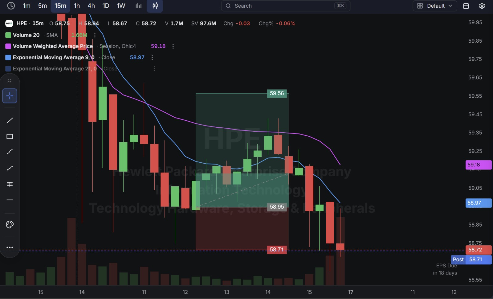
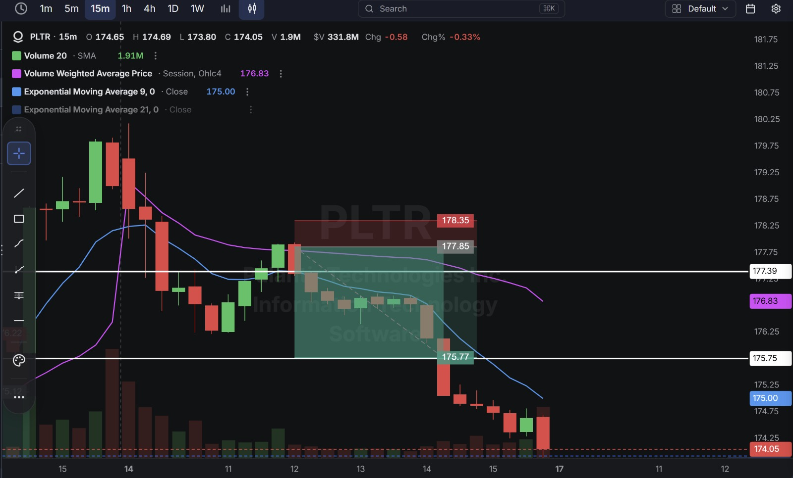
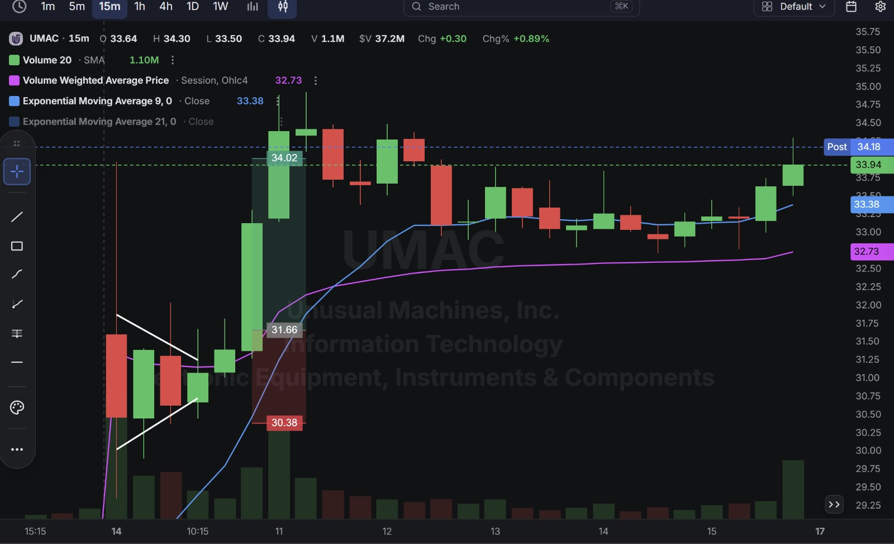
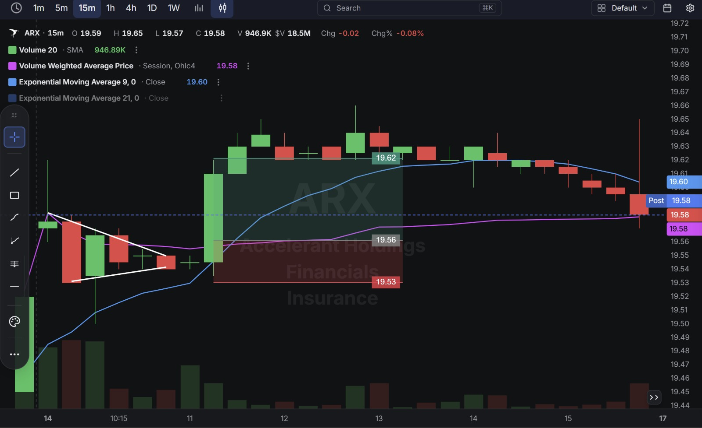

# Day 27 — US Market Analysis (14-08-2026)

**Work Format:** Pre-Market → Market Hours → After-Hours (IST evening-to-midnight coverage of the US session)

| Session      | IST Timing        | US Time (ET)      |
| ------------ | ----------------- | ----------------- |
| Pre-Market   | 5:00 PM – 7:00 PM | 7:30 AM – 9:30 AM |
| Market Hours | 7:00 PM – 1:30 AM | 9:30 AM – 4:00 PM |
| After Hours  | 1:30 AM – 2:30 AM | 4:00 PM – 5:00 PM |

> **The day's recurring technical concept: the Ascending Triangle.** Three of today's four charts (HPE, UMAC, ARX) show the same hand-drawn pattern — a flat resistance line capping a series of rising higher-lows, converging toward a breakout point. It's a classic bullish continuation pattern: each pullback fails to make a new low, showing buyers stepping in earlier and earlier, until supply at the flat top gets absorbed and price breaks through.

---

## 1. Pre-Market Analysis (7:30 AM – 9:30 AM ET)

### The Screener ("CANSLIM 2" — Full Configuration)

| Group   | Logic | Conditions                                                                                             |
| ------- | ----- | --------------------------------------------------------------------------------------------------------- |
| Group 1 | ALL   | Dollar Volume > $20M · AS 3M > 85 · Include Type: Stocks                                                   |
| Group 2 | ALL   | Pre Market Last > $5 · Pre Market Volume > 100,000                                                         |
| Group 3 | ALL   | EPS Growth Latest Rptd Qtr (%) > 25.00% · Sales Growth Latest Rptd Qtr (%) > 25.00% · AS 1M > 95            |

**Screener Screenshot:** 

**PLTR and HPE both carried over** from Day 26; **UMAC (Unusual Machines)** and **ARX (Accelerant Holdings)** are new to this journal.

### Overnight/Morning Catalysts

- **HPE (Hewlett Packard Enterprise)** — No new catalyst; earnings now 18 days out. Continuing to work through the same consolidation zone as recent sessions.
- **PLTR (Palantir)** — No fresh news; today's short used a straightforward resistance-rejection setup rather than the SMC liquidity-sweep framing used on Days 20, 24, and 26.
- **UMAC (Unusual Machines)** — A genuinely explosive fundamental story. Unusual Machines, a maker of NDAA-compliant drone components, reported Q2 FY2026 revenue of $16.7M against a $9.19M consensus — an 82% beat and **687% YoY growth** — on August 6, driven by enterprise demand and a policy tailwind from the Pentagon's "Drone Dominance" initiative (a $53.6B FY2027 budget request, with $39.2B earmarked for autonomous-systems procurement). The stock is up over 100% year-to-date, with Maxim raising its price target to $30 and the average 12-month analyst target sitting at $37.75. The entire NDAA-compliant drone sector has been moving together on the same policy tailwind.
- **ARX (Accelerant Holdings)** — Cleared the earnings/sales growth screen but showed no notable news catalyst on the day; it traded as one of the quietest, lowest-volatility names in this journal's history.

---

## 2. Market Hours Observation (9:30 AM – 4:00 PM ET)

### HPE — Ascending Triangle Breakout Attempt, Late Fade

Built a classic ascending triangle (flat resistance, rising higher-lows) before breaking out modestly, then faded back down through the session into the close.

### PLTR — Clean Rejection and Sustained Decline

Rejected at a marked resistance level and declined steadily through the rest of the session with minimal bounce.

### UMAC — Powerful Breakout From an Ascending Triangle

Broke out decisively from the same triangle pattern, extending well past the marked target before stabilizing near the highs into the close.

### ARX — Extremely Tight, Flat Range All Session

Traded in one of the narrowest ranges seen in this journal — barely a few cents wide for the entire session, with a small ascending-triangle pattern that never resolved into a real move either way.

---

## 3. After-Hours Analysis (4:00 PM – 5:00 PM ET)

Heading into the next session, the key open questions:

- Whether **HPE's** failed triangle breakout is a warning sign for the stock's broader consolidation, or just one more false start within a range it's been stuck in for over a week.
- Whether **PLTR's** clean rejection today (after two failed shorts on Days 23 and 26) restores confidence in fading this name technically, or was simply a different, cleaner setup than the prior attempts.
- Whether **UMAC and the broader NDAA-compliant drone sector** can extend this policy-driven rally, given the sector is moving as a group on the same catalyst (UMAC, Red Cat, Kratos, AeroVironment, Ondas all citing similar tailwinds).
- Whether **ARX** ever breaks out of its unusually tight range, or continues trading like one of the quietest names on the screener.

---

## 4. Trade Strategy — Actual Trades, Full CANSLIM + Technical Reasoning, and Results

> Three clean passes and one trade that never left its extremely tight range.

### 🟢 HPE — LONG — ✅ **PASSED**

**Concept used:** **Ascending Triangle breakout** — a flat resistance ceiling with a series of rising higher-lows underneath, betting that the compression resolves upward as supply at the flat top gets absorbed.

**Why I took this trade:** No fresh fundamental catalyst; this was a pure technical continuation buy on the triangle pattern, unrelated to any specific news.

**How I planned the entry and exit:**
- **Entry (58.95):** on the breakout above the triangle's rising trendline.
- **Stop Loss (58.71):** below that trendline — a tight 0.41% stop.
- **Target (59.56):** the triangle's projected breakout target.
- **Risk/Reward:** Risk $0.24 (0.41%) to make $0.61 (1.04%) → **RR of 2.54**.

**Result:** Price tagged the target during the breakout attempt before fading back down through the session to close at **58.72**, essentially flat on the day. Target hit before the later fade.

**Chart:** 

---

### 🔴 PLTR — SHORT — ✅ **PASSED**

**Concept used:** **Resistance rejection** — a simpler, more direct cousin of the SMC liquidity-sweep setups used on Days 20, 24, and 26: price tests a marked level, fails to hold, and reverses.

**Why I took this trade:** No fresh news; the CANSLIM fundamentals remain unchanged and strong, so this was purely a technical fade, marking the third short attempt on PLTR in this journal after Day 23's round-trip and Day 26's stop-out.

**How I planned the entry and exit:**
- **Entry (177.85):** short on the rejection at the marked resistance level.
- **Stop Loss (178.35):** above that rejection — a tight 0.28% stop.
- **Target (175.77):** the next support level below.
- **Risk/Reward:** Risk $0.50 (0.28%) to make $2.08 (1.17%) → **RR of 4.16** — the best risk/reward of the day.

**Result:** Price declined steadily through the target, continuing lower to close at **174.05** — well below target. Target hit and exceeded. **This is the cleanest of the three PLTR short attempts in this journal**, working exactly as planned without the round-trip or stop-out seen previously.

**Chart:**

---

### 🟢 UMAC — LONG — ✅ **PASSED**

**Concept used:** The same **Ascending Triangle breakout** pattern as HPE, visible directly on the chart via the hand-drawn converging trendlines.

**Why I took this trade:** **C:** an extraordinary 687% YoY revenue beat, crushing consensus by 82%. **A:** the company is guiding toward $250M in annual revenue by 2027, implying continued acceleration. **N:** a genuine, fresh policy tailwind — the Pentagon's "Drone Dominance" program — rather than just company-specific news, with the entire NDAA-compliant drone sector moving together. **L:** UMAC is one of the more prominent domestic drone-component suppliers benefiting from this policy shift. **S:** the stock broke above its 50-day moving average on August 3 and has stayed in an uptrend since, with real volume behind the move. This trade combined a strong CANSLIM profile with a clean, textbook chart pattern — the kind of setup where the fundamentals and the technicals are telling the same story.

**How I planned the entry and exit:**
- **Entry (31.66):** on the triangle breakout, buying strength in line with both the pattern and the underlying catalyst.
- **Stop Loss (30.38):** below the triangle's rising trendline — a 4.04% stop, wider than most trades in this journal given the stock's small-cap volatility.
- **Target (34.02):** the triangle's projected breakout target.
- **Risk/Reward:** Risk $1.28 (4.04%) to make $2.36 (7.45%) → **RR of 1.84**.

**Result:** Price broke out powerfully, reaching a session high of $34.30 — above target — before stabilizing to close at **33.94** (post-market $34.18). Target hit comfortably, the largest dollar move of the day.

**Chart:** 

---

### ⚪ ARX — LONG — ⚪ **MOVING SIDEWAYS (no resolution)**

**Concept used:** A very small **Ascending Triangle breakout** attempt, the same pattern family as HPE and UMAC, but on a much lower-volatility name.

**Why I took this trade:** ARX cleared the earnings/sales growth screen, but showed no specific catalyst on the day — this was a technical continuation trade on the small triangle pattern forming on the chart.

**How I planned the entry and exit:**
- **Entry (19.56):** on the attempted breakout above the triangle's resistance.
- **Stop Loss (19.53):** just below entry — an extremely tight 0.15% stop, reflecting the stock's very low volatility.
- **Target (19.62):** the triangle's projected breakout target, just $0.06 away.
- **Risk/Reward:** Risk $0.03 (0.15%) to make $0.06 (0.31%) → **RR of 2.00** as planned.

**Result:** Price never resolved in either direction, trading in an extraordinarily narrow band for the entire remaining session — one of the flattest, lowest-volatility ranges recorded in this journal. Neither the target nor the stop was meaningfully threatened. The position was left essentially unchanged, closing near **$19.58** — a negligible move either way. This is a genuinely different case from Day 24/25's manual closes (which came after real, wide chop) — ARX simply never had enough volatility for the setup to play out at all.

**Chart:** 

---

## 5. Trade Result Summary

| # | Stock | Setup Type                                              | Side  | CANSLIM Read                                                              | Result                    |
| --- | ----- | -------------------------------------------------------- | ----- | ------------------------------------------------------------------------- | -------------------------- |
| 1 | HPE   | Ascending triangle breakout                                | Long  | No fresh catalyst; pure technical continuation                            | ✅ Passed                  |
| 2 | PLTR  | Resistance rejection fade                                  | Short | Elite fundamentals unchanged; 3rd short attempt, first clean pass          | ✅ Passed                  |
| 3 | UMAC  | Ascending triangle breakout on a policy-driven mover        | Long  | Explosive C/A/N (687% growth, Drone Dominance tailwind); pattern + fundamentals aligned | ✅ Passed                  |
| 4 | ARX   | Small ascending triangle on a very low-volatility name       | Long  | Cleared growth screen; no catalyst; range too tight to resolve            | ⚪ Sideways, no resolution |

**Score: 3 passed, 1 never resolved (flat).**

### Normalized Results — $100 Total Capital Per Trade

| # | Stock     | Capital           | Entry → Result           | % Move  | Result             | P&L        |
| --- | --------- | ------------------ | ----------------------------- | ------- | ------------------- | ---------- |
| 1 | HPE       | $100               | 58.95 → 59.56 (target)        | 1.04%   | ✅ Target hit        | **+$1.04** |
| 2 | PLTR      | $100               | 177.85 → 175.77 (target)      | 1.17%   | ✅ Target hit        | **+$1.17** |
| 3 | UMAC      | $100               | 31.66 → 34.02 (target)        | 7.45%   | ✅ Target hit        | **+$7.45** |
| 4 | ARX       | $100               | 19.56 → 19.58 (flat)          | 0.10%   | ⚪ Flat, negligible   | **+$0.10** |
| — | **Total** | **$400 deployed**  | —                                | —       | **3 clean, 1 flat**  | **+$9.76** |

**On $400 total capital deployed, the day returned $9.76 in profit — roughly 2.44% on capital deployed**, driven almost entirely by UMAC's outsized policy-driven move.

---

## Key Takeaways From Day 27

1. **The Ascending Triangle is now a formally repeatable pattern in this journal**, having produced a clean win on UMAC and a target-then-fade on HPE, alongside the earlier rising-wedge (its bearish cousin) working on MDB and HPE's own short on Day 26. Worth explicitly screening for this pattern shape going forward, independent of which stock it appears on.
2. **PLTR's third short attempt finally landing cleanly, after a round-trip (Day 23) and a stop-out (Day 26), is a good reminder that repeated attempts on the same name aren't wasted even when earlier ones fail** — as long as each one is judged on its own setup quality rather than treated as "PLTR shorts don't work" after two losses.
3. **UMAC is this journal's best example yet of a small-cap CANSLIM name where the chart pattern and the fundamental catalyst told the exact same story** — a genuine 687% growth number, a real policy tailwind shared across an entire sector, and a textbook ascending triangle all pointing the same direction, appropriately sized with a wider stop given the added small-cap volatility.
4. **ARX is a useful new category to name explicitly: a trade that clears every screener condition but simply never generates enough volatility to test the setup.** This isn't a process failure or a missed read — some names, especially lower-float or lower-interest names, just won't move enough in a session to produce a real signal either way.
5. **Next Pre-Market session:** watch whether the broader NDAA-compliant drone sector (UMAC, Red Cat, Kratos, AeroVironment, Ondas) continues its policy-driven rally as a group, and keep watching for more ascending-triangle setups across the screener's results now that the pattern has proven itself twice.
