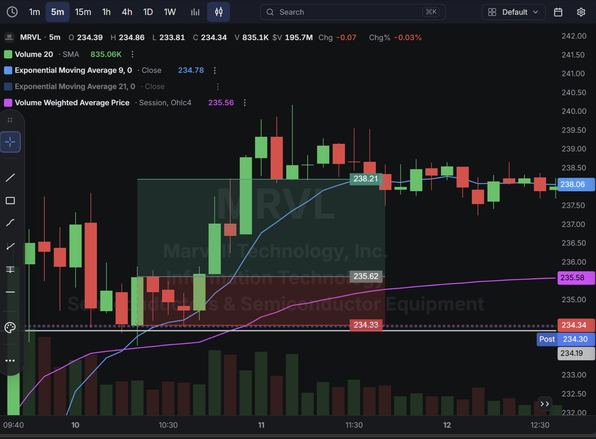
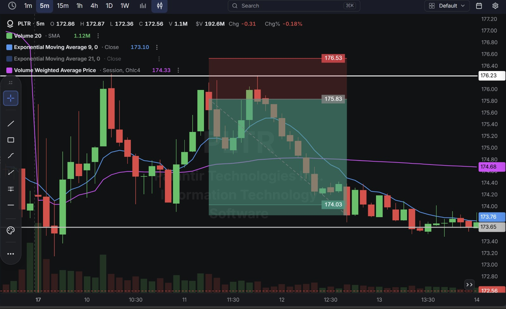
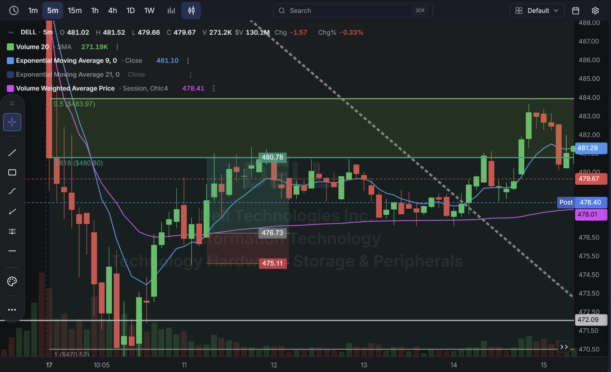
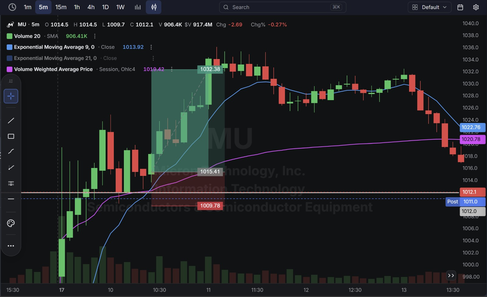

# Day 28 — US Market Analysis (17-08-2026)

**Work Format:** Pre-Market → Market Hours → After-Hours (IST evening-to-midnight coverage of the US session)

| Session      | IST Timing        | US Time (ET)      |
| ------------ | ----------------- | ----------------- |
| Pre-Market   | 5:00 PM – 7:00 PM | 7:30 AM – 9:30 AM |
| Market Hours | 7:00 PM – 1:30 AM | 9:30 AM – 4:00 PM |
| After Hours  | 1:30 AM – 2:30 AM | 4:00 PM – 5:00 PM |

> **New concept today: the 9 EMA / VWAP Crossover.** Every trade this session was planned around the same trigger — the 9-period EMA crossing the session's VWAP (and price confirming that cross), rather than a chart pattern (triangle, wedge) or an SMC liquidity concept. It's a momentum-confirmation setup: when the fast-moving average crosses the volume-weighted "fair value" line, it signals that short-term buying or selling pressure has genuinely shifted, not just drifted.

---

## 1. Pre-Market Analysis (7:30 AM – 9:30 AM ET)

### The Screener ("CANSLIM 2" — Full Configuration)

| Group   | Logic | Conditions                                                                                             |
| ------- | ----- | --------------------------------------------------------------------------------------------------------- |
| Group 1 | ALL   | Dollar Volume > $20M · AS 3M > 85 · Include Type: Stocks                                                   |
| Group 2 | ALL   | Pre Market Last > $5 · Pre Market Volume > 100,000                                                         |
| Group 3 | ALL   | EPS Growth Latest Rptd Qtr (%) > 25.00% · Sales Growth Latest Rptd Qtr (%) > 25.00% · AS 1M > 95            |

**Screener Screenshot:** 

**PLTR carried over** from recent sessions; **MRVL** returns for the first time since Day 25; **DELL** continues its multi-week presence in this journal; **MU (Micron)** is new to this journal, and is easily the standout name of the day.

### Overnight/Morning Catalysts

- **MRVL (Marvell Technology)** — No new same-day catalyst; still working through the AI-memory-platform strength from Day 25.
- **PLTR (Palantir)** — No fresh news; continuing to consolidate off its multi-week run.
- **DELL (Dell Technologies)** — No new catalyst; continuing to trade around its recent post-earnings, post-downgrade range.
- **MU (Micron)** — The clear headline story of the day, and one of the strongest single-name catalysts in this journal. Shares crossed the psychologically important **$1,000 level** in pre-market trading — the first time since July 6 — after a brutal 25% pullback through July 29 on overvaluation fears, followed by a 36% rally off those lows. The renewed strength came from a wave of aggressive price-target hikes: **New Street Research upgraded MU to Buy with a $1,250 target** (up from $470), and **UBS reiterated Buy with a $1,625 target** against a then-current price near $879 — both citing tight HBM (high-bandwidth memory) supply and AI-driven data-center demand that management says will stay "very tight" beyond 2027. Soros Capital Management made MU its largest holding as of June 30, and strength in South Korean chip stocks (Samsung, SK Hynix) added an overnight tailwind. The stock is up roughly 240% year-to-date.

---

## 2. Market Hours Observation (9:30 AM – 4:00 PM ET)

### MRVL — Breakout Above VWAP, Extension, Late Chop

Crossed above VWAP and the 9 EMA early, extended sharply higher, then spent the rest of the session giving back part of the move in a tighter range.

### PLTR — Breakdown Below VWAP, Sustained Decline

Crossed below both the 9 EMA and VWAP early and declined steadily through the rest of the session with minimal bounce.

### DELL — Volatile Open, VWAP Reclaim, Extension Into the Close

After a volatile opening swing, reclaimed VWAP and the 9 EMA, then extended higher into the final hour of the session.

### MU — Explosive Cross Above $1,000, Sharp Pullback From Highs

Rallied hard through the $1,000 level and well beyond on the price-target news, then gave back a large portion of the move in a steady decline through the back half of the session — though the stock still finished the day meaningfully higher than where it started.

---

## 3. After-Hours Analysis (4:00 PM – 5:00 PM ET)

Heading into the next session, the key open questions:

- Whether **MRVL's** late-session give-back is normal profit-taking or the start of a deeper pullback.
- Whether **PLTR's** clean breakdown continues, now that a 9 EMA/VWAP cross has confirmed the same bearish read that worked on Day 27.
- Whether **DELL** can extend the late-session strength into a genuine new leg higher.
- Whether **MU's** pullback from its highs is simply digestion of an enormous single-day move (crossing $1,000 for the first time in over a month, on some of the most aggressive price-target hikes seen in this journal), or the first sign that the rally got ahead of itself in the very short term — keeping in mind the stock is still up meaningfully on the day even after the pullback.

---

## 4. Trade Strategy — Actual Trades, Full CANSLIM + Technical Reasoning, and Results

> **Concept used across all four trades: 9 EMA / VWAP Crossover.** Long entries were taken when the 9 EMA crossed above VWAP (or price reclaimed both after dipping below), signaling short-term buying pressure taking control; short entries were taken on the mirror-image bearish cross. Three trades passed cleanly; one (MU) was stopped out during a sharp mid-session shakeout despite the stock's excellent underlying story.

### 🟢 MRVL — LONG — ✅ **PASSED**

**Why I took this trade:** The 9 EMA crossed above VWAP early in the session, confirming that short-term momentum had flipped positive after the prior lower-range chop. No fresh company-specific catalyst today; this was a pure continuation of the AI-memory-platform strength that drove MRVL's 14% spike back on Day 25.

**How I planned the entry and exit:**
- **Entry (235.62):** on confirmation of the 9 EMA/VWAP crossover, buying the reclaim above both lines.
- **Stop Loss (234.33):** below the crossover zone — a 0.55% stop.
- **Target (238.21):** the next resistance extension above.
- **Risk/Reward:** Risk $1.29 (0.55%) to make $2.59 (1.10%) → **RR of 2.01**.

**Result:** Price extended well past the target before giving back the move into the close, ending at **234.34** (post-market $234.30) — essentially back near the entry zone. The target itself, however, was tagged during the extension. Target hit.

**Chart:** 

---

### 🔴 PLTR — SHORT — ✅ **PASSED**

**Why I took this trade:** The mirror-image bearish 9 EMA/VWAP crossover — the 9 EMA crossed below VWAP early, confirming a genuine shift to selling pressure rather than a random dip. No fresh news; the CANSLIM fundamentals remain unchanged, so this was purely a technical, momentum-confirmed short.

**How I planned the entry and exit:**
- **Entry (175.83):** short on confirmation of the bearish crossover.
- **Stop Loss (176.53):** above the crossover zone — a 0.40% stop.
- **Target (174.03):** the next support level below.
- **Risk/Reward:** Risk $0.70 (0.40%) to make $1.80 (1.02%) → **RR of 2.57**.

**Result:** Price declined steadily through the target, closing the session at **172.56** — well below target. Target hit and exceeded.

**Chart:** 

---

### 🟢 DELL — LONG — ✅ **PASSED**

**Why I took this trade:** A bullish 9 EMA/VWAP crossover following an early volatile swing — price reclaimed both lines, confirming the dip had been bought rather than continuing to break down. No fresh catalyst; this was a technical continuation trade within DELL's broader ongoing range.

**How I planned the entry and exit:**
- **Entry (476.73):** on confirmation of the crossover reclaim.
- **Stop Loss (475.11):** below that reclaim zone — a 0.34% stop.
- **Target (480.78):** the next resistance level above, near the 0.618 Fibonacci retracement of the prior swing.
- **Risk/Reward:** Risk $1.62 (0.34%) to make $4.05 (0.85%) → **RR of 2.50**.

**Result:** Price extended well past the target into the final hour, reaching into the $483–484 area, before pulling back to close at **479.67** (post-market $478.40). Target hit comfortably.

**Chart:** 

---

### 🟢 MU — LONG — ❌ **STOPPED OUT**

**Why I took this trade:** About as strong a fundamental backdrop as any trade in this journal. **C/A:** management describes current business performance as "exceptional," with memory conditions expected to stay "very tight" beyond 2027. **N:** a genuine, fresh catalyst — the stock crossing $1,000 for the first time in over a month, paired with dramatic price-target increases from New Street ($1,250) and UBS ($1,625). **L:** Micron is a core AI-infrastructure memory supplier, benefiting from the same HBM scarcity story driving the entire sector. **I:** Soros Capital Management holding MU as its single largest position is about as strong an institutional-sponsorship signal as this journal has seen. The 9 EMA/VWAP crossover confirmed the momentum shift as price broke through $1,000 and kept climbing.

**How I planned the entry and exit:**
- **Entry (1015.41):** on confirmation of the crossover during the push through and above $1,000.
- **Stop Loss (1009.78):** below the crossover zone and the $1,010 level — a 0.55% stop.
- **Target (1032.38):** the next resistance extension above.
- **Risk/Reward:** Risk $5.63 (0.55%) to make $16.97 (1.67%) → **RR of 3.01**.

**Result:** Price pushed toward the target during the morning extension but reversed before fully confirming it, and a sharp mid-session shakeout drove the low down to **1009.7** — just below the stop — triggering an exit at **1009.78**. **Worth noting explicitly:** despite the stop-out, MU finished the broader session meaningfully higher on the day overall, underscoring that even an excellent fundamental story with a confirmed momentum crossover can still produce a shakeout that clears out an individual trade before the larger move plays out. This is the same "right read, wrong specific entry timing" pattern seen with MDB (Day 21) and HPE (Day 23) — the stock's story was intact; this particular trade wasn't.

**Chart:** 

---

## 5. Trade Result Summary

| # | Stock | Setup Type                                       | Side  | CANSLIM Read                                                                     | Result         |
| --- | ----- | ------------------------------------------------- | ----- | ------------------------------------------------------------------------------------ | -------------- |
| 1 | MRVL  | Bullish 9 EMA/VWAP crossover, continuation buy      | Long  | No fresh catalyst; continuing prior AI-memory-platform strength                      | ✅ Passed      |
| 2 | PLTR  | Bearish 9 EMA/VWAP crossover                        | Short | Elite fundamentals unchanged; pure momentum-confirmed technical short                | ✅ Passed      |
| 3 | DELL  | Bullish 9 EMA/VWAP crossover after a volatile open   | Long  | No fresh catalyst; technical continuation within an ongoing range                    | ✅ Passed      |
| 4 | MU    | Bullish 9 EMA/VWAP crossover through the $1,000 level | Long  | Outstanding C/A/N/L/I; excellent story, but the specific entry got shaken out       | ❌ Stopped out |

**Score: 3 for 4.**

### Normalized Results — $100 Total Capital Per Trade

| # | Stock     | Capital           | Entry → Result             | % Move  | Result         | P&L        |
| --- | --------- | ------------------ | -------------------------------- | ------- | -------------- | ---------- |
| 1 | MRVL      | $100               | 235.62 → 238.21 (target)         | 1.10%   | ✅ Target hit   | **+$1.10** |
| 2 | PLTR      | $100               | 175.83 → 174.03 (target)         | 1.02%   | ✅ Target hit   | **+$1.02** |
| 3 | DELL      | $100               | 476.73 → 480.78 (target)         | 0.85%   | ✅ Target hit   | **+$0.85** |
| 4 | MU        | $100               | 1015.41 → 1009.78 (stop)         | -0.55%  | ❌ Stopped out  | **-$0.55** |
| — | **Total** | **$400 deployed**  | —                                   | —       | **3W / 1L**     | **+$2.42** |

**On $400 total capital deployed, the day returned $2.42 in profit — roughly 0.61% on capital deployed** — the smallest daily return recorded in this journal so far, driven by tighter percentage targets across all four trades relative to prior sessions.

---

## Key Takeaways From Day 28

1. **The 9 EMA/VWAP crossover proved to be a clean, consistent trigger across four very different stocks** — two longs, one short, all confirmed the same way. Worth continuing to track as a standalone entry-timing tool alongside the chart-pattern (triangle/wedge) and SMC (liquidity-sweep) concepts already established in this journal.
2. **MU is the clearest example yet of separating "is this a good stock" from "was this a well-timed entry."** Every fundamental and institutional signal was pointing the same direction — and still, the specific entry got caught in a shakeout before the larger move (the stock finishing the day well higher) played out. The stop-out doesn't call the read into question; it confirms why tight, disciplined stops matter even on the highest-conviction names.
3. **PLTR's bearish crossover working cleanly continues the trend from Day 27's clean resistance-rejection short** — after Day 23's round-trip and Day 26's stop-out, this is now two consecutive successful short attempts on the same name, suggesting the more precise, momentum-confirmed triggers (crossover, clean rejection) are outperforming the earlier, looser liquidity-sweep timing on this specific stock.
4. **Today's smaller overall percentage moves (all four trades under 1.1%) reflect the crossover setup's nature** — it's a faster-confirming, tighter-target trigger than a chart-pattern breakout, trading off some of the larger reward potential (like Day 27's UMAC or Day 19's BLZE) for cleaner, more frequent confirmation.
5. **Next Pre-Market session:** watch whether MU's bigger picture (crossing back above $1,000 on major institutional and analyst conviction) continues to build, and keep testing the 9 EMA/VWAP crossover concept across the next batch of screener results to see how it performs over a larger sample.
