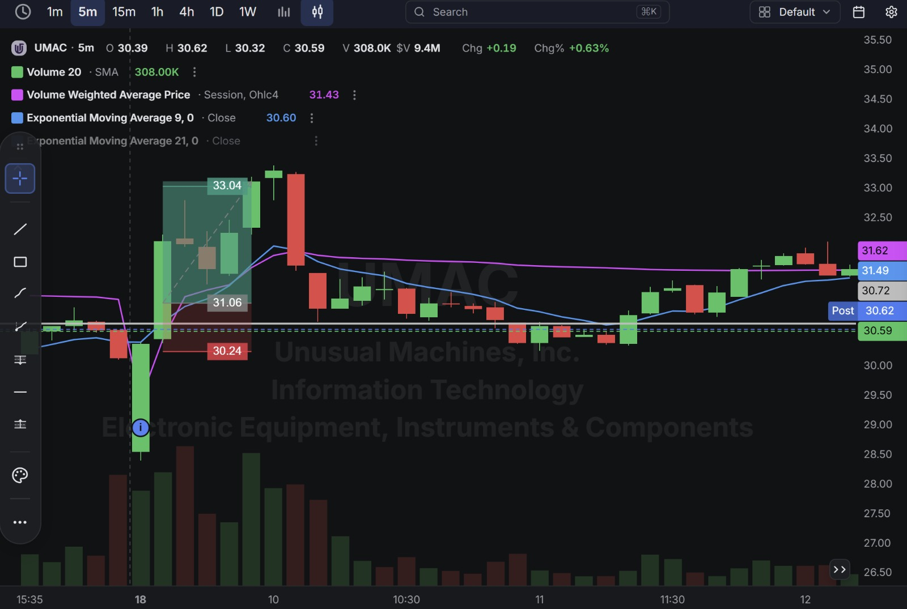
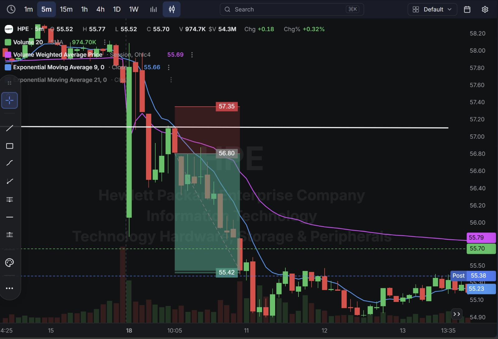
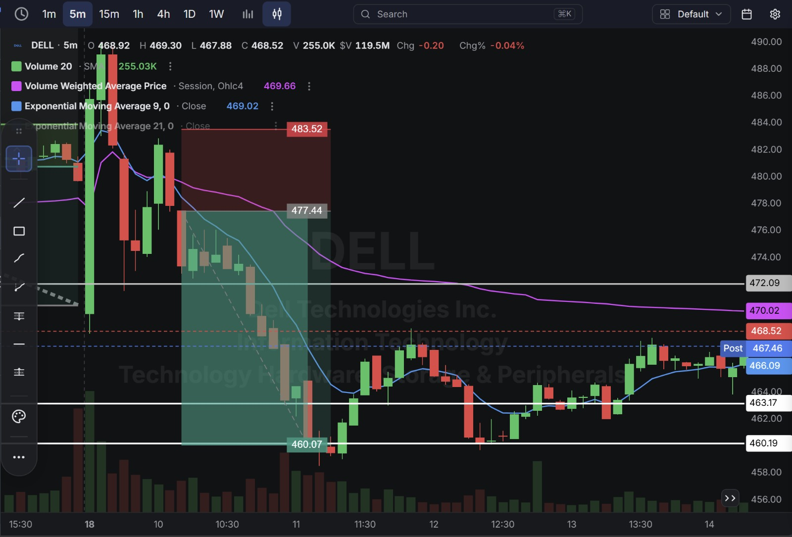
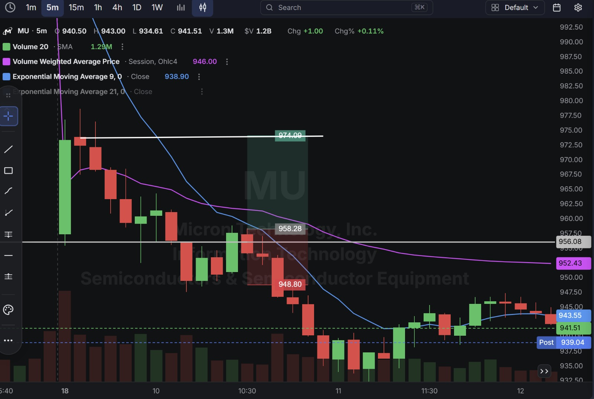

# Day 29 — US Market Analysis (18-08-2026)

**Work Format:** Pre-Market → Market Hours → After-Hours (IST evening-to-midnight coverage of the US session)

| Session      | IST Timing        | US Time (ET)      |
| ------------ | ----------------- | ----------------- |
| Pre-Market   | 5:00 PM – 7:00 PM | 7:30 AM – 9:30 AM |
| Market Hours | 7:00 PM – 1:30 AM | 9:30 AM – 4:00 PM |
| After Hours  | 1:30 AM – 2:30 AM | 4:00 PM – 5:00 PM |

> **Second straight day using the 9 EMA / VWAP Crossover** as the core entry trigger — the 9-period EMA crossing the session VWAP, confirmed by price, signaling a genuine short-term shift in buying or selling pressure .

---

## 1. Pre-Market Analysis (7:30 AM – 9:30 AM ET)

### The Screener ("CANSLIM 2" — Same Configuration as Day 28)

| Group   | Logic | Conditions                                                                                             |
| ------- | ----- | --------------------------------------------------------------------------------------------------------- |
| Group 1 | ALL   | Dollar Volume > $20M · AS 3M > 85 · Include Type: Stocks                                                   |
| Group 2 | ALL   | Pre Market Last > $5 · Pre Market Volume > 100,000                                                         |
| Group 3 | ALL   | EPS Growth Latest Rptd Qtr (%) > 25.00% · Sales Growth Latest Rptd Qtr (%) > 25.00%                        |

**Screener Screenshot:**

**HPE and DELL both carried over** from Day 28; **UMAC (Unusual Machines)** returns for the first time since Day 27; **MU (Micron)** continues directly from Day 28's strong session.

### Overnight/Morning Catalysts

- **UMAC (Unusual Machines)** — No new same-day catalyst; still riding the broader NDAA-compliant drone sector strength and the Pentagon "Drone Dominance" tailwind first covered on Day 27.
- **HPE (Hewlett Packard Enterprise)** — No new catalyst; continuing to trade within its recent consolidation range.
- **DELL (Dell Technologies)** — No new catalyst; still working through the wide range established over the past several sessions.
- **MU (Micron)** — Continuing directly out of Day 28's massive move through $1,000, still riding the aggressive New Street ($1,250) and UBS ($1,625) price-target hikes and the broader HBM-supply-tightness story. Today's session tests whether that strength extends into a second day or needs to digest first.

---

## 2. Market Hours Observation (9:30 AM – 4:00 PM ET)

### UMAC — Sharp Breakout Above VWAP, Extension, Then a Hard Reversal

Crossed above VWAP and the 9 EMA early with a powerful breakout candle, extended well past the target, then reversed hard on a single large red candle before stabilizing into a quiet grind through the rest of the session.

### HPE — Breakdown Below VWAP, Decline Into a New Range

Crossed below both the 9 EMA and VWAP early, declined into the target zone, then based and chopped in a tighter range for the remainder of the session.

### DELL — Breakdown Below VWAP, Sharp Decline, Steady Recovery

Crossed below VWAP and the 9 EMA early, declined sharply through the session's first half, then reversed and climbed steadily back through the second half to close near the day's highs.

### MU — Breakdown Below Both Lines, Sharp Decline, Partial Recovery

Opened with a bullish setup but reversed hard, breaking below both the 9 EMA and VWAP and declining sharply through the session before stabilizing and partially recovering into the close.

---

## 3. After-Hours Analysis (4:00 PM – 5:00 PM ET)

Heading into the next session, the key open questions:

- Whether **UMAC's** sharp reversal after the breakout is a one-candle shakeout within the broader drone-sector strength, or the start of real profit-taking after such a fast move.
- Whether **HPE's** new, lower consolidation range holds or breaks down further.
- Whether **DELL's** strong second-half recovery signals the range is resolving higher after today's early flush.
- Whether **MU's** pullback is simply the market digesting Day 28's enormous single-day move (crossing $1,000, aggressive analyst target hikes) before the larger story reasserts itself, or whether the rally needs more time to consolidate before extending further.

---

## 4. Trade Strategy — Actual Trades, Full CANSLIM + Technical Reasoning, and Results

> **Concept used across all four trades: 9 EMA / VWAP Crossover**, the same trigger used on Day 28. Three trades passed cleanly; MU was stopped out after a sharp reversal broke below both lines shortly after entry.

### 🟢 UMAC — LONG — ✅ **PASSED**

**Why I took this trade:** The 9 EMA crossed above VWAP on a strong breakout candle, confirming renewed buying pressure in line with the ongoing drone-sector policy tailwind (Pentagon "Drone Dominance" program) that has driven UMAC's strength since Day 27.

**How I planned the entry and exit:**
- **Entry (31.06):** on confirmation of the bullish crossover.
- **Stop Loss (30.24):** below the crossover zone — a 2.64% stop, wider given the stock's small-cap volatility.
- **Target (33.04):** the next resistance extension above.
- **Risk/Reward:** Risk $0.82 (2.64%) to make $1.98 (6.38%) → **RR of 2.42**.

**Result:** Price extended well past the target before a sharp single-candle reversal gave back a large portion of the move, settling into a quiet range to close at **30.59** (post-market $30.62). The target itself was tagged during the extension. Target hit.

**Chart:**

---

### 🔴 HPE — SHORT — ✅ **PASSED**

**Why I took this trade:** The mirror-image bearish 9 EMA/VWAP crossover — both lines crossed downward early, confirming genuine selling pressure. No fresh catalyst; a pure technical, momentum-confirmed short.

**How I planned the entry and exit:**
- **Entry (56.80):** short on confirmation of the bearish crossover.
- **Stop Loss (57.35):** above the crossover zone — a 0.97% stop.
- **Target (55.42):** the next support level below.
- **Risk/Reward:** Risk $0.55 (0.97%) to make $1.38 (2.43%) → **RR of 2.51**.

**Result:** Price declined into the target zone before basing and chopping in a tighter range through the rest of the session, closing at **55.70** (post-market $55.38). Target hit.

**Chart:**

---

### 🔴 DELL — SHORT — ✅ **PASSED**

**Why I took this trade:** Same bearish crossover trigger as HPE — the 9 EMA crossed below VWAP early, confirming a genuine shift to selling pressure. No fresh catalyst; a technical short within DELL's ongoing wide range.

**How I planned the entry and exit:**
- **Entry (477.44):** short on confirmation of the bearish crossover.
- **Stop Loss (483.52):** above the crossover zone — a 1.27% stop.
- **Target (460.07):** the next support level below.
- **Risk/Reward:** Risk $6.08 (1.27%) to make $17.37 (3.64%) → **RR of 2.86**.

**Result:** Price declined sharply into the target zone before reversing and climbing steadily back through the second half of the session, closing at **468.52** (post-market $467.46) — well above the target level it had already tagged. Target hit before the later recovery.

**Chart:**

---

### 🔴 MU — LONG — ❌ **STOPPED OUT**

**Why I took this trade:** Directly continuing Day 28's thesis — **C/A/N/L/I** all remain outstanding (tight HBM supply, aggressive new price targets from New Street and UBS, Soros's largest holding). The 9 EMA crossing above VWAP looked like confirmation that Day 28's momentum was extending into a second session.

**How I planned the entry and exit:**
- **Entry (958.28):** on the crossover confirmation, buying continuation of the prior session's strength.
- **Stop Loss (948.80):** below the crossover zone — a 0.99% stop.
- **Target (974.09):** the next resistance level above.
- **Risk/Reward:** Risk $9.48 (0.99%) to make $15.81 (1.65%) → **RR of 1.67**.

**Result:** Rather than extending, price reversed hard shortly after entry, breaking below both the 9 EMA and VWAP and declining well past the stop to an intraday low of $934.61, before stabilizing and partially recovering to close at **941.51**. Stopped out at **948.80**. **Worth being direct about this one:** after an enormous single-day move like Day 28's, a second-day continuation entry is inherently higher-risk — the crossover confirmed short-term momentum, but a stock up as much as MU was over two sessions is exactly the kind of setup where a sharp digestion move should be treated as a real possibility, not a low-probability tail risk.

**Chart:** 

---

## 5. Trade Result Summary

| # | Stock | Setup Type                                       | Side  | CANSLIM Read                                                                     | Result         |
| --- | ----- | ------------------------------------------------- | ----- | ------------------------------------------------------------------------------------ | -------------- |
| 1 | UMAC  | Bullish 9 EMA/VWAP crossover                        | Long  | Strong sector-wide policy tailwind (drone dominance); continuation of Day 27's strength | ✅ Passed      |
| 2 | HPE   | Bearish 9 EMA/VWAP crossover                        | Short | No fresh catalyst; pure momentum-confirmed technical short                           | ✅ Passed      |
| 3 | DELL  | Bearish 9 EMA/VWAP crossover                        | Short | No fresh catalyst; technical short within an ongoing range                           | ✅ Passed      |
| 4 | MU    | Bullish 9 EMA/VWAP crossover, day-2 continuation     | Long  | Outstanding C/A/N/L/I; second-day continuation after an enormous prior move           | ❌ Stopped out |

**Score: 3 for 4.**

### Normalized Results — $100 Total Capital Per Trade

| # | Stock     | Capital           | Entry → Result             | % Move  | Result         | P&L         |
| --- | --------- | ------------------ | -------------------------------- | ------- | -------------- | ----------- |
| 1 | UMAC      | $100               | 31.06 → 33.04 (target)           | 6.38%   | ✅ Target hit   | **+$6.38**  |
| 2 | HPE       | $100               | 56.80 → 55.42 (target)           | 2.43%   | ✅ Target hit   | **+$2.43**  |
| 3 | DELL      | $100               | 477.44 → 460.07 (target)         | 3.64%   | ✅ Target hit   | **+$3.64**  |
| 4 | MU        | $100               | 958.28 → 948.80 (stop)           | -0.99%  | ❌ Stopped out  | **-$0.99**  |
| — | **Total** | **$400 deployed**  | —                                   | —       | **3W / 1L**     | **+$11.46** |

**On $400 total capital deployed, the day returned $11.46 in profit — roughly 2.87% on capital deployed**, the best daily return recorded in this journal since Day 19, driven largely by UMAC's outsized small-cap move.

---

## Key Takeaways From Day 29

1. **MU is a direct, useful counterpoint to Day 28's takeaway.** On Day 28, the crossover worked precisely because it had major fundamental fuel behind it. Today, that same fuel was still present — and the trade still failed, because the stock had already made an enormous move the day before. **The lesson isn't "the fundamentals didn't matter," it's "a second-day continuation entry carries its own distinct risk (digestion/profit-taking) that a fresh first-day breakout doesn't."** Both factors — catalyst strength and move freshness — need to be weighed together, not just the catalyst alone.
2. **UMAC's sharp single-candle reversal after tagging target is a good reminder that hitting a target and a stock "behaving well" afterward are two separate things** — the position would have already been closed at 33.04 before the hard reversal, so the outcome for the actual trade taken was clean, even though the stock itself gave back a large chunk of the move afterward.
3. **DELL's late recovery, arriving well after the target was already tagged, is the same pattern seen on UMAC today and MU/DELL on Day 21** — the trade's own timeline (entry to target) is what determines the result, independent of what the stock does in the following hours.
4. **The 9 EMA/VWAP crossover concept has now been used across eight trades over two sessions (Days 28–29), with a 6-2 record** — a reasonable sample size suggesting the setup has real edge, particularly when paired with a supporting fundamental story, and particularly on fresh (not extended) moves.
5. **Next Pre-Market session:** watch whether MU needs a full session of digestion before its next leg, and keep monitoring UMAC and the broader drone sector for whether today's reversal was a one-candle shakeout or the start of real consolidation after such a fast multi-day run.
