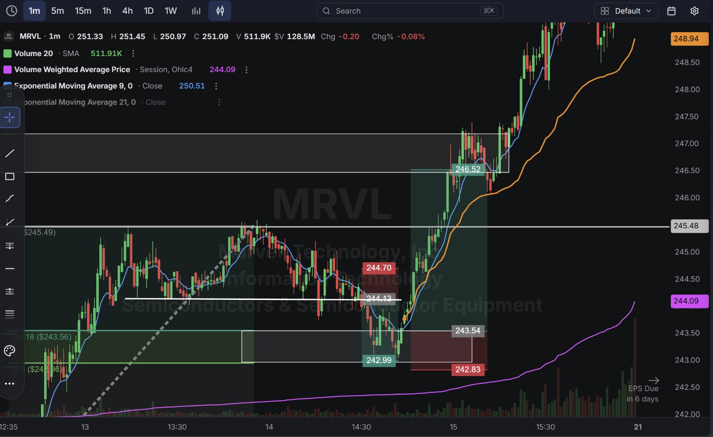
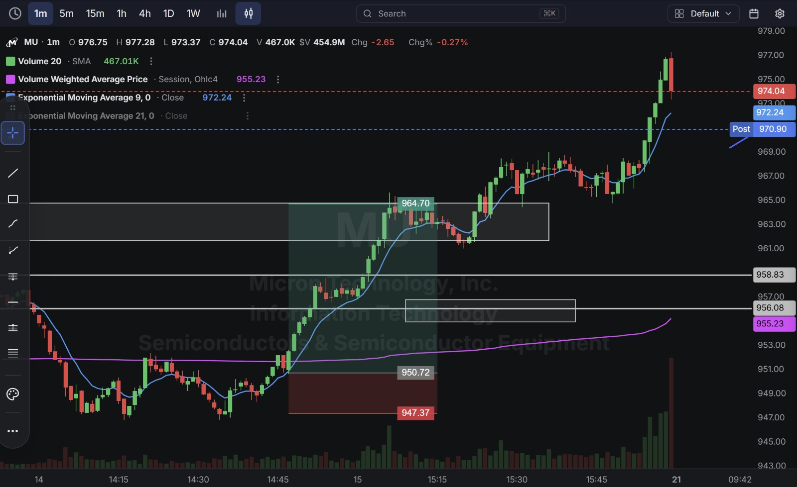
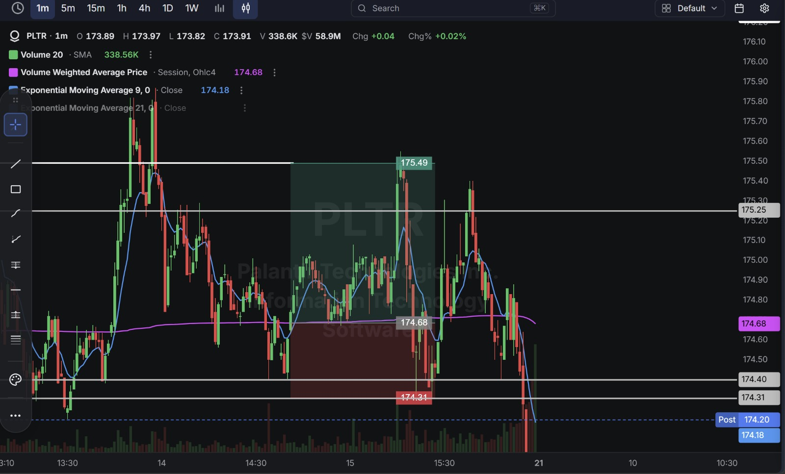

# Day 31 — US Market Analysis (20-08-2026)

**Work Format:** Pre-Market → Market Hours → After-Hours (IST evening-to-midnight coverage of the US session)

| Session      | IST Timing        | US Time (ET)      |
| ------------ | ----------------- | ----------------- |
| Pre-Market   | 5:00 PM – 7:00 PM | 7:30 AM – 9:30 AM |
| Market Hours | 7:00 PM – 1:30 AM | 9:30 AM – 4:00 PM |
| After Hours  | 1:30 AM – 2:30 AM | 4:00 PM – 5:00 PM |

> **New this session: trading down to the 1-minute chart, and taking two separate trades on the same stock (MRVL) in one session.** The core trigger is still the 9 EMA/VWAP crossover established over Days 28–30, now refined with **Fibonacci retracement confluence** — waiting for the crossover to happen at a meaningful Fib level (0.5 or 0.618 retracement) rather than at any arbitrary point, for a tighter, faster-confirming entry.

---

## 1. Pre-Market Analysis (7:30 AM – 9:30 AM ET)

### The Screener ("CANSLIM 2" — Same Configuration as Days 28–30)

| Group   | Logic | Conditions                                                                                             |
| ------- | ----- | --------------------------------------------------------------------------------------------------------- |
| Group 1 | ALL   | Dollar Volume > $20M · AS 3M > 85 · Include Type: Stocks                                                   |
| Group 2 | ALL   | Pre Market Last > $5 · Pre Market Volume > 100,000                                                         |
| Group 3 | ALL   | EPS Growth Latest Rptd Qtr (%) > 25.00% · Sales Growth Latest Rptd Qtr (%) > 25.00%                        |

**Screener Screenshot:** 

**MRVL returns** for the first time since Day 25; **MU** continues directly from Day 29's stopped-out trade, now with earnings just **6 days away**; **PLTR** returns after Day 30's clean long.

### Overnight/Morning Catalysts

- **MRVL (Marvell Technology)** — No new same-day catalyst; still benefiting from the broader AI-memory-platform strength first covered on Day 25, now extending into a strong intraday trend.
- **MU (Micron)** — No new catalyst beyond the ongoing story from Days 28–29 (crossing $1,000, aggressive New Street/UBS price-target hikes); now with its own earnings just 6 days out, adding a fresh layer of event-risk awareness after Day 29's second-day-continuation stop-out.
- **PLTR (Palantir)** — No fresh news; continuing to whip between clean breakouts and reversals across recent sessions, today traded long again after Day 30's successful long.

---

## 2. Market Hours Observation (9:30 AM – 4:00 PM ET)

### MRVL — Consolidation, Short-Lived Pullback, Then a Powerful Breakout

Spent the early session consolidating near a Fibonacci retracement zone, dipped briefly on a quick pullback, then broke out powerfully and extended into a strong, sustained uptrend for the rest of the session.

### MU — Sharp Breakout, Extension, Late Pullback

Broke out decisively on a 9 EMA/VWAP crossover, extended hard through the session, and pulled back modestly from the highs into the close while still finishing well above the entry.

### PLTR — Choppy Range, Breakout Spike, Fade Back to Range

Traded in a choppy, directionless range for most of the session, spiked sharply on a brief breakout, then faded back down through the rest of the session.

---

## 3. After-Hours Analysis (4:00 PM – 5:00 PM ET)

Heading into the next session, the key open questions:

- Whether **MRVL's** powerful breakout extends further or needs to consolidate after such a fast, large move.
- Whether **MU's** pullback from today's highs is healthy digestion ahead of its earnings date in 6 days, or the start of the kind of pre-earnings de-risking flagged as a risk on Day 20's DDOG trade.
- Whether **PLTR's** fade back into its range after the brief spike is a genuine rejection, or just noise within an otherwise directionless session.

---

## 4. Trade Strategy — Actual Trades, Full CANSLIM + Technical Reasoning, and Results

> **Concept used across all four trades: 9 EMA/VWAP Crossover with Fibonacci confluence**, executed on the 1-minute chart for faster, tighter confirmation. All four trades passed — two separate trades on MRVL (a short scalp followed by a long breakout trade), plus one each on MU and PLTR.

### 🔴 MRVL — Trade 1 — SHORT — ✅ **PASSED**

**Why I took this trade:** A brief bearish 9 EMA/VWAP crossover during an early pullback that stalled right at the 0.618 Fibonacci retracement level of the prior swing — a level where sellers had a clear technical reason to step back in, even without any fresh news.

**How I planned the entry and exit:**
- **Entry (244.13):** short on confirmation of the crossover at the Fib retracement zone.
- **Stop Loss (244.70):** above that zone — a 0.23% stop.
- **Target (242.99):** the next support level below.
- **Risk/Reward:** Risk $0.57 (0.23%) to make $1.14 (0.47%) → **RR of 2.00**.

**Result:** Price declined through the target before the larger reversal that set up Trade 2. Target hit.

**Chart:** 

---

### 🟢 MRVL — Trade 2 — LONG — ✅ **PASSED**

**Why I took this trade:** Immediately after Trade 1 closed, the 9 EMA crossed back above VWAP — a fast reversal confirming the pullback was over and genuine buying pressure had resumed. This is the same discipline used throughout this journal (SNOW Days 15–16, HPE Day 25, PLTR Day 30): following what the crossover shows in real time rather than holding a fixed directional bias after the first trade.

**How I planned the entry and exit:**
- **Entry (243.54):** long on confirmation of the bullish crossover reversal.
- **Stop Loss (242.83):** below the reversal zone — a 0.29% stop.
- **Target (246.52):** the next resistance level above.
- **Risk/Reward:** Risk $0.71 (0.29%) to make $2.98 (1.22%) → **RR of 4.20** — the best risk/reward of the day.

**Result:** Price broke out powerfully through the target and kept extending well beyond it into a sustained uptrend, closing the visible session near $251. Target hit comfortably, and the largest dollar winner of the day.

**Chart:** 

---

### 🟢 MU — LONG — ✅ **PASSED**

**Why I took this trade:** A clean bullish 9 EMA/VWAP crossover, and a meaningfully different setup than Day 29's stopped-out trade — this was a **fresh breakout from a genuine consolidation**, not a second-day continuation immediately following an enormous prior move. **C/A/N/L/I** remain unchanged and outstanding from Days 28–29 (tight HBM supply, aggressive analyst targets, Soros's top holding), and this trade explicitly applied the Day 29 lesson: wait for a real reset/consolidation before re-entering, rather than chasing the extension directly.

**How I planned the entry and exit:**
- **Entry (950.72):** on confirmation of the crossover breaking out of the consolidation.
- **Stop Loss (947.37):** below that consolidation — a 0.35% stop.
- **Target (964.70):** the next resistance extension above.
- **Risk/Reward:** Risk $3.35 (0.35%) to make $13.98 (1.47%) → **RR of 4.17**.

**Result:** Price broke out and extended well past the target to a high of $977.28, before pulling back modestly to close at **974.04** (post-market $970.90) — still well above target. Target hit comfortably.

**Chart:** 

---

### 🟢 PLTR — LONG — ✅ **PASSED**

**Why I took this trade:** A bullish 9 EMA/VWAP crossover within an otherwise choppy range — no fresh news, a purely technical, momentum-confirmed trade continuing the direction established on Day 30's successful long.

**How I planned the entry and exit:**
- **Entry (174.68):** on confirmation of the crossover at VWAP.
- **Stop Loss (174.31):** below the crossover zone — a 0.21% stop.
- **Target (175.49):** the next resistance level above.
- **Risk/Reward:** Risk $0.37 (0.21%) to make $0.81 (0.46%) → **RR of 2.19**.

**Result:** Price spiked through the target before fading back into the broader range, closing the visible session at **173.91** (post-market $174.20) — below the entry, but the target itself was tagged during the spike. Target hit before the later fade.

**Chart:** 

---

## 5. Trade Result Summary

| # | Stock       | Setup Type                                              | Side  | CANSLIM Read                                                                | Result    |
| --- | ----------- | ---------------------------------------------------------- | ----- | ---------------------------------------------------------------------------- | --------- |
| 1 | MRVL (T1)   | Bearish 9 EMA/VWAP crossover at a Fib retracement level      | Short | No fresh catalyst; pure technical fade of a pullback                         | ✅ Passed |
| 2 | MRVL (T2)   | Bullish 9 EMA/VWAP crossover reversal, immediate flip         | Long  | AI-memory strength continuing from Day 25; followed the crossover reversal   | ✅ Passed |
| 3 | MU          | Bullish 9 EMA/VWAP crossover on a fresh consolidation breakout | Long  | Outstanding C/A/N/L/I; fresh setup, not a chase of the prior extension       | ✅ Passed |
| 4 | PLTR        | Bullish 9 EMA/VWAP crossover                                  | Long  | Elite fundamentals unchanged; continuation of Day 30's long                  | ✅ Passed |

**Score: 4 for 4.**

### Normalized Results — $100 Total Capital Per Trade

| # | Stock       | Capital           | Entry → Target        | % Move | Result       | P&L        |
| --- | ----------- | ------------------ | ----------------------- | ------ | ------------ | ---------- |
| 1 | MRVL (T1)   | $100               | 244.13 → 242.99          | 0.47%  | ✅ Target hit | **+$0.47** |
| 2 | MRVL (T2)   | $100               | 243.54 → 246.52          | 1.22%  | ✅ Target hit | **+$1.22** |
| 3 | MU          | $100               | 950.72 → 964.70          | 1.47%  | ✅ Target hit | **+$1.47** |
| 4 | PLTR        | $100               | 174.68 → 175.49          | 0.46%  | ✅ Target hit | **+$0.46** |
| — | **Total**   | **$400 deployed**  | —                          | —      | **4 for 4**  | **+$3.62** |

**On $400 total capital deployed across four trades (two of them on MRVL), the day returned $3.62 in profit — roughly 0.91% on capital deployed.** Smaller percentage moves than recent sessions, reflecting the tighter, faster-confirming nature of 1-minute-chart entries relative to the 5m/15m setups used through most of this journal.

---

## Key Takeaways From Day 31

1. **Taking two sequential trades on the same stock (MRVL) in one session, flipping direction between them, is a natural extension of the crossover concept's direction-agnostic nature** (first demonstrated with PLTR across Days 28 and 30). Rather than treating the first trade's close as "done with this stock for the day," following a fresh crossover signal immediately afterward captured the larger move that followed.
2. **MU's clean pass today, right after Day 29's stop-out, is a direct, successful application of that day's lesson.** The difference wasn't the fundamentals (unchanged and excellent both times) — it was waiting for a genuine consolidation/reset before re-entering, rather than chasing a second-day continuation immediately after an enormous prior move.
3. **Moving to the 1-minute chart trades off some reward potential (all four trades under 1.5% today) for faster, more frequent confirmation** — a reasonable trade-off for a session focused on precision entries rather than chasing the largest possible move.
4. **Adding Fibonacci retracement levels as confluence with the 9 EMA/VWAP crossover (MRVL's Trade 1) gave the setup an extra layer of justification beyond the crossover alone** — worth continuing to test whether Fib-confirmed crossovers outperform plain crossovers as the sample size grows.
5. **Next Pre-Market session:** with MU's own earnings now just 6 days out, start applying the same discipline shown with DDOG (Days 16–20) — track the countdown and size positions more conservatively as the date approaches. Also worth watching whether MRVL's powerful breakout needs a consolidation day before its next leg.
