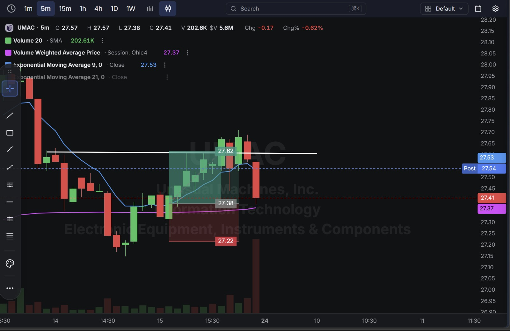
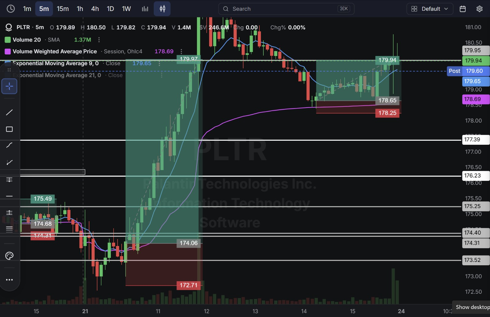
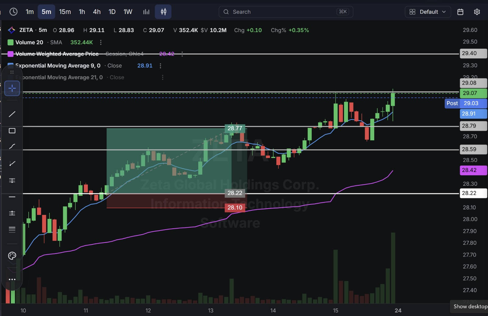
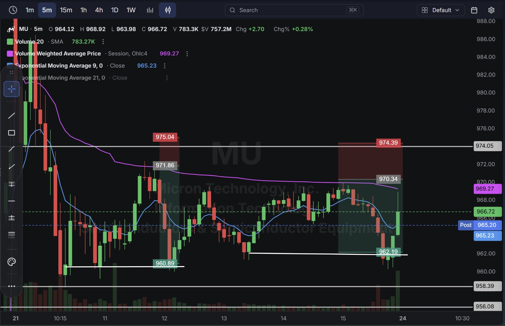

# Day 32 — US Market Analysis (24-08-2026)

**Work Format:** Pre-Market → Market Hours → After-Hours (IST evening-to-midnight coverage of the US session)

| Session      | IST Timing        | US Time (ET)      |
| ------------ | ----------------- | ----------------- |
| Pre-Market   | 5:00 PM – 7:00 PM | 7:30 AM – 9:30 AM |
| Market Hours | 7:00 PM – 1:30 AM | 9:30 AM – 4:00 PM |
| After Hours  | 1:30 AM – 2:30 AM | 4:00 PM – 5:00 PM |

> **First multi-entry day in this journal:** rather than one trade per stock, two names (PLTR and MU) each produced a **second, fresh crossover signal after the first trade had already closed at target** — the same 9 EMA/VWAP Crossover strategy used since Day 28, simply re-applied whenever the setup re-confirmed later in the session. Six total trades across four stocks, all six passed.

---

## 1. Pre-Market Analysis (7:30 AM – 9:30 AM ET)

### The Screener ("CANSLIM 2" — Same Configuration as Days 28–30)

| Group   | Logic | Conditions                                                                                             |
| ------- | ----- | --------------------------------------------------------------------------------------------------------- |
| Group 1 | ALL   | Dollar Volume > $20M · AS 3M > 85 · Include Type: Stocks                                                   |
| Group 2 | ALL   | Pre Market Last > $5 · Pre Market Volume > 100,000                                                         |
| Group 3 | ALL   | EPS Growth Latest Rptd Qtr (%) > 25.00% · Sales Growth Latest Rptd Qtr (%) > 25.00%                        |

**Screener Screenshot:** 

**UMAC, PLTR, and ZETA all carried over** from Day 30; **MU** returns for the first time since Day 29.

### Overnight/Morning Catalysts

- **UMAC (Unusual Machines)** — No new same-day catalyst; still working off the same drone-sector policy tailwind that's carried this name across multiple sessions in this journal.
- **PLTR (Palantir)** — No fresh news; continuing to trade off its established multi-week momentum, today producing two separate, valid crossover signals across the session.
- **ZETA (Zeta Global)** — No new catalyst; a straightforward technical continuation on an established uptrend.
- **MU (Micron)** — No new same-day catalyst; still digesting the aggressive price-target hikes and the crossing of $1,000 first covered on Day 28, now trading with two separate short-side crossover setups on a choppier, more two-directional day.

---

## 2. Market Hours Observation (9:30 AM – 4:00 PM ET)

### UMAC — Breakout Above VWAP, Extension, Sharp Late Reversal

Crossed above VWAP and the 9 EMA, extended toward the target, then reversed sharply on a single large red candle late in the session.

### PLTR — Two Distinct Crossover Legs

Delivered a powerful bullish crossover and breakout early in the session that ran for hours, followed — after consolidating — by a **second**, fresh bullish crossover later on, both confirmed independently and both extending to new highs.

### ZETA — Clean Breakout Above VWAP, Sustained Extension

Crossed above VWAP early and extended steadily through the rest of the session with minimal pullback, closing near the highs.

### MU — Two Distinct Bearish Crossover Legs

Delivered a bearish crossover and decline early in the session, based and recovered somewhat, then produced a **second**, fresh bearish crossover later on as price rolled over again from a lower high.

---

## 3. After-Hours Analysis (4:00 PM – 5:00 PM ET)

Heading into the next session, the key open questions:

- Whether **UMAC's** sharp late reversal is the start of real consolidation after its multi-session run, or just a single-candle shakeout.
- Whether **PLTR's** strength across two separate legs in one session signals the stock is entering a genuinely stronger phase of its trend, or whether today's pace was unusually fast even for this name.
- Whether **ZETA's** clean extension holds into the next session.
- Whether **MU** needs a full session of two-way chop (as seen today) before its next decisive directional move, given how far the stock has already run since Day 28.

---

## 4. Trade Strategy — Actual Trades, Full CANSLIM + Technical Reasoning, and Results

> **Concept used across all six trades: 9 EMA / VWAP Crossover.** Two of today's four stocks (PLTR, MU) produced a second, independent crossover signal later in the session after the first trade had already closed at target — each treated as its own separate trade with its own entry, stop, and target, rather than holding or averaging into a single position.

### 🟢 UMAC — LONG — ✅ **PASSED**

**Why I took this trade:** The 9 EMA crossed above VWAP, confirming renewed short-term buying pressure in line with UMAC's ongoing multi-session strength.

**How I planned the entry and exit:**
- **Entry (27.38):** on confirmation of the bullish crossover.
- **Stop Loss (27.22):** below the crossover zone — a 0.58% stop.
- **Target (27.62):** the next resistance level above.
- **Risk/Reward:** Risk $0.16 (0.58%) to make $0.24 (0.88%) → **RR of 1.50**.

**Result:** Price extended through the target before a sharp reversal candle gave back the move late in the session, closing at **27.41** (post-market $27.54). The target itself was tagged before that reversal. Target hit.

**Chart:** 

---

### 🟢 PLTR — LONG (Trade 1) — ✅ **PASSED**

**Why I took this trade:** A powerful bullish 9 EMA/VWAP crossover early in the session — no fresh news, but a clean, high-conviction momentum confirmation.

**How I planned the entry and exit:**
- **Entry (175.49):** on confirmation of the crossover.
- **Stop Loss (174.31):** below the crossover zone — a 0.67% stop.
- **Target (179.97):** the next resistance level above.
- **Risk/Reward:** Risk $1.18 (0.67%) to make $4.48 (2.55%) → **RR of 3.80**.

**Result:** Price rallied powerfully and sustained the move for hours, reaching a session high of $180.50 before consolidating. Target hit comfortably — the largest single-trade dollar move of the day.

**Chart:** 

---

### 🟢 PLTR — LONG (Trade 2) — ✅ **PASSED**

**Why I took this trade:** After Trade 1 closed at target and the stock consolidated in a tighter range, a **second, fresh 9 EMA/VWAP crossover** formed later in the session — a genuinely new signal, not a continuation of the first position, confirming renewed buying pressure after the pause.

**How I planned the entry and exit:**
- **Entry (178.65):** on confirmation of the second crossover.
- **Stop Loss (178.25):** below that crossover zone — a 0.22% stop.
- **Target (179.94):** the next resistance level above.
- **Risk/Reward:** Risk $0.40 (0.22%) to make $1.29 (0.72%) → **RR of 3.23**.

**Result:** Price broke out again late in the session, spiking to close right at **179.94** — exactly at target. Target hit.

**Chart:** 

---

### 🟢 ZETA — LONG — ✅ **PASSED**

**Why I took this trade:** A clean bullish 9 EMA/VWAP crossover on an established uptrend, no fresh catalyst — a straightforward technical continuation.

**How I planned the entry and exit:**
- **Entry (28.22):** on confirmation of the crossover.
- **Stop Loss (28.10):** below the crossover zone — a 0.43% stop.
- **Target (28.77):** the next resistance level above.
- **Risk/Reward:** Risk $0.12 (0.43%) to make $0.55 (1.95%) → **RR of 4.58** — the best risk/reward of the day.

**Result:** Price extended well past the target, closing near session highs at **29.07** (post-market $29.03). Target hit comfortably.

**Chart:** 

---

### 🔴 MU — SHORT (Trade 1) — ✅ **PASSED**

**Why I took this trade:** A bearish 9 EMA/VWAP crossover early in the session — no fresh catalyst, purely a technical fade following the digestion of Day 28's massive move.

**How I planned the entry and exit:**
- **Entry (971.86):** short on confirmation of the bearish crossover.
- **Stop Loss (975.04):** above the crossover zone — a 0.33% stop.
- **Target (960.89):** the next support level below.
- **Risk/Reward:** Risk $3.18 (0.33%) to make $10.97 (1.13%) → **RR of 3.45**.

**Result:** Price declined into the target zone before basing and recovering. Target hit.

**Chart:** 

---

### 🔴 MU — SHORT (Trade 2) — ✅ **PASSED**

**Why I took this trade:** After Trade 1 closed and MU recovered into a lower high, a **second, fresh bearish crossover** formed as the 9 EMA rolled back below VWAP — a new, independently confirmed signal rather than a continuation of the first short.

**How I planned the entry and exit:**
- **Entry (970.34):** short on confirmation of the second bearish crossover.
- **Stop Loss (974.39):** above that crossover zone — a 0.42% stop.
- **Target (962.19):** the next support level below.
- **Risk/Reward:** Risk $4.05 (0.42%) to make $8.15 (0.84%) → **RR of 2.01**.

**Result:** Price declined into the target zone before a late recovery candle closed the session at **966.72** (post-market $965.20) — above the target, but the target itself was tagged during the decline first. Target hit.

**Chart:** 

---

## 5. Trade Result Summary

| # | Stock       | Setup Type                                   | Side  | CANSLIM Read                                                       | Result    |
| --- | ----------- | ----------------------------------------------- | ----- | -------------------------------------------------------------------- | --------- |
| 1 | UMAC        | Bullish 9 EMA/VWAP crossover                     | Long  | Ongoing sector tailwind; multi-session continuation                  | ✅ Passed |
| 2 | PLTR (T1)   | Bullish 9 EMA/VWAP crossover                     | Long  | Elite fundamentals unchanged; clean momentum confirmation             | ✅ Passed |
| 3 | PLTR (T2)   | Second, fresh bullish crossover after Trade 1     | Long  | Same profile; renewed signal after consolidation                     | ✅ Passed |
| 4 | ZETA        | Bullish 9 EMA/VWAP crossover                     | Long  | No fresh catalyst; technical continuation                            | ✅ Passed |
| 5 | MU (T1)     | Bearish 9 EMA/VWAP crossover                     | Short | No fresh catalyst; digestion after Day 28's massive move              | ✅ Passed |
| 6 | MU (T2)     | Second, fresh bearish crossover after Trade 1     | Short | Same profile; renewed signal on a lower high                         | ✅ Passed |

**Score: 6 for 6.**

### Normalized Results — $100 Total Capital Per Trade

| # | Stock/Trade  | Capital          | Entry → Target          | % Move | Result       | P&L        |
| --- | ------------ | ------------------ | -------------------------- | ------ | ------------ | ---------- |
| 1 | UMAC         | $100               | 27.38 → 27.62               | 0.88%  | ✅ Target hit | **+$0.88** |
| 2 | PLTR (T1)    | $100               | 175.49 → 179.97             | 2.55%  | ✅ Target hit | **+$2.55** |
| 3 | PLTR (T2)    | $100               | 178.65 → 179.94             | 0.72%  | ✅ Target hit | **+$0.72** |
| 4 | ZETA         | $100               | 28.22 → 28.77                | 1.95%  | ✅ Target hit | **+$1.95** |
| 5 | MU (T1)      | $100               | 971.86 → 960.89              | 1.13%  | ✅ Target hit | **+$1.13** |
| 6 | MU (T2)      | $100               | 970.34 → 962.19              | 0.84%  | ✅ Target hit | **+$0.84** |
| — | **Total**    | **$600 deployed**  | —                              | —      | **6 for 6**  | **+$8.07** |

**On $600 total capital deployed across six trades, the day returned $8.07 in profit — roughly 1.35% on capital deployed** — the largest number of trades and the first perfect 6-for-6 session in this journal.

---

## Key Takeaways From Day 32

1. **This is the first day this journal has treated the same stock's re-confirmed crossover as a genuinely separate trade rather than holding or adding to one position** — PLTR and MU each delivered two independent, fully-formed setups in a single session, and sizing each one at the same $100 baseline (rather than doubling up on the first) kept risk consistent regardless of how many signals a given name produced.
2. **PLTR's two legs and MU's two legs are useful mirror-image case studies of the same idea**: a strong trend (PLTR, long) and a weak one (MU, short) can both legitimately re-confirm mid-session once the first move consolidates, as long as each new entry is judged on its own fresh crossover rather than assumed from the earlier trade.
3. **A perfect 6-for-6 day, immediately following Day 30's perfect 4-for-4, is now two clean sessions in a row** — the same caution flagged after Day 20's and Day 30's streaks applies here even more directly: this is exactly the environment where oversizing or skipping the crossover confirmation on a "sure thing" becomes tempting, and exactly when discipline matters most.
4. **The 9 EMA/VWAP crossover concept's running record now stands at 16 wins against 3 losses across five sessions (Days 28–30, 32)** — a genuinely large enough sample to treat as a core, proven strategy in this journal rather than an experimental one.
5. **Next Pre-Market session:** watch whether PLTR's unusually fast, two-leg session today was an exception or a sign the trend is accelerating, and continue watching for multi-entry days on other names now that the framework for handling them (treat each fresh crossover as its own trade) is established.
