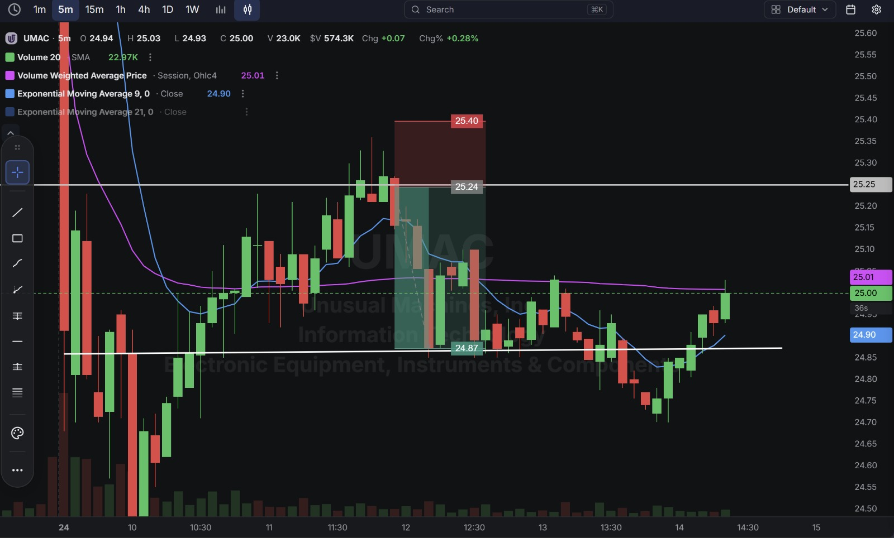
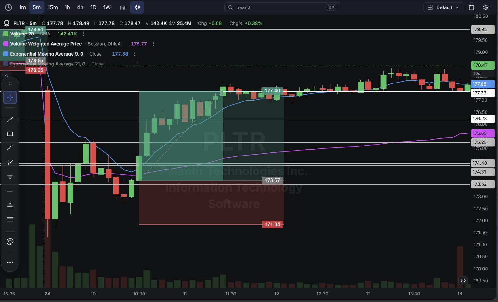
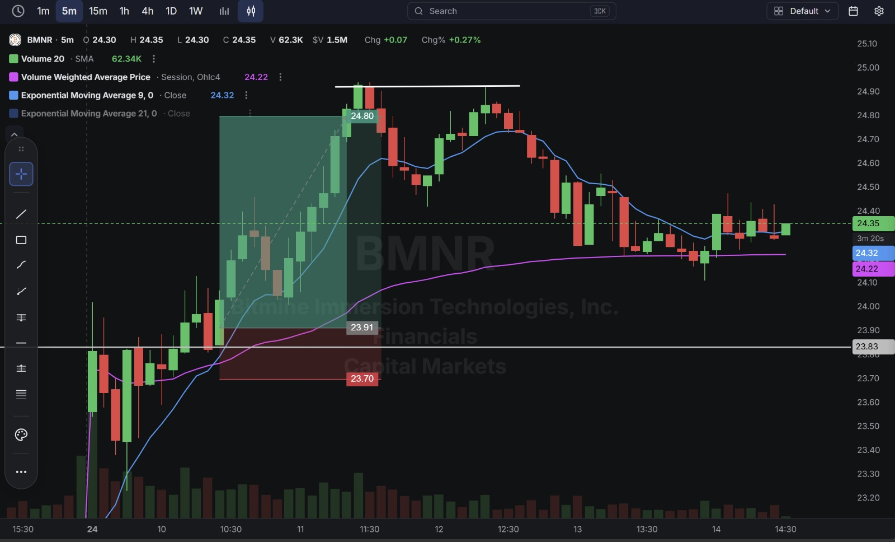
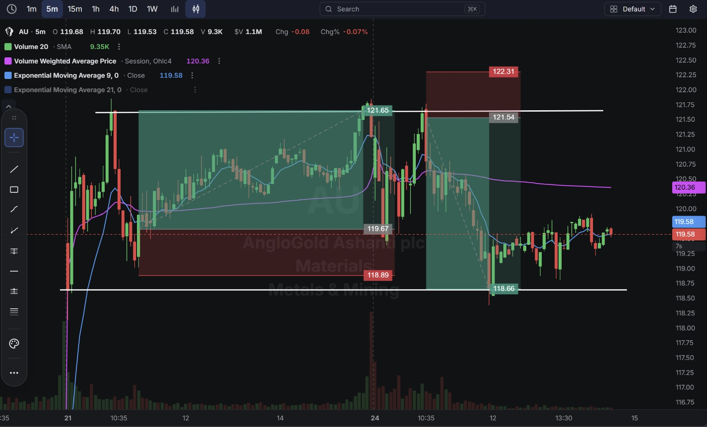

# Day 33 — US Market Analysis (24-08-2026)

**Work Format:** Pre-Market → Market Hours → After-Hours (IST evening-to-midnight coverage of the US session)

| Session      | IST Timing        | US Time (ET)      |
| ------------ | ----------------- | ----------------- |
| Pre-Market   | 5:00 PM – 7:00 PM | 7:30 AM – 9:30 AM |
| Market Hours | 7:00 PM – 1:30 AM | 9:30 AM – 4:00 PM |
| After Hours  | 1:30 AM – 2:30 AM | 4:00 PM – 5:00 PM |

---

## 1. Pre-Market Analysis (7:30 AM – 9:30 AM ET)

### The Screener ("CANSLIM 2" — Same Configuration as Days 28–32)

| Group   | Logic | Conditions                                                                                             |
| ------- | ----- | --------------------------------------------------------------------------------------------------------- |
| Group 1 | ALL   | Dollar Volume > $20M · AS 3M > 85 · Include Type: Stocks                                                   |
| Group 2 | ALL   | Pre Market Last > $5 · Pre Market Volume > 100,000                                                         |
| Group 3 | ALL   | EPS Growth Latest Rptd Qtr (%) > 25.00% · Sales Growth Latest Rptd Qtr (%) > 25.00%                        |

**Screener Screenshot:** 

**Result: 10 stocks.** **UMAC and PLTR both carried over** from Day 32; **BMNR (Bitmine Immersion Technologies)** and **AU (AngloGold Ashanti)** are both new to this journal.

### Overnight/Morning Catalysts

- **UMAC (Unusual Machines)** — No new same-day catalyst; still trading off the ongoing drone-sector policy tailwind, now across its fourth-plus session in this journal, today from the short side for the first time.
- **PLTR (Palantir)** — No fresh news; continuing directly out of Day 32's two-leg session with another clean bullish crossover.
- **BMNR (Bitmine Immersion Technologies)** — A crypto-treasury-focused capital markets name that cleared the current-quarter EPS and sales growth filters; no specific same-day news identified, traded purely on the technical crossover.
- **AU (AngloGold Ashanti)** — A gold-mining major that cleared the growth screen on strong current-quarter results; produced two distinct, opposite-direction setups across the session as the stock swung in a wide range.

---

## 2. Market Hours Observation (9:30 AM – 4:00 PM ET)

### UMAC — Breakdown Below VWAP, Decline, Recovery

Crossed below both the 9 EMA and VWAP early, declined into the target zone and below, then recovered steadily back toward the entry level into the close.

### PLTR — Breakout Above VWAP, Sustained Extension

Crossed above VWAP early and extended steadily through the session with continued strength, closing near the highs.

### BMNR — Breakout Above VWAP, Extension, Late Pullback

Crossed above VWAP and extended sharply higher through the target, before giving back a portion of the move and stabilizing into the close.

### AU — Two Distinct Crossover Legs in Opposite Directions

Rallied on an early bullish crossover to a fresh high, pulled back, then reversed into a **second, bearish crossover** later in the session as the stock rolled over from that high, declining sharply before a partial recovery into the close.

---

## 3. After-Hours Analysis (4:00 PM – 5:00 PM ET)

Heading into the next session, the key open questions:

- Whether **UMAC's** recovery off the lows signals the multi-session drone-sector strength is reasserting itself, or whether today's short-side setup is the first sign of real consolidation.
- Whether **PLTR's** continued strength across three straight sessions of clean crossovers (Days 30, 32, 33) means the trend is accelerating.
- Whether **BMNR's** late pullback after the breakout is healthy digestion or a warning sign for a name new to this journal.
- Whether **AU's** wide, two-directional range today resolves into a clearer trend, or continues chopping in the next session.

---

## 4. Trade Strategy — Actual Trades, Full CANSLIM + Technical Reasoning, and Results

> **Concept used across all five trades: 9 EMA / VWAP Crossover.** AU produced two independent, opposite-direction signals in one session — a long on the initial breakout, then a fresh short once price rolled over and re-crossed below both lines — each treated and sized as its own separate trade.

### 🔴 UMAC — SHORT — ✅ **PASSED**

**Why I took this trade:** The 9 EMA crossed below VWAP, confirming a genuine short-term shift to selling pressure — the first short-side signal taken on UMAC in this journal after several long trades across recent sessions.

**How I planned the entry and exit:**
- **Entry (25.24):** short on confirmation of the bearish crossover.
- **Stop Loss (25.40):** above the crossover zone — a 0.63% stop.
- **Target (24.87):** the next support level below.
- **Risk/Reward:** Risk $0.16 (0.63%) to make $0.37 (1.47%) → **RR of 2.31**.

**Result:** Price declined through the target and continued lower before recovering into the close at **25.00**. Target hit.

**Chart:**

---

### 🟢 PLTR — LONG — ✅ **PASSED**

**Why I took this trade:** A clean bullish 9 EMA/VWAP crossover, directly continuing the momentum from Day 32's two-leg session. No fresh news; the CANSLIM fundamentals remain elite and unchanged.

**How I planned the entry and exit:**
- **Entry (173.67):** on confirmation of the bullish crossover.
- **Stop Loss (171.85):** below the crossover zone — a 1.05% stop.
- **Target (177.40):** the next resistance level above.
- **Risk/Reward:** Risk $1.82 (1.05%) to make $3.73 (2.15%) → **RR of 2.05**.

**Result:** Price extended well past the target, continuing to climb through the session to close at **178.47**. Target hit comfortably.

**Chart:** 

---

### 🟢 BMNR — LONG — ✅ **PASSED**

**Why I took this trade:** A clean bullish 9 EMA/VWAP crossover on a name new to this journal, cleared by the growth screen on real current-quarter EPS and sales acceleration. No specific same-day catalyst; a pure momentum-confirmed technical long.

**How I planned the entry and exit:**
- **Entry (23.91):** on confirmation of the bullish crossover.
- **Stop Loss (23.70):** below the crossover zone — a 0.88% stop.
- **Target (24.80):** the next resistance level above.
- **Risk/Reward:** Risk $0.21 (0.88%) to make $0.89 (3.72%) → **RR of 4.24** — the best risk/reward of the day.

**Result:** Price rallied cleanly through the target before pulling back and stabilizing into the close at **24.35**. Target hit.

**Chart:** 

---

### 🟢 AU — LONG (Trade 1) — ✅ **PASSED**

**Why I took this trade:** A bullish 9 EMA/VWAP crossover on a gold-mining major that cleared the current-quarter growth screen — a technical continuation buy with no specific same-day catalyst identified.

**How I planned the entry and exit:**
- **Entry (119.67):** on confirmation of the bullish crossover.
- **Stop Loss (118.89):** below the crossover zone — a 0.65% stop.
- **Target (121.65):** the next resistance level above.
- **Risk/Reward:** Risk $0.78 (0.65%) to make $1.98 (1.66%) → **RR of 2.54**.

**Result:** Price rallied cleanly through the target before reversing sharply. Target hit before the later decline.

**Chart:** 

---

### 🔴 AU — SHORT (Trade 2) — ✅ **PASSED**

**Why I took this trade:** After Trade 1 closed at target and the stock rolled over, a **second, fresh bearish crossover** formed as the 9 EMA crossed back below VWAP — a genuinely new, independently confirmed signal in the opposite direction from the first trade, not a hedge or a reversal of the original position.

**How I planned the entry and exit:**
- **Entry (121.54):** short on confirmation of the bearish crossover, near the highs of the earlier rally.
- **Stop Loss (122.31):** above the crossover zone — a 0.63% stop.
- **Target (118.66):** the next support level below.
- **Risk/Reward:** Risk $0.77 (0.63%) to make $2.88 (2.37%) → **RR of 3.74**.

**Result:** Price declined sharply through the target to a session low before a partial recovery into the close at **119.58**. Target hit.

**Chart:** 

---

## 5. Trade Result Summary

| # | Stock/Trade | Setup Type                                       | Side  | CANSLIM Read                                                            | Result    |
| --- | ----------- | ------------------------------------------------- | ----- | ---------------------------------------------------------------------------- | --------- |
| 1 | UMAC        | Bearish 9 EMA/VWAP crossover                        | Short | Ongoing sector tailwind; first short-side signal on this name                | ✅ Passed |
| 2 | PLTR        | Bullish 9 EMA/VWAP crossover                        | Long  | Elite fundamentals unchanged; 3rd straight clean crossover session           | ✅ Passed |
| 3 | BMNR        | Bullish 9 EMA/VWAP crossover                        | Long  | New name; real current-quarter EPS/sales acceleration                       | ✅ Passed |
| 4 | AU (T1)     | Bullish 9 EMA/VWAP crossover                        | Long  | New name; cleared growth screen                                              | ✅ Passed |
| 5 | AU (T2)     | Second, fresh bearish crossover after Trade 1        | Short | Same profile; opposite-direction signal after the rollover                  | ✅ Passed |

**Score: 5 for 5.**

### Normalized Results — $100 Total Capital Per Trade

| # | Stock/Trade | Capital           | Entry → Target        | % Move | Result       | P&L         |
| --- | ----------- | ------------------ | ------------------------ | ------ | ------------ | ----------- |
| 1 | UMAC        | $100               | 25.24 → 24.87              | 1.47%  | ✅ Target hit | **+$1.47**  |
| 2 | PLTR        | $100               | 173.67 → 177.40            | 2.15%  | ✅ Target hit | **+$2.15**  |
| 3 | BMNR        | $100               | 23.91 → 24.80               | 3.72%  | ✅ Target hit | **+$3.72**  |
| 4 | AU (T1)     | $100               | 119.67 → 121.65             | 1.66%  | ✅ Target hit | **+$1.66**  |
| 5 | AU (T2)     | $100               | 121.54 → 118.66             | 2.37%  | ✅ Target hit | **+$2.37**  |
| — | **Total**   | **$500 deployed**  | —                            | —      | **5 for 5**  | **+$11.37** |

**On $500 total capital deployed across five trades, the day returned $11.37 in profit — roughly 2.27% on capital deployed** — the second consecutive perfect session, following Day 32's 6-for-6.

---

## Key Takeaways From Day 33

1. **AU's two opposite-direction trades in one session are the clearest example yet of the crossover strategy being genuinely reactive rather than biased** — the same stock produced a valid long and a valid short within hours of each other, and both worked, because each was judged purely on its own fresh crossover signal rather than any fixed view on the stock.
2. **Two consecutive perfect sessions (Day 32's 6-for-6, now Day 33's 5-for-5) is an eleven-trade winning streak** — worth treating with real discipline rather than complacency, exactly as flagged after the prior streaks on Days 20 and 30. The next loss is not a surprise; it's overdue statistically and should be sized for accordingly.
3. **BMNR and AU are both first appearances in this journal, and both worked cleanly on the crossover concept with no company-specific catalyst driving the signal** — reinforcing that the setup travels well across sectors (drone components, AI software, crypto-treasury, gold mining) as long as the underlying growth screen and the technical trigger both confirm.
4. **The 9 EMA/VWAP crossover's running record now stands at 21 wins against 3 losses across six sessions (Days 28–30, 32–33)** — an increasingly robust sample supporting this as the primary strategy going forward.
5. **Next Pre-Market session:** watch for the streak's eventual break and treat it as normal variance, not a signal the strategy has stopped working, while continuing to watch PLTR's now three-session run of clean crossovers for signs of exhaustion.
