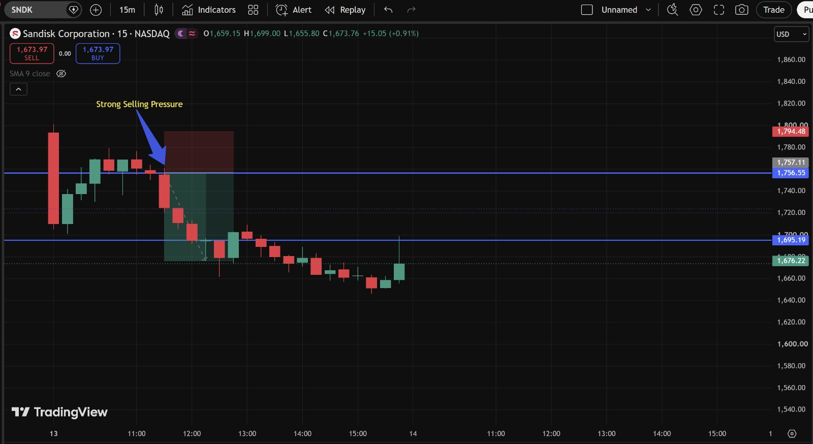
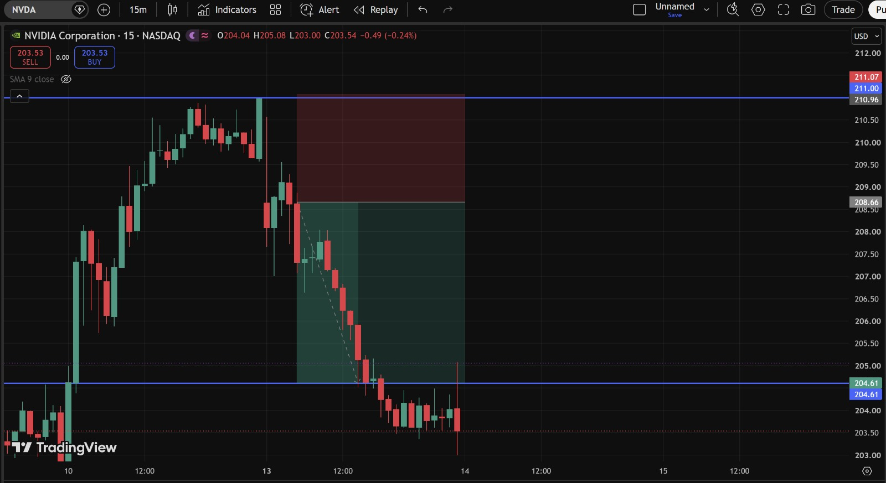
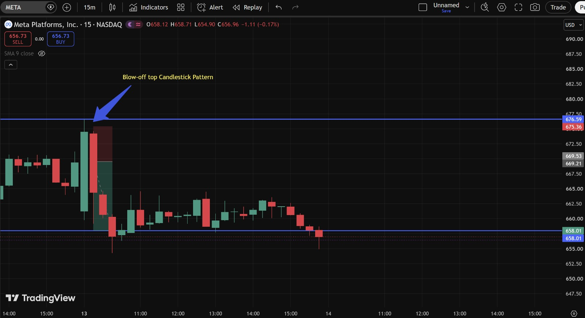
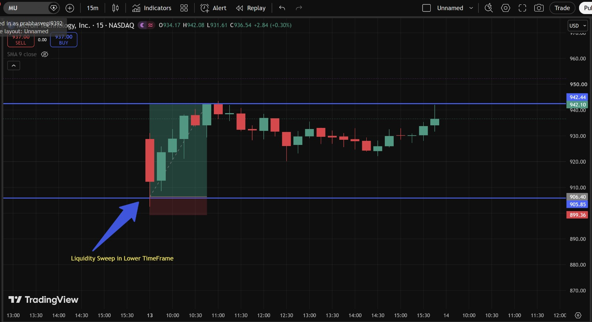

# Day 4 — US Market Analysis (13-07-2026)

**Work Format:** Pre-Market → Market Hours → After-Hours (IST evening-to-midnight coverage of the US session)

| Session | IST Timing | US Time (ET) |
|---|---|---|
| Pre-Market | 5:00 PM – 7:00 PM | 7:30 AM – 9:30 AM |
| Market Hours | 7:00 PM – 1:30 AM | 9:30 AM – 4:00 PM |
| After Hours | 1:30 AM – 2:30 AM | 4:00 PM – 5:00 PM |

---

## 1. Pre-Market Analysis (7:30 AM – 9:30 AM ET)

### Overnight Catalyst
Two separate stories collided heading into Monday:
- **President Trump announced he was reinstating a blockade on Iranian shipping** through the Strait of Hormuz over the weekend, sending oil prices higher again and reviving the risk-off tone from earlier in the week.
- **SK Hynix's second trading day turned into a rout.** After popping nearly 13% on its Nasdaq debut Friday, the US-listed shares tumbled **8%** on Monday; the Seoul-listed shares fell more than **15%** — their worst day in history — and dragged the broader Korean market down with them (KOSPI fell as much as 8%, triggering a circuit breaker; Samsung Electronics fell 10%).
- This hit the whole memory/chip complex: the **Roundhill Memory ETF (DRAM)** was off as much as **9%**, with **SanDisk** and **Western Digital** both down around **5–9%**, **Micron** down **5–6%**, and the **iShares Semiconductor ETF (SOXX)** down about **2%**.
- Investors were also digesting fresh doubts about the AI-hardware supply/demand story — reports suggested memory production yields were improving faster than expected, raising questions about whether the supply shortage that had supported premium HBM pricing was starting to fade.
- Not everything was down, though — **Meta** carried over strength from Friday's **+6%** move (on a bullish SemiAnalysis report about its AI compute business), still showing green pre-market even as the rest of the AI-hardware trade came under pressure.

### Pre-Market Screenshot

**Reading the board:** Even at 9:21 AM ET, **MU was already red pre-market (-1.24%)** while **NVDA (+4.03%), META (+5.97%), SPY (+0.43%), and SNDK (+3.10%)** were all still showing green. This is an important early divergence — Micron was the one name already reflecting the SK Hynix/memory-sector stress before the rest of the tape had caught up to it. That divergence turned out to be the first clue for the whole session: the "green" board at 9:21 AM did **not** hold once the market opened.

### How I Picked My Watchlist From Pre-Market
1. **MU** flagged first — the only red name on an otherwise green board is exactly the kind of divergence worth digging into, and here it lined up directly with the SK Hynix/memory-sector news.
2. **SNDK** — same sector as MU, same overnight catalyst, watching whether it would follow MU's lead (despite still showing green on the board) or hold up.
3. **NVDA** — carried strong pre-market gains (+4%) after Friday's session; watching whether that would hold once the Iran/oil headline was priced in more broadly.
4. **META** — the outlier, driven by a stock-specific catalyst (SemiAnalysis report) rather than the memory/chip story; a good name to watch for whether company-specific strength could resist a broader risk-off pull.
5. **SPY** — confirmation instrument, to judge whether the day was a narrow chip/memory-specific move or a broad risk-off day.

---

## 2. Market Hours Observation (9:30 AM – 4:00 PM ET)

The pre-market "green board" reversed hard once the session got going. By the close: **S&P 500 -0.79%** to 7,515.34, **Nasdaq Composite -1.55%** to 25,873.18, **Dow -0.26%** to 52,498.64 — confirming this was a genuine broad risk-off day, not just a narrow chip-sector issue, even though chips/memory were the epicenter.

### MU — Gapped Down, Swept the Low, Then Recovered Into a Range
Opened well below its pre-market level, dropping straight to a low near **905** — sweeping out the liquidity resting below the recent consolidation — before reversing and grinding back up into a **905–942** range, ending the session (and into the next day) trading around **928–937**.

### NVDA — Rejected at the Highs, Broke Down Hard
Continued Friday's rally briefly into Monday, tagging a high near **211** (matching the pre-market gain), then reversed and has been in a **persistent, multi-day downtrend** since — a clean Break of Structure to the downside, printing lower highs and lower lows all the way down to **203.00**.

### META — Blow-Off Top, Then Faded With the Sector
Extended its Friday rally up to a high near **675**, then reversed hard as the broader risk-off tone took hold, fading all the way back down to **656–657** — giving back essentially the entire Monday gain by the time the session (and the following day) played out.

### SNDK — Gapped Down Hard, Failed Rally, New Range
Opened dramatically lower than its pre-market indication, gapping from the ~1,900s down to an open near **1,659**. A rally attempt tagged **1,699** before failing and fading back down to **1,650–1,652** — a new, much lower range than anything seen in Days 2–3.

### SPY — Confirms Broad Risk-Off
The -0.79% close (versus a +0.43% pre-market indication) confirms the reversal was market-wide, not confined to chips/memory — useful context for sizing the individual stock trades more cautiously than on a narrow sector-specific down day.

---

## 3. After-Hours Analysis (4:00 PM – 5:00 PM ET)

Heading into the next session, the key questions carried forward:
- Whether **MU's** recovery off the 905 sweep low holds as the new range low, or gets retested and broken.
- Whether **NVDA's** breakdown from 211 continues further, or finds support given how far it's already fallen.
- Whether **META** can stabilize around 656 (its pre-selloff base from July 10) or continues fading with the sector.
- Whether **SNDK's** failed rally at 1,699 marks the top of its new, much lower range.

---

## 4. Trade Strategy Per Stock — Actual Setups Observed (with Result)

> This section is based on my own annotated 15m charts, marking the exact concepts I identified on each chart: Strong Selling Pressure, Rejection at Resistance, a Blow-off Top Candlestick Pattern, and a Liquidity Sweep.

### 🔴 SNDK — SHORT — ✅ **PASSED (both targets)**

**Setup: Rejection at Resistance + Strong Selling Pressure Breakdown**

Price had been consolidating/rejecting in the **~1,756–1,794** zone (a clear resistance band) when a large red candle — marked **"Strong Selling Pressure"** — broke decisively below the **1,756.55** level. That single candle is the signal: a candle that doesn't just close lower but does so with real range and follow-through is a strong sign that sellers have taken control, not just a normal pullback candle.

| Parameter | Level | Notes |
|---|---|---|
| Entry | **Below 1,756** | On the close of the Strong Selling Pressure candle, confirming the breakdown |
| Stop Loss | **1,794** | Above the rejected high / resistance zone |
| Target 1 | **1,695.19** | Marked support level |
| Target 2 | **1,655.80** | Session low |
| **Result** | **✅ Passed — both targets hit.** Price broke straight through 1,695.19 and continued to the session low of 1,655.80, before recovering to the current 1,673.97 | Clean, fast breakdown with almost no resistance between entry and Target 2 |

**Chart:**

**Why it worked:** The "Strong Selling Pressure" candle is really just a specific, easy-to-spot version of a **Break of Structure** — a decisive candle through a well-defined level, with range and volume behind it, rather than a slow grind through. Waiting for that kind of candle (instead of shorting the first sign of weakness) kept this entry high-quality and avoided getting caught in the earlier, choppier consolidation.

---

### 🔴 NVDA — SHORT — ✅ **PASSED (target exceeded)**

**Setup: Rejection at Resistance, breakdown through a measured continuation zone**

Price tagged the **211.00–211.07** resistance zone (matching the pre-market high), got rejected, and fell straight through a defined continuation zone down toward the **204.61** support level marked on the chart.

| Parameter | Level | Notes |
|---|---|---|
| Entry | **208.66** | On breakdown through the rejection zone, confirming sellers were in control below resistance |
| Stop Loss | **211.07** | Above the resistance high |
| Target | **204.61** | Marked support level |
| **Result** | **✅ Passed — and exceeded.** Price didn't just tag 204.61, it broke straight through it, continuing down to a low of **203.00**, with the current price sitting at **203.53** | One of the strongest, most direct breakdowns of the week — barely any counter-trend bounce the whole way down |

**Chart:**

**Why it worked:** This is a good example of setting a target at a *known* level (204.61) while staying open to the idea that a strong enough trend can run past it. Since the move broke 204.61 with real momentum rather than stalling there, the better read afterward would have been to trail the stop rather than close the full position right at the target.

---

### 🔴 META — SHORT — ✅ **PASSED**

**Setup: Blow-off Top Candlestick Pattern**

A **blow-off top** is a specific two-candle signature: a large, aggressive green candle pushing to a fresh high (a buying climax), immediately followed by a large red candle that gives back most or all of that gain. It signals exhaustion — the last wave of buyers rushing in right before the move reverses. That's exactly what printed at the **676.59/675.36** high.

| Parameter | Level | Notes |
|---|---|---|
| Entry | **~669** | On confirmation the red reversal candle was holding (break below the blow-off top candle's midpoint) |
| Stop Loss | **676.59** | Above the blow-off top high |
| Target | **658.01** | Marked support level |
| **Result** | **✅ Passed** — price declined cleanly into the target zone, closing around **656.73–656.96**, just through the 658.01 level | Textbook blow-off top reversal, with the move to target following almost immediately after the pattern completed |

**Chart:**

**Why it worked:** The lesson here is recognizing that a big green candle isn't automatically bullish — *where* it happens matters. A large green candle that immediately gets engulfed by an even more aggressive red candle, right at a fresh high, is a reversal signal, not a continuation signal. This is the bearish mirror image of the "bullish engulfing + confirmation" concept used for NVDA's long back on Day 3.

---

### 🟢 MU — LONG — ✅ **PASSED (near-exact)**

**Setup: Liquidity Sweep in a Lower Timeframe**

Price dipped down to sweep the liquidity resting just below **905.85**, wicking as low as **899.36** — clearing out stop-losses from anyone long the prior consolidation — before reversing sharply and reclaiming the level.

| Parameter | Level | Notes |
|---|---|---|
| Entry | **906** | On reclaim above the swept level, confirming the sweep was rejected |
| Stop Loss | **899.36** | Below the sweep low |
| Target | **942.10** | Marked resistance / prior high |
| **Result** | **✅ Passed (near-exact)** — price rallied from the sweep all the way up to test the 942 zone, before pulling back to the current **937.00**, just below full target | Clean sweep-and-reclaim, with price now consolidating just under the target rather than reversing back down |

**Chart:**

**Why it worked:** This is the same Liquidity Sweep concept from the Day 8 notes, just spotted on a lower timeframe than usual — the sweep doesn't have to happen at an obvious daily support level to be valid; a clear stop-hunt-and-reclaim on the 15-minute chart works the same way, as long as the reversal candle and follow-through are convincing.

---

## 5. Trade Result Summary

| # | Stock | Setup Type | Side | Result |
|---|---|---|---|---|
| 1 | SNDK | Rejection at Resistance + Strong Selling Pressure breakdown | Short | ✅ Passed (both targets) |
| 2 | NVDA | Rejection at Resistance + breakdown through measured zone | Short | ✅ Passed (target exceeded) |
| 3 | META | Blow-off Top Candlestick Pattern | Short | ✅ Passed |
| 4 | MU | Liquidity Sweep (lower timeframe) + reclaim | Long | ✅ Passed (near-exact) |

**Score: 4 for 4.**

---

## Key Takeaways From Day 4

1. **SNDK's "Strong Selling Pressure" candle** is a good practical example of a Break of Structure — the entry trigger wasn't the first red candle, it was the specific candle that closed with real range through a defined resistance zone, and that distinction made the difference between an early, choppy entry and a clean one.
2. **NVDA's move exceeding its target** is a reminder that a marked support/resistance level is a *planning* tool, not a guarantee the move stops there — trailing a stop once a level breaks with strong momentum can capture more of a trend than exiting the full position right at the original target.
3. **META's Blow-off Top pattern** is the bearish counterpart to the bullish engulfing + confirmation setup from Day 3 (NVDA) — both rely on reading *two* candles together rather than one in isolation, just in opposite directions.
4. **MU's Liquidity Sweep** confirms that this concept works the same way on smaller/lower timeframes as it does on the daily/15m "Previous Day High/Low" versions used earlier this week — the core idea (sweep resting orders, then reverse once the sweep is absorbed) doesn't change, only the scale.
5. **Process note:** three of today's four setups were short, and all were built around the same idea — a rejection at a resistance level followed by a confirming breakdown candle (Strong Selling Pressure, blow-off top reversal, or a clean break through a measured zone). Recognizing that these are the same underlying pattern in different clothes is more useful than treating each as a brand-new setup.
6. **Next Pre-Market session:** check whether MU's rally toward 942 continues (confirming the reclaim) or stalls and reverses back toward the 905–906 zone — that will be the first read on whether the memory-sector stress from today's SK Hynix news is fully priced in or not.
