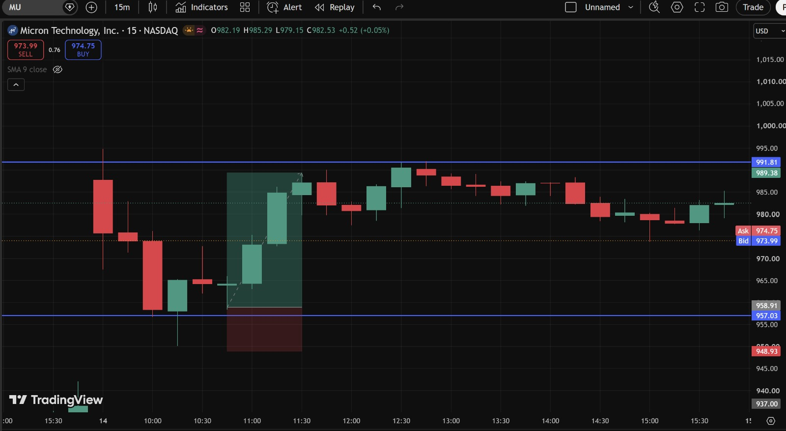
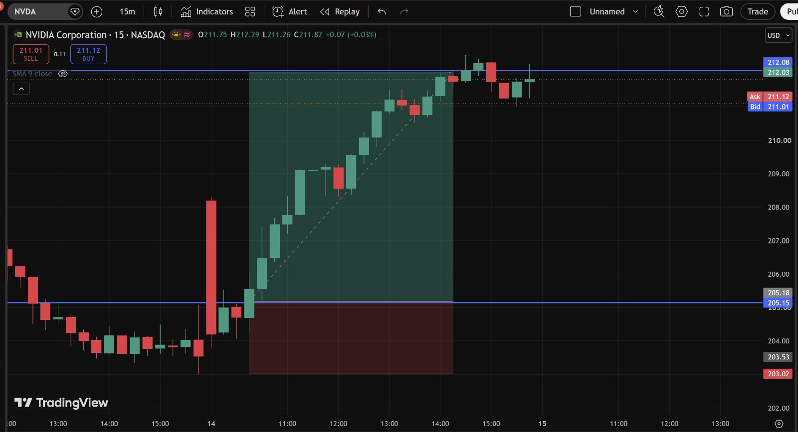
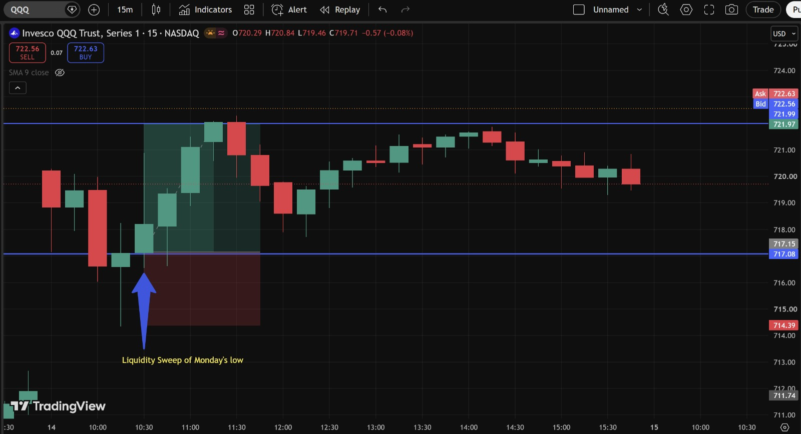
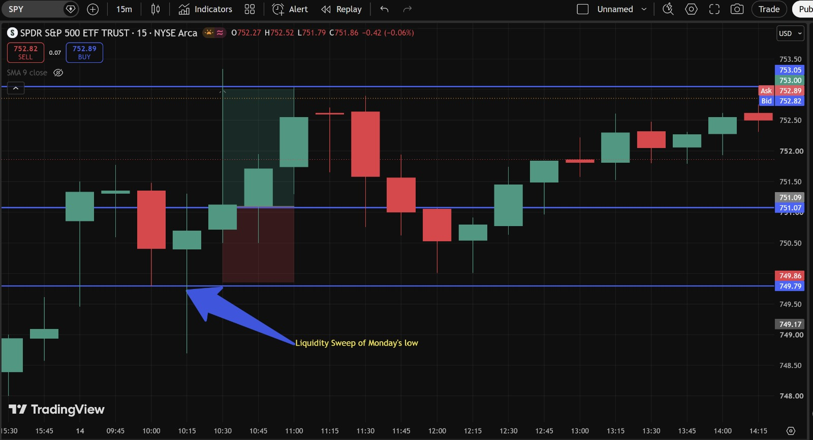
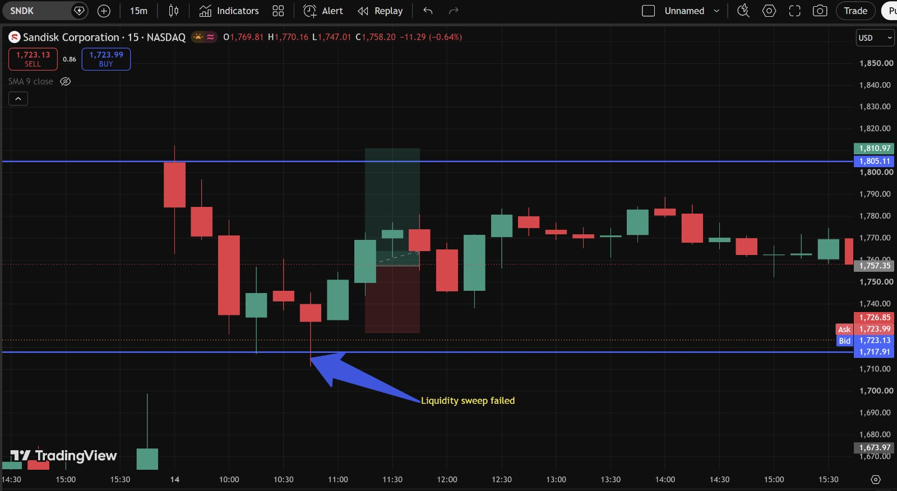

# Day 5 — US Market Analysis (14-07-2026)

**Work Format:** Pre-Market → Market Hours → After-Hours (IST evening-to-midnight coverage of the US session)

| Session | IST Timing | US Time (ET) |
|---|---|---|
| Pre-Market | 5:00 PM – 7:00 PM | 7:30 AM – 9:30 AM |
| Market Hours | 7:00 PM – 1:30 AM | 9:30 AM – 4:00 PM |
| After Hours | 1:30 AM – 2:30 AM | 4:00 PM – 5:00 PM |

---

## 1. Pre-Market Analysis (7:30 AM – 9:30 AM ET)

### Overnight/Morning Catalyst
Two big things were in play heading into Tuesday:
- **June CPI came in cooler than expected** — the first negative month-over-month headline print since 2020, with year-over-year inflation easing from 4.2% to roughly 3.8%. Cooler inflation data is generally read as bullish for stocks (less pressure on the Fed to stay hawkish).
- **Bank earnings kicked off the day**, and it was a mixed bag: **Goldman Sachs** and **JPMorgan** both beat expectations comfortably (Goldman EPS of $20.98 vs. $14.48 expected), **Bank of America** and **Wells Fargo** also beat. But **IBM plunged over 20%** pre-market after warning of soft software/infrastructure demand — a single stock heavy enough to knock roughly **425 points off the Dow** on its own.
- **The memory/chip sector was rebounding** after Monday's sharp SK Hynix-driven selloff — SK Hynix ADRs were up as much as ~7% pre-market, SanDisk +4–6%, Western Digital/Micron/Seagate +3%+, and Nvidia +1–4%, as some of Monday's panic reversed.

### Pre-Market Screenshot

**Important note on this screenshot:** at 9:16 AM ET the board was showing **MU -4.32%, NVDA -3.52%, SNDK -12.63%, QQQ -1.90%, SPY -0.78%** — all deeply red. This is the **same stale-data issue flagged back on Day 3**: these numbers are actually **Monday's (July 13) session losses**, not Tuesday's live pre-market move. Live pre-market data from other sources at the same time was showing the *opposite* picture — chip and memory names **rebounding**. This is now a confirmed, repeatable pattern with this specific "Most Active" data source early in the pre-market session, worth cross-checking against a live quote every morning going forward.

### How I Picked My Watchlist From Pre-Market
Kept the same 5 names from Day 4 (**MU, SNDK, NVDA, QQQ, SPY**), since Tuesday was a direct reaction/rebound day to Monday's selloff rather than a fresh setup — watching whether Monday's SK Hynix-driven decline (and the broader Monday's-low sweep visible across QQQ/SPY too) was a genuine trend change or a one-day panic that would mean-revert on the rebound.

---

## 2. Market Hours Observation (9:30 AM – 4:00 PM ET)

By the close: **S&P 500 +0.38%** to 7,543.59, **Nasdaq Composite +0.9%** to 26,107.01, **Dow +9.63 points (+0.02%)** to 52,508.27 — essentially flat, entirely because IBM's ~25% drop offset otherwise-strong bank earnings. Semiconductors were the clear leadership group, with the **VanEck Semiconductor ETF (SMH) trading +2.5%**.

All five names on the watchlist shared the same underlying mechanic on Tuesday: **a sweep of Monday's low, followed by a reclaim.** Four of the five reclaims turned into clean, sustained rallies to target. One (SNDK) reclaimed briefly, then failed to hold and rolled back over.

---

## 3. After-Hours Analysis (4:00 PM – 5:00 PM ET)

Heading into the next session, the key open questions:
- Whether **MU, NVDA, QQQ, and SPY** hold their reclaimed levels, confirming Monday's selloff really was a one-day panic.
- Whether **SNDK's** failed sweep is an isolated, stock-specific issue or an early warning sign that the broader rebound is less solid than the other four charts suggest.

---

## 4. Trade Strategy Per Stock — Actual Marked Levels (with Result)

> This section uses my own annotated 15m charts, with exact horizontal levels marked for the sweep zone and the target zone on each chart.

### 🟢 MU — LONG — ✅ **PASSED**

**Setup: Liquidity Sweep of the gap-fill zone (957.03 / 958.91), reclaim and rally to target (989.38 / 991.81)**

Price dropped down to sweep the **957–959** zone before reversing sharply and rallying in a strong, uninterrupted move up toward the **989–992** target zone.

| Parameter | Level | Notes |
|---|---|---|
| Entry | **959** | Reclaim above the sweep zone |
| Stop Loss | **950** | Below the sweep low |
| Target | **990** | Marked resistance zone (989.38–991.81) |
| **Result** | **✅ Passed** — price rallied cleanly into the 989–992 zone (session high 985.29, tagging the lower edge of the target band) before consolidating back to the current **973.99–974.75** | Strong, decisive reclaim candle with real follow-through — no hesitation on the way up |

**Chart:**

---

### 🟢 NVDA — LONG — ✅ **PASSED (exceeded)**

**Setup: Reclaim above 205.15 / 205.18, rally to target zone (212.03 / 212.08)**

After a sharp drop, a single large displacement candle broke back above **205**, and price continued climbing in a clean, linear move all the way to the **212** target zone.

| Parameter | Level | Notes |
|---|---|---|
| Entry | **205.18** | On the break/reclaim candle |
| Stop Loss | **203.02** | Below the session low |
| Target | **212.05** | Marked resistance zone (212.03–212.08) |
| **Result** | **✅ Passed and exceeded** — session high printed **212.29**, clearing the target; price is holding near the highs at **211.01–211.12** | The cleanest, most linear move of the day — the reclaim candle alone did most of the work, with very little chop along the way |

**Chart:**

---

### 🟢 QQQ — LONG — ✅ **PASSED**

**Setup: Liquidity Sweep of Monday's low (717.08 / 717.15), reclaim and rally**

Price swept down through **717**, tagging a low of **714.39**, then reversed and rallied cleanly back up through the marked zone.

| Parameter | Level | Notes |
|---|---|---|
| Entry | **717.15** | Reclaim above the sweep zone |
| Stop Loss | **714.39** | Below the sweep low |
| Target | **722.50** | Top of the marked rally zone |
| **Result** | **✅ Passed** — price is currently trading at **722.56–722.63**, at/above the target | Clean sweep-and-reclaim, same mechanic as MU, just on the index level |

**Chart:**

---

### 🟢 SPY — LONG — ✅ **PASSED (near-exact)**

**Setup: Liquidity Sweep of Monday's low (749.79 / 749.86), reclaim through 751.07 / 751.09, rally to target (753.00 / 753.05)**

Price swept down to **749.79**, reclaimed back above **751**, and grinded higher toward the marked target zone.

| Parameter | Level | Notes |
|---|---|---|
| Entry | **751.09** | Reclaim of the mid-level after the sweep |
| Stop Loss | **749.79** | Below the sweep low |
| Target | **753.00** | Marked resistance zone |
| **Result** | **✅ Passed (near-exact)** — current price **752.82–752.89**, essentially at the target | Slower, choppier climb than QQQ, but the same setup working the same way |

**Chart:**

---

### 🔴 SNDK — LONG — ❌ **FAILED ("Liquidity Sweep Failed")**

**Setup: Liquidity Sweep of the 1,717.91 / 1,723.13 zone, attempted reclaim toward target (1,805.11 / 1,810.97)**

This is the one trade of the day that didn't work, and it's worth understanding *why* in detail rather than just marking it as a loss.

Price swept down to a low near **1,717**, and the reclaim candle did break back above the **1,723** zone — on the surface, an identical setup to MU, QQQ, and SPY. But instead of continuing in a clean, sustained move like the other four, the rally **stalled inside the marked zone (1,740–1,810)**, chopped back and forth with several red candles mixed into the "rally," and ultimately **rolled back over** — giving back the entire reclaim and settling back down to **1,723.13–1,723.99**, right back at the original sweep/entry zone.

| Parameter | Level | Notes |
|---|---|---|
| Entry | **1,723** | Reclaim above the sweep zone |
| Stop Loss | **1,717** | Below the sweep low |
| Target | **1,808** | Marked resistance zone (1,805.11–1,810.97) |
| **Result** | **❌ Failed** — target never reached; price rallied partway into the zone, then reversed and is now back at the entry level | Stop-loss technically wasn't hit, but the trade never developed — this is a "failed liquidity sweep," not just an unlucky stop-out |

**Chart:**

**Why this one failed when the other four didn't:** The clearest difference on the chart is the **quality of the reclaim candle(s)**. MU, NVDA, QQQ, and SPY all reclaimed their sweep zones with a **strong, decisive candle (or a tight sequence of them) that kept pushing in one direction with very little immediate pushback** — real conviction behind the move. SNDK's reclaim, by contrast, was immediately followed by a red candle inside the same zone, then more chop — sellers stepped back in almost right away instead of stepping aside. A liquidity sweep on its own isn't the full signal; **the follow-through after the reclaim is what actually confirms the setup**, and SNDK never gave that confirmation. This is a good practical addition to the FVG/Liquidity checklist from the Day 8 notes: after a sweep and reclaim, watch for continued one-directional follow-through before trusting the move, not just the reclaim candle itself.

---

## 5. Trade Result Summary

| # | Stock | Setup Type | Side | Result |
|---|---|---|---|---|
| 1 | MU | Liquidity Sweep (957–959) → rally to 989–992 target | Long | ✅ Passed |
| 2 | NVDA | Reclaim at 205 → rally through 212 target | Long | ✅ Passed (exceeded) |
| 3 | QQQ | Liquidity Sweep of Monday's low → rally to 722.50 target | Long | ✅ Passed |
| 4 | SPY | Liquidity Sweep of Monday's low → rally to 753 target | Long | ✅ Passed (near-exact) |
| 5 | SNDK | Liquidity Sweep → reclaim → stalled and reversed | Long | ❌ Failed |

**Score: 4 for 5. SNDK is the one loss of the day.**

---

## Key Takeaways From Day 5

1. **All five trades used the exact same core mechanic** — a sweep of Monday's low or a similar level, followed by a reclaim — which makes today an unusually clean, controlled comparison of what separates a setup that works from one that doesn't, since the entry logic was identical across all five.
2. **SNDK's failure is more useful than the four wins combined**: the sweep and the reclaim candle both looked correct, but the move lacked follow-through immediately afterward. Adding a "did the reclaim get instantly challenged, or did it keep extending" check before fully trusting a sweep-and-reclaim setup is a direct, concrete improvement to take into next week.
3. **The pre-market data lag from Day 3 repeated itself again** — worth treating this as a permanent, standing check rather than a one-off surprise each time it happens.
4. **QQQ and SPY both passing the same setup as MU and NVDA** is good evidence Tuesday's rebound had genuine breadth behind it, which is exactly the kind of context that should increase conviction on individual stock setups like MU and NVDA going forward.
5. **Next Pre-Market session:** watch whether SNDK either retests and properly reclaims the 1,723 zone with real follow-through this time, or breaks back below 1,717 and confirms Tuesday's bounce has failed for that name specifically — while the other four (MU, NVDA, QQQ, SPY) hold their reclaimed levels.
