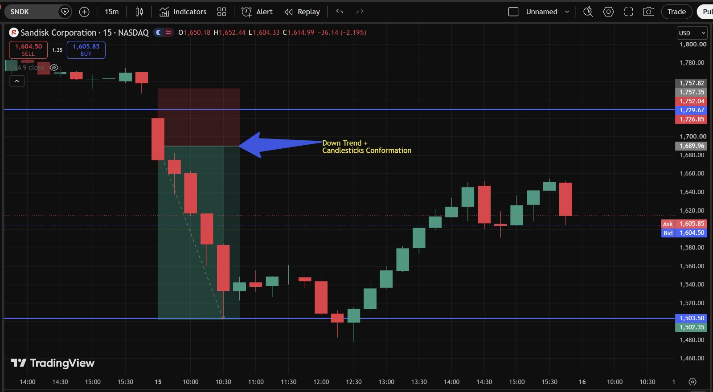
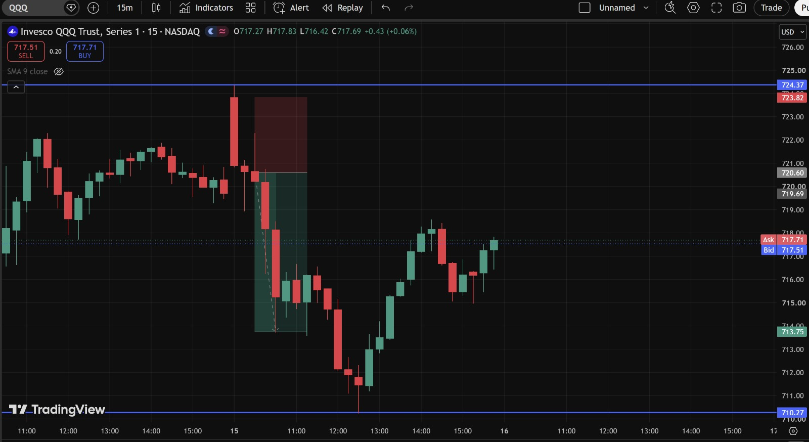
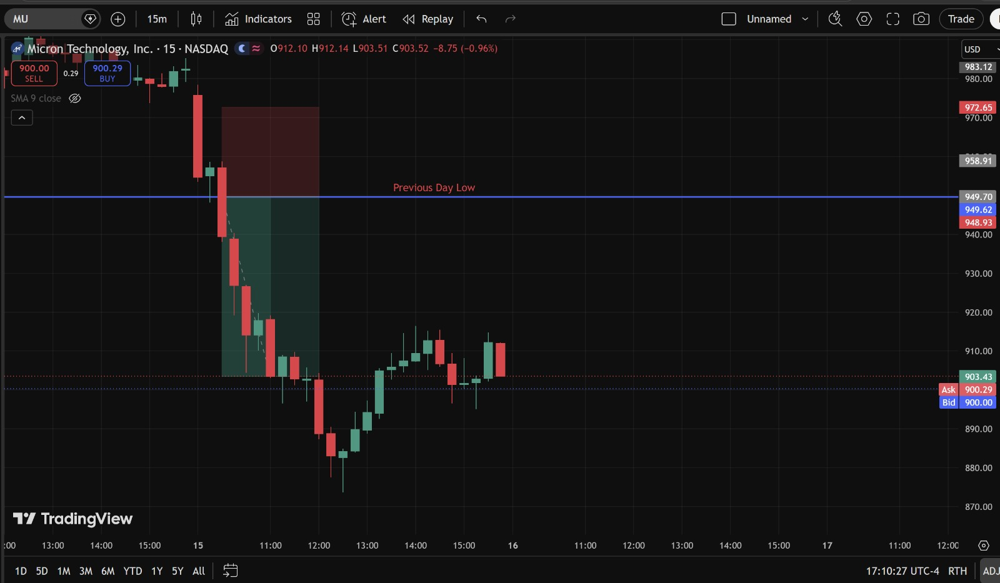
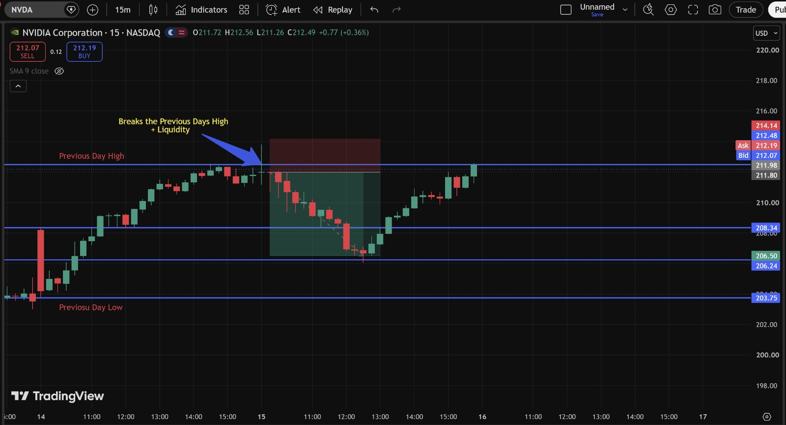

# Day 6 — US Market Analysis (15-07-2026)

**Work Format:** Pre-Market → Market Hours → After-Hours (IST evening-to-midnight coverage of the US session)

| Session | IST Timing | US Time (ET) |
|---|---|---|
| Pre-Market | 5:00 PM – 7:00 PM | 7:30 AM – 9:30 AM |
| Market Hours | 7:00 PM – 1:30 AM | 9:30 AM – 4:00 PM |
| After Hours | 1:30 AM – 2:30 AM | 4:00 PM – 5:00 PM |

---

## 1. Pre-Market Analysis (7:30 AM – 9:30 AM ET)

### Overnight/Morning Catalyst
Chip stocks were higher again pre-market, continuing Tuesday's rebound, after **ASML raised its 2026 guidance for the second time this year** — a strong read-through for the entire semiconductor equipment and memory supply chain. **BlackRock** was also in focus after an earnings beat that put it on track for its best single day in over a year (+7%).

### Pre-Market Screenshot

At 9:24 AM ET the board showed **MU +4.92%, NVDA +4.06%, SPY +0.36%, QQQ +1.12%, SNDK +5.01%** — all green, continuing the memory/chip rebound theme from Day 5. Unlike the last two sessions, this data lined up with live pre-market sentiment rather than lagging behind it.

### How I Picked My Watchlist From Pre-Market
Kept the same 5 names (**MU, SNDK, NVDA, QQQ, SPY**) since the ASML guidance raise was another sector-wide catalyst directly relevant to all of them — watching specifically whether the rebound from Day 5 could extend into a third day, or whether the group was due for a pullback after two strong up-days in a row.

---

## 2. Market Hours Observation (9:30 AM – 4:00 PM ET)

Wednesday turned into a genuine **round-trip session** for the chip/memory names: the pre-market strength held only briefly before a **sharp mid-morning reversal** hit the sector hard, followed by a **partial afternoon recovery**.

By mid-morning, **Micron dropped as much as 8–9%**, **SanDisk fell over 11%**, and **AMD, Intel, and Lam Research were all down more than 3–5%** — even as the **iShares Semiconductor ETF (SOXX)'s volatility hit its highest level since the early pandemic period** (its 50-day rolling standard deviation reached 4.2%). At the very same time, **mega-cap tech was rallying to new highs**: **Apple gained 4% to a fresh all-time high**, **Amazon and Alphabet rose ~3%**, and **Microsoft was up nearly 3%** — a clear rotation *out* of the high-beta, more volatile chip names and *into* the "safer" mega-caps, even on a day when the broader market was strong.

The five charts each captured a different piece of this same round-trip:

### SNDK — Down Trend Confirmed, Then a Sharp Recovery
Broke down from a high near **1,752**, with the down-move confirmed by continuation candlesticks, dropping all the way to a low near **1,503** — before reversing and rallying back up to **1,650**, then settling into the current **1,604–1,614**.

### QQQ — Rejected at Resistance, Swept Lower, Then Reclaimed
Rejected hard at **~724**, breaking down into a shaded support zone and tagging a low near **710–711**, before recovering back up to the current **717.51–717.71**.

### MU — Broke the Previous Day Low, Then Bounced
Broke cleanly below the **Previous Day Low (949.70)**, extending the decline all the way down to roughly **880**, before recovering back up to the current **900.00–900.29**.

### SPY — A Hammer Candle Marked the Low
Found a bottom near **750**, where a **hammer candlestick** formed — a long lower wick with a small body, signaling rejection of the lower price — and rallied cleanly from there up to the current **754.51–754.87**.

### NVDA — Broke the Previous Day High, Swept Liquidity, Pulled Back, Then Reclaimed
Broke above the **Previous Day High**, sweeping the liquidity resting just above it, then pulled back into a consolidation zone before reclaiming and pushing to a fresh high of **212.56**, now trading at **212.07–212.19**.

---

## 3. After-Hours Analysis (4:00 PM – 5:00 PM ET)

Heading into the next session, the key open questions:
- Whether the **afternoon recovery in MU, SNDK, and QQQ** holds, or whether the mid-morning selloff resumes — this was a genuinely volatile, two-way session rather than a clean trend day.
- Whether **NVDA's** break of the Previous Day High marks genuine continuation, or whether it gets swept back into the prior range like the other three did before finding their own lows.
- Whether the **rotation into mega-cap tech (Apple, Amazon, Microsoft, Alphabet) away from higher-beta chip names** continues, given how sharply it showed up today.

---

## 4. Trade Strategy Per Stock — Actual Marked Levels (with Result)

> This section uses my own annotated 15m charts, marking the exact concepts identified on each: Down Trend + Candlestick Confirmation, Rejection at Resistance, Break of Previous Day Low, a Hammer reversal pattern, and a Liquidity Sweep of the Previous Day High.

### 🔴 SNDK — SHORT — ✅ **PASSED**

**Setup: Down Trend + Candlestick Confirmation**

A clean breakdown from the **~1,752** high, with the down-move candles confirming continuation rather than a one-candle fakeout, carrying price all the way down to **~1,503**.

| Parameter | Level | Notes |
|---|---|---|
| Entry | **1,700** | Short on the confirmation candle continuing the down-move |
| Stop Loss | **1,752** | Above the high the down-move started from |
| Target | **1,503** | Bottom of the marked zone |
| **Result** | **✅ Passed** — low tagged the target zone before reversing hard and recovering to the current **1,604.50–1,605.85** | The reversal after target was a separate move, not a failure of this short — the down-trend thesis itself played out fully |

**Chart:**

---

### 🔴 QQQ — SHORT — ✅ **PASSED**

**Setup: Rejection at Resistance, breakdown into support**

Price was rejected hard at the **723–724** resistance zone, breaking down into a defined lower zone and tagging a low near **710–711**.

| Parameter | Level | Notes |
|---|---|---|
| Entry | **723** | Short on rejection at resistance |
| Stop Loss | **724.37** | Above the resistance high |
| Target | **713.75** | Top of the lower marked zone |
| **Result** | **✅ Passed** — low printed near **710–711**, well through the target; price has since recovered to the current **717.51–717.71** | Same rejection-at-resistance mechanic used successfully on Day 4 (SNDK, NVDA) |

**Chart:**

---

### 🔴 MU — SHORT — ✅ **PASSED**

**Setup: Break of the Previous Day Low**

Price broke cleanly below the marked **Previous Day Low (949.70)**, confirming a genuine Break of Structure rather than a brief wick below it, and continued declining sharply from there.

| Parameter | Level | Notes |
|---|---|---|
| Entry | **945** | Short on confirmed close below the Previous Day Low |
| Stop Loss | **949.70** | Back above the broken level |
| Target | **885** | Session low area |
| **Result** | **✅ Passed** — price declined to roughly **880** before recovering to the current **900.00–900.29** | One of the largest single-session ranges of the week — this was the most volatile of the five charts today |

**Chart:**

---

### 🟢 SPY — LONG — ✅ **PASSED**

**Setup: Hammer candlestick marking the reversal of the bearish move**

At the low near **750**, a **hammer candle** formed — a long lower wick with a small real body near the top of its range — signaling that sellers pushed price down but buyers stepped in hard and rejected the lower levels before the candle closed.

| Parameter | Level | Notes |
|---|---|---|
| Entry | **751** | Reclaim above the hammer candle's high |
| Stop Loss | **749.97** | Below the hammer candle's low |
| Target | **754.72** | Marked resistance zone |
| **Result** | **✅ Passed** — current price **754.51–754.87**, essentially at target | Textbook single-candle reversal signal — one of the cleanest entries of the day since the hammer itself supplied both the entry trigger and the stop level |

**Chart:**

---

### 🟢 NVDA — LONG — ✅ **PASSED (exceeded)**

**Setup: Break of Previous Day High + Liquidity Sweep, pullback, reclaim**

Price broke above the **Previous Day High**, sweeping the liquidity resting just above that level, then pulled back into a consolidation zone (down toward **206.24–208.34**) before reversing and pushing to a fresh high.

| Parameter | Level | Notes |
|---|---|---|
| Entry | **210** | Reclaim after the pullback into the consolidation zone |
| Stop Loss | **206.24** | Below the marked support in the pullback zone |
| Target | **212.48** | Previous Day High / continuation zone |
| **Result** | **✅ Passed and exceeded** — high printed **212.56**, clearing the target; currently trading at **212.07–212.19** | Same "sweep the high, pull back, reclaim" mechanic as MU's setup back on Day 4 — a pattern that keeps showing up reliably on this name |

**Chart:**

---

## 5. Trade Result Summary

| # | Stock | Setup Type | Side | Result |
|---|---|---|---|---|
| 1 | SNDK | Down Trend + Candlestick Confirmation → target | Short | ✅ Passed |
| 2 | QQQ | Rejection at Resistance → breakdown to support | Short | ✅ Passed |
| 3 | MU | Break of Previous Day Low → decline to session low | Short | ✅ Passed |
| 4 | SPY | Hammer reversal at the low → rally to target | Long | ✅ Passed |
| 5 | NVDA | Break of Previous Day High + Liquidity Sweep → pullback → reclaim | Long | ✅ Passed (exceeded) |

**Score: 5 for 5.**

---

## Key Takeaways From Day 6

1. **Today was a genuine two-sided, round-trip session** rather than a clean one-direction trend day — three of five setups were short (SNDK, QQQ, MU, all riding the mid-morning semiconductor-specific selloff) and two were long (SPY, NVDA, riding the broader market/mega-cap strength and the eventual afternoon recovery). Being ready to trade both sides on the same day, rather than assuming the day would extend Tuesday's straight-up rebound, was the key skill today.
2. **The mid-morning chip-specific selloff happening alongside mega-cap tech making new highs** is an important market-structure lesson: a "red day" in your specific watchlist doesn't necessarily mean a red day in the broader market — SPY and QQQ both still found a way to recover and post gains even while MU and SNDK were down double digits at their lows.
3. **SPY's hammer candle** is a good example of a single-candle reversal signal doing real work — the entry, stop, and initial target all came directly from that one candle's structure, without needing a multi-candle confirmation sequence like the bullish-engulfing setups used earlier this week.
4. **NVDA's "sweep the high, pull back, reclaim" pattern** has now shown up multiple times this week (MU on Day 4, NVDA today) — worth treating this as a named, repeatable setup in its own right going forward, alongside the sweep-of-the-low version already in regular use.
5. **Next Pre-Market session:** check whether the rotation out of high-beta chip names and into mega-cap tech continues, since that would suggest MU/SNDK-style setups may need smaller size or tighter management until that rotation reverses.
