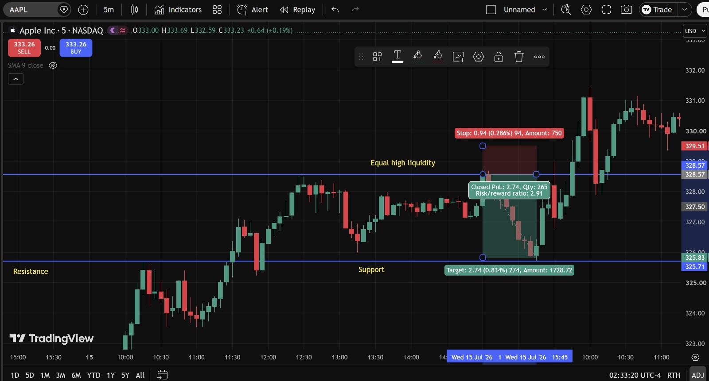
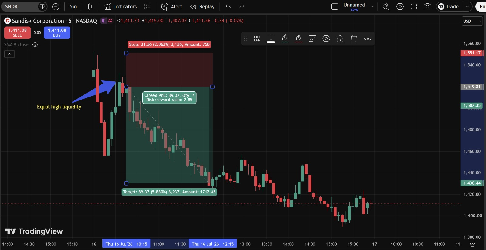
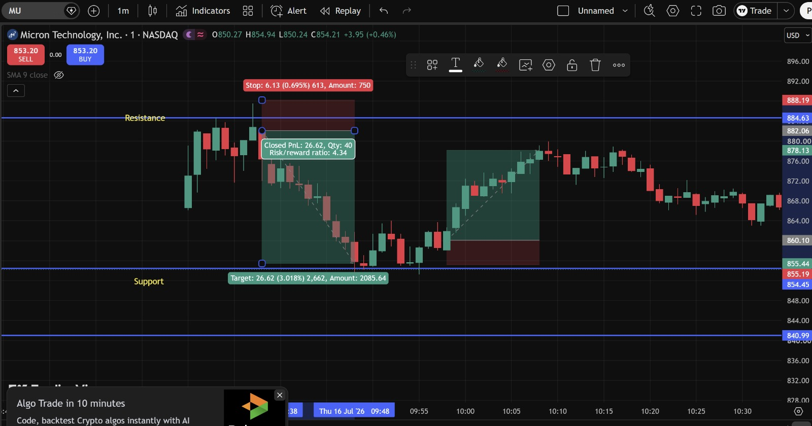

# Day 7 — US Market Analysis (16-07-2026)

**Work Format:** Pre-Market → Market Hours → After-Hours (IST evening-to-midnight coverage of the US session)

| Session | IST Timing | US Time (ET) |
|---|---|---|
| Pre-Market | 5:00 PM – 7:00 PM | 7:30 AM – 9:30 AM |
| Market Hours | 7:00 PM – 1:30 AM | 9:30 AM – 4:00 PM |
| After Hours | 1:30 AM – 2:30 AM | 4:00 PM – 5:00 PM |

---

## 1. Pre-Market Analysis (7:30 AM – 9:30 AM ET)

### Overnight/Morning Catalyst
The memory/chip sector extended its decline into a third day:
- **TSMC beat Q2 earnings**, but raised its full-year capex guidance sharply — from a prior **$52–56 billion** range up to **$60–64 billion** — and the market read the higher spending as a margin/return-on-investment concern rather than pure good news, sending the stock down more than 2% despite the beat.
- **SK Hynix fell over 7% pre-market**, **SanDisk and Western Digital both fell nearly 8%**, and **Micron broke below its $898 support level**, extending Wednesday's weakness into a third straight down session.
- A new, more structural worry also surfaced: reports that **China's CXMT (a domestic DRAM maker) is planning an $8.5 billion IPO**, raising questions about whether the current memory/DRAM upcycle could face new competitive supply risk down the line.
- **U.S.–Iran tensions re-escalated** again, adding a fresh layer of macro risk-off on top of the chip-specific weakness.
- Futures reflected the split: **Nasdaq 100 futures -0.91%**, **S&P 500 futures -0.28%**, while **Dow futures were actually +0.12%** — an early signal this would be another narrow, chip-concentrated decline rather than a broad market selloff.

### Pre-Market Screenshot

At 9:36 AM ET the board showed **MU -2.87%, SNDK -4.93%, NVDA -1.43%, QQQ -0.88%, AAPL -0.13%** — all red, with the memory names (MU, SNDK) leading the decline by a wide margin over the broader QQQ and AAPL, consistent with the "narrow, chip-specific selloff" read from the pre-market catalysts above.

### How I Picked My Watchlist From Pre-Market
Kept **MU and SNDK** on the list given they were still the epicenter of the three-day chip selloff, and added **AAPL** as a new name this week — specifically because reports referenced a **rotation out of semiconductors and into "Mag 7" names** during this same stretch, making Apple a good candidate to test whether that rotation thesis was showing up on the chart. NVDA and QQQ stayed on the radar from the pre-market board but weren't charted in detail today.

---

## 2. Market Hours Observation (9:30 AM – 4:00 PM ET)

By the close: **S&P 500 -0.51%** to 7,533.77, **Nasdaq Composite -1.47%** to 25,881.95, **Dow -105.67 points (-0.20%)** to 52,552.97. The **VanEck Semiconductor ETF (SMH) slid almost 4%**, led by a **5%+ drop in Arm Holdings**, and the **PHLX Semiconductor Index closed 16.5% off its June 22 high**.

**The key structural point of the day:** semiconductor stocks fell **4.3% as a group** and dragged the index down — even though **nearly 75% of all S&P 500 components actually finished higher.** Healthcare (+2.2%, led by UnitedHealth's strong earnings and raised guidance) and financials (Morgan Stanley posted record revenue) both had a strong day. This is exactly the kind of "narrow decline, broad advance" session the pre-market Dow-futures divergence hinted at.

### AAPL — Equal High Liquidity Swept, Then a Clean Drop
Price tagged an **equal-high liquidity zone at 328.57**, got rejected, and dropped cleanly toward the target zone near **325.83** — before rallying hard later in the session, up to **331** by the close, consistent with the broader "rotation into Mag 7" theme playing out intraday.

### SNDK — Equal High Liquidity Swept, Sharp Decline Continues
Similarly tagged an **equal-high liquidity zone near 1,519.81**, reversed hard, and declined all the way down toward **1,430**, extending the three-day memory-sector selloff.

### MU — Rejected at Resistance, Dropped to Support, Then Bounced
Rejected at a **Resistance level (884.63)**, dropped to the marked **Support zone (~858–860)**, and then staged a recovery rally back up toward **878–880** before fading again into the close.

---

## 3. After-Hours Analysis (4:00 PM – 5:00 PM ET)

Heading into the next session, the key open questions:
- Whether **AAPL's** late-session rally (326 → 331) is the start of a genuine "rotation into Mag 7" trend, or just an intraday bounce.
- Whether **MU's** bounce off Support (858–860) holds, or whether the three-day chip selloff resumes given the fresh CXMT/DRAM-supply concern.
- Whether **SNDK's** decline toward 1,430 finds support there or continues, given it's now down sharply across three straight sessions.

---

## 4. Trade Strategy Per Stock — Actual Executed Trades (with Result)

> This section documents the exact trades taken, using the TradingView position tool with precise entry, stop, target, and closed P&L for each.

### 🔴 AAPL — SHORT — ✅ **PASSED**

**Setup: Equal High Liquidity sweep and rejection**

Price tagged an **equal-high liquidity zone at 328.57** — a level where resting sell-stop/short-entry liquidity had built up from prior equal highs — and was rejected sharply from there.

| Parameter | Level | Notes |
|---|---|---|
| Entry | **328.57** | Short on rejection at the equal-high liquidity zone |
| Stop Loss | **329.51** | 0.94 (0.286%) above entry |
| Target | **325.83** | 2.74 (0.834%) below entry |
| **Closed Result** | **✅ Passed — Closed PnL +2.74, Qty 265, Risk/Reward 2.91** | Target reached cleanly; the later rally to 331 came *after* this position was already closed at target |

**Chart:**

---

### 🔴 SNDK — SHORT — ✅ **PASSED**

**Setup: Equal High Liquidity sweep and rejection**

Same concept as AAPL, on the name most directly at the center of the three-day memory selloff — price tagged an **equal-high liquidity zone near 1,519.81** and reversed hard.

| Parameter | Level | Notes |
|---|---|---|
| Entry | **1,519.81** | Short on rejection at the equal-high liquidity zone |
| Stop Loss | **1,551.17** | 31.36 (2.063%) above entry |
| Target | **1,430.44** | 89.37 (5.880%) below entry |
| **Closed Result** | **✅ Passed — Closed PnL +89.37, Qty 7, Risk/Reward 2.85** | Full target reached in a clean, sustained decline — the largest single-trade gain of the week in percentage terms |

**Chart:**

---

### 🔴 MU — SHORT — ✅ **PASSED**, then a secondary bounce off Support

**Setup: Rejection at Resistance, decline to Support**

Price was rejected at the marked **Resistance level (884.63)** and declined to the marked **Support zone (~858–860)**.

| Parameter | Level | Notes |
|---|---|---|
| Entry | **884.63** | Short on rejection at Resistance |
| Stop Loss | **~890.76** | 6.13 (0.695%) above entry |
| Target | **~858.01** | 26.62 (3.018%) below entry |
| **Closed Result** | **✅ Passed — Closed PnL +26.62, Qty 40, Risk/Reward 4.34** | The best risk/reward ratio of the day — a tight stop against a much larger target |

**Secondary observation (not a formally graded trade):** After tagging Support, price staged a clear recovery rally back up toward **878–880**, before fading again into the close. This lines up with the same "sweep/reject, then reclaim" mechanic used repeatedly earlier in the week (Day 4–6), just without a separately marked stop/target box this time.

**Chart:**

---

## 5. Trade Result Summary

| # | Stock | Setup Type | Side | Result |
|---|---|---|---|---|
| 1 | AAPL | Equal High Liquidity sweep and rejection | Short | ✅ Passed (+2.74, R:R 2.91) |
| 2 | SNDK | Equal High Liquidity sweep and rejection | Short | ✅ Passed (+89.37, R:R 2.85) |
| 3 | MU | Rejection at Resistance → decline to Support | Short | ✅ Passed (+26.62, R:R 4.34) |

**Score: 3 for 3, all with Risk/Reward ratios above 2.8.**

### Normalized Results — $100 Total Capital Per Trade

To make the three trades easy to compare on equal footing, this table assumes **$100 of total capital deployed per trade** (not $100 of risk) — i.e., $100 worth of the stock taken short on each name. Since every trade closed at full target, the dollar profit is simply **$100 × the target's percentage move**, using the exact percentages from each trade's target label.

| # | Stock | Capital | Target Move | Result | P&L |
|---|---|---|---|---|---|
| 1 | AAPL | $100 | 0.834% | ✅ Target hit | **+$0.83** |
| 2 | SNDK | $100 | 5.880% | ✅ Target hit | **+$5.88** |
| 3 | MU | $100 | 3.018% | ✅ Target hit | **+$3.02** |
| — | **Total** | **$300 deployed** | — | **3 for 3** | **+$9.73** |

**On $300 total capital deployed across the three trades, the day returned $9.73 in profit — roughly a 3.24% return on capital deployed.** SNDK did the most work here since its target represented the largest single percentage move (5.88%), even though MU had the better Risk/Reward ratio — a good reminder that R:R and percentage return are two different things: R:R tells you how good the trade was *relative to what you risked losing*, while this table shows the actual return *on the capital you put to work*.

---

## Key Takeaways From Day 7

1. **All three trades today were built on the same core idea — price rejecting at a level where resting liquidity or a defined Resistance zone sat — just labeled slightly differently on each chart** (Equal High Liquidity vs. plain Resistance). Recognizing these as the same underlying concept, rather than three separate patterns, continues to be the most useful mental shortcut from this whole week.
2. **The index-level story (semiconductors -4.3% while ~75% of S&P components rose) is a good reminder that a strong watchlist day doesn't require a strong overall market** — all three shorts worked precisely *because* the decline was concentrated in chips, not despite the broader market's strength elsewhere (Healthcare, Financials).
3. **AAPL's late rally to 331, after the short had already closed at target**, is a useful, low-stakes example of why locking in a defined target matters — chasing this one further short into the later rally would have turned a clean win into a loss.
4. **MU's Resistance-to-Support trade posted the best risk/reward of the day (4.34)** — worth noting what made the stop so tight relative to the target here (a well-defined, recently-tested Resistance level right at the entry) as a model for sizing future entries where a similarly tight invalidation level is available.
5. **Next Pre-Market session:** watch whether the CXMT/DRAM-supply competition story becomes a recurring overhang on MU and SNDK specifically, since that's a new, more structural narrative than the day-to-day AI-capex sentiment swings that have driven most of this week's moves.
