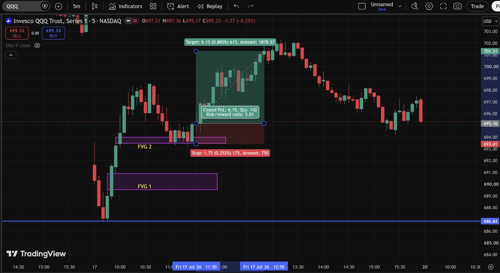
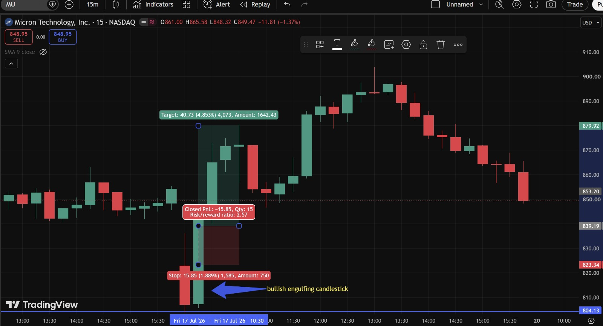
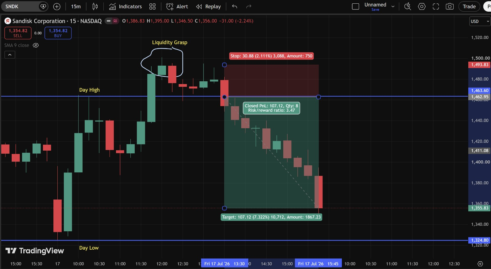
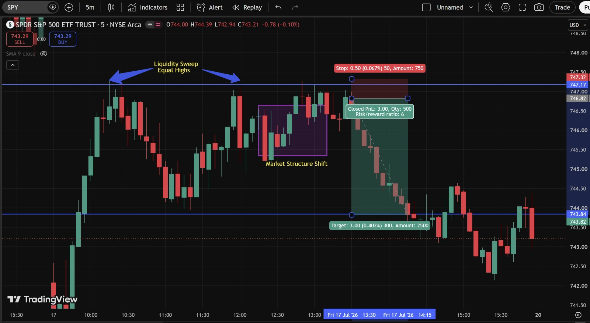
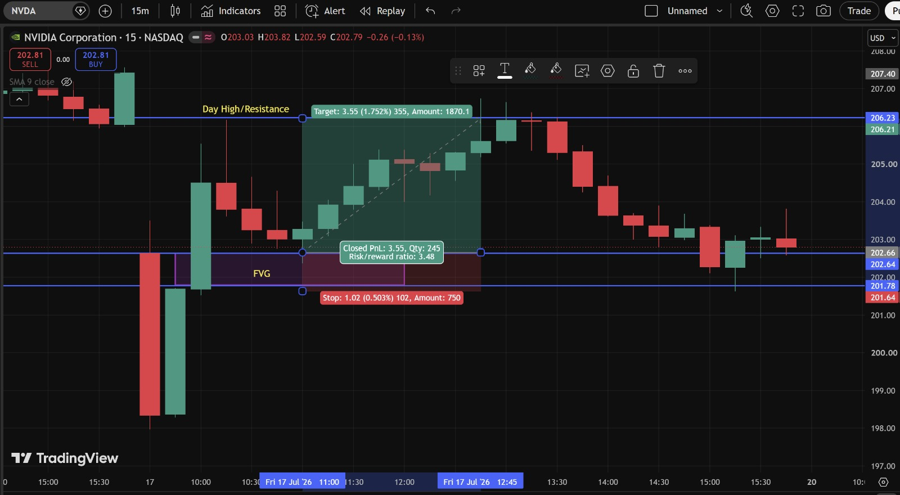

# Day 8 — US Market Analysis (17-07-2026)

**Work Format:** Pre-Market → Market Hours → After-Hours (IST evening-to-midnight coverage of the US session)

| Session | IST Timing | US Time (ET) |
|---|---|---|
| Pre-Market | 5:00 PM – 7:00 PM | 7:30 AM – 9:30 AM |
| Market Hours | 7:00 PM – 1:30 AM | 9:30 AM – 4:00 PM |
| After Hours | 1:30 AM – 2:30 AM | 4:00 PM – 5:00 PM |

---

## 1. Pre-Market Analysis (7:30 AM – 9:30 AM ET)

### Overnight/Morning Catalyst
The memory-sector rout that's been building all week deepened further:
- **Micron traded intraday between $873.63 and $982.40** the prior session, settling around **$876** — now roughly **27–29% below** the nearly **$1,200 high** it touched in June. Along with **SK Hynix** and **Samsung**, the whole memory group is now down **more than 20% from recent highs**, which several outlets are now describing as the sector having entered a **bear market**.
- **Barron's flagged a longer-term structural concern**: reports that **Micron faces intensifying competition from Chinese memory-chip makers** (the CXMT threat first mentioned earlier this week), reframed as a rising competitive risk rather than a one-off headline.
- Adding to the negative sentiment: **high-profile investor Michael Burry** established a **put-option position against Micron** near $1,051.87 on July 1st, and **Micron's CEO Sanjay Mehrotra** has been selling shares under a pre-arranged trading plan, with **insider selling at its highest level since 2010**.
- Semiconductor stocks broadly have lost an estimated **$1.5 trillion in combined market value** since June 25th, with **Micron alone down close to $350 billion** over that stretch.

### Pre-Market Screenshot

At 9:22 AM ET the board showed **MU -5.65%, SPY -0.54%, NVDA -2.40%, SNDK -12.63%, QQQ -1.64%** — all red, with **SNDK's -12.63%** standing out as by far the steepest pre-market move of the week, confirming the memory-sector bear-market narrative was still the dominant story heading into the open.

### How I Picked My Watchlist From Pre-Market
Kept the same core watchlist (**MU, SNDK, NVDA, QQQ, SPY**) given the memory-sector story was clearly not resolved yet — SNDK's outsized pre-market drop specifically made it the priority name to watch for a potential liquidity-driven reversal, given how stretched the move had become.

---

## 2. Market Hours Observation (9:30 AM – 4:00 PM ET)

The session continued the pattern from earlier in the week — sharp, fast moves within the memory/chip complex, with several names showing clear liquidity-driven reversals rather than clean one-directional trends.

### QQQ — FVG Mitigation, Long to Target
Price built two Fair Value Gaps (FVG 1 and FVG 2) during an early decline, then reclaimed back up through both zones, rallying cleanly to the target area near **701–702**.

### MU — Bullish Engulfing Candlestick, Stopped Out
A bullish engulfing candle printed at the bottom of a sharp decline, suggesting a reversal — but the follow-through failed to hold, and the trade was stopped out before the larger rally that followed later in the session.

### SNDK — Liquidity Grasp, Short to Target
Price tagged a **"Liquidity Grasp"** zone at the top of a bounce (a pocket of resting liquidity from equal-ish highs), reversed hard, and declined all the way to the target zone.

### SPY — Liquidity Sweep of Equal Highs + Market Structure Shift, Short to Target
Price swept two equal highs, then showed a clear **Market Structure Shift** (a break in the pattern of higher highs/higher lows), confirming a short into the target zone.

### NVDA — FVG Reclaim, Long to Day High/Resistance
Price reclaimed through a Fair Value Gap and rallied cleanly up to the marked **Day High/Resistance** level.

---

## 3. After-Hours Analysis (4:00 PM – 5:00 PM ET)

Heading into the next session, the key open questions:
- Whether **MU's** failed bullish-engulfing setup was simply a shakeout ahead of a larger move, or a genuine sign the stock isn't ready to reverse yet given the deepening bear-market narrative.
- Whether **SNDK's** sharp decline off the "Liquidity Grasp" zone continues, or whether the stock is nearing a level where dip-buyers (noted as still active on sentiment trackers) step back in.
- Whether the broader memory/chip bear-market narrative (Burry's put position, insider selling, CXMT competition) keeps weighing on the whole group into next week.

---

## 4. Trade Strategy Per Stock — Actual Executed Trades (with Result)

> This section documents the exact trades taken, using the TradingView position tool with precise entry, stop, target, and closed P&L for each.

### 🟢 QQQ — LONG — ✅ **PASSED**

**Setup: FVG 1 and FVG 2 mitigation, reclaim and rally**

Price built two Fair Value Gaps during the decline (FVG 1 near 690, FVG 2 near 693.5–695.5), then reclaimed back through both zones and rallied cleanly.

| Parameter | Level | Notes |
|---|---|---|
| Entry | **695.16** | Reclaim above FVG 2 |
| Stop Loss | **693.41** | 1.75 (0.252%) below entry |
| Target | **701.31** | 6.15 (0.885%) above entry |
| **Closed Result** | **✅ Passed — Closed PnL +6.15, Qty 142, Risk/Reward 3.51** | Clean, sustained rally through both FVG zones to target |

**Chart:**

---

### 🔴 MU — LONG — ❌ **FAILED (stopped out)**

**Setup: Bullish Engulfing Candlestick**

A bullish engulfing candle printed at the bottom of a sharp decline — the same concept used successfully on Day 3's NVDA trade — but this time the follow-through didn't hold.

| Parameter | Level | Notes |
|---|---|---|
| Entry | **839.19** | On the bullish engulfing candle |
| Stop Loss | **823.34** | 15.85 (1.889%) below entry |
| Target | **879.92** | 40.73 (4.853%) above entry |
| **Closed Result** | **❌ Failed — Closed PnL -15.85, Qty 15, Risk/Reward 2.57** | Price dipped back through the stop before the larger rally (which did eventually reach the target zone) got underway |

**Chart:**

**Why this one failed:** Looking at the chart afterward, price *did* eventually rally into the target zone (890+) — but only after first dipping back through the stop level. This is a good example of a genuinely correct directional read (the engulfing candle did mark a real low) undermined by an entry that was a touch too early relative to the stop placement — the follow-through needed a bit more room than the stop allowed for. Worth revisiting whether a slightly wider stop, or waiting for one more confirmation candle after the engulfing pattern, would have kept this one in play.

---

### 🔴 SNDK — SHORT — ✅ **PASSED**

**Setup: Liquidity Grasp at the top of a bounce**

Price rallied into a **"Liquidity Grasp"** zone — a pocket of resting liquidity near a recent high — before reversing sharply.

| Parameter | Level | Notes |
|---|---|---|
| Entry | **1,463.60** | Short on rejection at the Liquidity Grasp zone |
| Stop Loss | **1,493.83** | 30.88 (2.111%) above entry |
| Target | **1,355.83** | 107.12 (7.322%) below entry |
| **Closed Result** | **✅ Passed — Closed PnL +107.12, Qty 8, Risk/Reward 3.47** | The largest single-trade percentage move of the day, consistent with SNDK being the most extended name on the whole watchlist this week |

**Chart:**

---

### 🔴 SPY — SHORT — ✅ **PASSED**

**Setup: Liquidity Sweep of Equal Highs + Market Structure Shift**

Price swept two equal highs (clearing out resting liquidity from both), then printed a **Market Structure Shift** — a clear break in the prior pattern of higher highs and higher lows — confirming the reversal.

| Parameter | Level | Notes |
|---|---|---|
| Entry | **746.82** | Short on confirmation of the Market Structure Shift |
| Stop Loss | **747.32** | 0.50 (0.067%) above entry |
| Target | **743.82** | 3.00 (0.402%) below entry |
| **Closed Result** | **✅ Passed — Closed PnL +3.00, Qty 500, Risk/Reward 6.0** | The best Risk/Reward ratio of the day by a wide margin — an extremely tight stop against a well-defined target |

**Chart:**

---

### 🟢 NVDA — LONG — ✅ **PASSED**

**Setup: FVG reclaim, rally to Day High/Resistance**

Price reclaimed through a Fair Value Gap zone and rallied cleanly up toward the marked **Day High/Resistance** level.

| Parameter | Level | Notes |
|---|---|---|
| Entry | **202.66** | Reclaim above the FVG zone |
| Stop Loss | **201.64** | 1.02 (0.503%) below entry |
| Target | **206.21** | 3.55 (1.752%) above entry, matching Day High/Resistance |
| **Closed Result** | **✅ Passed — Closed PnL +3.55, Qty 245, Risk/Reward 3.48** | Clean FVG-reclaim setup, same mechanic used successfully earlier this week |

**Chart:**

---

## 5. Trade Result Summary

| # | Stock | Setup Type | Side | Result |
|---|---|---|---|---|
| 1 | QQQ | FVG 1 & 2 mitigation → reclaim and rally | Long | ✅ Passed (+6.15, R:R 3.51) |
| 2 | MU | Bullish Engulfing Candlestick | Long | ❌ Failed (-15.85, R:R 2.57) |
| 3 | SNDK | Liquidity Grasp at the top | Short | ✅ Passed (+107.12, R:R 3.47) |
| 4 | SPY | Liquidity Sweep of Equal Highs + Market Structure Shift | Short | ✅ Passed (+3.00, R:R 6.0) |
| 5 | NVDA | FVG reclaim → rally to Resistance | Long | ✅ Passed (+3.55, R:R 3.48) |

**Score: 4 for 5. MU is the one loss of the day.**

### Normalized Results — $100 Total Capital Per Trade

To make the five trades easy to compare on equal footing, this table assumes **$100 of total capital allocated to each trade** (not $100 of risk), with the dollar result calculated directly from each trade's actual percentage move — a gain to target for the four winners, and a loss to the stop level for MU.

| # | Stock | Capital | % Move | Result | P&L |
|---|---|---|---|---|---|
| 1 | QQQ | $100 | +0.885% | ✅ Target hit | **+$0.89** |
| 2 | MU | $100 | -1.889% | ❌ Stopped out | **-$1.89** |
| 3 | SNDK | $100 | +7.322% | ✅ Target hit | **+$7.32** |
| 4 | SPY | $100 | +0.402% | ✅ Target hit | **+$0.40** |
| 5 | NVDA | $100 | +1.752% | ✅ Target hit | **+$1.75** |
| — | **Total** | **$500 deployed** | — | **4 for 5** | **+$8.47** |

**On $500 total capital deployed across the five trades, the day returned $8.47 in profit — roughly a 1.69% return on capital deployed.** SNDK alone contributed nearly the entire day's gain (+$7.32 out of +$8.47 net), while MU's loss (-$1.89) was easily the smallest dollar swing of the day despite being the one failed trade — a good reminder that a loss doesn't have to be large to still be a loss worth learning from.

---

## Key Takeaways From Day 8

1. **SNDK's Liquidity Grasp short did the heavy lifting for the whole day** — both in raw percentage terms (7.322%, more than double any other trade) and in dollar terms on the normalized table. This lines up directly with the Pareto-principle lesson from the TraderLion notes: a small number of trades tend to account for the majority of a day's (or a system's) net profit.
2. **MU's failed bullish-engulfing setup is this week's most instructive loss**: the directional read was correct (price did eventually rally into the target zone), but the stop was hit first. This points to a concrete process question worth testing going forward — whether waiting for one additional confirmation candle after an engulfing pattern, rather than entering on the engulfing candle itself, would filter out this kind of early stop-out.
3. **SPY's Risk/Reward of 6.0** was the standout of the day — a very tight, well-defined stop (0.067%) against a clean target, off a textbook Liquidity Sweep + Market Structure Shift combination.
4. **The broader memory-sector bear-market narrative (Burry's put position, insider selling, CXMT competition, -20%+ across the whole group) is now a multi-week, structural story**, not just a single bad day — worth treating MU and SNDK setups with extra caution around position sizing until this theme resolves one way or the other.
5. **Next Pre-Market session:** check whether SNDK's decline is finding any stabilization given how extended the move has become, and whether MU's bullish-engulfing thesis gets a second, better-confirmed opportunity to play out.
