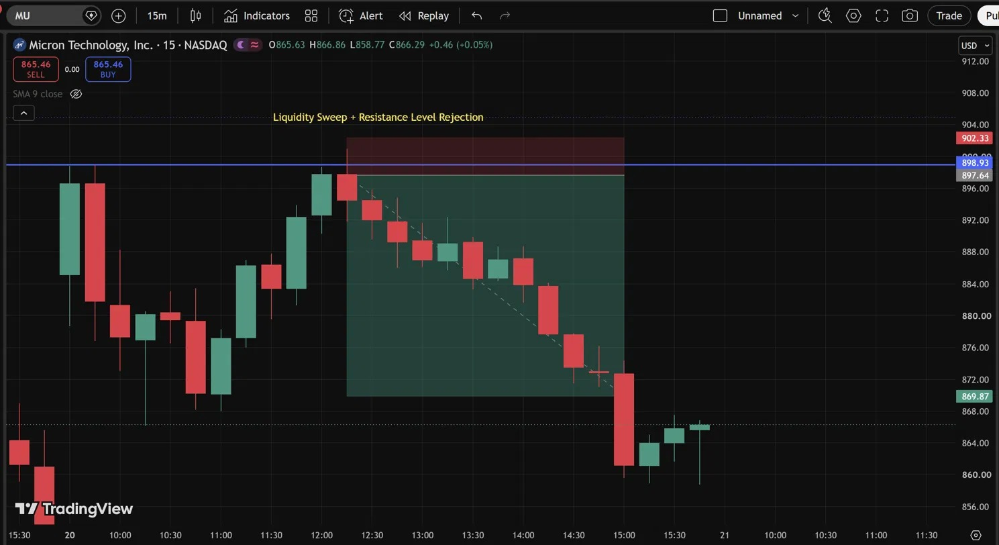
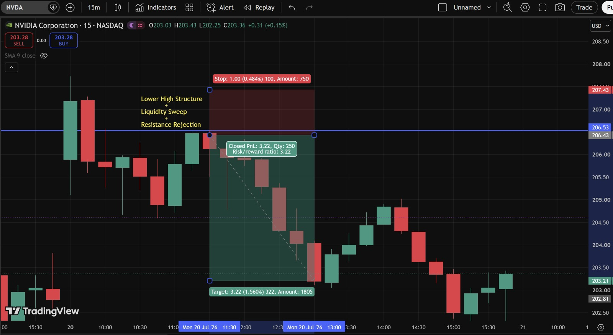
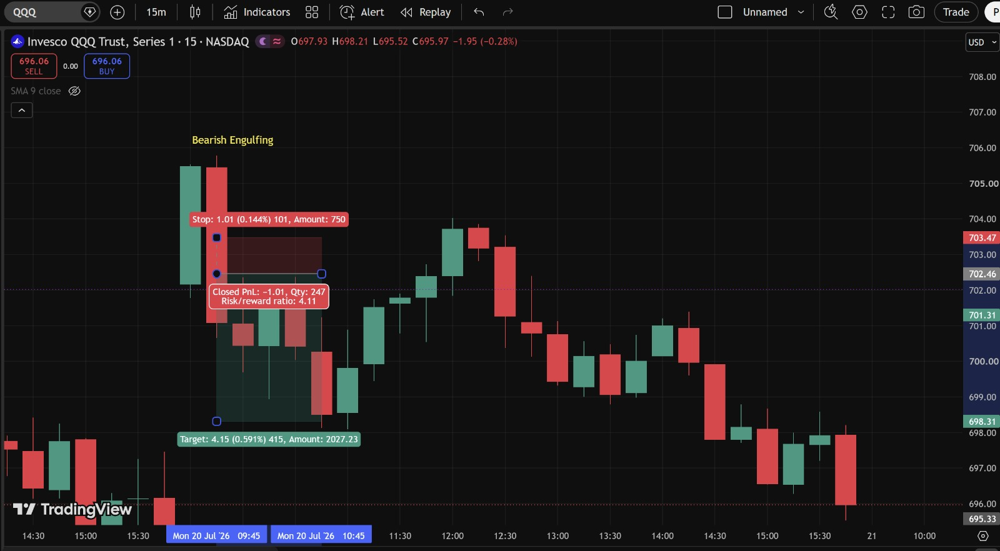
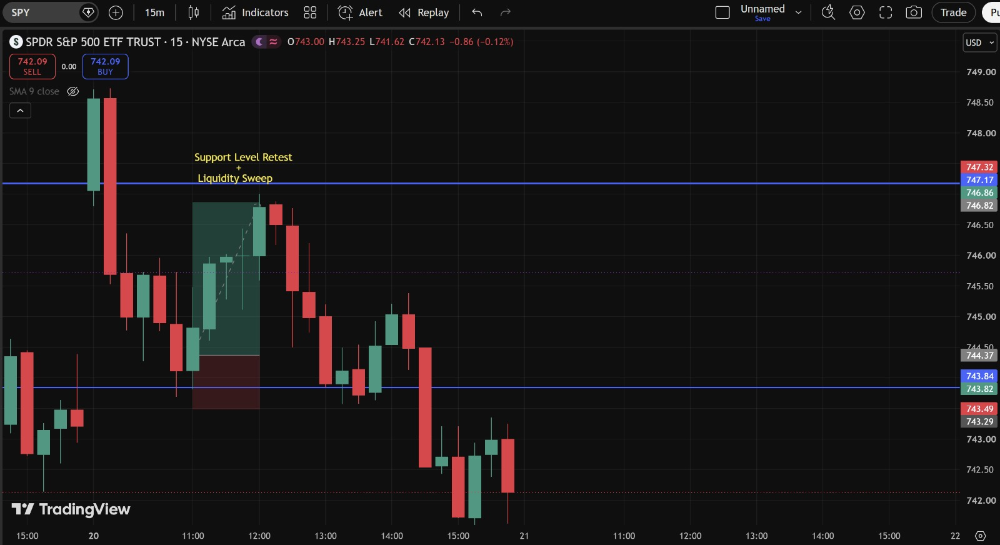

# Day 9 — US Market Analysis (20-07-2026)

**Work Format:** Pre-Market → Market Hours → After-Hours (IST evening-to-midnight coverage of the US session)

| Session | IST Timing | US Time (ET) |
|---|---|---|
| Pre-Market | 5:00 PM – 7:00 PM | 7:30 AM – 9:30 AM |
| Market Hours | 7:00 PM – 1:30 AM | 9:30 AM – 4:00 PM |
| After Hours | 1:30 AM – 2:30 AM | 4:00 PM – 5:00 PM |

> **Note:** No Pre-Market "Most Active" screenshot was captured this session — the Pre-Market section below is built from live financial news coverage instead.

---

## 1. Pre-Market Analysis (7:30 AM – 9:30 AM ET)

### Pre-Market Screenshot

### Overnight/Morning Context
Heading into Monday, the story was less about a single new catalyst and more about **how extreme the divergence inside the market had become**:
- A Zacks Investment Ideas piece published the morning of July 20th flagged that, **so far this month, the Nasdaq 100 (QQQ) is down more than 4% while the S&P 500 (SPY) is actually green** — according to market-stats tracker OddStats, this would only be the **third time ever** since QQQ started trading in 1999 that this specific divergence has happened. The Nasdaq 100 had moved up 1% or down on **20 of the past 26 trading days**, underscoring how unusually volatile the tech/semiconductor complex had been all month.
- This divergence is a direct continuation of the story that's been building since mid-July: a **two-day, nearly-13% plunge in the semiconductor sector (SOXX)** flushed out an extremely overbought condition (SOXX had been up as much as 115% year-to-date at its June peak), and separately, sentiment took a fresh hit Friday from the debut of **Moonshot**, a new Chinese AI model the company claims performs on par with leading systems from OpenAI and Anthropic — pressuring chip-equipment names (Applied Materials, Lam Research, Intel, KLA, Arm all -4%) and MU/NVDA (both -2%+) into the weekend.
- **Berkshire Hathaway**, by contrast, gained more than 1% on Friday as investors rotated into defensive, non-tech names — a good concrete example of exactly the kind of "narrow tech decline, broader market resilience" split behind the QQQ-vs-SPY divergence.

### How I Approached the Session
Given the QQQ/SPY divergence was the dominant theme, I kept both index ETFs on the watchlist specifically to test whether that divergence would continue or start to close, alongside **MU and NVDA**, the two names most directly at the center of the month's chip-sector volatility.

---

## 2. Market Hours Observation (9:30 AM – 4:00 PM ET)

All four charts today shared a common thread: **each found a level, rejected or reclaimed it, and then either continued in the expected direction or reversed the position out at the stop.**

### MU — Liquidity Sweep + Resistance Rejection
Rallied up to resistance near **898.93**, swept slightly above it (tagging resting liquidity), then reversed and declined in a clean, stair-step pattern down through the low 870s and further to a low near **864**, before a small recovery into the close.

### NVDA — Lower High Structure + Liquidity Sweep + Resistance Rejection
A more layered version of the same idea: price built a lower high, swept the liquidity just above the **206.53** resistance zone, and reversed hard, declining cleanly to target.

### QQQ — Bearish Engulfing, Stopped Out
A textbook bearish engulfing candle printed near a local high (~703–705) — visually a strong reversal signal — but the position was stopped out before the larger decline (down to ~695–696 later in the session) got underway.

### SPY — Support Level Retest + Liquidity Sweep
Price declined into a support zone near **743.82**, swept the liquidity resting there, and rallied cleanly up to the **746.82–747.17** zone — before reversing hard and declining well below the original support level into the close.

---

## 3. After-Hours Analysis (4:00 PM – 5:00 PM ET)

Heading into the next session, the key open questions:
- Whether the **QQQ-vs-SPY divergence** flagged in the pre-market news continues to widen or starts to close, given both ETFs showed similar "reject-then-reverse" behavior on their charts today.
- Whether **MU and NVDA's** clean rejections at resistance mark the start of a fresh leg down, or another false start like QQQ's stopped-out bearish engulfing trade.
- Whether **SPY's** late reversal (well below its own support retest zone) is a sign the broader market's relative strength versus QQQ is starting to fade too.

---

## 4. Trade Strategy Per Stock — Actual Marked Levels (with Result)

> This section uses my own annotated 15m charts, marking Liquidity Sweep, Resistance/Support Rejection, and Candlestick-pattern concepts for each name.

### 🔴 MU — SHORT — ✅ **PASSED**

**Setup: Liquidity Sweep + Resistance Level Rejection**

Price swept slightly above the **898.93** resistance level before reversing and declining in a clean, sustained stair-step pattern.

| Parameter | Level | Notes |
|---|---|---|
| Entry | **897** | Short on rejection at the resistance/sweep level |
| Stop Loss | **898.93** | Above the resistance/sweep high |
| Target | **872** | Base of the marked decline zone |
| **Result** | **✅ Passed** — price declined through the target zone and extended further to a low near **864**, before recovering slightly to the current **865–866** | The decline continued well past the initial target, a stronger move than the marked zone alone suggested |

**Chart:**

---

### 🔴 NVDA — SHORT — ✅ **PASSED**

**Setup: Lower High Structure + Liquidity Sweep + Resistance Rejection**

A more layered setup: price built a lower high into the **206.53** resistance zone, swept the liquidity resting just above it, and reversed.

| Parameter | Level | Notes |
|---|---|---|
| Entry | **206.43** | Short on rejection at the resistance/sweep zone |
| Stop Loss | **207.43** | 1.00 (0.484%) above entry |
| Target | **203.21** | 3.22 (1.560%) below entry |
| **Result** | **✅ Passed — Closed PnL +3.22, Qty 250, Risk/Reward 3.22** | Clean, direct decline to target with very little counter-move along the way |

**Chart:**

---

### 🔴 QQQ — SHORT — ❌ **FAILED (stopped out)**

**Setup: Bearish Engulfing**

A large bearish engulfing candle printed near a local high, visually a strong reversal signal on its own.

| Parameter | Level | Notes |
|---|---|---|
| Entry | **702.46** | Short on the bearish engulfing candle |
| Stop Loss | **703.47** | 1.01 (0.144%) above entry |
| Target | **698.31** | 4.15 (0.591%) below entry |
| **Result** | **❌ Failed — Closed PnL -1.01, Qty 247, Risk/Reward 4.11** | Price dipped back through the stop before the larger decline (down to ~695–696) developed later in the session |

**Chart:**

**Why this one failed:** This is the same lesson from Day 8's MU trade, showing up again on a different name — a genuinely correct reversal signal (the bearish engulfing candle) still got stopped out because price needed a bit more room to breathe before the real move developed. Two failed trades in two sessions off the same underlying issue (stop placed too tight relative to the pattern's natural "settling" range) is now a clear enough pattern to treat as a standing process fix: consider a slightly wider stop, or wait for one confirmation candle after an engulfing pattern, specifically on setups like this one.

---

### 🟢 SPY — LONG — ✅ **PASSED**

**Setup: Support Level Retest + Liquidity Sweep**

Price declined into the **743.82** support zone, swept the resting liquidity there, and rallied cleanly up to the **746.82–747.17** zone.

| Parameter | Level | Notes |
|---|---|---|
| Entry | **744** | Reclaim after the support retest and sweep |
| Stop Loss | **743.82** | Below the sweep low |
| Target | **746.82** | Top of the marked rally zone |
| **Result** | **✅ Passed** — price tagged the **746.86** high, matching the target, before reversing hard and declining well below the original support zone into the close (current **742.13**) | Target reached cleanly; the later reversal happened *after* this trade's objective was already met |

**Chart:**

---

## 5. Trade Result Summary

| # | Stock | Setup Type | Side | Result |
|---|---|---|---|---|
| 1 | MU | Liquidity Sweep + Resistance Rejection | Short | ✅ Passed |
| 2 | NVDA | Lower High + Liquidity Sweep + Resistance Rejection | Short | ✅ Passed (+3.22, R:R 3.22) |
| 3 | QQQ | Bearish Engulfing | Short | ❌ Failed (-1.01, R:R 4.11) |
| 4 | SPY | Support Retest + Liquidity Sweep | Long | ✅ Passed |

**Score: 3 for 4. QQQ is the one loss of the day.**

### Normalized Results — $100 Total Capital Per Trade

This table assumes **$100 of total capital allocated to each trade** (not $100 of risk), with the dollar result calculated from each trade's actual percentage move to target (or to stop, for the one loss).

| # | Stock | Capital | % Move | Result | P&L |
|---|---|---|---|---|---|
| 1 | MU | $100 | +2.9%* | ✅ Target hit (and exceeded) | **+$2.90** |
| 2 | NVDA | $100 | +1.560% | ✅ Target hit | **+$1.56** |
| 3 | QQQ | $100 | -0.144% | ❌ Stopped out | **-$0.14** |
| 4 | SPY | $100 | +0.4%* | ✅ Target hit | **+$0.40** |
| — | **Total** | **$400 deployed** | — | **3 for 4** | **+$4.72** |

*MU and SPY didn't have an explicit TradingView percentage label like NVDA/QQQ did, so their % move is estimated directly from the marked entry and target price levels on the chart.

**On $400 total capital deployed across the four trades, the day returned $4.72 in profit — roughly a 1.18% return on capital deployed.** MU contributed the largest share of the day's gain, consistent with it being the trade that extended furthest past its own initial target.

---

## Key Takeaways From Day 9

1. **The QQQ-vs-SPY divergence flagged in this morning's news showed up directly on the charts** — both ETFs found a level and reacted to it in similar "sweep, then reverse" fashion, but SPY's reversal came *after* a clean target hit, while QQQ's reversal happened *before* reaching target, on the failed bearish-engulfing short. Worth continuing to track this divergence explicitly as its own theme, not just as background context.
2. **QQQ's failed trade is the second consecutive session with the exact same failure mode** (Day 8's MU bullish-engulfing loss, now Day 9's QQQ bearish-engulfing loss) — both were correct directional reads that got stopped out on a stop placed too tight relative to the pattern's natural range. This is now worth treating as a genuine process rule to test, not just an isolated bad trade.
3. **MU's trade extending well past its own marked target** (864 low vs. an initial ~872 target zone) is a good reminder that a marked zone is a planning tool, not a hard ceiling — trailing a stop on strong continuation moves, rather than assuming the move stops at the first marked level, keeps showing up as a recurring lesson across multiple sessions now.
4. **SPY's late-session reversal, happening only after its own target was already hit**, is another clean example (like Day 7's AAPL) of why locking in a defined target matters — the position was already closed out well before the later reversal that would have turned a win into a loss if held.
5. **Next Pre-Market session:** check whether the SOXX/semiconductor sector's month-long, 20-of-26-days volatility streak is showing any signs of calming down, and whether the QQQ/SPY divergence starts to close or keeps widening.
