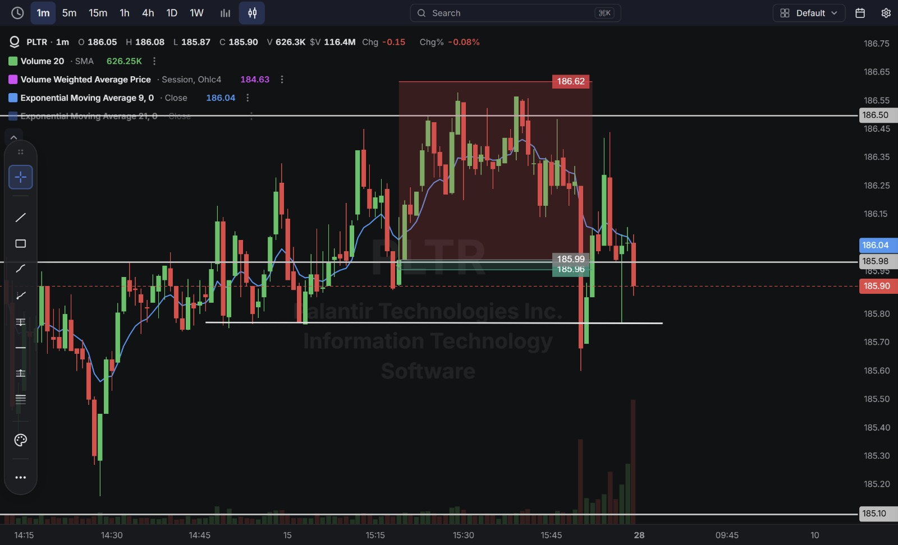
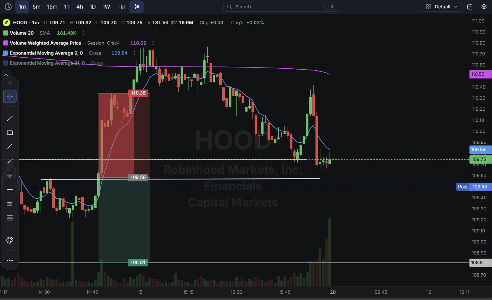
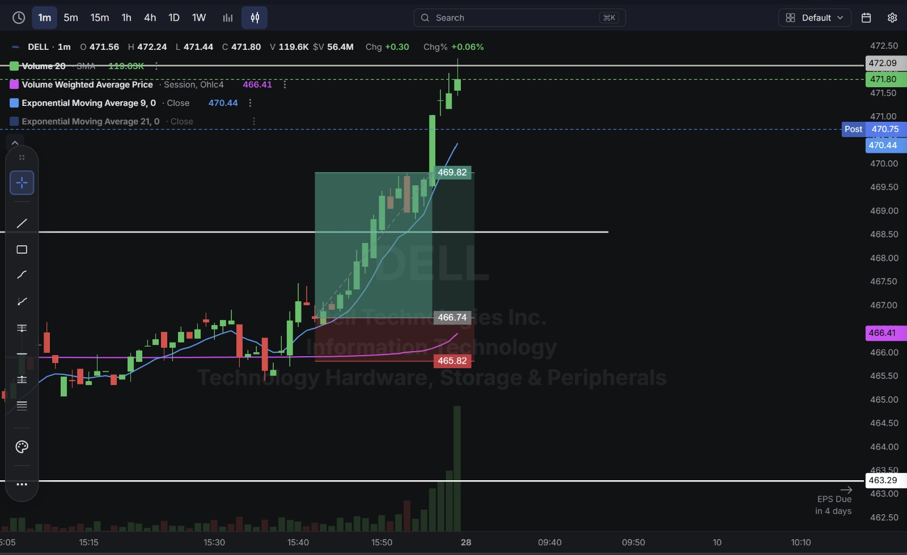

# Day 1 — Live Paper Trading (28-08-2026)

**Process Update:** This begins a new log, separate from the SMC learning journal — **Live Paper Trading** via the Charles Schwab demo platform. I identify the setup and provide the entry, target, and stop-loss; the trade is placed accordingly on the demo account. Day numbering restarts at 1 for this series.

**Work Format:** Pre-Market → Market Hours → After-Hours (IST evening-to-midnight coverage of the US session)

| Session      | IST Timing        | US Time (ET)      |
| ------------ | ----------------- | ----------------- |
| Pre-Market   | 5:00 PM – 7:00 PM | 7:30 AM – 9:30 AM |
| Market Hours | 7:00 PM – 1:30 AM | 9:30 AM – 4:00 PM |
| After Hours  | 1:30 AM – 2:30 AM | 4:00 PM – 5:00 PM |

---

## 1. Pre-Market Analysis (7:30 AM – 9:30 AM ET)

### The Screener ("CANSLIM 2")

| Group   | Logic | Conditions                                                                          |
| ------- | ----- | ----------------------------------------------------------------------------------- |
| Group 1 | ALL   | Dollar Volume > $20M · AS 3M > 85 · Include Type: Stocks                            |
| Group 2 | ALL   | Pre Market Last > $5 · Pre Market Volume > 100,000                                  |
| Group 3 | ALL   | EPS Growth Latest Rptd Qtr (%) > 25.00% · Sales Growth Latest Rptd Qtr (%) > 25.00% |

**Screener Screenshot:**

**Result: 10 stocks.** PLTR, HOOD, and DELL were selected for trading today off clean 9 EMA/VWAP crossovers.

---

## 2. Market Hours Observation (9:30 AM – 4:00 PM ET)

### PLTR — Rejection Below VWAP, Grind Lower

Price stalled out just under 186.62 after an extended run, then rolled over as the 9 EMA crossed back below VWAP, grinding down toward the 185.90–186.00 zone into the close.

### HOOD — Spike Through Resistance, Sharp Reversal

Price spiked up through the 109.58–110.35 zone shortly after the crossover, tagging the upper boundary before reversing hard and declining back down through the session, settling near 109.75.

### DELL — Breakout Above VWAP, Sustained Extension

Crossed above VWAP and the 9 EMA cleanly, extending steadily through the 466.74–469.82 zone and continuing to climb well beyond it into the close, with EPS due in 4 days adding extra interest to the name.

---

## 3. Trade Strategy — Actual Trades, Reasoning, and Results

> **Concept used across all three trades: 9 EMA / VWAP Crossover.**

### 🔴 PLTR — SHORT — ✅ **PASSED**

**Why I took this trade:** The 9 EMA crossed below VWAP after price failed to hold above 186.62, confirming a shift to selling pressure.

**How I planned the entry and exit:**
- **Entry (185.99):** short on confirmation of the bearish crossover.
- **Stop Loss (186.62):** above the crossover/rejection zone — a 0.34% stop.
- **Target (185.96):** the next support level below.
- **Risk/Reward:** Risk $0.63 (0.34%) to make $0.03 (0.02%) → **RR of 0.05**.

**Result:** Price broke through the target and continued declining to close near **185.90**. Target hit.

**Chart:**

---

### 🔴 HOOD — SHORT — ❌ **STOPPED OUT**

**Why I took this trade:** A bearish 9 EMA/VWAP crossover formed after price topped out, signaling a short-term reversal.

**How I planned the entry and exit:**
- **Entry (109.58):** short on confirmation of the bearish crossover.
- **Stop Loss (110.35):** above the crossover zone — a 0.70% stop.
- **Target (108.81):** the next support level below.
- **Risk/Reward:** Risk $0.77 (0.70%) to make $0.77 (0.70%) → **RR of 1.00**.

**Result:** Price spiked back up through 110.35 shortly after entry, triggering the stop, before reversing and declining back down to **109.75** later in the session. Stop hit.

**Chart:**

---

### 🟢 DELL — LONG — ✅ **PASSED**

**Why I took this trade:** A clean bullish 9 EMA/VWAP crossover with strong volume, ahead of an EPS report due in 4 days.

**How I planned the entry and exit:**
- **Entry (466.74):** on confirmation of the bullish crossover.
- **Stop Loss (465.82):** below the crossover zone — a 0.20% stop.
- **Target (469.82):** the next resistance level above.
- **Risk/Reward:** Risk $0.92 (0.20%) to make $3.08 (0.66%) → **RR of 3.35** — the best risk/reward of the day.

**Result:** Price extended well past the target, continuing to climb through the session to **471.80**. Target hit comfortably.

**Chart:**

---

## 4. Trade Result Summary

| # | Stock | Setup Type                   | Side  | Result         |
| - | ----- | ----------------------------- | ----- | -------------- |
| 1 | PLTR  | Bearish 9 EMA/VWAP crossover  | Short | ✅ Passed       |
| 2 | HOOD  | Bearish 9 EMA/VWAP crossover  | Short | ❌ Stopped Out  |
| 3 | DELL  | Bullish 9 EMA/VWAP crossover  | Long  | ✅ Passed       |

**Score: 2 for 3.**

### Normalized Results — $100 Capital Per Trade

| # | Stock     | Capital           | Entry → Exit    | % Move  | Result         | P&L        |
| - | --------- | ------------------ | --------------- | ------- | -------------- | ---------- |
| 1 | PLTR      | $100                | 185.99 → 185.96 | 0.02%   | ✅ Target hit   | **+$0.02** |
| 2 | HOOD      | $100                | 109.58 → 110.35 | -0.70%  | ❌ Stopped out  | **-$0.70** |
| 3 | DELL      | $100                | 466.74 → 469.82 | 0.66%   | ✅ Target hit   | **+$0.66** |
| — | **Total** | **$300 deployed**   | —               | —       | **2 for 3**    | **-$0.02** |

**On $300 total capital deployed across three trades, the day netted -$0.02 — essentially breakeven** — DELL's strong RR trade almost fully offset the HOOD stop-out, with PLTR's tight target adding a negligible amount either way.

---

## Key Takeaways From Day 1

1. **First day of the Live Paper Trading log via the Charles Schwab demo account** — a shift from purely charting the trades to actually placing and tracking them, which should sharpen discipline around sticking to the planned entry/SL/target rather than adjusting mid-trade.
2. **HOOD's stop-out is a reminder that the 9 EMA/VWAP crossover can whipsaw right after entry** — price tagged the stop and then moved in the originally expected direction anyway, which is the cost of doing business with this setup rather than a flaw to fix.
3. **DELL's 3.35 RR trade carried the day** — a reminder that a couple of strong-RR winners can absorb a full stop-out and still keep the session close to flat.
4. **PLTR's trade had a very thin RR (0.05)** — worth reviewing whether a target that close to entry is worth taking given transaction/slippage risk on a live paper account, even when it technically hits.
5. **Next session:** watch DELL into its EPS report in a few days, and keep an eye on whether HOOD sets up a fresh, cleaner crossover after today's whipsaw.
