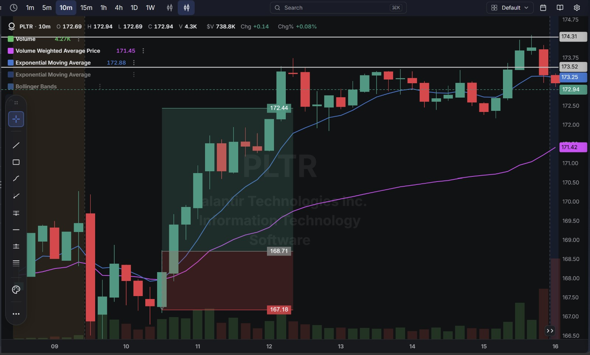
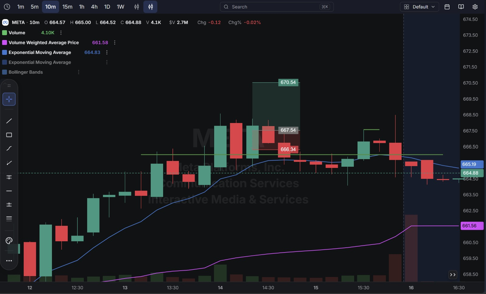

# Day 10 — Live Paper Trading (14-09-2026)

**10 trades closed today across 4 tickers** (QQQ, PLTR, MSFT, META). 7 winners, 3 losers, netting **+$1.52**. Account moved from $199,979.89 to **$199,981.41**.

---

## 1. Trade Log (Chronological)

| # | Time (ET) | Stock | Side  | Qty | Entry   | Exit    | P/L        |
| - | --------- | ----- | ----- | --- | ------- | ------- | ---------- |
| 1 | 6:31 AM   | QQQ   | Long  | 1   | $703.61 | $704.15 | ✅ +$0.54   |
| 2 | 6:47 AM   | QQQ   | Long  | 1   | $705.25 | $706.12 | ✅ +$0.87   |
| 3 | 6:53 AM   | PLTR  | Long  | 2   | $168.19 avg | $167.97 | ❌ -$0.44   |
| 4 | 8:35 AM   | PLTR  | Long  | 1   | $171.79 | $171.88 | ✅ +$0.09   |
| 5 | 9:41 AM   | PLTR  | Short | 1   | $172.45 | $172.44 | ✅ +$0.01   |
| 6 | 9:42 AM   | MSFT  | Long  | 1   | $506.93 | $507.17 | ✅ +$0.24   |
| 7 | 10:05 AM  | META  | Long  | 1   | $664.67 | $664.58 | ❌ -$0.09   |
| 8 | 10:33 AM  | QQQ   | Long  | 1   | $712.39 | $712.46 | ✅ +$0.07   |
| 9 | 10:55 AM  | META  | Long  | 1   | $666.03 | $667.46 | ✅ +$1.43   |
| 10| 12:33 PM  | META  | Long  | 1   | $667.54 | $666.34 | ❌ -$1.20   |

**Account Statement:**

---

## 2. Detailed Breakdown — What Happened on Each Trade

### ✅ Trades 1–2 — QQQ Long x2 (+$0.54, +$0.87)
Two quick QQQ longs back to back in the first half hour, both closed for small, clean gains. No issues — both were in and out fast with the trend.

### ❌ Trade 3 — PLTR Long, 2 shares (-$0.44)
Bought 1 share at $168.67, added a second at $167.71 (average cost $168.19), then closed both at $167.97 for a small loss.

**What went wrong:** Adding to the position at a lower price after it had already dipped (168.67 → 167.71) is an averaging-down pattern — it lowered the average cost, but the position still needed a recovery above $168.19 just to break even, and it only partially got there before being closed.

**Chart (shows the PLTR long zone and eventual target):**

### ✅ Trade 4 — PLTR Long (+$0.09)
A fresh, smaller long at $171.79, closed almost immediately at $171.88. Clean scalp.

### ✅ Trade 5 — PLTR Short (+$0.01)
A short attempt at $172.45, covered a cent lower at $172.44 — essentially a scratch trade, no real edge either way but no damage done.

### ✅ Trade 6 — MSFT Long (+$0.24)
First MSFT trade of the day, bought at $506.93, sold at $507.17 for a clean small win.

### ❌ Trade 7 — META Long #1 (-$0.09)
Bought META at $664.67, closed at $664.58 for a tiny loss — essentially a scratch that went slightly the wrong way.

### ✅ Trade 8 — QQQ Long #3 (+$0.07)
A third QQQ long, entered and closed for a very small gain.

### ✅ Trade 9 — META Long #2 (+$1.43) — Best Trade of the Day
Bought at $666.03, held longer than the other trades today, and closed at $667.46 for the best result of the session.

### ❌ Trade 10 — META Long #3 (-$1.20) — Largest Loss of the Day
Bought at $667.54, right near the top of the range shown on the chart (marked target $670.54, well above), but META reversed and the position was closed at $666.34 — a level that lines up almost exactly with the chart's marked support/stop zone.

**What went wrong:** This was the third META trade of the day, entered right after the second one had just worked well (+$1.43). Buying again near the recent highs, chasing the same move that had already paid off once, meant there was little room left before the reversal — the entry was late relative to the move, similar to the "re-entering right after a win" pattern seen on Day 6.

**Chart:**

---

## 3. Net Result for the Day

| Category            | P/L        |
| -------------------- | ---------- |
| Winners (7 trades)    | +$3.25     |
| Losers (3 trades)     | -$1.73     |
| **Net Day P/L**      | **+$1.52** |

**Account balance at close: $199,981.41**

---

## Key Takeaways From Day 10

1. **META was both the best and worst trade of the day** — the second META long (+$1.43) was excellent, but chasing a third META entry right after that win, near the top of the day's range, gave back most of the gain (-$1.20). The pattern of re-entering a name immediately after it just worked (flagged on Day 6 and Day 9) shows up again here.
2. **The PLTR averaging-down trade (Trade 3) is worth a specific note** — adding to a position at a worse price to lower the average cost is a different mistake than simply re-entering; it increases size into a trade that's already moving the wrong way, and it produced the day's only PLTR loss.
3. **Most of today's trades were very quick, small-margin scalps** — 6 of the 10 trades had a P/L under $0.30 in either direction, meaning today's real result came down to just 2 trades (META #2 and META #3) rather than broad-based edge across the session.
4. **10 trades in one session is the highest count yet** — worth watching whether trade frequency itself is adding value or just adding noise, since half the trades today were effectively scratches.
5. **Next session:** avoid adding to a losing position at a worse price (no averaging down), and build in a short pause before re-entering the same ticker a third time in one session, especially right after a winning trade on that name.
