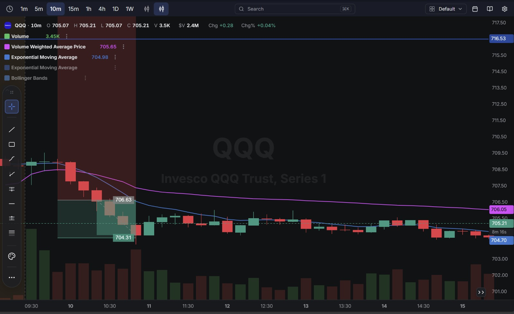
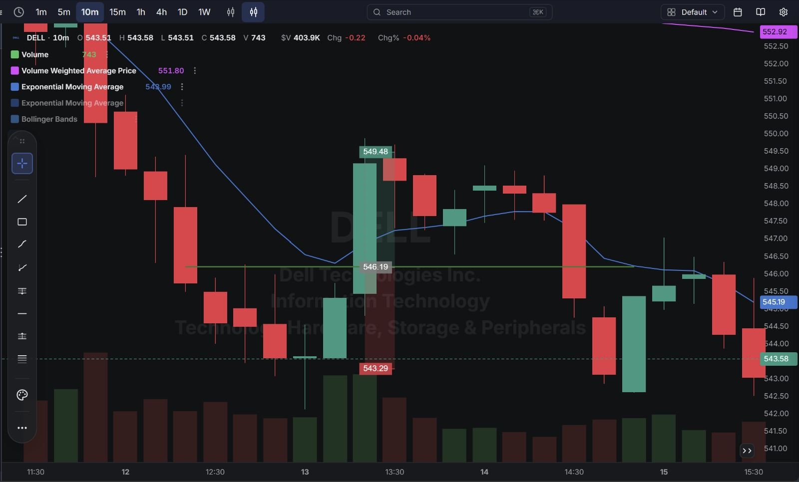
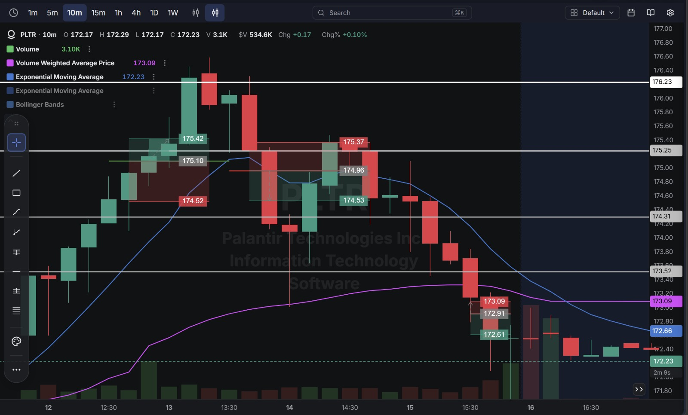

# Day 11 — Live Paper Trading (15-09-2026)

**5 trades closed today — all 5 were winners.** No losses at all this session. Net result: **+$5.69**, the best day yet, taking the account from $199,981.36 to **$199,987.05**.

---

## 1. Trade Log (Chronological)

| # | Time (ET) | Stock | Side  | Qty | Entry   | Exit    | P/L        |
| - | --------- | ----- | ----- | --- | ------- | ------- | ---------- |
| 1 | 7:39 AM   | QQQ   | Short | 1   | $705.68 | $704.31 | ✅ +$1.37   |
| 2 | 10:05 AM  | PLTR  | Long  | 1   | $175.10 | $175.42 | ✅ +$0.32   |
| 3 | 10:25 AM  | DELL  | Long  | 1   | $546.21 | $549.48 | ✅ +$3.27   |
| 4 | 10:51 AM  | PLTR  | Short | 1   | $174.96 | $174.53 | ✅ +$0.43   |
| 5 | 12:41 PM  | PLTR  | Short | 1   | $172.91 | $172.61 | ✅ +$0.30   |

**Account Statement:**

---

## 2. Detailed Breakdown — What Went Right on Each Trade

### ✅ Trade 1 — QQQ Short (+$1.37) — Best Trade of the Day
Shorted at $705.68, with a defined target at $704.31 and a stop marked well above at $706.63. QQQ declined cleanly into the target zone and the position was closed almost exactly there.

**Why it worked:** A clear range was mapped out before entry (the green/red box shows the planned profit zone below entry and the risk zone above it), and the trade was allowed to run to the pre-set level without early interference.

**Chart:**

### ✅ Trade 2 — PLTR Long (+$0.32)
Bought at $175.10, closed at $175.42. A quick, clean scalp early in PLTR's move.

### ✅ Trade 3 — DELL Long (+$3.27) — Second-Best Trade of the Day
Bought at $546.21, right at a marked support/entry line, targeting $549.48 above. DELL moved straight to the target and the position was closed there.

**Why it worked:** The entry (546.19–546.21) and target (549.48) both line up precisely with pre-marked chart levels — this was a planned trade executed exactly as mapped, with no hesitation once the target was reached.

**Chart:**

### ✅ Trade 4 — PLTR Short (+$0.43)
After PLTR pulled back from the morning high, shorted at $174.96 and covered at $174.53 — reading the reversal correctly after the earlier long had already captured the upside.

### ✅ Trade 5 — PLTR Short (+$0.30)
A third PLTR trade later in the session, shorting at $172.91 as the stock continued fading, covered at $172.61.

**Why it worked:** Unlike some previous sessions where a third re-entry on the same name led to chasing a move that had already played out, this PLTR short caught genuine continuation of the same downward drift already in place from Trade 4 — same direction, not a reversal chase.

**Chart (covers all three PLTR trades today):**

---

## 3. Net Result for the Day

| Category            | P/L        |
| -------------------- | ---------- |
| Winners (5 trades)    | +$5.69     |
| Losers (0 trades)     | $0.00      |
| **Net Day P/L**      | **+$5.69** |

**Account balance at close: $199,987.05**

---

## Key Takeaways From Day 11

1. **First perfect session — 5 for 5, no losing trades.** Both DELL and QQQ show entries and targets lining up almost exactly with pre-marked chart levels, which is the clearest sign yet of planning a trade before entering rather than reacting in the moment.
2. **The three PLTR trades today were a genuine, consistent read of the stock's move** — long into the early rally, then short twice as it faded — rather than flipping direction repeatedly without confirmation, which is what caused losses on Days 6, 8, and 10.
3. **DELL's trade (+$3.27) was the single largest win of the entire journal so far** — a clean support-to-target trade with no wasted movement.
4. **Trade frequency was moderate (5 trades) rather than high (8–10 like recent sessions)** — worth noting that today's more selective pace coincided with the best result yet, supporting the idea from Day 10 that fewer, better-confirmed trades may outperform higher-frequency scalping.
5. **Next session:** try to identify what made today's entries different (clear pre-marked levels, waiting for confirmation before flipping direction) and treat it as the standard to repeat, rather than the exception.
