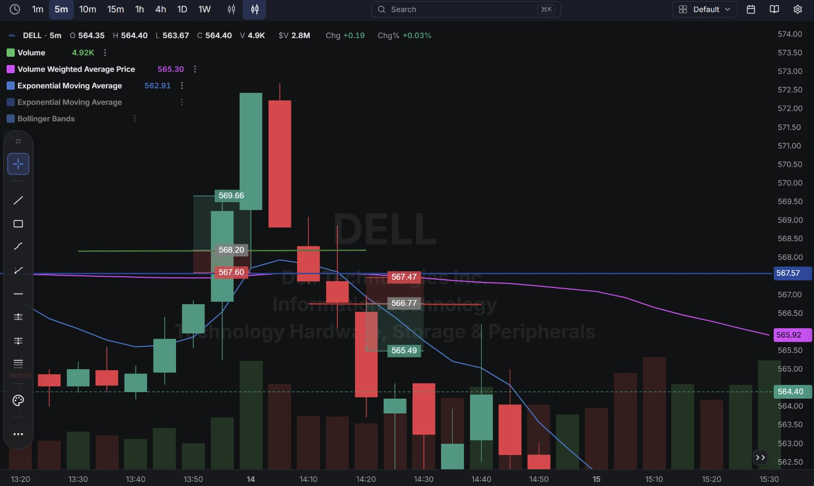
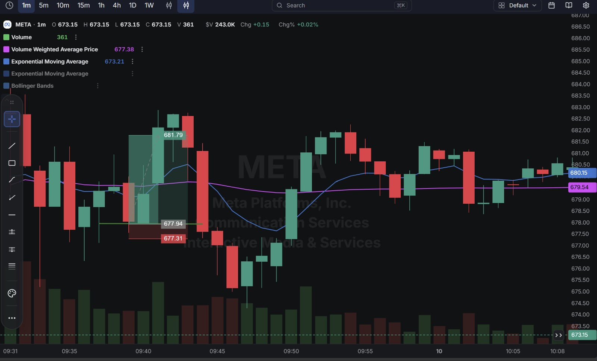

# Day 12 — Live Paper Trading (16-09-2026)

**13 trades closed today across 5 tickers** (META, PLTR, DELL, MSFT, QQQ) on a day the **Fed held its interest rate meeting**. Account P/L for the day: **+$6.34** (per account summary), taking the account to **$199,993.26**.

*Note: the visible trade log below reconstructs to +$4.26 across the 13 identifiable round trips — about $2.08 short of the account's official $6.34. This is most likely one additional trade sitting just outside the visible window in both account-statement screenshots (there's a scroll boundary between them), not a math error in the trades shown.*

---

## 1. Market Context — FOMC Rate Decision

Today's session coincided with the **Federal Reserve's interest rate meeting**. Fed days are typically choppier and more headline-driven than a normal session — price can whip in both directions around the announcement and the press conference — which likely explains why today had the highest trade count yet (13) with a lot of small, quick round trips rather than a few clean, sustained moves like Day 11.

---

## 2. Trade Log (Chronological)

| # | Time (ET) | Stock | Side  | Entry   | Exit    | P/L        |
| - | --------- | ----- | ----- | ------- | ------- | ---------- |
| 1 | 6:33 AM   | META  | Long  | $678.79 | $681.36 | ✅ +$2.57   |
| 2 | 6:35 AM   | PLTR  | Long  | $171.43 | $171.48 | ✅ +$0.05   |
| 3 | 9:38 AM   | PLTR  | Long  | $172.45 | $172.17 | ❌ -$0.28   |
| 4 | 10:04 AM  | DELL  | Long  | $568.20 | $566.77 | ❌ -$1.43   |
| 5 | 10:13 AM  | DELL  | Short | $566.74 | $565.49 | ✅ +$1.25   |
| 6 | 10:20 AM  | MSFT  | Long  | $493.89 | $493.75 | ❌ -$0.14   |
| 7 | 10:24 AM  | QQQ   | Short | $709.43 | $709.77 | ❌ -$0.34   |
| 8 | 11:05 AM  | META  | Long  | $677.94 | $681.79 | ✅ +$3.85   |
| 9 | 11:35 AM  | META  | Short | $677.07 | $678.54 | ❌ -$1.47   |
| 10| 11:41 AM  | PLTR  | Long  | $174.21 | $174.69 | ✅ +$0.48   |
| 11| 11:44 AM  | META  | Short | $682.80 | $683.84 | ❌ -$1.04   |
| 12| 12:12 PM  | PLTR  | Short | $171.68 | $171.59 | ✅ +$0.09   |
| 13| 12:16 PM  | META  | Short | $673.71 | $673.04 | ✅ +$0.67   |

**Account Statement (Part 1):**

**Account Statement (Part 2):**

---

## 3. Detailed Breakdown — What Went Right and Wrong

### ✅ Trades 1–2 — META & PLTR Longs, Early Morning (+$2.57, +$0.05)
Two clean opening trades before the Fed noise picked up — META in particular captured a strong early move.

### ❌ Trade 3 — PLTR Long (-$0.28)
A second PLTR long later in the morning that reversed against the position. Small, contained loss.

### ❌ Trade 4 — DELL Long (-$1.43)
Bought at $568.20 aiming for the $569.66 area (marked on chart), but DELL reversed and the position was closed at $566.77, right around the marked support/stop zone.

**What went wrong:** Similar to prior DELL longs (Day 8, Day 10), the entry came without a confirmed bounce — DELL kept sliding through the level instead of holding it.

**Chart:**

### ✅ Trade 5 — DELL Short (+$1.25)
Immediately flipped to short after the long failed, entering at $566.74 and covering at $565.49 as DELL continued its slide — a good adjustment that recovered most of Trade 4's loss.

### ❌ Trades 6–7 — MSFT Long, QQQ Short (-$0.14, -$0.34)
Two quick, small losses on new attempts in MSFT and QQQ — both look like scratch trades that didn't get confirmation before reversing.

### ✅ Trade 8 — META Long (+$3.85) — Best Trade of the Day
Bought at $677.94, right at a marked support level, targeting the $681.79 area. META ran straight to the target and the position was closed there — a clean, well-planned trade.

**Chart:**

### ❌ Trade 9 — META Short (-$1.47)
Right after the big long win, flipped to short META at $677.07 and got stopped out at $678.54 as META continued higher.

**What went wrong:** This is the same "flip direction right after a big win on the same name" pattern flagged on Day 10 (with META, no less) — shorting into a stock that had just shown strong upward momentum minutes earlier.

### ✅ Trade 10 — PLTR Long (+$0.48)
A clean, well-timed long entry and exit.

### ❌ Trade 11 — META Short (-$1.04)
A third META trade, shorting again at $682.80 and getting stopped at $683.84 as META kept climbing.

**What went wrong:** A second consecutive short against META's uptrend in the same session — after Trade 9 had already shown shorting this move wasn't working, going back to the same idea a second time compounded the mistake rather than correcting it.

### ✅ Trades 12–13 — PLTR Short, META Short (+$0.09, +$0.67)
Later in the session, both a PLTR short and a META short worked — by this point META had actually turned over and started declining, so fading it was finally the right read.

---

## 4. Net Result for the Day

| Category            | P/L        |
| -------------------- | ---------- |
| Winners (7 trades)    | +$8.96     |
| Losers (6 trades)     | -$4.70     |
| **Net (from visible trades)** | **+$4.26** |
| **Official Account P/L (Day)** | **+$6.34** |

**Account balance at close: $199,993.26**

---

## Key Takeaways From Day 12

1. **META was traded 6 times today — the most of any single name in one session so far** — and it tells two different stories depending on timing: the long into support (+$3.85) was excellent, but shorting it twice in a row right after (-$1.47, -$1.04) fought a move that had already proven itself, before finally being right on the third short once META genuinely turned over.
2. **The DELL long-then-flip-short sequence (Trade 4 → 5) is a good example of correcting course quickly** rather than holding onto a losing thesis — the flip to short recovered most of the initial loss.
3. **A Fed rate-decision day produced the highest trade count yet (13)**, consistent with the expectation that these sessions are choppier — worth considering whether reducing trade frequency specifically on known macro-event days would help, since 6 of the 13 trades were losses in the $0.14–$1.47 range.
4. **The repeated mistake to watch going forward is re-entering the same side of a trade that just failed** (META short after META short failed) rather than either stepping aside or waiting for the stock to actually show the reversal before re-attempting it.
5. **Next session:** on days with a scheduled macro catalyst (Fed, CPI, jobs report), consider being more selective before and immediately after the event rather than trading through the chop at the same frequency as a normal session.
