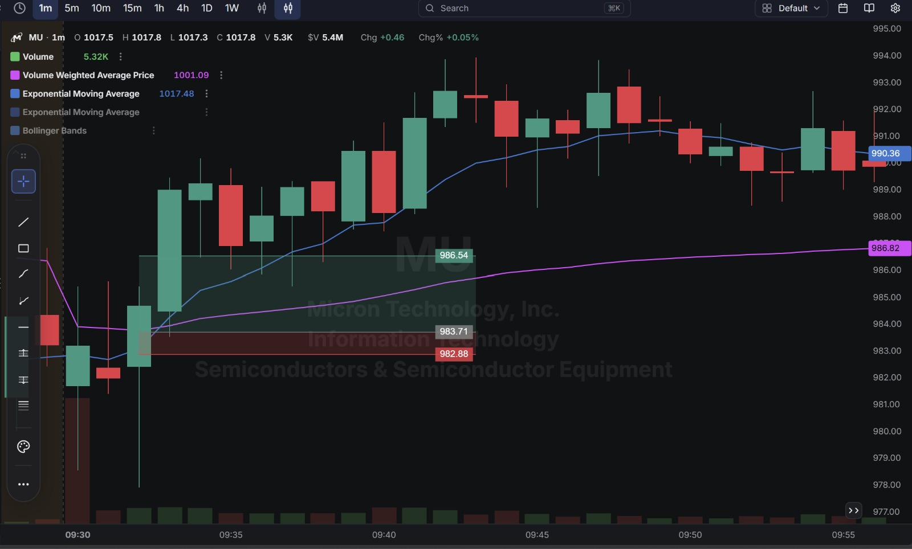
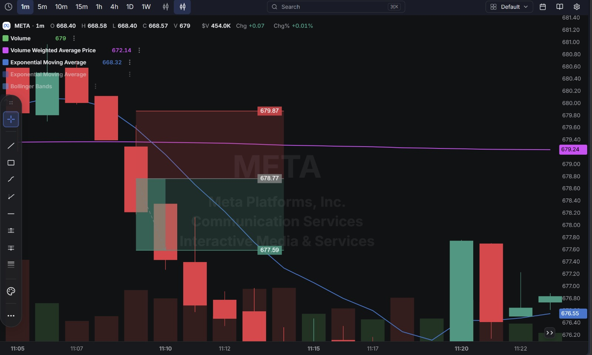
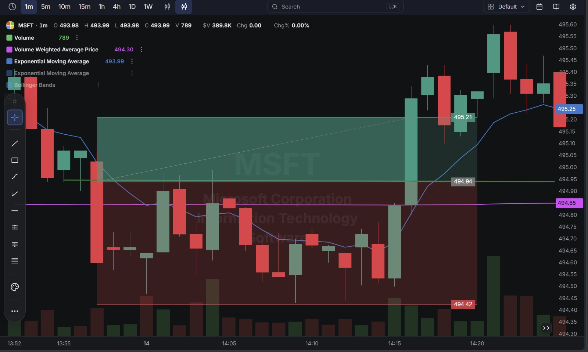
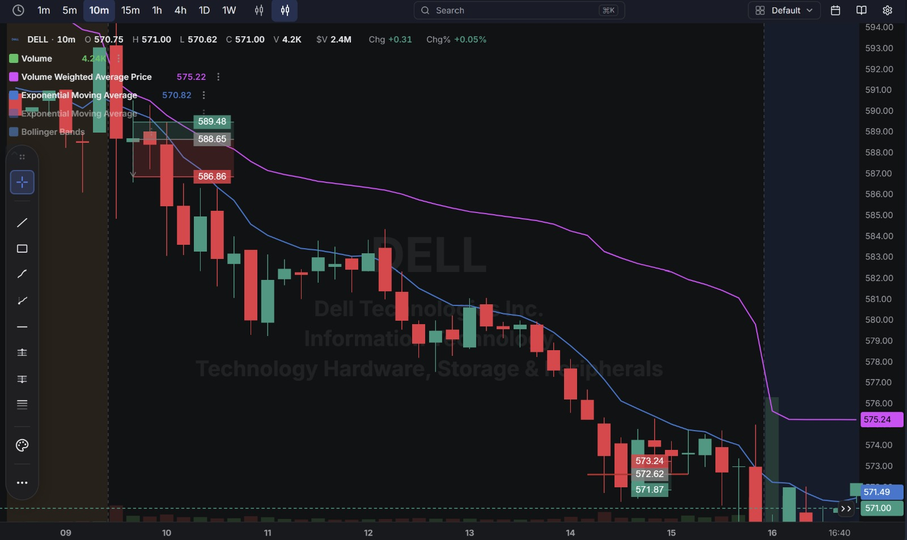

# Day 13 — Live Paper Trading (18-09-2026)

**6 round-trip trades closed today across 4 tickers** (MU, DELL, META, MSFT), with the market still digesting the Fed's rate decision from earlier in the week. Account P/L for the day: **+$7.09** (per account summary), taking the account to **$199,998.16**.

*Note: the visible trade log below reconstructs to +$4.37 across the 6 identifiable round trips — about $2.72 short of the account's official $7.09, similar to the small gap seen on Day 12. This is most likely a trade sitting just outside the visible window of the account statement screenshot rather than a math error in the trades shown.*

---

## 1. Market Context — Post-Fed Follow-Through

Two sessions after the FOMC rate decision, price action across the day's names (DELL, MU, META, MSFT) still showed some of the choppier, headline-reactive character seen on Day 12 — smaller, quicker round trips rather than one sustained trend, consistent with markets still working out the implications of the Fed's decision.

---

## 2. Trade Log (Chronological)

| # | Time (ET) | Stock | Side  | Qty | Entry   | Exit    | P/L        |
| - | --------- | ----- | ----- | --- | ------- | ------- | ---------- |
| 1 | 6:31 AM   | MU    | Long  | 1   | $983.71 | $986.54 | ✅ +$2.83   |
| 2 | 6:32 AM   | DELL  | Short | 1   | $588.75 | $588.02 | ✅ +$0.73   |
| 3 | 6:35 AM   | META  | Long  | 1   | $678.95 | $677.59 | ❌ -$1.36   |
| 4 | 10:37 AM  | MSFT  | Long  | 1   | $494.94 | $495.21 | ✅ +$0.27   |
| 5 | 11:21 AM  | DELL  | Short | 1   | $574.33 | $573.95 | ✅ +$0.38   |
| 6 | 11:33 AM  | DELL  | Short | 2   | $572.63 avg | $571.87 | ✅ +$1.52   |

**Account Statement:**

---

## 3. Detailed Breakdown — What Went Right and Wrong

### ✅ Trade 1 — MU Long (+$2.83) — Best Trade of the Day
Bought at $983.71, targeting the $986.54 area (matching the chart's marked support/target zone), with a stop below around $982.88. MU ran cleanly to the target and was closed there.

**Chart:**

### ✅ Trade 2 — DELL Short (+$0.73)
Shorted at $588.75 right after the MU win, covered at $588.02 for a modest profit — a good quick continuation trade in a different name.

### ❌ Trade 3 — META Long (-$1.36)
Bought at $678.95, but the chart shows the risk zone (red, above $679.87) and the eventual exit landed right at the marked support level ($677.59) — meaning the position was closed at what looks like a pre-planned stop rather than a target.

**What went wrong:** The chart's zones suggest this level was set up expecting support to hold near $678.77, but META broke straight through it down to $677.59. This is the same "buying into a level that doesn't actually hold" pattern seen in DELL longs on Days 8, 10, and 12 — except this time on META.

**Chart:**

### ✅ Trade 4 — MSFT Long (+$0.27)
Bought at $494.94, right at a marked support line, targeting $495.21 above. MSFT moved cleanly to the target — entry and exit both line up almost exactly with the chart's marked levels.

**Chart:**

### ✅ Trade 5 — DELL Short (+$0.38)
A fresh DELL short later in the morning, entered at $574.33 and covered at $573.95 for a small, clean win as DELL continued its intraday downtrend (visible on the chart as a steady grind lower through the whole session).

### ✅ Trade 6 — DELL Short, Added To (+$1.52)
Shorted again at $572.26, then added a second share at $573.00 as DELL bounced slightly (raising the average entry to $572.63), before covering both for a $1.52 gain at $571.87 as DELL resumed its decline.

**What went right:** Unlike the PLTR averaging-down mistake on Day 10 — which added to a *losing* long at a worse price — this add was on a short into a stock that was still in a clear downtrend on the day (per the DELL chart, a steady grind from ~589 down to ~571 across the session), so the extra size was added in the direction the stock was actually moving, not against it.

**Chart (shows both DELL trades across the session):**

---

## 4. Net Result for the Day

| Category            | P/L        |
| -------------------- | ---------- |
| Winners (5 trades)    | +$5.73     |
| Losers (1 trade)      | -$1.36     |
| **Net (from visible trades)** | **+$4.37** |
| **Official Account P/L (Day)** | **+$7.09** |

**Account balance at close: $199,998.16**

---

## Key Takeaways From Day 13

1. **DELL was the most reliable name of the day** — three separate DELL trades, all shorts, all profitable, correctly reading a clear intraday downtrend that's visible across the whole session on the chart.
2. **The one loss (META) came from buying into a level that didn't hold** — a repeat of a pattern seen with DELL on multiple earlier days, just applied to a different stock this time. Worth treating "buy the dip at a marked support line" as needing actual confirmation (a bounce first) rather than entering right as price arrives at the line.
3. **Adding to the second DELL short (Trade 6) worked because it was in the direction of the established trend** — a useful contrast to the Day 10 PLTR mistake of averaging down into a losing long. The lesson isn't "never add to a position," it's "only add in the direction the market is already confirming."
4. **MU was a strong, clean addition to the rotation again** (as it also was on Day 9), suggesting it's a name worth continuing to watch alongside the regular DELL/PLTR/META/QQQ group.
5. **Next session:** keep applying the "add only with the trend" rule from Trade 6, and for support/resistance entries (like the META long), wait for one confirming candle at the level before entering rather than buying right as price touches it.
