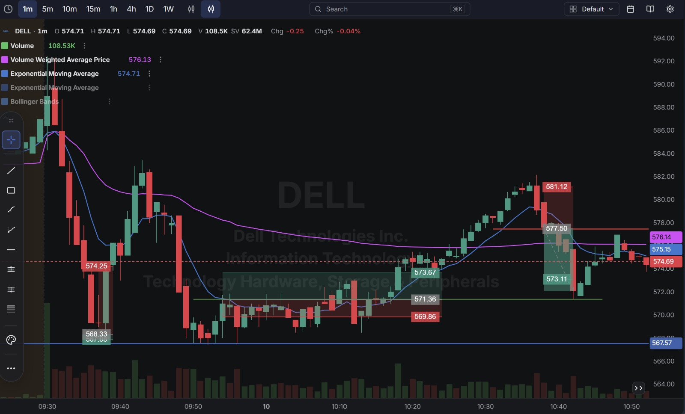
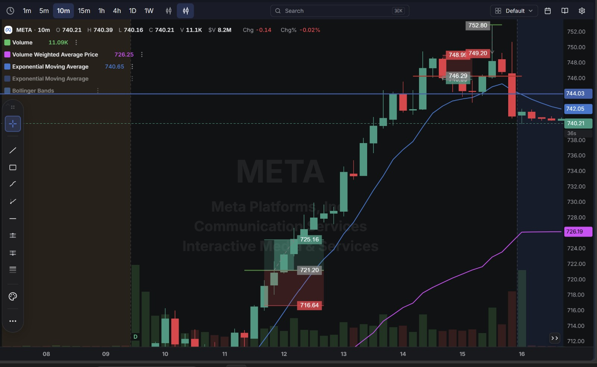

# Day 14 — Live Paper Trading (21-09-2026)

**10 round-trip trades closed today across META, DELL, and QQQ**, on a day META surged hard on AI-agent news (Meta's "Muse" AI agent driving broad tech strength). Net result: **-$2.64** (per account summary), taking the account to **$199,995.38**. A DELL long swing position was also opened at the close, held overnight into the next session.

---

## 1. Market Context — META's AI-Driven Rally

META ran from the low $700s to a high near $752 over the course of the day (finishing the week up over 12% on the daily chart), driven by news around Meta's "Muse" AI agent and related strength across AI infrastructure names (Intel, Arm mentioned in the same news cycle). This kind of fast, news-driven trend explains both the day's best setups (buying META dips during the climb) and its worst (getting shaken out on sharp pullbacks within that same trend).

---

## 2. Trade Log (Chronological)

| # | Time (ET) | Stock | Side  | Entry     | Exit    | P/L         |
| - | --------- | ----- | ----- | --------- | ------- | ----------- |
| 1 | 6:33 AM   | META  | Long  | $698.76   | $699.71 | ✅ +$0.95    |
| 2 | ~6:3x AM  | DELL  | Long  | ~$584.40* | $574.25 | ❌ ≈ -$10.15* |
| 3 | 6:39 AM   | QQQ   | Long  | $729.80   | $730.03 | ✅ +$0.23    |
| 4 | 6:46 AM   | META  | Long  | $704.28   | $700.34 | ❌ -$3.94    |
| 5 | 6:54 AM   | DELL  | Long  | $571.38   | $574.40 | ✅ +$3.02    |
| 6 | 7:38 AM   | DELL  | Short | $577.48   | $572.46 | ✅ +$5.02    |
| 7 | 8:19 AM   | META  | Long  | $713.48   | $711.25 | ❌ -$2.23    |
| 8 | 8:55 AM   | META  | Long  | $721.20   | $725.16 | ✅ +$3.96    |
| 9 | 10:39 AM  | META  | Short | $740.48   | $740.42 | ✅ +$0.06    |
| 10| 11:46 AM  | META  | Short | $746.29   | $745.85 | ✅ +$0.44    |

*Trade 2's entry price is reconstructed, not directly read from the visible statement — see the note above.

**Account Statement (Part 1):**

**Account Statement (Part 2):**

---

## 3. Detailed Breakdown — What Went Right and Wrong

### ✅ Trade 1 — META Long (+$0.95)
A quick, clean opening scalp before the bigger moves of the day got underway.

### ❌ Trade 2 — DELL Long (≈ -$10.15) — Largest Loss of the Day, By Far
Bought DELL in the pre-market/opening minutes near the $584–586 area, right before the stock gapped down hard at the open. The chart shows a massive single red candle taking DELL from roughly $586 down through $568 within the first few minutes of trading, and the position was closed around $574.25 as the damage was already done.

**What went wrong:** This was a long entered right before (or into) a violent opening move with no room to react — the single biggest structural risk in trading the open is exactly this kind of gap/flush, and this trade absorbed nearly all of it. This dwarfs every other trade of the day combined and is the entire reason the day finished red despite 7 of the other 9 trades being profitable.

**Chart:**

### ❌ Trade 4 — META Long (-$3.94)
Bought at $704.28 during the early rally, but got a sharp pullback and closed at $700.34.

**What went wrong:** Even within a strong uptrend, a single entry can get caught in a pullback — this looks like a case of chasing the move slightly too early in its development rather than waiting for a clear higher low.

### ✅ Trades 5–6 — DELL Long, then DELL Short (+$3.02, +$5.02)
After the disastrous opening long, DELL was traded twice more successfully — once long on the recovery bounce, then once short on a subsequent pullback. Both trades read the stock's actual intraday swings correctly, in contrast to Trade 2's blind entry into the open.

### ❌ Trade 7 — META Long (-$2.23)
Another META long that got caught in a dip within the broader uptrend, similar in character to Trade 4.

### ✅ Trades 8–10 — META Long, then Two META Shorts (+$3.96, +$0.06, +$0.44)
The best-timed META trade of the day was the $721.20 → $725.16 long, buying right at a marked support zone (matching the chart's $716.64–$721.20 box) during the strongest part of the rally. The two later shorts near the day's highs ($740s and $746) were both small, controlled trades taken as META began stalling out near its highs — reasonable attempts to fade an extended move, closed for tiny gains rather than holding for a bigger reversal that didn't fully materialize.

**Chart (shows the full META range and multiple trade zones):**

---

## 4. Overnight Position — DELL Long Swing (Held Into Next Session)

At the end of the day, a **DELL long swing position was opened**, intended to be held overnight rather than closed same-day. This is separate from today's closed P/L and will need to be tracked and resolved in the next session.

---

## 5. Net Result for the Day

| Category            | P/L        |
| -------------------- | ---------- |
| Winners (7 trades)    | +$13.68    |
| Losers (3 trades)     | -$16.32    |
| **Net Day P/L**      | **-$2.64** |

**Account balance at close: $199,995.38**

---

## Key Takeaways From Day 14

1. **One trade (the opening DELL long) accounted for the entire loss of the day and then some** — 7 of the 10 trades were winners, and the combined winners (+$13.68) nearly doubled the combined losses on the other 2 losing trades (-$6.17). Without the opening gap trade, today would have been comfortably green.
2. **Trading right at the open, before a stock's true direction is established, carries outsized risk** — this is the clearest, most expensive lesson from the whole journal so far. A rule worth adopting: wait for the first few minutes of price action to establish some structure before sizing into a name at the open, especially one already showing pre-market volatility.
3. **DELL redeemed itself later in the session** — the long-then-short sequence (Trades 5–6) shows the stock was very tradeable once its actual intraday range was established, just not blindly at the open.
4. **META's news-driven rally produced a mix of good (buying the dip at support) and bad (chasing without a pullback) entries** — the difference between Trade 8 (good, bought a marked support zone) and Trades 4/7 (chased, got caught in pullbacks) is a useful side-by-side comparison for what a well-timed trend entry looks like versus a rushed one.
5. **Next session:** resolve the overnight DELL long swing position first thing, and treat the "no blind entries in the first few minutes of the open" rule as a hard requirement going forward given how costly it was today.
