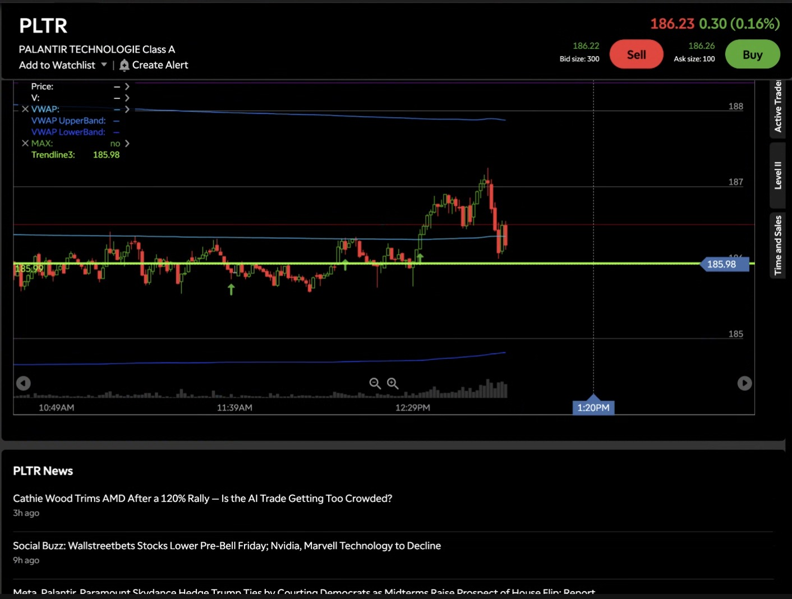
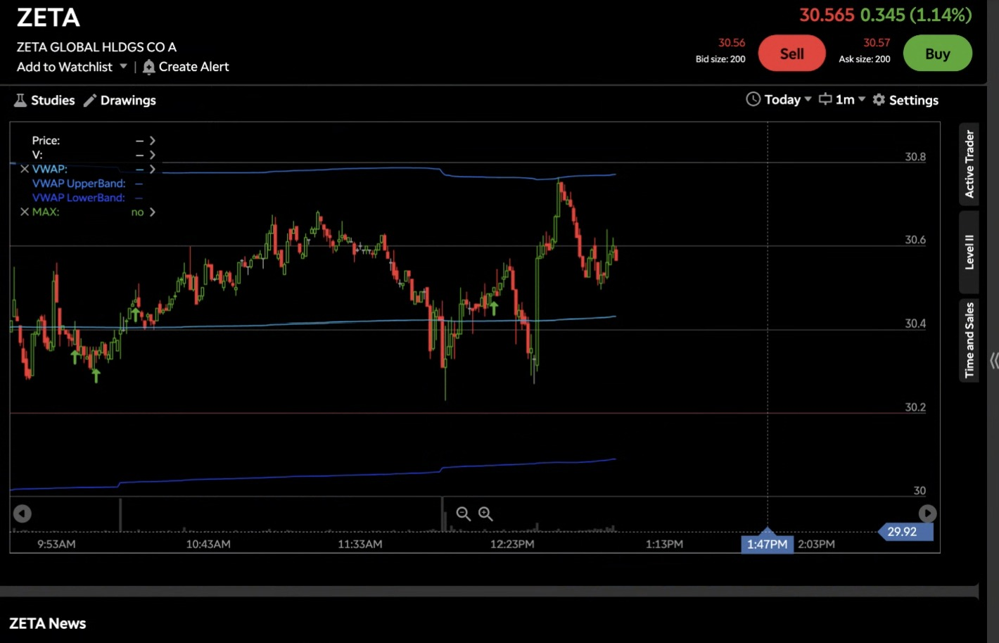

# Day 2 — Live Paper Trading (31-08-2026)

**No trades were executed today.** The session was spent exploring how to properly structure a bracket order (Entry / Target / Stop-Loss) in thinkorswim on the Charles Schwab paper trading account. A PLTR order was built out fully (Buy → OCO Target + Stop) but **not sent**, since price never gave a clean confirmation before the market closed.

---

## 1. Order Practice — PLTR (thinkorswim OCO Bracket)

Built a full bracket order to practice the mechanics of order entry:

| Leg | Action | Type   | Price   | TIF |
| --- | ------ | ------ | ------- | --- |
| 1   | Buy 1  | MARKET | ~186.36 | Day |
| 2   | Sell 1 | LIMIT  | $188.00 | GTC |
| 3   | Sell 1 | STOP   | $186.70 | GTC |

Legs 2 and 3 were linked as **OCO** (One-Cancels-Other) off the initial buy fill.

**Order Ticket:**

---

## 2. Predictions (Not Executed — No Confirmation)

### 🟢 PLTR — Predicted LONG

**Read:** Price marked a reference level at **$185.98** (chart trendline). Prediction was for candles to pull back down into this zone, then reverse.

- **Entry (pullback zone): $185.98**
- **Target: $188.00**
- **Stop-Loss: $186.70**

**Reasoning:** Expecting a dip into the $185.98 support/reference line, followed by a reversal back upward toward $188.00, matching the bracket order built above.

**Chart:**

---

### 🔴 HOOD — Predicted LONG (Bullish Reversal)

**Read:** Price was in a clear downtrend, trading at $104.15–104.20, well below VWAP ($106.73) after news broke that Robinhood, Kalshi, and Crypto.com lost their appeals against the Nevada Gaming Control Board.

- **Entry (red line): ~$104.60**
- **Target (green line): ~$104.90**

**Reasoning:** Expecting candles to first reclaim the ~$104.60 level with bullish momentum, then continue to the ~$104.90 zone above it.

**Chart:**

---

### 🔴 ZETA — Predicted SHORT (Target Not Reached)

**Read:** Price was consolidating between $30.20 and $30.80, currently at $30.565.

- **Entry: $30.40**
- **Target: $30.20**

**Reasoning:** Expecting a move down toward $30.20 from the $30.40 entry zone, but predicting the move **falls short and does not actually tag the $30.20 target**.

**Chart:**

---

## 3. Key Takeaways From Day 2

1. **No trade taken today** — none of the three setups gave a clean confirmation signal before market close, so all three orders stayed as predictions/practice rather than live paper positions.
2. **Learned the OCO bracket order workflow in thinkorswim** — placing an initial Buy at market, then linking a Sell Limit (target) and Sell Stop (stop-loss) together as One-Cancels-Other, so only one of the two exits fires once the position is open.
3. **HOOD's setup came with a live catalyst** — the Nevada Gaming Control Board news hitting mid-session is a good reminder to check headlines before assuming a pure technical reversal will play out.
4. **ZETA prediction is explicitly a "near miss" call** — worth tracking tomorrow to see whether the move stalls before $30.20 as predicted, which is a useful test of reading support/resistance strength.
5. **Next session:** revisit all three levels at the open — PLTR for the $185.98 pullback, HOOD for reclaiming $104.60, and ZETA for whether $30.20 holds as unreached support.
