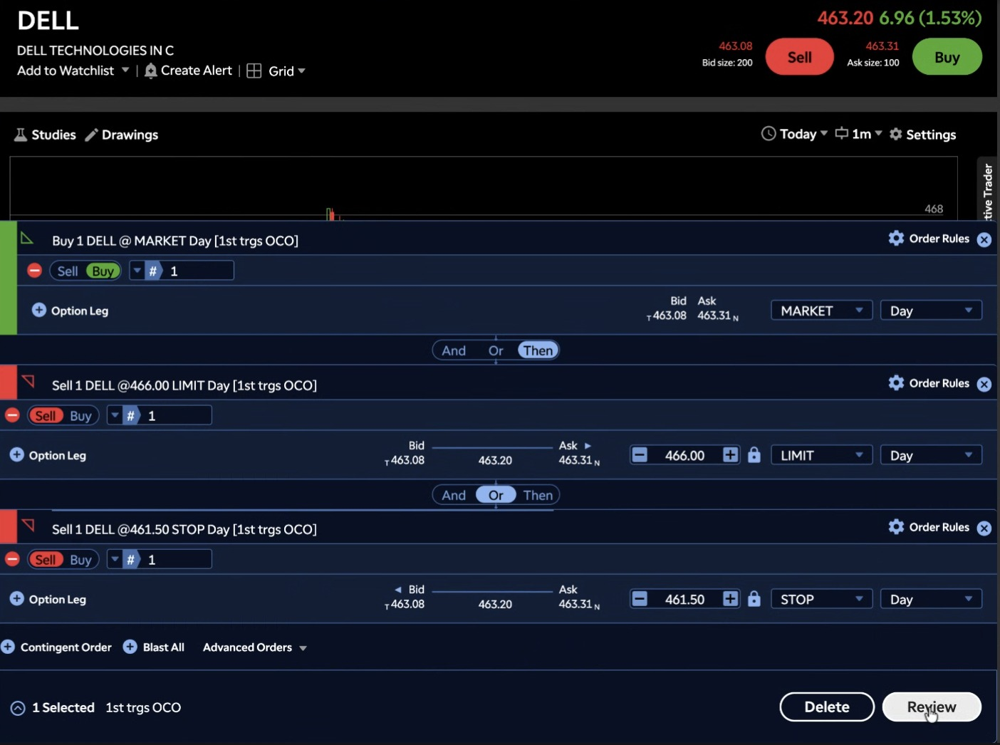

# Day 3 — Live Paper Trading (31-08-2026)

**First actual trades executed today** — previous sessions were order-placement practice and predictions only; today two real positions were opened and closed/left open on the Charles Schwab (thinkorswim) paper account.

---

## 1. Trade 1 — DELL LONG (Bracket Order)

Built and sent a full bracket order:

| Leg | Action | Type   | Price   | TIF |
| --- | ------ | ------ | ------- | --- |
| 1   | Buy 1  | MARKET | ~463.20 | Day |
| 2   | Sell 1 | LIMIT  | $466.00 | Day |
| 3   | Sell 1 | STOP   | $461.50 | Day |

Legs 2 and 3 linked as **OCO** (target vs. stop).

**Result:** The position was closed early for a **small loss of about $1**, before either the target or the stop was reached.

**Order Ticket:**

---

## 2. Trade 2 — DELL SHORT

After closing the long position, flipped direction and went **short DELL** at an entry (fill) price of **$460.37**.

**What happened:** Market closing time approached before the protective buy-to-cover **stop order triggered/closed**, so the short position was carried **open past the session**. With DELL trading down to $457.39 by the end of the session, the open position was sitting on an **unrealized gain of about $2**.

| Position | Qty | Entry (Cost) | Mark   | P/L (Day) | P/L (Open) |
| -------- | --- | ------------ | ------ | --------- | ---------- |
| DELL     | -1  | $460.37      | $457.39 | +$2.09   | +$2.98     |

**Account / Position Screenshot:**

---

## 3. Net Result for the Day

- Trade 1 (Long DELL, closed early): **≈ -$1.00**
- Trade 2 (Short DELL, left open at close): **≈ +$2.00 unrealized**
- **Net Day P/L: +$2.09**

---

## Key Takeaways From Day 3

1. **First real trades placed, not just practice tickets** — the main lesson today was actually entering a position with a defined entry/target/stop, rather than only building and reviewing the order structure.
2. **The long DELL trade didn't work out** — closed early for a small loss before either the $466.00 target or $461.50 stop was reached, worth reviewing why the position was closed manually instead of letting the bracket play out.
3. **Flipping to short after the long failed turned the day around** — the short entry at $460.37 was in the right direction as DELL continued lower into the close.
4. **An unclosed stop order left a position open past the session** — the short's protective stop never triggered, which is what actually created the open profit, but this was luck rather than plan; leaving a stop order unresolved into market close is a risk-management gap to fix, since it could just as easily have gone the other way.
5. **Next session:** confirm how thinkorswim handles Day-TIF stop orders that don't fill before the close, and check whether the DELL short is still open or needs to be managed at tomorrow's open.
