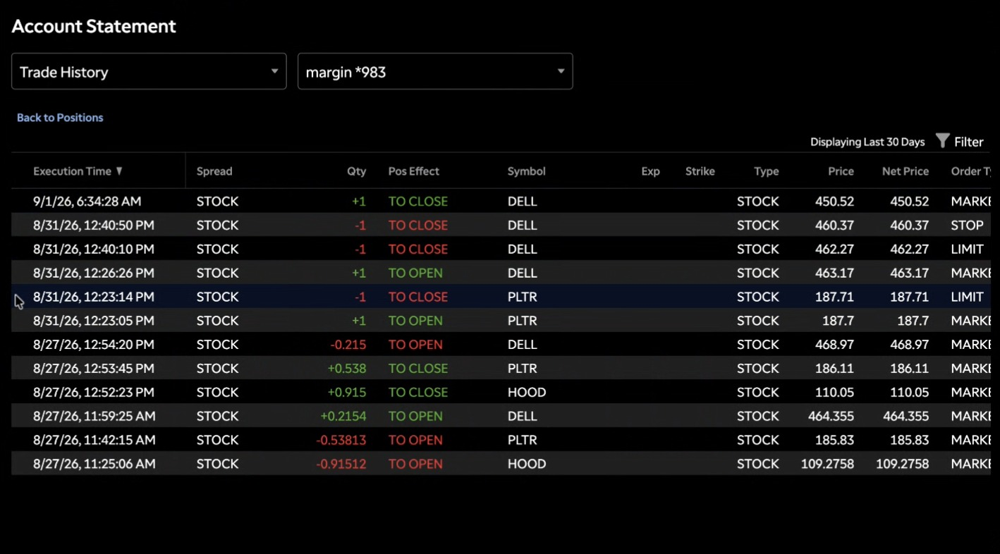

# Day 4 — Live Paper Trading (01-09-2026)

**Three positions closed today** — one carried over from yesterday's open short, plus two new trades placed and closed during the session.

---

## 1. Trade 1 — DELL SHORT (Carried Over from Day 3, Closed Pre-Market)

Yesterday's DELL short (entered at **$460.37** on 8/31, left open since the stop never triggered before the close) was closed this morning right after market open.

- **Entry (8/31): $460.37**
- **Exit (9/1, pre-market): $450.52**
- **Result: ✅ Profit of about $8**

**Chart:**

---

## 2. Trade 2 — PLTR SHORT

- **Entry: ~$185.67**
- **Target/Exit: ~$184.54**
- **Result: ✅ Profit of about $1**

**Chart:**

---

## 3. Trade 3 — DELL LONG

- **Entry: ~$435.49**
- **Target (not reached): ~$440.74**
- **Stop/Exit: ~$433.88**
- **Result: ❌ Loss of about $2**

**Chart:**

---

## 4. Account Snapshot

**Pre-Market Opening:**

**Trade History (Account Statement):**

---

## 5. Net Result for the Day

| # | Trade                     | Result       | P&L        |
| - | ------------------------- | ------------ | ---------- |
| 1 | DELL Short (carryover)    | ✅ Closed     | **+$8**    |
| 2 | PLTR Short                | ✅ Closed     | **+$1**    |
| 3 | DELL Long                 | ❌ Stopped out | **-$2**   |
| — | **Net Day P&L**           | —            | **≈ +$7**  |

**Account balance at market close: ≈ $200,008** (up from $200,002 at the start of Day 3).

---

## Key Takeaways From Day 4

1. **Yesterday's unresolved stop turned into today's biggest win** — closing the carried-over DELL short right at the open captured the bulk of the day's gain, but it also highlights that leaving a position open overnight is still a decision that needs to be made deliberately, not something to depend on repeating.
2. **The PLTR short was a clean, small, quick win** — entry and exit were close together, showing the value of taking a smaller, high-probability profit rather than holding out for a bigger move.
3. **The new DELL long didn't work** — stopped out for a small loss before the $440.74 target was ever in reach, a reminder that DELL had just been in a strong downtrend (the same stock shorted successfully earlier), so fading that trend with a long needed a stronger confirmation signal.
4. **Overall a green day (~+$7)** — the losing trade was more than offset by the two winners, which is the kind of day-level outcome to aim for even when not every individual trade works.
5. **Next session:** review whether DELL is still better suited to the short side given today's long loss, and keep tracking whether letting a position run past market close (like yesterday's short) should become a deliberate part of the process or stay something to avoid.
