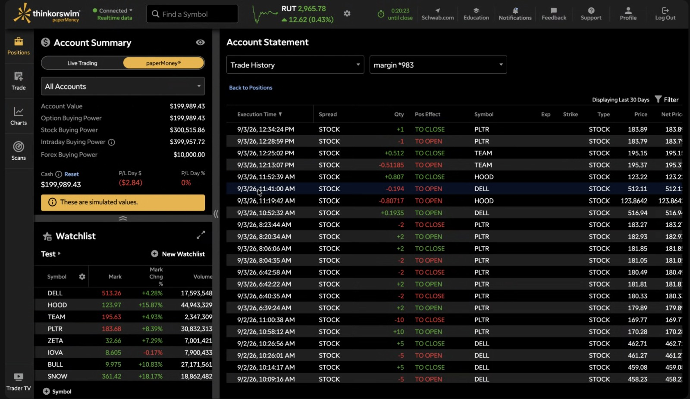

# Day 6 — Live Paper Trading (03-09-2026)

**8 positions closed today** — 5 round trips on PLTR alone, plus one each on DELL, HOOD, and TEAM. Net result: **-$2.84**, taking the account from $199,992.35 to **$199,989.43**.

---

## 1. Trade Log (Chronological)

| # | Time (ET) | Stock | Side  | Qty    | Entry     | Exit      | Exit Type | P/L (approx) |
| - | --------- | ----- | ----- | ------ | --------- | --------- | --------- | ------------ |
| 1 | 6:39 AM   | PLTR  | Long  | 2      | $179.89   | $180.33   | LIMIT     | ✅ +$0.88     |
| 2 | 6:42 AM   | PLTR  | Long  | 2      | $181.81   | $180.49   | STOP      | ❌ -$2.64     |
| 3 | 8:04 AM   | PLTR  | Short | 2      | $181.05   | $181.85   | STOP      | ❌ -$1.60     |
| 4 | 8:20 AM   | PLTR  | Long  | 2      | $182.93   | $183.27   | LIMIT     | ✅ +$0.68     |
| 5 | 10:52 AM  | DELL  | Long  | ~0.19  | $516.94   | $512.11   | Flipped   | ❌ -$0.93     |
| 6 | 11:19 AM  | HOOD  | Short | ~0.81  | $123.8642 | $123.22   | Market    | ✅ +$0.52     |
| 7 | 12:13 PM  | TEAM  | Short | ~0.51  | $195.37   | $195.15   | Market    | ✅ +$0.11     |
| 8 | 12:28 PM  | PLTR  | Short | 1      | $183.79   | $183.89   | LIMIT     | ❌ -$0.10     |

**Account Statement:**

---

## 2. Detailed Breakdown — What Happened on Each Trade

### ✅ Trade 1 — PLTR Long #1 (+$0.88)
Bought 2 shares at $179.89, sold at $180.33 on a limit. Clean scalp, closed at target.

### ❌ Trade 2 — PLTR Long #2 (-$2.64)
Bought 2 more shares at $181.81 just a couple of minutes after the first win, chasing continuation higher. Price reversed almost immediately and the stop at $180.49 was hit — the day's biggest single loss.

**What went wrong:** This was a re-entry right after a winning trade, buying into a higher price with no fresh pullback or confirmation — essentially chasing the first trade's momentum instead of waiting for a new setup.

### ❌ Trade 3 — PLTR Short #1 (-$1.60)
After getting stopped out on the long, flipped to short at $181.05, expecting a deeper pullback. Got stopped out again at $181.85 for a second loss in a row.

**What went wrong:** Flipping direction immediately after a loss (long to short within about 90 minutes, on the same stock, same day) is a classic sign of chasing price rather than trading a plan — two opposite losing trades back to back on PLTR before 8:10 AM.

### ✅ Trade 4 — PLTR Long #3 (+$0.68)
Bought 2 shares at $182.93, closed at $183.27 on a limit. A clean win that recovered part of the morning's losses.

### ❌ Trade 5 — DELL Long → Flipped (-$0.93)
Opened a ~$100 long position in DELL at $516.94. By 11:41 AM the position was closed out (and effectively flipped into a small residual short) at $512.11 as DELL pulled back.

**What went wrong:** DELL had already run up sharply over the prior few sessions — buying into that extended move without a pullback first left little room before the stock gave some of it back.

### ✅ Trade 6 — HOOD Short (+$0.52)
Shorted a ~$100 position in HOOD at $123.8642, covered at $123.22 for a small profit as HOOD dipped.

### ✅ Trade 7 — TEAM Short (+$0.11)
Shorted a ~$100 position in TEAM at $195.37, covered at $195.15 for a tiny profit — first trade of the day in a new name (TEAM), sized and executed cleanly even though the gain was small.

### ❌ Trade 8 — PLTR Short #2 (-$0.10)
One more PLTR short attempt late in the session, 1 share at $183.79, covered at $183.89 for a small loss.

**What went wrong:** A fifth PLTR trade in the same session — by this point PLTR had already produced 2 wins and 2 losses; going back to the well a fifth time on the same name suggests the stock was being over-traded rather than showing a genuinely new setup.

---

## 3. Net Result for the Day

| Category            | P/L        |
| -------------------- | ---------- |
| Winners (4 trades)    | +$2.19     |
| Losers (4 trades)     | -$5.27     |
| **Net Day P/L (account)** | **-$2.84** |

**Account balance at close: $199,989.43** (down from $199,992.35 at the start of the day).

---

## Key Takeaways From Day 6

1. **PLTR was traded 5 separate times today** — 2 wins, 2 losses, and a final small loss on a 5th re-entry. The pattern of flipping direction (long → short → long → short) on the same stock within a single session is the clearest issue of the day: each re-entry looked more like chasing the last move than a fresh, planned setup.
2. **The two biggest losses (Trades 2 and 3) both came from re-entering immediately after a prior trade closed** — one chasing a winner higher, the other flipping direction right after a stop-out. Both are worth a specific rule: wait for a new, distinct signal before re-entering the same name.
3. **DELL, HOOD, and TEAM were each traded once, and only DELL lost money** — buying DELL after it had already run up sharply cost more than the two new-name shorts (HOOD, TEAM) made combined.
4. **The smallest position sizes correlate with the smallest wins/losses** — the $100-notional DELL/HOOD/TEAM trades and the 1-share PLTR trade all had sub-$1 swings, while the 2-share PLTR trades carried the larger P/L swings (both up and down).
5. **Next session:** set a cap on how many times the same ticker can be re-traded in one session before requiring a clear reason for the change in direction, and continue favoring smaller size on lower-conviction, chase-y entries.
