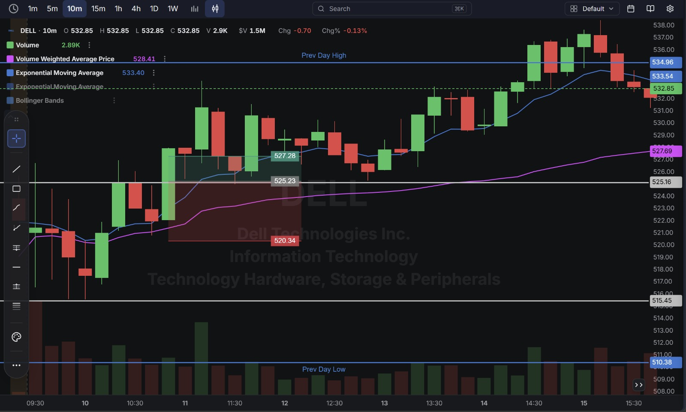
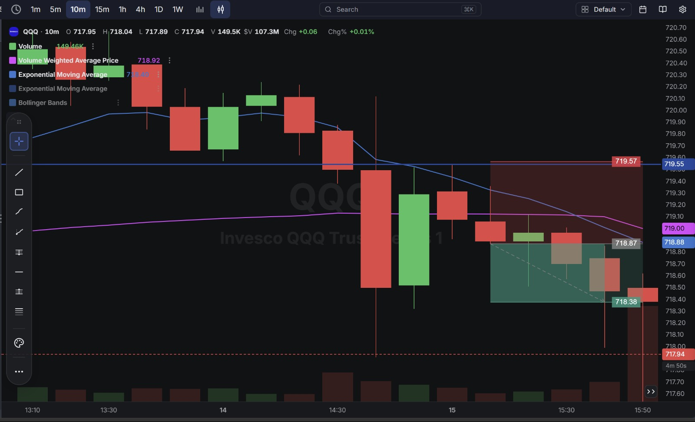

# Day 7 — Live Paper Trading (09-09-2026)

**A green day** — closed out a small overnight carryover position and executed two fresh intraday trades. Net result: **+$2.18**, taking the account from $199,976.41 to **$199,978.59**.

---

## 1. Trade Log (Chronological)

| # | Time (ET) | Stock | Side  | Qty | Entry     | Exit    | Exit Type | P/L        |
| - | --------- | ----- | ----- | --- | --------- | ------- | --------- | ---------- |
| 1 | 6:37 AM   | DELL  | Short (carryover) | 2 | (from prior session) | $524.18 | LIMIT | ❌ ≈ -$0.08 |
| 2 | 7:55 AM   | DELL  | Long  | 1   | $525.31   | $527.11 | LIMIT     | ✅ +$1.80   |
| 3 | 12:20 PM  | QQQ   | Short | 1   | $718.85   | $718.39 | LIMIT     | ✅ +$0.46   |

**Account Statement:**

---

## 2. Detailed Breakdown — What Happened on Each Trade

### ❌ Trade 1 — DELL Short, Overnight Carryover (≈ -$0.08)
A 2-share DELL short position from the previous session was still open going into today and was closed first thing at $524.18.

**What went wrong:** This wasn't a fresh decision made today — it was simply resolving a position left open from before. The loss was tiny, but it's a repeat of the same habit flagged on Day 3 (leaving a stop/position unresolved past the session): the outcome here was mild, but it's still a position that was closed reactively at the open rather than on a planned level.

### ✅ Trade 2 — DELL Long (+$1.80)
Bought 1 share at $525.31, targeting the $527+ area, and closed at $527.11 on a limit. The setup was framed around a defined range: support near $525.23 (close to the entry) and a stop well below at $520.34, with the target at $527.28 — giving a wide stop but a clearly defined level to sell into.

**Chart:**

### ✅ Trade 3 — QQQ Short (+$0.46)
Shorted 1 share at $718.85, with a tight protective stop at $719.57 (just above entry) and a target at $718.38. The trade worked cleanly — QQQ drifted down into the target and was closed at $718.39, just a cent above the planned level.

**Chart:**

---

## 3. Net Result for the Day

| Category            | P/L        |
| -------------------- | ---------- |
| Carryover loss (1 trade) | -$0.08 |
| Intraday winners (2 trades) | +$2.26 |
| **Net Day P/L**      | **+$2.18** |

**Account balance at close: $199,978.59** (up from $199,976.41 at the start of the day).

---

## Key Takeaways From Day 7

1. **Both intraday trades were planned and executed cleanly** — DELL's long had a defined support/target range, and QQQ's short used a tight stop just above entry with the trade working almost exactly to the planned target ($718.38 planned vs. $718.39 actual exit).
2. **The only loss on the day was the overnight carryover, not a fresh trading decision** — a reminder that positions left open past the close still need to be actively managed the next morning, even when the eventual cost is small.
3. **QQQ's tight stop (just $0.72 away from entry) paired with a clear target is a good template** — a well-defined range, even a small one, let the trade play out mechanically without needing to babysit it.
4. **A genuinely quiet, disciplined day compared to earlier sessions** — only 2 fresh trades taken (versus 5–8 on some prior days), and both were profitable, suggesting more selective entries are producing better results than frequent re-entries.
5. **Next session:** keep applying the same discipline — clearly defined entry/target/stop before placing the trade — and make a habit of resolving any overnight position at a planned level rather than simply closing it out at whatever the open price happens to be.
