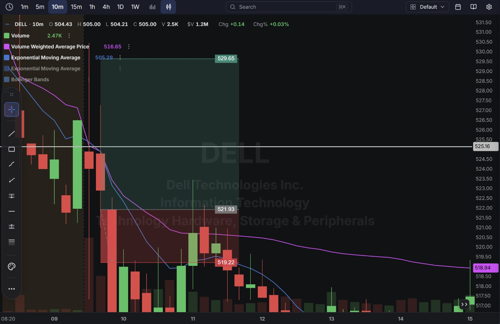
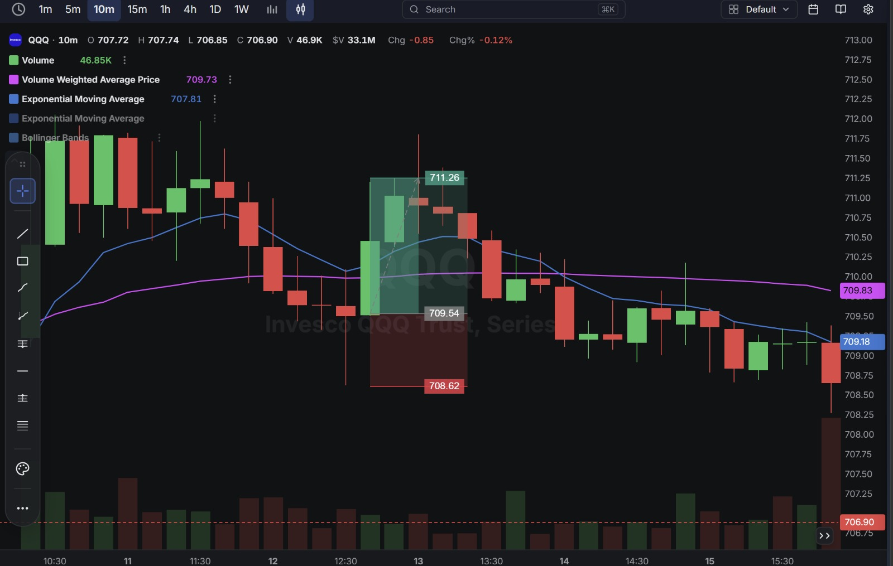
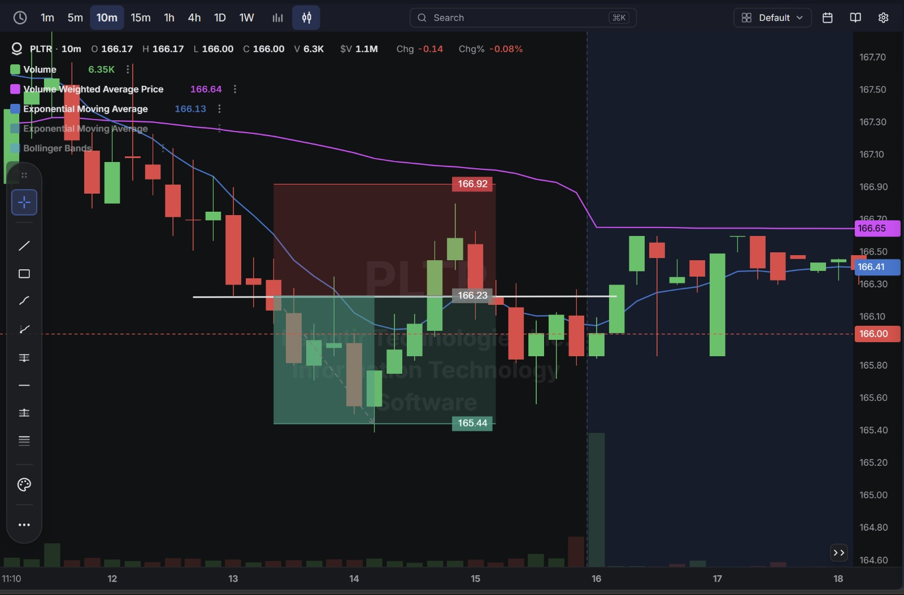

# Day 8 — Live Paper Trading (10-09-2026)

**4 trades closed today** — 2 winners, 2 losers, netting out to a tiny **-$0.09** loss. Account moved from $199,978.55 to **$199,978.46**.

---

## 1. Trade Log (Chronological)

| # | Time (ET) | Stock | Side  | Qty | Entry   | Exit    | Exit Type | P/L        |
| - | --------- | ----- | ----- | --- | ------- | ------- | --------- | ---------- |
| 1 | 6:32 AM   | DELL  | Long  | 1   | $521.71 | $519.28 | LIMIT     | ❌ -$2.43   |
| 2 | 6:46 AM   | QQQ   | Long  | 1   | $709.54 | $711.27 | LIMIT     | ✅ +$1.73   |
| 3 | 10:15 AM  | PLTR  | Short | 1   | $166.20 | $165.44 | LIMIT     | ✅ +$0.76   |
| 4 | 11:41 AM  | DELL  | Short | 1   | $515.46 | $515.61 | LIMIT     | ❌ -$0.15   |

**Account Statement:**

---

## 2. Detailed Breakdown — What Happened on Each Trade

### ❌ Trade 1 — DELL Long (-$2.43) — Largest Loss of the Day
Bought 1 share at $521.71, with a planned target well above at $529.65 and support/stop marked around $519.22–$521.93. Instead of continuing up, DELL broke down through the support zone and the position was closed at $519.28, right in line with the marked stop level.

**What went wrong:** The entry was taken near the top of a fading move rather than off a fresh bounce — the chart shows DELL had already been sliding into the entry, with VWAP well above the entry price. The wide target ($8 away) versus how quickly the stop zone was reached suggests the setup was entered too early, before the stock actually confirmed support.

**Chart:**

### ✅ Trade 2 — QQQ Long (+$1.73)
Bought 1 share at $709.54, with a stop below at $708.62 and a target above at $711.26. The trade worked cleanly, closing at $711.27 — a cent above the planned target.

**What went wrong:** Nothing — this was the best-executed trade of the day, with price moving straight to the pre-planned level.

**Chart:**

### ✅ Trade 3 — PLTR Short (+$0.76)
Shorted 1 share at $166.20, with a stop above at $166.92 and a target below at $165.44. Price declined into the target and the position was closed almost exactly there.

**What went wrong:** Nothing — a second clean, planned trade that hit its target.

**Chart:**

### ❌ Trade 4 — DELL Short (-$0.15)
A second DELL trade, this time short at $515.46, closed shortly after at $515.61 for a very small loss.

**What went wrong:** Going back to DELL a second time in the same session, right after the first DELL trade had already lost money, is worth noting — the position size was appropriately small given the lower conviction, which kept the damage minimal, but it's the same "re-trading the same name after a loss" pattern flagged on Day 6.

---

## 3. Net Result for the Day

| Category            | P/L        |
| -------------------- | ---------- |
| Winners (2 trades)    | +$2.49     |
| Losers (2 trades)     | -$2.58     |
| **Net Day P/L**      | **-$0.09** |

**Account balance at close: $199,978.46**

---

## Key Takeaways From Day 8

1. **QQQ and PLTR were the two clean, well-executed trades of the day** — both had a defined entry, stop, and target ahead of time, and both closed almost exactly at the planned target level.
2. **The first DELL long was the costliest mistake** — entered without waiting for confirmation that the pullback had actually found support, and the stock broke straight through the marked support zone to the stop.
3. **The second DELL trade repeats a familiar pattern** — going back to a name that just lost money, in the opposite direction, within the same session. The loss was tiny this time only because the size was small, not because the entry logic was necessarily better.
4. **A net loss of just $0.09 despite two red trades** shows the value of the two winners' good risk/reward — QQQ and PLTR's gains ($1.73 + $0.76 = $2.49) very nearly offset DELL's two losses ($2.43 + $0.15 = $2.58) combined.
5. **Next session:** for DELL specifically, wait for a clearer confirmation signal (a reclaim of VWAP or a higher low) before entering, rather than trying to catch the exact bottom or top of a move already in progress.
