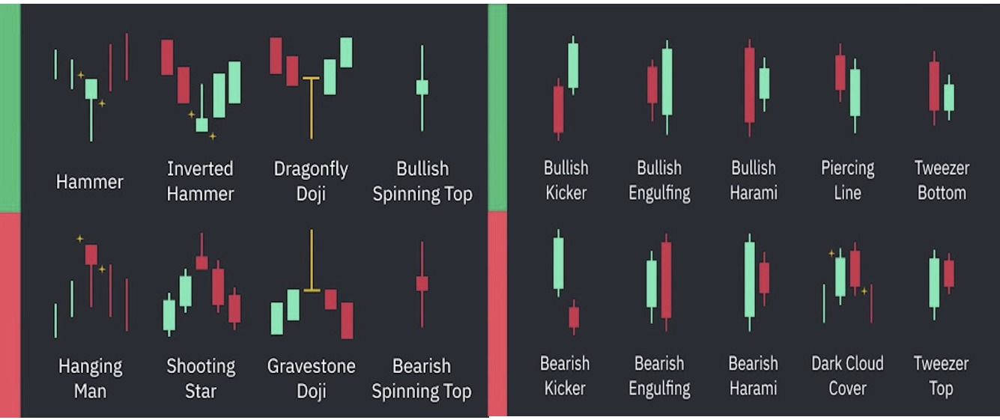

# Candlestick Patterns

## Introduction

Candlestick patterns are one of the most widely used tools in technical analysis. They visually represent price movement and help traders understand the ongoing battle between buyers and sellers. Each candlestick contains four important pieces of information: the opening price, closing price, highest price, and lowest price during a specific time period.

Candlestick patterns provide valuable insights into market sentiment, trend continuation, and potential reversals. By studying these patterns, traders can better understand price action and make more informed trading decisions.

---

---

## Basic Components of a Candlestick

Each candlestick consists of:

* **Open Price** – The price at which the trading period begins.
* **Close Price** – The price at which the trading period ends.
* **High Price** – The highest price reached during the period.
* **Low Price** – The lowest price reached during the period.

### Bullish Candle

A bullish candle is usually represented in green and indicates that the closing price is higher than the opening price. This shows that buyers were in control during the trading session.

### Bearish Candle

A bearish candle is usually represented in red and indicates that the closing price is lower than the opening price. This shows that sellers were dominant during the trading session.

---

## Bullish Reversal Patterns

Bullish reversal patterns indicate that buying pressure is increasing and the market may move upward after a downtrend.

### Hammer

The Hammer pattern consists of a small body and a long lower wick. It shows that sellers initially pushed the price lower, but buyers regained control and pushed the price back up before the candle closed. This pattern becomes more reliable when it appears near a support zone.

### Bullish Engulfing

A Bullish Engulfing pattern occurs when a large bullish candle completely covers the body of the previous bearish candle. This indicates strong buying pressure and often signals the beginning of a bullish reversal.

### Tweezer Bottom

The Tweezer Bottom pattern forms when two consecutive candles have similar lows. This indicates that buyers are defending a support level and may trigger a reversal to the upside.

### Dragonfly Doji

A Dragonfly Doji has a long lower wick with the opening and closing prices occurring near the same level. It signals rejection of lower prices and potential buyer strength.

---

## Bearish Reversal Patterns

Bearish reversal patterns suggest that sellers are gaining control and the market may move downward.

### Shooting Star

A Shooting Star has a small body and a long upper wick. It indicates that buyers pushed prices higher, but sellers eventually took control and forced the price back down before the close.

### Bearish Engulfing

This pattern occurs when a large bearish candle completely engulfs the body of the previous bullish candle. It represents strong selling pressure and often signals a potential downward reversal.

### Tweezer Top

A Tweezer Top forms when two consecutive candles have similar highs. This pattern indicates strong resistance and rejection of higher prices.

---

## Continuation and Momentum Patterns

### Momentum Candle

A Momentum Candle is significantly larger than surrounding candles and indicates strong buying or selling activity. These candles often appear during breakouts and trend continuation moves.

### Marubozu Candle

A Marubozu Candle has a large body with little or no wick. It demonstrates complete control by either buyers or sellers throughout the trading session and often reflects strong momentum.

### Multiple Candle Confirmation

When several candles repeatedly reject the same price area through their wicks, it strengthens the reliability of that support or resistance zone. Multiple confirmations increase the probability that the level is significant.

---

## Importance of Candlestick Patterns

Candlestick patterns help traders:

* Understand market sentiment.
* Identify potential trend reversals.
* Confirm trend continuation.
* Locate entry and exit opportunities.
* Improve decision-making using price action.

However, candlestick patterns should not be used in isolation. They are most effective when combined with support and resistance, trend analysis, volume analysis, and other technical indicators.

---

## Key Takeaways

* Candlesticks visually represent market psychology.
* Bullish patterns indicate potential buying opportunities.
* Bearish patterns indicate potential selling pressure.
* Momentum candles help identify strong market participation.
* Confirmation from volume and support/resistance improves reliability.
* Candlestick analysis forms the foundation of price action trading.

---

## Conclusion

Candlestick patterns are essential tools for understanding market behavior and price action. They provide valuable information about buyer and seller strength, trend direction, and potential reversals. By learning to identify and interpret candlestick patterns, traders can improve their ability to analyze charts and make more informed trading decisions.
